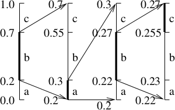
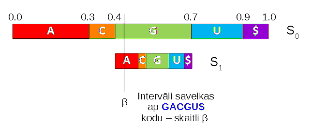
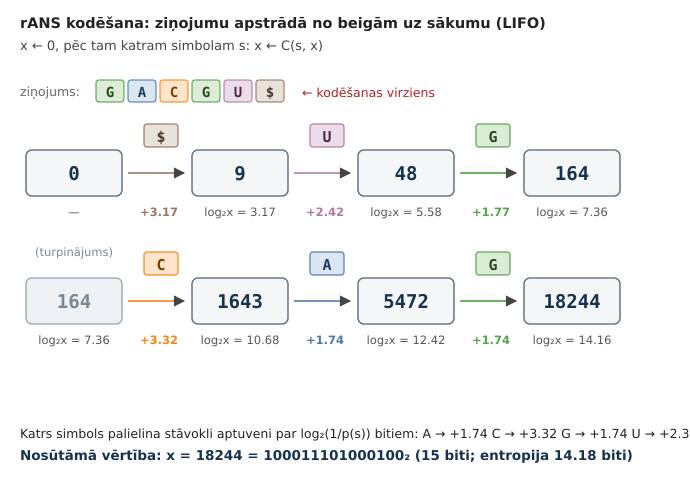
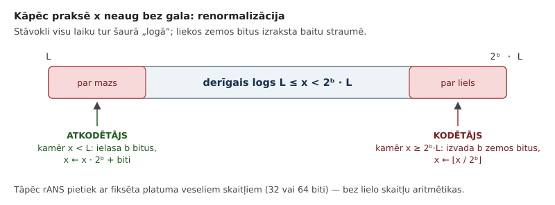
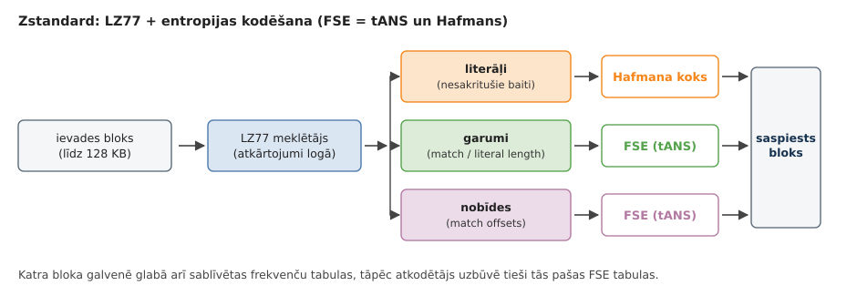

# 2. Lossless Compression: Arithmetic Coding

Huffman codes are optimal when every message must be encoded with one and the same bit string and no code string is a prefix of another string. The average number of bits per message used by a Huffman code (like other optimal codes) does not exceed $H(S)+1$.

In some cases this is inefficient: if there is a message set $S=\lbrace \mathtt{0}, \mathtt{1} \rbrace$ with probabilities $1023/1024$ and $1/1024$, respectively, then a Huffman code would still spend one bit per message, even though the entropy is

```python
>>> import math
>>> pp = [1023/1024, 1/1024]
>>> H = sum([-p*math.log2(p) for p in pp])
>>> H
0.011173818721219527
```

To encode 1000 messages distributed like this, $11.17$ bits are needed on average, not $1000$ bits.

There are two popular approaches that solve this:

* [Arithmetic codes](https://web.mat.upc.edu/sebastia.xambo/CDI15/CDI15-04-ArithmeticCoding.pdf)
* [Asymmetric numeral systems](https://en.wikipedia.org/wiki/Asymmetric_numeral_systems) - since publication in 2014 used in Zstandard (the `Zstd` implementation)

```bash
sudo apt-get install zstd
# brew install zstd    ## (Mac OS X users)
echo "A quick brown fox jumped over a lazy dog" > input.txt
zstd input.txt -o output.zst
zstd -d output.zst -o input2.txt
diff input.txt input2.txt
```

**Arithmetic codes:** They are better for adaptive probabilistic models, where message probabilities can change depending on the input received so far. The arithmetic operations in the original algorithm are meant to be performed with real numbers; therefore an implementation of this algorithm (in integer arithmetic) is not very simple. It can also lose speed, because it regularly does multiplication and division.

**Asymmetric numeral systems:** Usually not adaptive (all probabilities can be computed in advance). Compression and decompression are very fast and make maximal use of bit operations.

## The Basic Idea of Arithmetic Coding

### Example: A Die


*Die example.*

Alice wants to send Bob $1000$ results of rolling a (fair) die. A prefix code sometimes needs $2$ and sometimes $3$ bits. For example, the following code can be used:

$$
C = \{ (1,\texttt{00}), (2,\texttt{010}), (3,\texttt{011}),
(4,\texttt{100}), (5,\texttt{101}), (6,\texttt{11}) \}.
$$

$$
\ell_a(C) = \frac{2 + 3 + 3 + 3 + 3 + 2}{6} = 2.666\ldots
$$

> *Note:* To send $1000$ die results with a Huffman code, Alice will use $2666.67$ bits on average. Slightly fewer if the results contain more "1"s and "6"s, and slightly more if "2", "3", "4", "5" come up more often than average.

**Hoping for a reduction from 2667 to 2585**

The entropy (average information content) of one die roll is about $\log_2 6 \approx 2.585$.

$$
H = \sum\limits_{s \in S} p(s) \cdot \left( - \log_2 p(s) \right) =
6 \cdot \left( \frac{1}{6} \cdot \left( - \log_2\,\frac{1}{6} \right) \right) \approx 2.584963.
$$

Prefix codes cannot solve this, because they send two or three bits for every message (fractional bits cannot be sent). Arithmetic coding works differently: for each die result it creates an interval six times shorter (as described in arithmetic coding). And only at the very end is the resulting very short interval encoded with a bit string.

### Example: English Letter Frequencies


The letter distribution of natural languages is usually not the best example, because letters tend to appear in predictable strings, so encoding individual symbols (with either Huffman or arithmetic coding) is usually suboptimal. [Letter frequencies](http://pi.math.cornell.edu/~mec/2003-2004/cryptography/subs/frequencies.html)

**Arithmetic coding**

**Why use arithmetic coding?** If the message space has odd probabilities, then Huffman codes (which cut the "real estate" of the code space into pieces of $1/2$, $1/4$, etc.) waste a lot of space and do not exploit the fact that the information content of some messages is much smaller than $1$.

**How to send a message whose information content is less than one bit?** For example, a message with probability $1023/1024$ has information content $\log_2 (1024/1023) \approx 0.0014$. We cut the code space into pieces of a different kind, and encode into bits only at the very end.

### The Arithmetic Coding Algorithm

**Input:** A message alphabet and its probability distribution. Also a sequence of messages over this alphabet.

**Output:** An interval $I \subseteq [0;1]$ (it is enough to send a number from this interval).

* There are $m$ messages $\lbrace 1,\ldots,m \rbrace$. Their probabilities are $\lbrace p(1),\ldots , p(m)\rbrace$, which sum to $1$.
* We define the *cumulative probabilities*:

  $$
  f(j) = \sum\limits_{i=1}^{j-1} p(i),\;\;j=1,\ldots,m.
  $$

**Constructing the intervals**

We are given a sequence of messages $x_1,x_2,\ldots,x_k \in \lbrace 1,\ldots,m \rbrace$. We build a sequence of intervals, where each interval has a known left endpoint $\ell_i$ and length $s_i$.

$$
[0;1] \supset [l_1;l_1+s_1) \supset [l_2;l_2+s_2) \supset \ldots \supset [l_k; l_k+s_k).
$$

Interval 1: $[l_1;l_1 + s_1) = \left[ f(x_1); f(x_1) + p(x_1) \right)$. For intervals $2,\ldots,k$ we set:

$$
\left\{
\begin{array}{l}
l_i = l_{i-1} + f(x_i) \cdot s_{i-1}\\
s_i = s_{i-1} \cdot p(x_i)
\end{array} \right.
$$

**Example**



*Sequence of intervals.*

* The alphabet has 3 letters *a,b,c*. Their probabilities are 0.2, 0.5, 0.3, respectively (the entropy for sending one letter is 1.485475)
* The example shows that `babc` corresponds to the interval [.255, .27).
* A finite binary fraction in this interval: `.0100001`, i.e., $[33/128,34/128) \subseteq [.255, .27)$.
* To send a string of 4 messages we spent 7 bits (1.75 bits per message on average).

**Question:** In the limit, will the number of bits sent relative to the message length tend to the entropy 1.485475? Why?

**Sending the intervals**

* Given an interval of length $s$, one can find inside it a number whose binary representation has at most $\left\lceil - \log_2 s \right\rceil$ bits.
* We want to send only one number. To know how long its interval is, we interpret, say, $0.010$ not simply as $1/4$, but as the interval $[1/4, 3/8)$.
* Without losing more than 1-2 bits, we can build an interval $[k/2^n,(k+1)/2^n)$ that lies strictly inside the $I$ given by the arithmetic code.

**Peculiarities of arithmetic coding**

* Arithmetic coding algorithms must be built either for relatively small message sets (where floating-point arithmetic is enough), or an approximation must be made where real numbers are approximated with integers.

See also page 21 of [G.Blelloch. Introduction to Data Compression](https://www.cs.cmu.edu/~guyb/realworld/compression.pdf) - an arithmetic coding algorithm approximated with integers.

**Encoding example**

We send the string `GACGU$`, where the symbols `A`, `C`, `G`, `U` are RNA nucleobases, and `$` denotes the end of the string. The prior probabilities of the symbols are as follows:



| `A` | `C` | `G` | `U` | `$` |
| --- | --- | --- | --- | --- |
| 30% | 10% | 30% | 20% | 10% |

**Computing the intervals**

* $S_0 = [0.000000; 1.000000]$ corresponds to `""` (the empty string),
* $S_1 = [0.400000; 0.700000]$ corresponds to `G`,
* $S_2 = [0.400000; 0.490000]$ corresponds to `GA`,
* $S_3 = [0.427000; 0.436000]$ corresponds to `GAC`,
* $S_4 = [0.430600; 0.433300]$ corresponds to `GACG`,
* $S_5 = [0.432490; 0.433030]$ corresponds to `GACGU`,
* $S_6 = [0.432976; 0.433030]$ corresponds to `GACGU$`.

The number written in binary

$$
\beta = 0.011011101101100_2 \approx 0.4329834_{10}
$$

belongs to the interval $S_6 = [0.432976; 0.433030]$.

Why does the binary representation of $\beta$ end with two zeros? Exactly 15 digits after the binary point and $\left[\beta;\,\beta + \frac{1}{2^{15}}\right] \subseteq S_6$.

> *Note:* Every finite binary fraction corresponds to a subinterval of $[0;1]$.

## Arithmetic Coding in Integers

Real-number arithmetic with 4-byte or 8-byte floating-point numbers can run into register *overflow* or *underflow* -- only a little information can be encoded in one number. There are also rounding errors; one must somehow ensure that rounding errors always happen the same way when encoding and decoding.

The usual solution is to switch to integer arithmetic and round the probabilities to numbers of the form $i/2^k$.

We define how many times each message occurs (roughly proportionally to the probabilities), and also the cumulative sums:

$$
c(1), c(2), \ldots, c(m)
$$

$$
f(i) = c(1) + \ldots + c(i-1),\;\; \mbox{for every $i \in [1;m]$}
$$

The sum of all counts is $T = c(1) + \ldots + c(m)$, and $R = 2^k$ is the register size (in practice $k = 16$ or $32$).

**Three rescaling cases**

The whole complexity of the algorithm is hidden in one place: the interval $[l;u]$ must not become so narrow that it "collapses" in integer arithmetic. Therefore, after each symbol the interval is rescaled by doubling, until it no longer falls into any of the three cases:

* $u < R/2$ -- the interval is in the lower half, so the next bit of the result is certainly $0$;
* $l \geq R/2$ -- the interval is in the upper half, the next bit is certainly $1$;
* $R/4 \leq l$ and $u < 3R/4$ -- the interval is in the middle; we **do not yet know** what the next bit will be, but we know that it will be followed by the opposite bit. We count such "pending" bits in the variable $m$ and output them later.

$\textsf{Emit}(b, m)$ $\quad$ *// outputs the bit $b$ followed by $m$ opposite bits*
1. $\textsf{WriteBit}(b)$
2. **for** $j = 1$ **to** $m$: $\textsf{WriteBit}(1 - b)$

$\textsf{Arithmetic-Encode}(x_1 x_2 \ldots x_n, f, T, k)$
1. $l = 0$; $\;\;u = R - 1$; $\;\;m = 0$
2. **for** $i = 1$ **to** $n$
3. $\quad s = u - l + 1$
4. $\quad u = l + \left\lfloor s \cdot f(x_i + 1)/T \right\rfloor - 1$
5. $\quad l = l + \left\lfloor s \cdot f(x_i)/T \right\rfloor$
6. $\quad$ **while** $\textsf{True}$
7. $\quad\quad$ **if** $u < R/2$ **then** $\textsf{Emit}(0, m)$; $\;m = 0$
8. $\quad\quad$ **elseif** $l \geq R/2$ **then** $\textsf{Emit}(1, m)$; $\;m = 0$; $\;l = l - R/2$; $\;u = u - R/2$
9. $\quad\quad$ **elseif** $l \geq R/4$ **and** $u < 3R/4$ **then** $m = m + 1$; $\;l = l - R/4$; $\;u = u - R/4$
10. $\quad\quad$ **else** **break**
11. $\quad\quad l = 2l$; $\;\;u = 2u + 1$
12. **if** $l \geq R/4$ **then** $\textsf{Emit}(1, m+1)$ **else** $\textsf{Emit}(0, m+1)$ $\quad$ *// termination*

In all three cases the corresponding offset ($0$, $R/2$, or $R/4$) is subtracted first, and only then does the doubling itself happen in line 11 -- that is why the three cases look almost the same.

### The Decompression Algorithm

The decoder repeats exactly the same interval division and rescaling, but additionally keeps a *read* $k$-bit window $t$. Knowing where $t$ lies in the interval $[l;u]$, one can tell which subinterval it falls into, i.e., which symbol was sent.

$\textsf{Arithmetic-Decode}(f, T, k, n)$
1. $l = 0$; $\;\;u = R - 1$
2. $t = \textsf{ReadBits}(k)$ $\quad$ *// the first $k$ bits as an integer*
3. **for** $i = 1$ **to** $n$
4. $\quad s = u - l + 1$
5. $\quad v = \left\lfloor \left( (t - l + 1) \cdot T - 1 \right)/s \right\rfloor$ $\quad$ *// position of $t$ on the scale $[0;T)$*
6. $\quad j = \textsf{Find-Symbol}(v)$ $\quad$ *// the unique $j$ with $f(j) \leq v < f(j+1)$*
7. $\quad \textsf{Output}(j)$
8. $\quad u = l + \left\lfloor s \cdot f(j+1)/T \right\rfloor - 1$
9. $\quad l = l + \left\lfloor s \cdot f(j)/T \right\rfloor$
10. $\quad$ **while** $\textsf{True}$
11. $\quad\quad$ **if** $u < R/2$ **then** *(nothing to subtract)*
12. $\quad\quad$ **elseif** $l \geq R/2$ **then** $l = l - R/2$; $\;u = u - R/2$; $\;t = t - R/2$
13. $\quad\quad$ **elseif** $l \geq R/4$ **and** $u < 3R/4$ **then** $l = l - R/4$; $\;u = u - R/4$; $\;t = t - R/4$
14. $\quad\quad$ **else** **break**
15. $\quad\quad l = 2l$; $\;\;u = 2u + 1$; $\;\;t = 2t + \textsf{ReadBit}()$

Lines 10-15 are *literally* the same as lines 6-11 of the encoder, except that instead of outputting bits, $t$ is shifted. Therefore both algorithms can be written with one common helper procedure, and it is exactly this symmetry that guarantees that rounding errors happen identically in the encoder and the decoder.

> *Note:* With $k = 16$, counts $c = (3,1,3,2,1)$ and $T = 10$, this algorithm outputs exactly the bits $011011101101100$ for the message `GACGU$`, i.e., the same number $\beta = 0.011011101101100_2$ that we found earlier with real-number arithmetic.

### End-of-Data Marker

Arithmetic decoding transforms the transmitted number (interval) and decodes more and more new messages. One can detect the moment when the interval being decoded has already gone outside $[0;1]$, and then decoding must stop.

There is another popular solution: `PSEUDO_EOF` - the code can end in the middle of a byte. Usually a special symbol (an end-of-text marker) is added to know when decoding must stop.

The end-of-data marker also ensures that one compressed message sequence cannot be a prefix of another message sequence (because the end-of-data marker must not occur in the middle of the code). See also a detailed [description of Huffman coding](https://web.stanford.edu/class/archive/cs/cs106b/cs106b.1172/assn/huffman.html), which describes a similar problem.

## Other Entropy Codes

**Conditional probability model**

Arithmetic coding can be improved by taking into account how the probability of a symbol depends on its context (a 1st-order model - only one previous symbol). Then the next interval is divided into pieces depending on the previous symbol.


*Conditional probability model.*

> *Note:* [Slides about arithmetic coding](http://www.ws.binghamton.edu/fowler/fowler%20personal%20page/EE523_files/Ch_04%20Arithmetic%20Coding%20(PPT).pdf)

**Asymmetric numeral systems**

*Asymmetric numeral systems (ANS)* -- research by Jaroslaw Duda (2014). They serve a similar purpose as arithmetic codes (they compress the input data stream down to the limit set by entropy). How they differ from arithmetic codes: applications in some new standards.

1. Facebook Zstandard.
2. Apple LZFSE.
3. Google Draco 3D compressor.

The new algorithms can compress better or transmit more data over the same communication channel; they sometimes need more computing power (or have to be programmed in parallel for better efficiency), so not all platforms support them.

It matters on which device and in which situation compression/decompression happens. (Caching, less frequent and smaller network use. The CPU can be used more safely.)

**Entropy coding as parallel algorithms?**

In all these algorithms, the next symbol to be encoded/decoded depends on the previous symbols (and on the internal state of the algorithm). Usually they cannot be parallelized.

* With Huffman codes one can try to parallelize the encoding and decoding of different data blocks in several threads.
* GPUs cannot be used, because the computations look different in each thread.

Perhaps compression/decompression instructions on longer vectors are possible if the input data is obtained in some special way. But so far there are no results on this.

## Asymmetric Numeral Systems (ANS)

**Basic idea: one integer instead of the whole state**

Arithmetic coding keeps an *interval* $[l;\,l+s)$ -- two numbers that, moreover, have to be multiplied and divided all the time. An asymmetric numeral system (*asymmetric numeral systems*, ANS; Jarosław Duda, 2009-2014) keeps only **one natural number** $x$, called the *state*. All the information processed so far is encoded in this number, and it has about $\log_2 x$ bits.

The idea is a generalization of the ordinary positional numeral system. 
If the alphabet has $b$ symbols with equal probabilities, then 
"appending one more digit $s$ to the end of the number $x$" means

$$
x \;\longmapsto\; b \cdot x + s, \qquad\text{and removing a digit is}\qquad
s = x \bmod b, \;\; x \longmapsto \left\lfloor x/b \right\rfloor .
$$

Each digit increases $x$ exactly $b$ times, i.e., adds $\log_2 b$ bits. This is a *symmetric* system: all digits have one and the same cost.

ANS does the same, but **asymmetrically**: a symbol with probability $p(s)$ must increase the state approximately $1/p(s)$ times, i.e., add $\log_2 \frac{1}{p(s)}$ bits -- exactly as much as Shannon entropy requires. Therefore the natural numbers $0, 1, 2, \ldots$ are divided among the symbols *unevenly*: a symbol $s$ is given about a $p(s)$ fraction of all natural numbers, spread out as evenly as possible.

**Frequency quantization**

Just as for arithmetic coding in integers, here too the probabilities are replaced by integer *counts* $f(s)$, whose sum is $M$ (usually $M = 2^k$ is chosen). 
We define the cumulative sums $c(s)$ as before:

$$
M = \sum\limits_{s} f(s), \qquad c(s) = \sum\limits_{t < s} f(t), \qquad p(s) \approx \frac{f(s)}{M}.
$$

For our example alphabet $\lbrace \mathtt{A}, \mathtt{C}, \mathtt{G}, \mathtt{U} \rbrace$ and the end-of-data marker `$` with probabilities $0.3,\,0.1,\,0.3,\,0.2,\,0.1$, $M = 10$ is enough, and the quantization is *exact* (the probabilities are already whole tenths):

| symbol | `A` | `C` | `G` | `U` | `$` |
| --- | --- | --- | --- | --- | --- |
| $p(s)$ | 0.3 | 0.1 | 0.3 | 0.2 | 0.1 |
| $f(s)$ | 3 | 1 | 3 | 2 | 1 |
| $c(s)$ | 0 | 3 | 4 | 7 | 9 |
| slots $r = x \bmod 10$ | 0,1,2 | 3 | 4,5,6 | 7,8 | 9 |

**Dividing the natural numbers among the symbols**

We split all natural numbers into blocks of $M$ elements. In each block the symbol $s$ owns $f(s)$ *slots* -- those whose remainder $r = x \bmod M$ satisfies $c(s) \le r < c(s) + f(s)$. Now each symbol has *its own* numeral system: we number with $0, 1, 2, \ldots$ only those slots that belong to the symbol $s$.


*Each symbol has its own subsequence of the natural numbers. For example, the symbol* `G` *owns the numbers* $4,5,6,14,15,16,24,\ldots$*, and their ranks are* $0,1,2,3,4,5,6,\ldots$

We obtain the **rANS** (*range ANS*) encoding and decoding functions:

$$
C(s,x) = M \cdot \left\lfloor \frac{x}{f(s)} \right\rfloor + \left( x \bmod f(s) \right) + c(s)
\qquad \text{(“the }x\text{-th slot that belongs to }s\text{”)}
$$

$$
D(x) = (s, x'), \quad \text{where } r = x \bmod M, \;\; s = s(r), \;\;
x' = f(s) \cdot \left\lfloor \frac{x}{M} \right\rfloor + r - c(s).
$$

> *Note:* The mapping $(s,x) \mapsto C(s,x)$ is a **bijection** from $\Sigma \times \mathbb{N}$ to $\mathbb{N}$: every natural number $y$ belongs to exactly one symbol and has exactly one rank in the subsequence of that symbol. Therefore $D$ is the exact inverse of $C$, and the compression is lossless.

Since $C(s,x) \approx \frac{M}{f(s)} \cdot x \approx \frac{x}{p(s)}$, each symbol grows the state by about $\log_2 \frac{1}{p(s)}$ bits. That is all the "information theory" in this algorithm.

### The Basic ANS Algorithm

The most important difference from arithmetic coding: ANS is **LIFO** (*last in, first out*, like a stack). The symbol encoded last is decoded first. Therefore the encoder goes through the message **from the end to the beginning**, and then the decoder outputs the symbols in the correct order.

$\textsf{Rans-Encode}(x_1 x_2 \ldots x_n, f, c, M)$
1. $x = 0$ $\quad$ *// initial state*
2. **for** $i = n$ **downto** $1$ $\quad$ *// the message is processed backwards*
3. $\quad s = x_i$
4. $\quad x = M \cdot \left\lfloor x / f(s) \right\rfloor + \left( x \bmod f(s) \right) + c(s)$
5. **end for**
6. **return** $x$

$\textsf{Rans-Decode}(x, f, c, M)$
1. **repeat**
2. $\quad r = x \bmod M$
3. $\quad s = \textsf{Lookup}(r)$ $\quad$ *// the unique $s$ with $c(s) \leq r < c(s) + f(s)$*
4. $\quad \textsf{Output}(s)$
5. $\quad x = f(s) \cdot \left\lfloor x / M \right\rfloor + r - c(s)$
6. **until** $s = \textsf{Eof}$ $\quad$ *// end-of-data marker; at this point $x = 0$ again*

In practice, the search in line 3 is not done with a loop, but with an $M$-element table $\textsf{Lookup}[0 \ldots M-1]$ that immediately tells the owner of each slot. It is this table (not multiplication and division) that makes ANS fast.

**End-of-data marker.** As we can see, ANS has a *natural* stopping condition: when the whole message has been decoded, the state returns to its initial value. Therefore the end-of-data marker `$` (`PSEUDO_EOF`) is not mandatory here -- it is enough if the decoder knows the number of symbols $n$. We will keep it anyway, so that the example can be compared directly with the arithmetic coding example; note that because of LIFO, `$` is encoded **first**.

### Example: The Message `GACGU$`

We encode the same message that we encoded earlier with arithmetic coding, with the same probabilities. The symbols are processed in the order `$`, `U`, `G`, `C`, `A`, `G`:

| step | symbol $s$ | $f(s)$ | $c(s)$ | $x$ before | computing $C(s,x)$ | $x$ after |
| --- | --- | --- | --- | --- | --- | --- |
| 1 | `$` | 1 | 9 | 0 | $10 \cdot \lfloor 0/1 \rfloor + 0 + 9$ | **9** |
| 2 | `U` | 2 | 7 | 9 | $10 \cdot \lfloor 9/2 \rfloor + 1 + 7 = 40 + 8$ | **48** |
| 3 | `G` | 3 | 4 | 48 | $10 \cdot \lfloor 48/3 \rfloor + 0 + 4 = 160 + 4$ | **164** |
| 4 | `C` | 1 | 3 | 164 | $10 \cdot \lfloor 164/1 \rfloor + 0 + 3$ | **1643** |
| 5 | `A` | 3 | 0 | 1643 | $10 \cdot \lfloor 1643/3 \rfloor + 2 + 0 = 5470 + 2$ | **5472** |
| 6 | `G` | 3 | 4 | 5472 | $10 \cdot \lfloor 5472/3 \rfloor + 0 + 4 = 18240 + 4$ | **18244** |



*Growth of the state. Each symbol adds about* $\log_2 (1/p(s))$ *bits.*

The result is **one number** $x = 18244$, whose binary representation is

$$
18244 = 100011101000100_2 \qquad (15 \text{ bits}).
$$

Let us compare with the theoretical limit:

$$
-\log_2 \left( 0.3 \cdot 0.3 \cdot 0.1 \cdot 0.3 \cdot 0.2 \cdot 0.1 \right)
= -\log_2 (0.000054) \approx 14.177 \text{ bits},
$$

$$
\log_2 18244 \approx 14.155 \text{ bits}.
$$

So the state $x$ has grown almost exactly as many times as the reciprocal of the probability of the message: $1/0.000054 \approx 18519$. Just as with arithmetic coding, a couple of bits are lost only at the very end, when $x$ has to be written in a whole number of bits (here 15 bits versus 14.18 bits of entropy).

**Decoding**

The decoder starts with $x = 18244$ and at each step looks at the remainder $x \bmod 10$:


The symbols come out in the order `G`, `A`, `C`, `G`, `U`, `$` -- i.e., in the **correct** order, and after `$` the state returns to zero. This is the same message we started with.

### Streaming Version: Renormalization

The previous algorithm is not usable directly: after a few thousand symbols $x$ would become a number several thousand bits long, and we would need big-number arithmetic. In practice the state is kept in a narrow **window**

$$
L \leq x < 2^b \cdot L
$$

(typically $L = 2^{23}$, $b = 8$, i.e., it works with 32-bit integers and outputs whole bytes). Before each encoding operation the encoder drops $b$ low bits at a time from $x$, until $C(s,x)$ is certain to fit in the window; the decoder symmetrically reads the bits back in.



$\textsf{Rans-Encode-Stream}(x_1 x_2 \ldots x_n, f, c, M, L, b)$
1. $x = L$
2. **for** $i = n$ **downto** $1$
3. $\quad s = x_i$
4. $\quad$ **while** $x \geq \left( L / M \right) \cdot 2^{b} \cdot f(s)$ $\quad$ *// renormalization*
5. $\quad\quad \textsf{WriteBits}(x \bmod 2^b,\; b)$
6. $\quad\quad x = \left\lfloor x / 2^b \right\rfloor$
7. $\quad$ **end while**
8. $\quad x = M \cdot \left\lfloor x / f(s) \right\rfloor + \left( x \bmod f(s) \right) + c(s)$
9. **end for**
10. $\textsf{WriteState}(x)$ $\quad$ *// final state (e.g., 4 bytes)*

$\textsf{Rans-Decode-Stream}(f, c, M, L, b, n)$
1. $x = \textsf{ReadState}()$
2. **for** $i = 1$ **to** $n$
3. $\quad r = x \bmod M$
4. $\quad s = \textsf{Lookup}(r)$
5. $\quad \textsf{Output}(s)$
6. $\quad x = f(s) \cdot \left\lfloor x / M \right\rfloor + r - c(s)$
7. $\quad$ **while** $x < L$ $\quad$ *// renormalization*
8. $\quad\quad x = x \cdot 2^b + \textsf{ReadBits}(b)$
9. $\quad$ **end while**
10. **end for**

The condition in line 4 is exactly such that after computing $C(s,x)$ the state is again in the window $[L;\,2^b L)$; this requires $L$ to be divisible by $M$. Since the encoder goes backwards, the decoder reads the bits it output in the opposite direction -- in practice the encoder writes bytes into a buffer from the end to the beginning, and then the decoder reads them in the normal order.

### tANS, the Finite-State Variant

If the sum of frequencies is chosen equal to the window size, $M = L$, then there are only $L$ valid states. In that case *all* values of the functions $C$ and $D$ can be **precomputed in a table**. This gives **tANS** (*table ANS*), which in Collet's implementation is called **FSE** (*Finite State Entropy*).

Decoding then looks like this -- without multiplication, division, or even comparison:

$\textsf{Tans-Decode-Symbol}(x)$
1. $(s,\; \mathit{nbBits},\; \mathit{newBase}) = \textsf{DecodeTable}[x]$
2. $\textsf{Output}(s)$
3. $x = \mathit{newBase} + \textsf{ReadBits}(\mathit{nbBits})$
4. **return** $x$

This is simply a **finite-state machine**: the state $x \in \lbrace 0,\ldots,L-1 \rbrace$, one table lookup, and reading a few bits per symbol. The only nontrivial step in building the table is the *symbol spread* -- the $f(s)$ states of each symbol must be placed among the $L$ states as evenly as possible. For this purpose Zstandard uses a fast, deterministic "step" formula instead of an optimal arrangement; the loss in compression ratio is negligible.

### ANS Compared with Arithmetic Coding

| | Arithmetic coding | ANS (rANS / tANS) |
| --- | --- | --- |
| State | interval $[l;\,l+s)$ (two numbers) | one number $x$ |
| Coding order | FIFO (from beginning to end) | LIFO (from end to beginning) |
| Operations per symbol | multiplication + division | table lookup (tANS) or 1 multiplication (rANS) |
| Adaptive models | convenient (CABAC etc.) | hard: tables must be rebuilt |
| Bit losses | $\approx 2$ bits for the whole stream | $\approx 2$ bits for the whole stream + quantization error |
| Speed | medium | very high (Zstd decompresses ~1--2 GB/s) |
| Patents | historically many | Duda deliberately published ANS without patents |

The main practical limitation: ANS is usually **not adaptive**. If symbol probabilities change, the tables must be rebuilt, so real implementations split the data into blocks and store a (compact) frequency table for each block.

## Zstandard: An Industrial Implementation of ANS

**History**

Jarosław Duda (Jagiellonian University in Kraków) published the ANS idea as early as 2009, and in finished form in 2013-2014, deliberately without patenting it and publishing reference implementations -- precisely because the spread of arithmetic coding in the 1980s-1990s had been slowed down by patents.

This work was turned into a practical version by Yann Collet, who was already known for the very fast `LZ4`. In 2013 he published the `FSE` library (a tANS implementation), and on its basis built **Zstandard** (`zstd`) -- an LZ77-type compression algorithm whose entropy coder is FSE. Collet started working at Facebook (now Meta) in 2015; `zstd` version 1.0 was released in August 2016 under the BSD license (since 2017 -- dual BSD / GPLv2 license). The format is standardized as [RFC 8478](https://www.rfc-editor.org/rfc/rfc8478) (2018), which was later replaced by [RFC 8878](https://www.rfc-editor.org/rfc/rfc8878) (2021).

**Current uses**

Within eight years `zstd` has become the new default choice where `gzip` used to be used:

* **Linux kernel:** the `btrfs`, `squashfs`, `f2fs` file systems, `initramfs`, and compression of the kernel image itself.
* **Package managers:** Arch Linux (`.pkg.tar.zst` since the end of 2019), Fedora RPM, Ubuntu `.deb` packages, Conda.
* **Databases and big data:** PostgreSQL (WAL and TOAST compression), MongoDB, RocksDB, ZFS, Apache Kafka, Hadoop, the Parquet and ORC file formats.
* **Network:** `Content-Encoding: zstd` in the HTTP protocol (Chrome since 2024, Firefox soon after), Nginx, `curl`.
* **Other uses of ANS:** Apple `LZFSE`, Google `Draco` (3D geometry), JPEG XL, as well as several libraries for storing machine learning models.

### What Happens with ANS Inside Zstandard

`zstd` is not a "pure" entropy coder -- it first performs an LZ77-type search for repetitions (like `gzip`), and only the resulting symbols are encoded with an entropy coder:



**Technical trade-offs compared with the "pure" ANS idea:**

1. **tANS, not rANS.** Zstandard uses the table variant (FSE), because its decoding requires neither multiplication nor division -- only one array lookup per symbol.
2. **Coarsely quantized probabilities.** The sum of frequencies is always a power $M = 2^k$, and a small one: RFC 8878 allows only $k \le 9$ for lengths and $k \le 8$ for offsets, i.e., 256-512 states. A smaller table = less cache load and a smaller header, but a slightly worse compression ratio.
3. **Simple spread.** The placement of symbols in the table is computed with a fast "step" formula instead of searching for the optimal one -- speed is more important than the last few percent.
4. **Huffman codes for literals.** Paradoxically, the largest part of the data -- the literals (bytes that did not fit into any repetition) -- is encoded by `zstd` with a Huffman tree, not with FSE. The reason: there are many literals, their distribution is usually not extremely skewed, and Huffman decoding is easier to parallelize (`zstd` uses 4 independent Huffman streams in one block). FSE remains for the "sequence" symbols (lengths, offsets), where the distributions are skewed and the gain from ANS is real.
5. **Several states in one stream.** To exploit the instruction-level parallelism of modern processors, `zstd` maintains several FSE states and updates them alternately from one bitstream.
6. **In blocks, not adaptively.** The data is split into blocks (up to 128 KB), and the header of each block stores compact frequency tables. If a block is small, `zstd` can use predefined tables or the tables of the previous block, so as not to spend more space on the header than on the data itself.
7. **Bitstream backwards.** Just as in the basic algorithm, the encoder writes bits from the end to the beginning; therefore a `zstd` block bitstream is read from the last byte forwards.
8. **Additional features around the algorithm:** dictionaries for small data (`--train`), long-mode window up to 2 GB (`--long`), multithreaded compression (`-T0`), XXH64 checksums, a streaming ("frame") format.

### Installation

**Linux / macOS**

```bash
sudo apt-get install zstd          # Debian, Ubuntu
sudo dnf install zstd              # Fedora, RHEL
sudo pacman -S zstd                # Arch
brew install zstd                  # macOS (Homebrew)

# from source:
git clone https://github.com/facebook/zstd.git
cd zstd && make -j && sudo make install
```

**Windows**

```powershell
scoop install zstd                 # Scoop
choco install zstandard            # Chocolatey
winget search zstd                 # then: winget install <ID>

# in an MSYS2 / MinGW environment:
pacman -S mingw-w64-x86_64-zstd
```

You can also simply download ready-made `zstd-v1.5.x-win64.zip` binaries from [github.com/facebook/zstd/releases](https://github.com/facebook/zstd/releases) and put `zstd.exe` somewhere in the `PATH` variable.

**Usage examples**

```bash
zstd input.txt -o output.zst       # compress (default level 3)
zstd -d output.zst -o input2.txt   # decompress
diff input.txt input2.txt

zstd -19 -T0 bigfile               # near-maximum compression, all cores
zstd --ultra -22 --long=27 bigfile # even more; needs a lot of RAM
zstd -b1 -e19 silesia.tar          # built-in benchmark for levels 1..19

tar --zstd -cf archive.tar.zst dir/    # tar with zstd
tar --zstd -xf archive.tar.zst

zstd --train samples/*.json -o dict.zd # dictionary for small files
zstd -D dict.zd small.json             # compress using the dictionary
```

Compression levels range from $-7$ (faster than `LZ4`, weak compression) to $19$, and with the `--ultra` flag -- up to $22$. Decompression speed hardly depends on the level; this is the main practical advantage of this format.

### How Zstandard Differs from Other Algorithms: Conclusions

Approximate figures for the Silesia corpus on one modern x86 core (the numbers are indicative, see the benchmarks in the `zstd` repository):

| Algorithm | Compression ratio | Compression, MB/s | Decompression, MB/s |
| --- | --- | --- | --- |
| `lz4 -1` | ~2.1 | ~700 | ~4000 |
| `zstd -1` | ~2.9 | ~500 | ~1600 |
| `gzip (zlib) -6` | ~3.1 | ~30 | ~400 |
| `zstd -9` | ~3.4 | ~50 | ~1500 |
| `brotli -5` | ~3.6 | ~20 | ~300 |
| `zstd -19` | ~3.9 | ~3 | ~1400 |
| `xz (LZMA) -9` | ~4.5 | ~1.5 | ~60 |

**Conclusions**

1. **A Pareto improvement over `gzip`.** At a similar compression ratio, `zstd` compresses an order of magnitude faster and decompresses 3-5 times faster. That is exactly why `zstd` replaced `gzip` so quickly in package managers and file systems -- the switch requires no trade-off at all.
2. **Asymmetric speed.** Decompression speed is ~1-2 GB/s regardless of how long the data took to compress. This is ideal for the "compress once, decompress a million times" scenario (software packages, database blocks, web content). `xz` loses here: it decompresses ten or more times slower.
3. **One format for a very wide range.** From level $-7$ (almost `LZ4` speed) to $22$ (almost `xz` ratio) -- one and the same file format and one decoder. Other ecosystems need three different tools for this range.
4. **Where `zstd` is not the best choice:** if only speed matters and the compression ratio is not important, `LZ4` is still faster; if an archive is compressed once and space is more expensive than time, `xz`/LZMA gives a 10-15% smaller file; for web text, `brotli` with its built-in dictionary can be more advantageous.
5. **The role of ANS.** By itself ANS gives `zstd` perhaps 5-10% better compression than Huffman codes in the same places, but -- unlike arithmetic coding -- **without loss of speed**. It is exactly this combination (the precision of arithmetic coding + the speed of Huffman coding) that made ANS the most significant practical innovation in lossless compression of the last twenty years.
6. **Licensing as a technical factor.** ANS was published without patents, and `zstd` -- under a free license. Compared with the history of arithmetic coding (`bzip2` and JPEG used less optimal Huffman codes only because of patents), this is a good example that the adoption of standards is determined not only by the quality of the algorithm.

## Problems

**Problem 2.1:** An arithmetic code is defined for a long string formed from two messages $(A,B)$ with probabilities $p(A) = 0.9$, $p(B) = 0.1$. In this arithmetic code, $1/3$ is sent (in binary $0.010101\ldots_2$). If $1/3$ is decoded, with how many messages "A" does the string start before the first "B" appears in it?

**Answer:**

* If $x \geq 0.9$, then the decoding of $x$ starts with `B`.
* If $x < 0.9$ and $x \geq (0.9)^2$, then the decoding starts with `AB`.
* If $x < (0.9)^2$ and $x \geq (0.9)^3$, then the decoding starts with `AAB`.
* If $x < (0.9)^3$ and $x \geq (0.9)^4$, then the decoding starts with `AAAB`.

Here $x = \frac{1}{3}$. We need to find the smallest $k-1$ for which

$$
1/3 \geq (0.9)^k\;\;\text{i.e.}\;\;-\ln 3 \geq k \cdot \ln 0.9
$$

Since $\ln 0.9 < 0$, we have $k \geq \frac{-\ln 3}{\ln 0.9} \approx 10.43$. The smallest integer value of $k$ is $11$, so the decoding of $x = 1/3$ will first contain $k-1 = 10$ messages `A`, followed by the message `B`.

> *Note:* The binary representation of ${\displaystyle \frac{1}{3}}$: summing the nonzero digits of $0.010101\ldots$, we get:

$$
\frac{1}{4} + \frac{1}{16} + \frac{1}{64} + \ldots = \frac{1/4}{1 - 1/4}.
$$

*The formula for the sum of an infinite geometric series:*

$$
b_1 + b_1q + b_1q^2 + b_1q^3 + \ldots = \frac{b_1}{1 - q}.
$$

$\square$

**Problem 2.2 (ANS by hand):** The alphabet has two symbols $\lbrace \mathtt{A}, \mathtt{B} \rbrace$ with quantized frequencies $f(\mathtt{A}) = 3$, $f(\mathtt{B}) = 1$; so $M = 4$, $c(\mathtt{A}) = 0$, $c(\mathtt{B}) = 3$.

* **(a)** Which natural numbers belong to `A` and which -- to `B`?
* **(b)** Write $C(\mathtt{A},x)$, $C(\mathtt{B},x)$ and $D(x)$ as simply as possible.
* **(c)** Encode the message `ABAA`, starting with $x_0 = 4$, and then decode the resulting number back.
* **(d)** How many bits did each of the four symbols "cost"? Compare with $\log_2 \frac{1}{p(s)}$.

**Answer:**

**(a)** The symbol `B` owns the numbers with $y \equiv 3 \pmod 4$, i.e., $3, 7, 11, 15, \ldots$; all others ($0,1,2,4,5,6,8,\ldots$) belong to `A`.

**(b)** Since $f(\mathtt{A}) = 3$ and $c(\mathtt{A}) = 0$, while $f(\mathtt{B}) = 1$ and $c(\mathtt{B}) = 3$:

$$
C(\mathtt{A},x) = 4\left\lfloor \frac{x}{3} \right\rfloor + (x \bmod 3),
\qquad C(\mathtt{B},x) = 4x + 3 .
$$

For decoding, look at $r = x \bmod 4$: if $r \leq 2$, then the symbol is `A` and $x' = 3\lfloor x/4 \rfloor + r$; if $r = 3$, then the symbol is `B` and $x' = \lfloor x/4 \rfloor$.

**(c)** ANS is LIFO, so the symbols are processed in the order `A`, `A`, `B`, `A`:

$$
4 \;\xrightarrow{\;\mathtt{A}\;}\; 5 \;\xrightarrow{\;\mathtt{A}\;}\; 6
\;\xrightarrow{\;\mathtt{B}\;}\; 27 \;\xrightarrow{\;\mathtt{A}\;}\; 36 .
$$

(For example, $C(\mathtt{B}, 6) = 4 \cdot 6 + 3 = 27$ and $C(\mathtt{A}, 27) = 4 \lfloor 27/3 \rfloor + 0 = 36$.) Decoding: $36 \bmod 4 = 0 \Rightarrow$ `A`, $x' = 3 \cdot 9 = 27$; next $27 \bmod 4 = 3 \Rightarrow$ `B`, $x' = 6$; then $6 \bmod 4 = 2 \Rightarrow$ `A`, $x' = 5$; finally $5 \bmod 4 = 1 \Rightarrow$ `A`, $x' = 4$. We get `ABAA`, and the state has returned to the initial value $4$.

**(d)** Respectively $\log_2 \frac{5}{4} = 0.32$, $\log_2 \frac{6}{5} = 0.26$, $\log_2 \frac{27}{6} = 2.17$ and $\log_2 \frac{36}{27} = 0.415$ bits; in total $\log_2 \frac{36}{4} = \log_2 9 = 3.17$ bits. The ideal costs are $\log_2 \frac{4}{3} = 0.415$ bits for the symbol `A` and $\log_2 4 = 2$ bits for the symbol `B`, in total $3.245$ bits. We see that for small $x$ the cost of an individual step can differ considerably from the ideal one, but as the state grows it approaches the ideal (the last step $27 \to 36$ is already exactly $0.415$).

$\square$

**Problem 2.3 (biased coin):** Alice tosses a coin that comes up `A` ("heads") with probability $3/4$ and `B` ("tails") with probability $1/4$, and wants to send Bob the results of $100$ tosses.

* **(a)** How many bits does the entropy require?
* **(b)** How many bits would a Huffman code spend? Why does it not help here?
* **(c)** Alice uses ANS with the same tables as in Problem 2.2. Suppose `A` came up exactly $75$ times and `B` $25$ times. How many times will the state $x$ grow, and how many bits is that?
* **(d)** *(A tangible model.)* Color the numbers $3, 7, 11, 15, \ldots$ red, and all other natural numbers -- green. In each color separately, renumber the numbers starting from zero: the green $0,1,2,4,5,6,8,\ldots$ get the numbers $0,1,2,3,4,5,6,\ldots$, and the red $3,7,11,15,\ldots$ get the numbers $0,1,2,3,\ldots$. Prove that the pair (color, new number) uniquely determines the original number and vice versa.

**Answer:**

**(a)** The entropy of one toss is

$$
H = -\frac{3}{4}\log_2 \frac{3}{4} - \frac{1}{4}\log_2 \frac{1}{4}
= \frac{3}{4} \cdot 0.415 + \frac{1}{4} \cdot 2 = 0.8113 \;\text{bits},
$$

so $100$ tosses need $81.13$ bits on average.

**(b)** For a two-symbol alphabet any prefix code assigns at least one bit to each toss, so a Huffman code spends exactly $100$ bits -- $19\%$ more than the entropy. A prefix code fundamentally cannot spend $0.415$ bits: whole bits cannot be split.

**(c)** Each `A` increases the state approximately $4/3$ times, each `B` -- approximately $4$ times, so

$$
\frac{x_{\text{end}}}{x_0} \approx \left( \frac{4}{3} \right)^{75} \cdot 4^{25},
$$

$$
\log_2 \frac{x_{\text{end}}}{x_0} \approx 75 \log_2 \frac{4}{3} + 25 \log_2 4
= 31.13 + 50 = 81.13 \;\text{bits}.
$$

This is *exactly* the same number that the entropy gave in part (a) -- not by chance: here the quantized frequencies $3/4$ and $1/4$ coincide with the true probabilities, so there is no quantization loss at all. The only bits lost are the last 1-2, when $x$ has to be written in a whole number of bits.

**(d)** For every natural number $y$ we look at the remainder $r = y \bmod 4$ and the integer part $q = \lfloor y/4 \rfloor$. If $r = 3$, then $y$ is red and its new number is $q$; if $r \in \lbrace 0,1,2 \rbrace$, then $y$ is green and its new number is $3q + r$. In the opposite direction: a red number $x$ corresponds to $y = 4x + 3$; a green number $x$ corresponds to $q = \lfloor x/3 \rfloor$, $r = x \bmod 3$ and $y = 4q + r$. The two formulas undo each other (division with remainder is unique), so this is a bijection between $\mathbb{N}$ and the set $\lbrace \text{red}, \text{green} \rbrace \times \mathbb{N}$.

This bijection **is** ANS: "green" means `A`, "red" means `B`, the new number is the previous state, and the number $y$ itself is the new state. No compression is needed in this problem -- division with remainder is enough.

$\square$

**Summary**

1. A prefix tree built with Huffman's algorithm is an optimal code in a certain sense, but it encodes each message with a whole number of bits. It can needlessly waste up to $1$ bit for each message sent.
2. Arithmetic coding can slightly delay the output of the bitstream (to encode the previous message correctly, it sometimes needs to know the next message), but it does not lose bits.
3. The basic arithmetic coding algorithm uses real numbers - it is hard to implement correctly, it is also slower, and it can require more memory. Therefore the integer variant is used in practice.
4. Since 1986 a variant of arithmetic coding has also been known that does not need multiplication (bit shifts are enough).
5. The ideas of arithmetic coding can also be adapted to adaptive models that take into account the conditional probabilities of the message distribution.
6. In the 1980s and 1990s most reasonable uses of arithmetic coding were restricted by patents. Therefore the `bzip2` archiver and the JPEG file format used Huffman coding (less optimal for their needs, but without patent restrictions). Patents whose applications were filed as early as 1976 (Jorma Rissanen, IBM) still influence technology standards.
7. The video codec standard H.264/AVC, published in 2004, uses a variant of arithmetic coding, CABAC - [Context-adaptive binary arithmetic coding](https://en.wikipedia.org/wiki/Context-adaptive_binary_arithmetic_coding).

## Bibliography

**(Wiki:ANS)** [Overview of asymmetric numeral systems](https://en.wikipedia.org/wiki/Asymmetric_numeral_systems)

**(Duda 2014)** J.Duda. [Asymmetric numeral systems: entropy coding combining speed of Huffman coding with compression rate of arithmetic coding](https://arxiv.org/abs/1311.2540), arXiv:1311.2540.

**(RFC 8878)** Y.Collet, M.Kucherawy. [Zstandard Compression and the 'application/zstd' Media Type](https://www.rfc-editor.org/rfc/rfc8878), 2021. (Replaces RFC 8478.)

**(Giesen 2014)** F.Giesen. [rANS notes](https://fgiesen.wordpress.com/2014/02/02/rans-notes/) -- practical advice on implementing rANS with integers.

**(Collet:FSE)** Y.Collet. [Finite State Entropy](https://github.com/Cyan4973/FiniteStateEntropy) and [Zstandard](https://github.com/facebook/zstd) source code.
