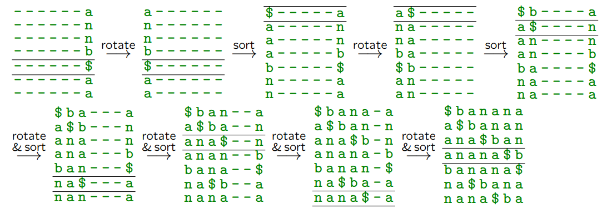
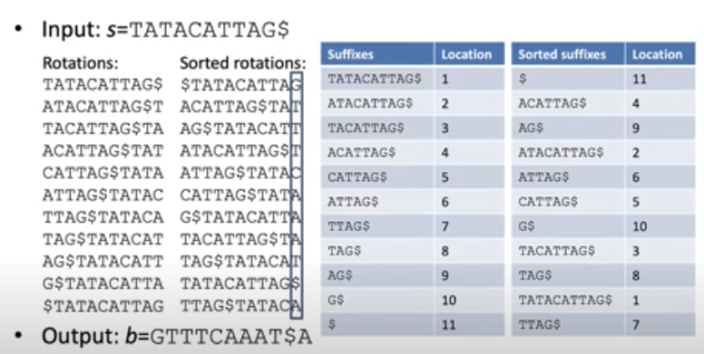

# 4. Burrows–Wheeler Transform

It was proposed by Michael Burrows and David Wheeler in 1994. The transform had been known to David Wheeler earlier; Michael Burrows came up with an efficient algorithm to perform it.

The idea of the Burrows–Wheeler transform (BWT): rearrange the letters of the input text so that the letters that occur immediately after (or immediately before) similar contexts end up next to each other.

In other words - the letters of the text are rearranged by a special transform so that the rearrangement reflects the "internal symmetries" of the text; repeated letters often end up next to each other.

## Move-to-Front Coding

Before BWT we look at another code called *Move-to-front*. It is often used right after the Burrows–Wheeler transform, but it can also be used independently -- to encode any sequence of messages.

If the input is a text in which identical letters (or letters from a small set, smaller than the full alphabet) often end up next to each other, it can be compressed efficiently with *Move-to-front* coding:

1. The letters of the alphabet are arranged in a list whose positions are numbered starting with $0$.
2. Each letter is encoded by its position in this list, then this letter is moved to the very beginning of the list.

We need a data structure -- a list $L$ that allows finding the position of a letter in the list $L.\textsf{index}(c)$, allows removing the element at a given position $L.\textsf{delete}(\textit{pos})$, and allows inserting the removed element at the beginning of the list $L.\textsf{insert}(\textit{pos},c)$. The most frequently used letters will be at the front of the list, and the output will consist mostly of small numbers. (If the most frequently used letters in the input slowly change, the list adapts accordingly.)

**Example:** Use $\textsf{MoveToFrontEncode}()$ to encode the string `abaccab` over the alphabet $S=\lbrace \mathtt{a}, \mathtt{b}, \mathtt{c} \rbrace$.

The table shows the processing of each input letter - at the end of each step a new number is appended to the output. The permutation of the alphabet is shown *before* processing the corresponding input letter. After processing the current letter, the alphabet is rearranged by moving the encoded letter to the very beginning.

| Input | Output | Alphabet before the step |
| --- | --- | --- |
| **a**, b, a, c, c, a, b | 0 | `[a,b,c]` |
| a, **b**, a, c, c, a, b | 0,1 | `[a,b,c]` |
| a, b, **a**, c, c, a, b | 0,1,1 | `[b,a,c]` |
| a, b, a, **c**, c, a, b | 0,1,1,2 | `[a,b,c]` |
| a, b, a, c, **c**, a, b | 0,1,1,2,0 | `[c,a,b]` |
| a, b, a, c, c, **a**, b | 0,1,1,2,0,1 | `[c,a,b]` |
| a, b, a, c, c, a, **b** | 0,1,1,2,0,1,2 | `[a,c,b]` |
| N/A | N/A | `[b,a,c]` |

**Example:** Use $\textsf{MoveToFrontEncode}()$ to encode the string `abababca` over the alphabet $S=\lbrace \mathtt{a}, \mathtt{b}, \mathtt{c} \rbrace$.

| Input | Output | Alphabet before the step |
| --- | --- | --- |
| **a**, b, a, b, a, b, c, a | 0 | `[a,b,c]` |
| a, **b**, a, b, a, b, c, a | 0,1 | `[a,b,c]` |
| a, b, **a**, b, a, b, c, a | 0,1,1 | `[b,a,c]` |
| a, b, a, **b**, a, b, c, a | 0,1,1,1 | `[a,b,c]` |
| a, b, a, b, **a**, b, c, a | 0,1,1,1,1 | `[b,a,c]` |
| a, b, a, b, a, **b**, c, a | 0,1,1,1,1,1 | `[a,b,c]` |
| a, b, a, b, a, b, **c**, a | 0,1,1,1,1,1,2 | `[b,a,c]` |
| a, b, a, b, a, b, c, **a** | 0,1,1,1,1,1,2,2 | `[c,b,a]` |
| N/A | N/A | `[a,c,b]` |

**Example:** Decode `010010` over the alphabet $S=\lbrace \mathtt{a}, \mathtt{b} \rbrace$

| Input | Output | Alphabet before the step |
| --- | --- | --- |
| **0**, 1, 0, 0, 1, 0 | a | `[a,b]` |
| 0, **1**, 0, 0, 1, 0 | a,b | `[a,b]` |
| 0, 1, **0**, 0, 1, 0 | a,b,b | `[b,a]` |
| 0, 1, 0, **0**, 1, 0 | a,b,b,b | `[b,a]` |
| 0, 1, 0, 0, **1**, 0 | a,b,b,b,a | `[b,a]` |
| 0, 1, 0, 0, 1, **0** | a,b,b,b,a,a | `[a,b]` |
| N/A | N/A | `[a,b]` |

## Burrows–Wheeler Transform

**Definition:** A *permutation* of an $n$-element list is any other list in which the order of these elements is changed. A *cyclic rotation* (cyclic permutation) is a permutation in which each element keeps both of its neighbors -- i.e., one or more elements from the end of the list are moved to the beginning of the list, without changing the relative order of the moved elements.

If all letters are distinct, an $n$-element list has $n!$ permutations (but only $n$ cyclic rotations).

**Example:** Write down all cyclic rotations of the words `BONBON$` and `BANANA$`, then sort them alphabetically.

```text
B O N B O N $              $ B O N B O N
$ B O N B O N              B O N $ B O N
N $ B O N B O              B O N B O N $
O N $ B O N B     --->     N $ B O N B O
B O N $ B O N              N B O N $ B O
N B O N $ B O              O N $ B O N B
O N B O N $ B              O N B O N $ B
```

```text
B A N A N A $              $ B A N A N A
$ B A N A N A              A $ B A N A N
A $ B A N A N              A N A $ B A N
N A $ B A N A     --->     A N A N A $ B
A N A $ B A N              B A N A N A $
N A N A $ B A              N A $ B A N A
A N A N A $ B              N A N A $ B A
```

The Burrows–Wheeler transform is the last column of this sorted arrangement -- BWT(`BONBON$`) = `NN$OOBB` and BWT(`BANANA$`) = `ANNB$AA`.

**Definition:** The *right context* of an alphabet letter $x \in S$ in a given text $T$ is any string of fixed length $k$ that immediately follows this letter $x$ (if the letter $x$ is close to the end of the word, the context is obtained by wrapping around cyclically to the beginning of the text).

The Burrows–Wheeler transform sorts all right contexts lexicographically and writes out the letters of the text in the order determined by these right contexts.


> *Note:* One could also sort in reverse lexicographic order (i.e., alphabetically, but reading each word from the other end). In this case the first column would become the Burrows–Wheeler transform. I.e., one can also sort by "left contexts". This is how Guy Blelloch describes it in the book *Introduction to Data Compression*.

### Inverse Burrows–Wheeler Transform

From the Burrows–Wheeler transform (the last column) one can deduce what the first column will be (the same letters, but in alphabetical order). One can show that the order of identical letters does not change in the result of the Burrows–Wheeler transform. Therefore it is enough to know these two columns and use the L2F (Last-to-First) mapping table.

It is also possible to reconstruct the whole matrix:



*Decode*

**Description of the algorithm**

1. In a loop, every column is shifted one step to the right and then rearranged. The permutation is determined by the last column of the matrix.
2. This way, if we can find column $j$, we can obtain column $j+1$ from column $j$. Repeating this, we can reconstruct the whole matrix $M$.
3. To reconstruct the original text $T$, it is enough to find only one row of the matrix.

> *Note:* See page 177 of [https://www.cs.helsinki.fi/u/tpkarkka/opetus/12s/spa/lecture11.pdf](https://www.cs.helsinki.fi/u/tpkarkka/opetus/12s/spa/lecture11.pdf)

## Efficient BWT with Suffix Trees

**Claim:** A naive implementation of BWT requires $O(n^2 \log n)$ time and $O(n^2)$ space.

**Proof:** Writing out the cyclic rotations requires filling an $n \times n$ matrix with letters; the space used is $O(n^2)$. Then $n$ strings have to be sorted; comparing two strings takes $O(n)$ steps in the worst case. The total time complexity is $O(n \log_2 n) \cdot O(n) = O(n^2 \log_2 n)$.

In practice, long texts are compressed by applying the Burrows–Wheeler transform to separate blocks. A typical block length is a few hundred kilobytes. Blocks should not be too long, so that they are practical to process. They should also not be too short, so that repeated contexts can be found and used optimally. Still, $O(n^2 \log_2 n)$ time complexity is very inefficient even for typical values of $n$ (100KiB to 1MiB).

The Burrows–Wheeler transform can be computed in time linear in the length of the word, $O(n)$, using *suffix arrays*.

**Definition:** The suffix array of an input string $w$ is a data structure whose key column contains the numbered suffixes of $w$ (the number of each suffix shows how many letters must be deleted from the beginning of the word to get this suffix), and the second column contains the position of each suffix in alphabetical order, starting with $0$.

**Example:** The suffix array for the string $w$ = `BANANA$`. We sort the suffixes alphabetically:

* `$` -> 6 (how many letters must be deleted from `BANANA$` to leave the dollar sign)
* `A$` -> 5
* `ANA$` -> 3
* `ANANA$` -> 1
* `BANANA$` -> 0
* `NA$` -> 4
* `NANA$` -> 2

We get the suffix array `[6, 5, 3, 1, 0, 4, 2]`

**Example:** The suffix array for the string $w$ = `TATACATTAG$`.

| Suffix (not stored) | Suffix number |
| --- | --- |
| `$` | 10 |
| `ACATTAG$` | 3 |
| `AG$` | 8 |
| `ATACATTAG$` | 1 |
| `ATTAG$` | 5 |
| `CATTAG$` | 4 |
| `G$` | 9 |
| `TACATTAG$` | 2 |
| `TAG$` | 7 |
| `TATACATTAG$` | 0 |
| `TTAG$` | 6 |

Suffix trees can be used in string searching. (For example, the information in the right column can be used to find `TA` in all places; one can use binary search -- finding the letter `T` in the original string at the positions pointed to by the suffix array. Then one searches for where the second letter `A` is.)

**Claim:** For a string $w$ of $|w| = n$ letters, the suffix array can be built in $O(n)$ time and takes $O(n)$ space.

(This claim is justified at the very end of the course - in the suffix tree/array algorithm on string searching.)

**Claim:** For the suffix array of a string $w$ ending with a dollar sign (alphabetically before all other letters of the alphabet), the positions in the suffix array coincide with the positions of the sorted Burrows–Wheeler rotations:



Since the Burrows–Wheeler transform is visible in the last column, it can be obtained

**BWT Transform with a Suffix Array**

The input is a word $w$ whose last symbol is `$`.

$\textsf{efficientBWT}(w)$
1. $\quad A = \textsf{getSuffixArray}(w) \quad$ *// initialize the suffix array*
2. $\quad n = |w| \quad$ *// n is the length of the string w, including the final dollar sign*
3. $\quad$ **for** $i = 0$ **to** $n-1$ *// repeat n times*
4. $\quad\quad j = A[i]-1$ *// j is one position before A[i]*
5. $\quad\quad$ **if** $j == -1$
6. $\quad\quad\quad j = n-1$ *// position "-1" in a cyclic rotation is at the end of the string*
7. $\quad\quad \textsf{output}(w[j])$

**Example:** For the string $w$ = `BANANA$` the suffix array is `[6, 5, 3, 1, 0, 4, 2]`. Therefore the result of the algorithm is as follows:

| $i$ | $A[i]$ | $j=A[i]-1$ | $w[j]$ |
| --- | --- | --- | --- |
| 0 | 6 | 5 | `A` |
| 1 | 5 | 4 | `N` |
| 2 | 3 | 2 | `N` |
| 3 | 1 | 0 | `B` |
| 4 | 0 | 6 | `$` |
| 5 | 4 | 3 | `A` |
| 6 | 2 | 1 | `A` |

In an earlier example we already saw that BWT(`BANANA$`) = `ANNB$AA`, which coincides with the output of this algorithm.

**Example:** Build the BWT and the suffix array for the string `CAA` (without the final dollar sign).

We write down and sort the cyclic rotations alphabetically:

```text
C A A             A A C
A C A     -->     A C A
A A C             C A A
```

The last column (the result of the BWT transform) is `CAA`.

> *Note:* To decode such a BWT transform without a dollar sign, the decoder also needs to know where the first letter is in the result of the BWT transform. Otherwise it can reconstruct the BWT matrix, but cannot find out which of the cyclic rotations in the matrix is the right one.

We write down and sort the suffixes alphabetically:

```text
C A A              A      (idx=2, the first 2 letters deleted in this suffix)
A A       --->     A A    (idx=1, the first 1 letter deleted)
A                  C A A  (idx=0, 0 letters deleted)
```

The suffix array is `[2,1,0]` (the suffix indices written in alphabetically sorted order). Let us try to apply $\textsf{efficientBWT}(w)$ to this string:

| $i$ | $A[i]$ | $j=A[i]-1$ | $w[j]$ |
| --- | --- | --- | --- |
| 0 | 2 | 1 | `A` |
| 1 | 1 | 0 | `A` |
| 2 | 0 | 2 | `C` |

Note that the obtained result `AAC` does not coincide with the true BWT result `CAA`. Therefore an important assumption of $\textsf{efficientBWT}(w)$ is that $w$ ends with a dollar sign (the very first letter of the alphabet).

## Problems

**Problem 4.1:** Write down the Burrows–Wheeler transform of the word `ABBA$`. After it, indicate where in this transform the string `ABBA$` is. *Note.* Rows in the sorted matrix are numbered from $1$.

**Answer:** Obtain the cyclic rotations of `ABBA$` and sort them lexicographically:

$$
\left( \begin{array}{ccccc}
\text{A} & B & B & A & \$ \\
\$ & A & B & B & A \\
A & \$ & A & B & B \\
B & A & \$ & A & B \\
B & B & A & \$ & A
\end{array} \right) \rightarrow
\left( \begin{array}{ccccc}
\text{\$} & A & B & B & A \\
A & \$ & A & B & B \\
A & B & B & A & \$ \\
B & A & \$ & A & B \\
B & B & A & \$ & A
\end{array} \right).
$$

The result of the transform is the right column: `AB$BA`. The original string is row 3. $\square$

**Problem 4.2:** For the Burrows–Wheeler transform string of `ABBA$` obtained in the previous question, write down the **Move-to-Front** code, if the initial order of the letters in the alphabet is `$` < `A` < `B`. *Note.* In **Move-to-Front** algorithms the alphabet is numbered from $0$.

* Write down the string obtained with the Burrows–Wheeler transform.
* Write down the move-to-front code of this string.

**Answer:** In each **Move-to-Front** encoding step we move the current symbol to the beginning of the alphabet.

| String | Code | Alphabet |
| --- | --- | --- |
| `*A*B$BA` | 1 | `($,A,B)` |
| `A*B*$BA` | 2 | `(A,$,B)` |
| `AB*$*BA` | 2 | `(B,A,$)` |
| `AB$*B*A` | 1 | `($,B,A)` |
| `AB$B*A*` | 2 | `(B,$,A)` |

The resulting code is `12212`. $\square$

## References

* [https://www.cs.helsinki.fi/u/tpkarkka/opetus/12s/spa/lecture11.pdf](https://www.cs.helsinki.fi/u/tpkarkka/opetus/12s/spa/lecture11.pdf)
* [https://docs.python.org/3/library/bz2.html](https://docs.python.org/3/library/bz2.html)
* [https://serverfault.com/questions/2600/how-do-you-set-bzip2-block-size-when-using-tar](https://serverfault.com/questions/2600/how-do-you-set-bzip2-block-size-when-using-tar)
* [https://youtu.be/w-Cnkg6ANG8?si=wC5UeoUDhXq56qzw](https://youtu.be/w-Cnkg6ANG8?si=wC5UeoUDhXq56qzw).
