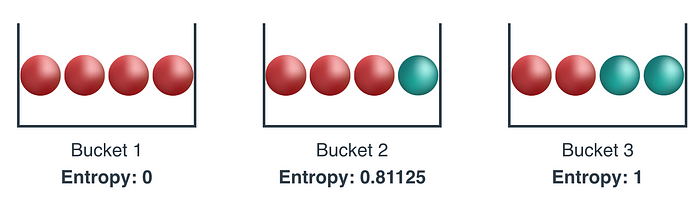
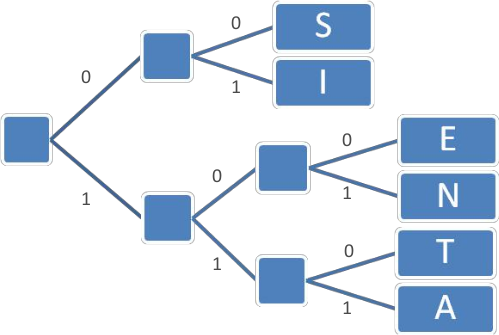
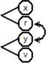
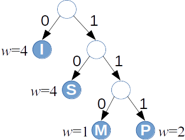

# 1. Lossless Compression: Huffman Code

## Course Scope and Methods

The course brings together a variety of algorithms that are important in the IT industry, with an emphasis on telecommunications, 
security, optimization problems, and data search. The algorithms fall into several 
families; each block of lectures covers one of them: 

1. Lossless compression, 
2. Lossy compression; image and video compression, 
3. Error-correcting codes,
4. Applied cryptography, 
5. Linear programming, also known as linear optimization; 
6. String searching algorithms.

**Theory:** For every algorithm topic we look at its mathematical foundations. For example, in compression 
the entropy of the message source is important; sampling rates of continuous signals, finite fields, extrapolation with polynomials, linear optimization problems and their duality, the use of hash functions and suffix trees in string searching.

**Algorithms to run on paper:** Pseudocode and examples are available for the algorithms, so that the algorithms themselves and the data structures they use can be drawn on paper, analyzed, and modified.

**Standards and tools:** We look at how the algorithms of the course appear in popular tools, standards, and libraries.

**Experiments:** We visualize the algorithms and run them in interactive environments, also on larger datasets than could be drawn on paper.

### How to Analyze Algorithms

**Classification by paradigm:** Exhaustive search, brute force, Decrease-and-conquer, Divide-and-conquer, Transform-and-conquer, Dynamic programming, Greedy technique, Iterative improvement. For algorithm *design techniques* see [[Lev12]](#Lev12).

**Classification by model of computation:** Deterministic, nondeterministic, randomized algorithms. Classical and quantum algorithms.

**Classification by complexity:** Worst-case complexity $O(f(n))$, average-case complexity (for randomly chosen input), expected complexity (for a randomized algorithm).

The course illustrates various algorithm design techniques. The model of computation is usually deterministic and classical (non-quantum). Some randomized algorithms are mentioned separately.

### Course Requirements

1. 4 homework assignments (together $40\%$) - theory questions and running algorithms on simple data on paper.
2. A 10-minute presentation on a prepared topic ($10\%$); experimenting with an algorithm related to the course topics ($20\%$).
3. Final exam ($30\%$).

## Lossless Compression: Introduction

1. Compression concepts, impossibility of universal compression.
2. Information content and the entropy of a probability distribution. Entropy in text problems.
3. Prefix codes, theorems about optimal prefix codes.
4. Huffman's algorithm; optimality of the resulting code. Encoding the prefix tree itself.

**Definition:** An *alphabet* is a finite set of symbols.

**Definition:** A *message alphabet* is a finite set of $n$ possible messages: $S = \lbrace x_1, x_2, \ldots, x_n \rbrace$.

A message alphabet may consist of letters in the traditional sense, but a message can also be several letters, a word, or any other object. A message alphabet has a probability distribution: each $x_i$ has a probability $p(x_i)$ with which it appears in the input.

* Latin/English alphabet: 26 symbols; Latvian alphabet: 33 symbols;
* [ASCII alphabet](http://www.asciitable.com/): $128$ symbols;
* Unicode alphabet (UCS-2, *Basic Multilingual Plane*): 65536 symbols.
* The alphabet of all blocks that can be encrypted with AES-128 or AES-256: (one block is $16$ bytes, so the alphabet size is $2^{128}$).
* A single message can also be a whole file or a chunk of a file to be compressed, many kilobytes long.

**Definition:** An *encoding* of a message set $S$ is a function $C$ that turns every message into a bit string.

The bit string corresponding to the message $x_i$ is called a *codeword* $w_i$, and the encoding can be described as a dictionary (i.e., as argument-value pairs of the function):

$$
C = \{ (x_1,w_1),(x_2,w_2),\ldots,(x_m,w_m)\}.
$$

**Definition:** If the message $x_i \in S$ itself is also written in bits, we can define the *compression ratio* - how many times the length of the bit string decreases after encoding:

$$
r = \frac{\text{Uncompressed size}}{\text{Compressed size}} = \frac{|x_i|}{|w_i|}.
$$

Similarly, we define the compression ratio for longer message sequences (how many times shorter the message sequence is after compression, compared with the length of the message sequence before compression). Usually we want the compression ratio $r$ to be as large as possible, but it can also happen that $r < 1$ (i.e., the unencoded bit string is shorter).

### Compression and Decompression


**Lossless compression:** The decompressed message is exactly the same as the original. Preferred for text documents and executable code.

**Lossy compression:** The decompressed message is only approximately equal to the original. Examples are storing and transmitting images, sound, and video.

**Example:** A lossless compression algorithm: [Run length encodings](https://commons.wikimedia.org/wiki/File:Run-lengthEncoding1.png). Very efficient when the same letter is repeated many times. Then, instead of $n$ identical letters, we send one letter and one number of length $\log_2 n$. In typical text, identical letters rarely repeat, and such an encoding makes the transmitted text longer.

**Definition:** A function $f\,:\; X \rightarrow Y$ is called *injective* if for every two arguments $x_1,x_2 \in X$ the following holds:

$$
\forall x_1, x_2 \in X \left(x_1 \neq x_2\;\;\Rightarrow\;\;f(x_1) \neq f(x_2)\right).
$$

> *Note:* A lossless compression function must be injective; it must not have "collisions" (values running into each other), otherwise it cannot be decoded unambiguously.

**Claim:** There is no algorithm that in lossless compression turns **every** $n$-bit string into a shorter string -- i.e., into a $k$-bit string where $k < n$.

**Proof:** By counting. A bit has $2$ values ($0$ or $1$).

* An $m$-bit string has $2^m$ values,
* A $k$-bit string has $2^k$ values.

By the *pigeonhole principle*, there is no injective function from a set with $2^m$ elements to a set with $2^k$ elements (if $k < m$). $\blacksquare$

### Information Content and Entropy

**Example:** There are two kinds of messages -- red and green. The probability of a green message is $0.25$, and the probability of a red message is $0.75$. How can we optimally encode a random sequence of $n$ messages that follows this probability distribution?



If we are given two message sets (alphabets), then when messages are written one after another, the number of concatenated messages is the product of the sizes of both sets. But the "amount of information" (intuitively - the length of the encoding) adds up.

1. Logarithm of a product: $\log_2 ab = \log_2 a + \log_2 b$
2. Change-of-base formula for logarithms: $\log_a b = \frac{\log_m b}{\log_m a}$. (When re-encoding the same information from an alphabet with $m$ symbols into an alphabet with $a$ symbols, the length of the encoding decreases $\log_m a$ times.)

**Definition:** The *information content* of a message $x_i \in S$ is the quantity:

$$
h(x_i) = \log_2 \frac{1}{p(x_i)} = -\log_2 p(x_i).
$$

> *Note:* The information content will turn out to equal the number of bits used to transmit the message $x_i$ in some optimal encoding.

This was introduced by *Claude Shannon*. There is a relation between entropy in information theory and entropy in thermodynamics, but it is not simple. There is an MIT course about it [[Mil11]](#Mil11).

**Examples:**

1. A fair coin has two states: $S=\lbrace \mathtt{heads}, \mathtt{tails} \rbrace$, and both messages have probability $p=\frac{1}{2}$. The information content of each of them:

   $$
   h(\mathtt{heads}) = h(\mathtt{tails}) = - \log_2 (1/2) = 1.
   $$

2. A die has six states, each with probability $1/6$. The information content of each of them:

   $$
   h(x_i) = - \log_2 (1/6) \approx 2.585.
   $$

**Sum of two information contents**

Assume that $a,b \in S$ are two independent random events, or messages. Then the probability of receiving them one after the other is $p(ab) = p(a) \cdot p(b)$, and the amount of information is:

$$
h(ab) = -\log_2 (p(a) \cdot p(b)) = -\log_2(p(a)) - \log_2(p(b)) = h(a) + h(b).
$$

**Definition:** If a discrete *random variable* has a known set of possible states $S$ and each $x_i \in S$ has a known probability, then the *entropy* of the random variable is the value:

$$
H(S) = - \sum\limits_{x_i \in S} p(x_i) \log_2 p(x_i),
$$

where $p(x_i)$ is the probability of the message $x_i$.

**Example (Entropy of a random bit string):** Consider the entropy of a bit string of length $L$. If there are $n = 2^L$ messages with equal probabilities $1/n$, then each of them can be encoded with $\log_2 n = L$ bits.

The information content of each message is $h(x_i) = -\log_2 (1/n) = \log_2 n = L$. So the entropy (the average value of all these information contents) is also $L$. In this extreme case the entropy is exactly equal to the bits needed for encoding.

**Example (Entropy of a biased coin):** If, when tossing a coin, heads ($\mathtt{heads}$) comes up with probability $0.9$ and tails ($\mathtt{tails}$) with probability $0.1$, then the information content of heads is $h(\mathtt{heads}) = -\log_2 0.9 \approx 0.152$, and the information content of tails is $h(\mathtt{tails}) = -\log_2 0.1 \approx 3.32$. The entropy of the coin-tossing process itself is the *weighted average* of these two quantities $H(\lbrace\mathtt{heads}, \mathtt{tails} \rbrace) = -0.9 \log_2 0.9 - 0.1 \log_2 0.1 \approx 0.469$.

> *Note:* Information content and entropy are measured in "bits". In computer architecture there are physical bits, but in entropy these are bits of the amount of information - they can also be fractional.


*Information content and entropy for the two-message alphabet $S = \lbrace\mathtt{heads}, \mathtt{tails} \rbrace$.*

A random variable with two messages has the largest entropy when both messages occur with equal probabilities. Then $H(S) = 1$. In all other cases $H(S) < 1$.

Note that entropy is also defined when one of the probabilities is $0$ (both marked points on the entropy graph on the right). A message with zero probability has an "infinite" logarithm and hence also infinite information content, but after multiplying by the weight $0$, the contribution of such a message to the total entropy is $0$, because ${\displaystyle \lim\limits_{p \rightarrow 0} - p \cdot \log_2 p = 0}$.

### Properties of Entropy

Consider a discrete random variable $X$ that has $m$ different values (messages, letters, die outcomes, heads/tails, etc.) with the corresponding probabilities $\lbrace p_1, p_2, \ldots, p_m \rbrace$. And another discrete random variable $Y = \lbrace y_1, y_2, \ldots, y_n \rbrace$ with the associated probabilities $p(x_i) = p_i$ and $p(y_j) = q_j$. Entropy has the following properties:

**Entropy is nonnegative:** $H(X) \geq 0$. The equality $H(X) = 0$ holds only if the probability distribution is $(x_1,x_2,\ldots,x_m) = (0,\ldots,0,1,0,\ldots,0)$.

**Entropy is symmetric:** $H(\lbrace x_1,\ldots, x_m \rbrace) = H(\lbrace x_{\tau(1)},\ldots, x_{\tau(m)} \rbrace)$, where $\tau(i)$ is a permutation of the indices $j$.

## Prefix Codes

Variable-length codes can help save space. If all messages are encoded with the same length, then each symbol takes $\left\lceil \log_2 |S| \right\rceil$ - this is usually far from optimal.

Codewords of different lengths can create *ambiguities*. For example, if the encoding is

$$
\{(a, \mathtt{1}), (b, \mathtt{01}), (c, \mathtt{101}), (d, \mathtt{011})\},
$$

then $\mathtt{1011}$ can be read in three different ways:

$$
\mathtt{1.01.1},\;\;\mathtt{1.011},\;\;\mathtt{101.1}.
$$

**Definition:** A *prefix code* is a mapping of the message alphabet to codewords such that no codeword is a prefix of another codeword. (In fact it is a "prefix-free" code.)



$$
C=\{ (S, \mathtt{00}), (I, \mathtt{01}),
     (E, \mathtt{100}), (N, \mathtt{101}),
     (T, \mathtt{110}), (A, \mathtt{111})\}.
$$

**Example:** Using the prefix tree above:

* Decode the string $\mathtt{11100110100}$,
* Decode the string $\mathtt{0001100101111}$.

### Average Code Length

Assume that the probability distribution on the message space $S$ is known: each $x_i \in S$ is assigned a probability $p(x_i)$ and $p(x_1)+\ldots+p(x_n)=1$.

**Definition:** The *average length* of a code $C = \lbrace(x_1,w_1),\ldots,(x_n,w_n)\rbrace$ is the sum:

$$
\ell_a(C) = \sum\limits_{(x_i,w_i) \in C} p(x_i)\ell(w_i),
$$

where $\ell(w_i)$ denotes the length of the codeword $w_i$ in bits.

**Definition:** We say that $C$ is an *optimal code* if it is uniquely decodable and its $\ell_a(C)$ is minimal. In other words, if for the given probability distribution of messages there is no other code with an even smaller average length.

**Theorem (Kraft–McMillan inequality):** ([[Ble13, Lemma 3.1.1]](#Ble13)) If $C$ is a *uniquely decodable code* $C = \lbrace (x_1,w_1),\ldots,(x_n,w_n)\rbrace$, then

$$
\sum\limits_{(x_i,w_i) \in C} 2^{-\ell(w_i)} \leq 1.
$$

And the converse: if we are given several code lengths $l_i$ satisfying $\sum 2^{-l_i} \leq 1$, then we can build a prefix tree from them in which every length $l_i$ corresponds to a leaf of depth exactly $l_i$.

**Proof:** For general uniquely decodable codes this is tricky to prove.

For *prefix-free codes* note that every $k_i$-bit code fills exactly a $\frac{1}{2^{k_i}}$ fraction of the volume in the prefix tree (also called the "code space").

The "volumes" of different codes cannot partially overlap. And since none is a prefix of another, none can lie entirely inside another. The volume of the full code space is $1$, so the sum of all $2^{-k_i}$, where $k_i = \ell(w_i)$, does not exceed 1. $\blacksquare$

**Theorem:** For every message set $S$ with a known probability distribution and an optimal prefix code $C$:

$$
\ell_a(C) \leq H(S) + 1.
$$

**Proof:** For each input message/symbol $x_i \in S$ we choose

$$
\ell(x_i) = \left\lceil \log_2 \frac{1}{p(x_i)} \right\rceil.
$$

In that case:

$$
\sum\limits_{x_i \in S} 2^{-\ell(x_i)} = \sum\limits_{x_i \in S}
2^{-\left\lceil \log_2 \frac{1}{p(x_i)} \right\rceil} \leq
\sum\limits_{x_i \in S} 2^{- \log_2 \frac{1}{p(x_i)}} = \sum\limits_{x_i \in S} p(x_i) = 1.
$$

By the Kraft–McMillan theorem (the converse direction) we can find a prefix code $C'$ with exactly these codeword lengths. An estimate of the average length $\ell_{avg}(C')$:

$$
\ell_{avg}(C') = \sum\limits_{x_i \in S} p(x_i) \cdot \left\lceil \log_2 \frac{1}{p(x_i)}
\right\rceil \leq
\sum\limits_{x_i \in S} p(x_i)\left( 1 + \log_2 \frac{1}{p(x_i)} \right) = 1 + H(S).
$$

The optimal prefix code $C$ must be at least as good as the code $C'$ just constructed. Therefore it has the same estimate:

$$
\ell_{avg}(C) \leq \ell_{avg}(C') \leq 1 + H(S).
$$

## Average Length of a Code

**T1: Estimate of the code length**

**Theorem 1:** For every message set $S$ with a known probability distribution and a uniquely decodable code $C$ the following inequality holds:

$$
H(S) \leq l_a(C).
$$

**Intuition behind Shannon's claim:** When sending a message $x$ from the alphabet $S$, the *information content* $h(x)$ is the recommended number of bits. If the messages $x_i$ have probabilities $p_i$, then each of them occupies some piece of the "code space". For example, using 4 bits for encoding, we have occupied 1/16 of the code space.

**Proof:** We write a chain of inequalities:

$$
\begin{array}{rl}
  H(S) - \ell_a(C) &= \sum\limits_{x_i \in S} p(x_i)  \log_2 \frac{1}{p(x_i)} -
  \sum\limits_{x_i \in S} p(x_i)\ell(x_i) =\\
  &= \sum\limits_{x_i \in S} p(x_i) \left( \log_2 \frac{1}{p(x_i)} -
  \log_2 2^{\ell(x_i)} \right) = \\
  &= \sum\limits_{x_i \in S} p(x_i) \log_2 \frac{ 2^{-\ell(x_i)}}{p(x_i)} \leq
  \log_2 \sum_{x_i \in S} 2^{-\ell(x_i)} \leq 0.\\
\end{array}
$$

$\blacksquare$

**The last step in the chain**

Recall the definition of $\ell$: for each message $s_i \in S$, $\ell(s_i)$ denotes the length of the codeword $w_i$ of $s_i$ in the code $C$, i.e., $(s_i,w_i) \in C$. Why does the following inequality hold?

$$
\sum\limits_{x_i \in S} p(x_i) \log_2 \frac{ 2^{-\ell(x_i)}}{p(x_i)} \leq
\log_2 \sum_{x_i \in S} 2^{-\ell(x_i)}
$$

**Jensen's inequality:** Let $f(x)$ be a twice continuously differentiable function on the interval $[a;b]$ with $f''(x) \leq 0$ on this interval, i.e., the graph of $f(x)$ is concave. Let $x_1,x_2,\ldots,x_n \in [a;b]$ be $n$ numbers and $p_1,p_2,\ldots,p_n$ weights whose sum is 1. Then the following inequality holds:

$$
p_1f(x_1) + p_2f(x_2) + \ldots + p_nf(x_n) \leq f \left( p_1x_1 + \ldots p_nx_n \right).
$$

## Huffman's Algorithm

**Input:** Letters (messages) with given probabilities.

**Output:** A prefix tree for representing these letters/messages with a prefix code.


*Huffman's algorithm.*

Huffman's algorithm follows the *greedy* algorithm paradigm - this time "local" optimization leads to a globally optimal solution.

**Pseudocode of Huffman's algorithm**

*Input:* A message alphabet $S$ with probability $x.\mathit{freq}$ for each message $x \in S$.
*Output:* A prefix tree that assigns a code to every message.

$\textsf{Huffman}(S)$
1. $\quad n = |S| \quad$ *// number of elements*
2. $\quad Q = \textsf{MinimumPriorityQueue}(S)$
3. $\quad$ **for** $i = 1$ **to** $n-1$:
4. $\quad\quad \textsf{CreateNode}(z)$
5. $\quad\quad z.\mathit{left} = x = Q.\textsf{ExtractMin}()$
6. $\quad\quad z.\mathit{right} = y = Q.\textsf{ExtractMin}()$
7. $\quad\quad z.\mathit{freq} = x.\mathit{freq} + y.\mathit{freq}$
8. $\quad\quad Q.\textsf{insert}(z)$
9. $\quad$ **return** $Q.\textsf{ExtractMin}()$

Pseudocode borrowed from [[CLRS22, p.431]](#CLRS22).

**Time complexity of Huffman's algorithm:** The time complexity when the priority queue is implemented as a *heap*:

* $\textsf{ExtractMin}(Q)$ (finding the minimum) in a priority queue needs $O(\log n)$ time.
* $\textsf{Insert}(Q,z)$ also needs $O(\log n)$ time.
* The total time for the call $\textsf{Huffman}(S)$ is $O(n \log n)$, where $n = |S|$.

**Theorem (Optimality of the Huffman tree):** Huffman's algorithm generates an optimal binary prefix tree for the message set $S$ under the given probability distribution.

Among all codes $C$ that somehow assign prefix-free codes $w_i$ to the messages $x_i \in S$, the average length

$$
\ell_a(C) = \sum\limits_{(x_i,w_i) \in C} p(x_i)\ell(w_i)
$$

will be the smallest (or one of the smallest) for the code $C^{\ast}$ described by the Huffman tree.

**Proof:**

**Base case:** The message alphabet $S$ has $1$ letter. Then there is only one tree, which is both the optimal tree and the Huffman tree.

**Inductive step:** There are at least two letters. Assume that Huffman's algorithm always gives an optimal tree for $k-1$ letters. Now we are given an alphabet $S$ with $k$ letters, where $x$ and $y$ are the two least frequent letters.

In the first step, Huffman's algorithm merges the nodes $x$ and $y$. A new node is created with frequency $p(x) + p(y)$. Next, Huffman's algorithm has to be applied to $k-1$ letters.

By the induction hypothesis, Huffman's algorithm gives the optimal tree for $k-1$ letters. This means that Huffman's algorithm gives the optimal tree among those trees in which $x$ and $y$ are siblings.

Maybe there is an even better tree in which $x$ and $y$ are not siblings?

We show that other trees can be transformed into trees that are at least as good and in which $x$ and $y$ are siblings.

In an optimal tree 2 claims hold:

1. If $p(x) < p(y)$, then $\ell_x \geq \ell_y$ (otherwise we could swap $x$ and $y$ in the tree and the code length would decrease.)
2. Denote the maximum codeword length, i.e., the depth of the prefix tree, by $\ell_{\max}$. Then there are two letters $u$, $v$ with $\ell_u = \ell_v = \ell_{\max}$. (First we find a deepest $u$. If there were no sibling edge to $v$, the code of $u$ could be shortened by one edge.)

Let $x,y$ be the 2 least frequent letters, and $u,v$ the deepest siblings in the prefix tree.

* Both $x,y$ are as deep in the tree as the deepest nodes $u$ and $v$ (otherwise the tree could be improved).
* By swapping $x$ with $u$ and $y$ with $v$, any optimal tree can be turned into another optimal tree in which $x$ and $y$ are siblings.



*Swapping $x$ and $y$.*

Earlier we proved the result: for every message set $S$ with a known probability distribution and an optimal prefix code $C$:

$$
\ell_a(C) \leq H(S) + 1.
$$

**Corollary:** Since Huffman's algorithm produces the optimal prefix code (in fact: one of the optimal ones), the Huffman code $C^{\ast}$ satisfies:

$$
\ell_a(C^{\ast}) \leq H(S) + 1.
$$

### Variants of Prefix Tree Codes

**Grouping symbols**

Example: The biased coin alphabet $S = \lbrace A,B \rbrace$ with probabilities $p(A) = 0.9$ and $p(B) = 0.1$.

* Encoding one symbol at a time, we get the average code length $\ell_a(C) = 1$, even though the entropy is $H(S) = 0.4689956$.
* Encoding two symbols at a time: $T = \lbrace AA,AB,BA,BB \rbrace$ with probabilities $\lbrace 0.81, 0.09, 0.09, 0.01 \rbrace$, the average code length of the Huffman code is $\ell_a(C_2) = 1 \cdot 0.81 + 2\cdot 0.09 + 3\cdot 0.09 + 3 \cdot 0.01 = 1.29/2 = 0.645$.

**Predictive coding**

* Usually there is no need to consider the full Cartesian product $S \times S$ formed by **all** possible symbol pairs $(x_i,x_j)$, because not every two (or three, four, etc.) symbols tend to appear next to each other.
* Encoding all symbol pairs works well for biased coins (and the sequence of Bernoulli trials they produce, where the distribution of one trial is $\lbrace p, 1-p \rbrace$).
* The first approximation for real texts are Markov chains (the probability distribution of the next symbol is determined by the previous symbol).

**Applications of Huffman's algorithm**

* The PKZIP (Phil Katz) archiver - PKZIP 2.04g and newer standards that use the DEFLATE compression standard (the same as the popular Zip file formats today).
* [RFC 7541 - HPACK: Header Compression for HTTP/2](https://tools.ietf.org/html/rfc7541) Header compression for the HTTP/2 protocol (RFC 7540), used since 2015.

## Sending the Code Table

Compression algorithms use a *codebook*; for prefix codes it can be pictured as a tree. If the message frequencies are known, the sender and the receiver can compute the tree themselves. Usually these frequencies become known only to the sender. Then the code tree or table has to be sent together with the encoded data.

In a large alphabet the code table can take a lot of space, so there is a particularly economical way to send a Huffman tree: [Canonical Huffman code](https://en.wikipedia.org/wiki/Canonical_Huffman_code).

**How to encode the Huffman tree itself efficiently:**

One can send the full code table (for every symbol/message write down the bit string that encodes it). This representation contains a lot of redundant information.

**Canonical Huffman code:** A [canonical Huffman code](https://en.wikipedia.org/wiki/Canonical_Huffman_code) is a way to assign the codes (without changing the code length of any letter) in alphabetical order. In this case (for a known message alphabet) it is enough to send only the code lengths -- the whole code table can be reconstructed from them. Simply put, in a canonical Huffman tree the symbols (the leaves of the tree) are first sorted by code length; for equal lengths, alphabetically. Formally this can be written as follows:

* When the leaves of the tree, i.e., the encoded symbols, are visited "in-order" (first the "0" branch, then the "1" branch), the code lengths form a nondecreasing sequence.
* For equal code lengths, the symbol that comes alphabetically before another symbol is to the left in the tree (i.e., the earlier letter also has a lexicographically earlier code).
* The shortest code (or one of the shortest, if there are several) consists of all zeros. The following codes are assigned in order, without skipping anything; if the code length increases at some step, then we not only add "1" to the binary number, but also append the required number of zeros to it.

**Example of a canonical tree:** Build a canonical Huffman code tree for the alphabet $\left\lbrace \mathtt{A}, \mathtt{B}, \mathtt{C}, \mathtt{D} \right\rbrace$ with the corresponding code lengths $(2,1,3,3)$.

**Solution:** The shortest code belongs to the symbol `B` - this code contains only zeros (so it is `0`). Next is the code of the symbol `A`, which is `10`. Finally, there are the two longest codes, which we assign in alphabetical order. So the code of the symbol `C` is `110`, and the code of the symbol `D` is `111`.

```text
B = 0     (1 bit)
A = 10    (2 bits)
C = 110   (3 bits)
D = 111   (3 bits)
```

If a canonical Huffman tree is used and the symbol alphabet is known (for example, $S=\lbrace A,B,C,D \rbrace$), then it is enough to communicate the codeword lengths of the corresponding letters: $(2, 1, 3, 3)$.

**About non-canonical Huffman trees:** Of course, running Huffman's algorithm can also produce a non-canonical tree (and hence a non-canonical code table). For example,

```text
A = 11
B = 0
C = 101
D = 100
```

Such a tree gives codes as short as the canonical one, because the code lengths are the same. However, this time the codes do not follow each other in lexicographic/sorted order.

## Problems

**Problem 1.1:** A fair die was rolled and showed some number from the set $\lbrace 1,2,3,4,5,6 \rbrace$. Which expression gives the information content of this event?

**(A)** $(\ln 2) \cdot (\ln 6)$

**(B)** ${\displaystyle (\ln 2)/(\ln 6)}$

**(C)** ${\displaystyle (\ln 6)/(\ln 2)}$

**(D)** $\ln (2\ln 6)$

**(E)** Some other (write your own)

**Answer:** The change-of-base formula for logarithms:

$$
\log_a b = \frac{\log_m b}{\log_m a}.
$$

In our case ${\displaystyle \log_2 6 = (\ln 6)/(\ln 2) \approx 2.584963}$. $\square$

**Problem 1.2:** Find the entropy of the random variable $S = \lbrace A,B,C \rbrace$, where $p(A)=1/2$, $p(B)=p(C)=1/4$. Round the answer to two decimal places.

**Answer:** For each of the symbols $A,B,C$ we compute the information content: $h(A) = \log_2 \frac{1}{1/2} = \log_2 2 = 1$.

$$
h(B)=h(C)= \log_2 \frac{1}{1/4} = \log_2 4 = 2.
$$

The entropy is the weighted average $(1/2)h(A) + (1/4)h(B) + (1/4)h(C)$:

$$
(1/2)\cdot 1 + (1/4) \cdot 2 + (1/4) \cdot 2 = 1.5.
$$

$\square$

**Problem 1.3:** What is the average length of the Huffman code used to encode the string `MISSISSIPPI`? Round the answer to two decimal places.

**Answer:**



*Prefix tree*

| $a \in S$ | $w(a)$ | $\ell_a$ | $p(a)$ |
| --- | --- | --- | --- |
| I | 0 | 1 | $4/11$ |
| S | 10 | 2 | $4/11$ |
| M | 110 | 3 | $1/11$ |
| P | 111 | 3 | $2/11$ |

The code lengths of the letters $I,S,M,P$ are $1,2,3,3$ bits, respectively. We multiply them by the probabilities of the corresponding letters (their relative frequencies in the word `MISSISSIPPI`).

$$
1\frac{4}{11} + 2\frac{4}{11} + 3\frac{2}{11} +
3\frac{1}{11} = \frac{21}{11} \approx 1.91.
$$

$\square$

**Problem 1.4:** What would the average code length be if each of the four letters in the word `MISSISSIPPI` were encoded as follows:

$$
C = \{(I,\mathtt{00}),(M,\mathtt{01}),
(P,\mathtt{10}),(S,\mathtt{11})\}.
$$

Round the answer to two decimal places.

**Answer:** Even without calculating anything, we see that the code length of every symbol is $2$, so the average code length will also be a weighted average of all these twos:

$$
p(M)\cdot 2 + p(I)\cdot 2 + p(S)\cdot 2 + p(P)\cdot 2 =
(1/11)\cdot 2 + (4/11)\cdot 2 + (4/11)\cdot 2 + (2/11)\cdot 2 = 2.
$$

$\square$

**Problem 1.5:** A canteen offers three different soups that cost 1, 2, or 3 euros, respectively. There are also three main courses that cost 2, 4, and 6 euros, respectively. Each visitor randomly chooses one of the soups and one of the main courses.

* What is the entropy of the random variable describing 1 chosen soup?
* What is the entropy of the random variable describing 1 chosen main course?
* What is the entropy of the lunch set if the soup and the main course are chosen independently?
* What is the entropy of the random variable describing the price paid for both dishes?

**Problem 1.6:** The letters "MISSISSIPPI" are written on $11$ tiles. They are all put into a dark bag. In one move, one tile is drawn from the bag, the letter on it is written down, and the tile is put back into the bag.

If after $11$ such moves the letters "MISSISSIPPI" have been written down in exactly this order, the player receives a big cash prize. Denote the probability of receiving the prize by $P$. Express $\log_2(P)$ in terms of $H(X)$ -- the entropy of the random variable of drawing one tile.

**Problem 1.7:** There are $12$ coins, all of equal mass except one, which is either lighter or heavier than the others. What is the smallest number of weighings needed to find this coin and determine whether it is lighter or heavier?

**Answer:** A few simple questions:

* How many weighings would be needed if we already knew the answer and had to prove it, for example, as expert evidence in court? *Nondeterministic algorithms*.
* How many weighings does a deterministic algorithm need? Justification by counting the cases and the pigeonhole principle?

**First step:** How many against how many should we weigh first? We compute the entropy (the expected Shannon information content of the 1st weighing):

| Weighing | Probabilities of outcomes | Entropy (bits) |
| --- | --- | --- |
| 6 against 6 | $p(\text{L},\text{Eq},\text{R})=(1/2,0,1/2)$ | $1$ |
| 5 against 5 | $p(\text{L},\text{Eq},\text{R})=(5/12,1/6,5/12)$ | $1.483356$ |
| 4 against 4 | $p(\text{L},\text{Eq},\text{R})=(1/3,1/3,1/3)$ | $1.584963$ |
| 3 against 3 | $p(\text{L},\text{Eq},\text{R})=(1/4,1/2,1/4)$ | $1.5$ |
| 2 against 2 | $p(\text{L},\text{Eq},\text{R})=(1/6,2/3,1/6)$ | $1.251629$ |
| 1 against 1 | $p(\text{L},\text{Eq},\text{R})=(1/12,5/6,1/12)$ | $0.816689$ |

> *Note:* If data has to be compressed, it helps if the entropy of the input data is minimal. On the other hand, if something has to be found out with the smallest possible number of questions (weighings, etc.), one usually tries to make the information content, and hence the entropy received, as large as possible.

$\square$

**Problem 1.8:** In a random experiment, a fair coin is tossed until the first tails comes up. The possible outcomes of this experiment and their probabilities:

$$
(\mathtt{T}, 1/2), (\mathtt{HT}, 1/4), (\mathtt{HHT}, 1/8), (\mathtt{HHHT}, 1/16), \ldots,
$$

In addition, there is the event in which tails never comes up: $\mathtt{HHHH}\ldots$. Its probability is $0$ (so this event does not affect the entropy).

Find the entropy of the discrete random variable $X$ that has these infinitely many outcomes. In other words, find the sum:

$$
H(X) = \sum_{i = 1}^{\infty} \frac{1}{2^i}\left( - \log_2 \frac{1}{2^i} \right) =
\sum_{i=1}^{\infty} \frac{1}{2^i} \cdot i.
$$

**Problem 1.9:** Morse code is defined as follows:

* The alphabet to be encoded consists of $27$ symbols -- the 26 letters of the English alphabet and the space between words.
* The code of each of the 26 letters is a unique combination of short and long marks. A long mark (for example, a beep in radio communication) is exactly three times as long as a short mark.
* Between the marks within one letter, a pause as long as a short beep is left.
* Between two letters in one word, a pause as long as three short beeps is left.
* The space between words is a pause as long as seven short beeps.


*Morse code for `"PARIS_"` (the word is followed by a word space).*

The code of the word `"PARIS_"` is `10111011101000101110001011101000101000101010000000`. See [Morse structure and timing](http://www.nu-ware.com/NuCode%20Help/index.html?morse_code_structure_and_timing_.htm).


*Letter codes (Dave Nathanson, KG6ZJO, 2010.)*

Questions about Morse code:

* Is it uniquely decodable?
* Is it a prefix code (if we assume that the code of every letter is followed by "000", i.e., a pause as long as three short beeps)?
* What is the average length $\ell_a(C)$ of Morse code?

## References

<a id="Ble13"></a>**[Ble13]** G. Blelloch, *Introduction to Data Compression*, Computer Science Department, Carnegie Mellon University, 2013. Available at [https://bit.ly/3Bp1mj2](https://bit.ly/3Bp1mj2), [Archived](https://web.archive.org/web/20191115000000*/https://www.cs.cmu.edu/~guyb/realworld/compression.pdf).

<a id="CLRS22"></a>**[CLRS22]** T. Cormen, C. Leiserson, R. Rivest, and C. Stein, *Introduction to Algorithms*, 4th ed., The MIT Press, Cambridge, MA, 2022. Available at [https://bit.ly/3XwfYVr](https://bit.ly/3XwfYVr).

<a id="Lev12"></a>**[Lev12]** A. Levitin, *Introduction to The Design and Analysis of Algorithms*, 3rd ed., Addison-Wesley, 2012.

<a id="Mil11"></a>**[Mil11]** Jeffrey W. Miller, *Information Theory*, YouTube playlist, 2011. Available at [https://www.youtube.com/playlist?list=PLE125425EC837021F](https://www.youtube.com/playlist?list=PLE125425EC837021F).

<a id="P-L2008"></a>**[P-L2008]** P. Penfield and S. Lloyd, *Information and Entropy*, MIT OpenCourseWare, Massachusetts Institute of Technology, Spring 2008. Available at [https://bit.ly/3ZBmaxZ](https://bit.ly/3ZBmaxZ), [Archived](https://web.archive.org/web/20240000000000*/https://ocw.mit.edu/courses/6-050j-information-and-entropy-spring-2008/).
