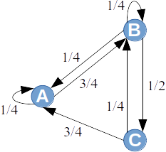

# 3. Lossless Compression: Lempel–Ziv Algorithms

Abraham Lempel, Jacob Ziv, and Terry Welch created several related compression algorithms that use an adaptive dictionary storing frequently repeated substrings. These are called Lempel–Ziv algorithms. They include [LZ77 and LZ78](https://en.wikipedia.org/wiki/LZ77_and_LZ78), [Lempel–Ziv–Welch (LZW)](https://en.wikipedia.org/wiki/Lempel%E2%80%93Ziv%E2%80%93Welch), [LZMA](https://en.wikipedia.org/wiki/Lempel%E2%80%93Ziv%E2%80%93Markov_chain_algorithm), and a few others.

In this course we look at LZ77 and LZW (an improved variant of LZ78).

## Motivation

Dictionary compression (LZ77 or LZW) can achieve a higher compression ratio than entropy codes (Huffman or arithmetic), because it exploits the fact that the next symbols in the input data depend on the previous ones.

Huffman and arithmetic codes are optimal when the messages are independent and their probabilities are known. In real files this is not the case: in text, source code, HTML pages, and log files whole words, identifiers, and lines repeat, but a Huffman code encodes every letter with the same codeword, even if the whole word has already been seen before. Moreover, for an entropy code the probability model must be known in advance or sent together with the data. Dictionary methods avoid these problems: a repeated fragment is replaced by a reference to its previous occurrence, nobody builds or sends a model, the data is processed in a single pass, and decompression is simple copying, hence very fast. At a time when disk space and modem transfer speed were expensive, this made LZ algorithms the basis of most general-purpose archivers (an exception is, for example, bzip2, see the chapter on the Burrows–Wheeler transform). Theoretically, LZ algorithms are *universal*: for any stationary and ergodic source they asymptotically achieve its entropy rate, even without knowing the statistics of the source (see "Mathematical Foundations").

## History

**About the LZ77 algorithm:** LZ77 (published in 1977) uses the text itself as the dictionary; a sliding window and back-references. Compression formats such as DEFLATE, used in ZIP and gzip files and in PNG images.

**About the LZW algorithm:** LZW (published in 1984) introduces dynamic dictionary building without requiring a predefined symbol table (it is an adaptive compression method). It is a 
specific variant of the LZ78 algorithm (the Lempel–Ziv algorithm of 1978). It is found in the GIF image compression format and in the UNIX "compress" utility.

The LZ77 algorithm has the most diverse applications today. 
Applications of LZW are GIF and the UNIX "compress" program, 
but because of licensing restrictions and other reasons GIF has now been 
largely replaced by PNG. 

Abraham Lempel and Jacob Ziv worked at the Technion (Israel Institute of Technology in Haifa), and their goal was originally theoretical -- to find a *universal* compression method that does not need to know the source probabilities. The results were published in the journal *IEEE Transactions on Information Theory* in 1977 (LZ77) and 1978 (LZ78). Terry Welch, working at the Sperry Research Center, described LZW in the journal *IEEE Computer* in 1984 -- a variant of LZ78 that is easy to implement efficiently both in software and in hardware. LZW was soon used by the UNIX program `compress`, and in 1987 by the GIF image format created by CompuServe. The LZW patent belonged to Unisys, Sperry's successor, so free software authors looked for algorithms without patent risk: the program `gzip`, created in 1992, replaced `compress`, and it uses DEFLATE -- LZ77 together with Huffman coding, which Phil Katz introduced in the PKZIP 2 archiver in 1993. When Unisys and CompuServe announced a license fee for GIF software at the end of 1994, the PNG format (standardized in 1996), which also uses DEFLATE, was developed as a GIF replacement. The LZW patents expired in 2003-2004, but by then DEFLATE had already become the standard in ZIP archives, HTTP compression, and PNG images.

## Algorithms

### The LZ77 Algorithm

#### Idea

The algorithm uses a window (*view*) -- a buffer of fixed length (for example, 32 KiB, i.e., 32768 bytes). Near the end of the window there is a cursor pointing to some letter.

* Before the cursor is the search buffer (almost the whole 32 KiB window)
* After the cursor is the look-ahead buffer -- for example, $32$ bytes. (Choosing a longer look-ahead buffer makes prefix search harder; but $32$-letter strings are something we can hope to find in the previous data.)

In this case the dictionary is a piece of the already encoded string. The encoder sees the tail of the encoded string as a sliding window:

The window is like a memory buffer in which recently encoded strings can be found and used to write the following piece of the string more compactly.

#### Pseudocode

The encoder outputs triples $(d, \ell, x)$: the match starts $d$ positions before the cursor, its length is $\ell$, and $x$ is the symbol following the match. If there is no match, it outputs $(0, 0, x)$. A match may start in the window but continue into the look-ahead buffer (overlap with the part being encoded) -- this way a long run of repetitions is encoded with a single triple.

$\textsf{LZ77-Encode}(T, n, W, L)$ $\quad$ *// $T[1:n]$ -- input; $W$ -- window length; $L$ -- look-ahead buffer length*
1. $i = 1$ $\quad$ *// cursor position*
2. **while** $i \leq n$
3. $\quad d = 0$; $\;\;\ell = 0$ $\quad$ *// longest match found so far*
4. $\quad$ **for** $s = i - 1$ **downto** $\max(1, i - W)$ $\quad$ *// possible match starts in the window, nearest first*
5. $\quad\quad k = 0$
6. $\quad\quad$ **while** $k < \min(L, n - i)$ **and** $T[s + k] == T[i + k]$
7. $\quad\quad\quad k = k + 1$
8. $\quad\quad$ **if** $k > \ell$ **then** $d = i - s$; $\;\ell = k$
9. $\quad \textsf{Output}(d, \ell, T[i + \ell])$
10. $\quad i = i + \ell + 1$

In line 6 the condition $k < n - i$ guarantees that at least one symbol $T[i + \ell]$ remains after the match to be output in line 9. Lines 4-8 are a naive search -- in the worst case $O(W \cdot L)$ symbol comparisons for each triple. Since $s$ goes from the nearest position to the farthest and a match is replaced only by a strictly longer one, among matches of equal length the smallest offset $d$ is chosen.

$\textsf{LZ77-Decode}(C)$ $\quad$ *// $C$ -- sequence of triples $(d, \ell, x)$*
1. $m = 0$ $\quad$ *// number of symbols decoded so far into the array $T$*
2. **for each** $(d, \ell, x) \in C$
3. $\quad$ **for** $k = 1$ **to** $\ell$
4. $\quad\quad T[m + k] = T[m + k - d]$ $\quad$ *// copy one symbol at a time*
5. $\quad m = m + \ell + 1$
6. $\quad T[m] = x$
7. **return** $T[1:m]$

The decoder does not search for anything, it only copies, so it is much faster than the encoder. In line 4 the symbols are copied one at a time, because the source region can overlap with the symbols just written (if $d < \ell$).

#### Example

The figure encodes the string `aacaacabcabaaac` with window length $W = 6$ and look-ahead buffer length $L = 4$ (with these parameters $\textsf{LZ77-Encode}$ outputs exactly the triples shown in the figure). The cursor symbol $T[i]$ is framed, the window (up to $6$ symbols before the cursor) is in bold, and the remaining symbols of the look-ahead buffer are underlined.

1. Cursor $i = 1$: the window is empty, so there is nowhere to search for matches. The letter is output as $(0, 0, \mathtt{a})$, and the cursor moves by $1$.
2. Cursor $i = 2$: the window contains `a`, which matches the cursor letter `a`. The next letters (`a` at position 2 and `c` at position 3) no longer match, so $d = 1$, $\ell = 1$, and the match is followed by `c`. Output $(1, 1, \mathtt{c})$; the cursor moves by $\ell + 1 = 2$.
3. Cursor $i = 4$: the window contains `aac`. The longest match starts at position 1 ($d = 3$): positions $1 \ldots 4$ contain `aaca`, exactly as positions $4 \ldots 7$ do. The source region overlaps with the part being encoded, because its last letter is the cursor position $4$ itself. The match is followed by `b`: output $(3, 4, \mathtt{b})$; the cursor moves by $5$.
4. Cursor $i = 9$: the window contains `caacab` (positions $3 \ldots 8$). The letter `c` occurs in the window in two places: from position 3 only `ca` matches ($\ell = 2$), but from position 6 -- `cab` ($\ell = 3$). The longest match is chosen, $d = 9 - 6 = 3$, $\ell = 3$, followed by `a`: output $(3, 3, \mathtt{a})$; the cursor moves by $4$.
5. Cursor $i = 13$: the window contains `abcaba` (positions $7 \ldots 12$), and the letters `aac` remain unencoded. The longest match `aa` starts immediately before the cursor ($d = 1$) and overlaps with the part being encoded -- the decoder obtains it by copying the previous letter twice. It is followed by the last letter `c`: output $(1, 2, \mathtt{c})$, and encoding ends.

With $\textsf{LZ77-Decode}$, for each triple the decoder copies $\ell$ letters and appends $x$: `a` + `ac` + `aacab` + `caba` + `aac` = `aacaacabcabaaac`. So instead of $15$ letters there are $5$ triples -- but each triple takes more space than one letter, so in practice they are encoded further (see "From Triples to a Compressed File").

#### Improvements in the gzip Implementation

Some changes to LZ77 used by "gzip".

**Two output formats:** The algorithm either tries to find a prefix of length at least three (and then outputs it as an LZ77 triple), or outputs letters one at a time. (One extra bit is used to distinguish the two output formats.) This change saves a lot of space for files that cannot be compressed well, because a full triple (with position and length fields) does not have to be output.

**Huffman codes:** `gzip` encodes letters and match lengths with one Huffman tree, and offsets with another (see the next subsection).

**Lazy matching:** The LZ77 algorithm is greedy -- it always tries to find the longest prefix starting with the first symbol of the look-ahead buffer. (Regardless of how this affects later prefixes.) Sometimes it pays off to output one symbol at the current position, hoping to find a longer prefix later.

**Hash tables with prefixes:** `gzip` builds a hash table with all encountered strings of length 3 as keys. (If they have several continuations, these are stored in the hash table bucket in reverse order.) If there are several prefixes, it is better for LZ77 to choose the most recent one (with the smallest *offset*), because this produces the most skewed distribution, which compresses well with a Huffman code.

#### From Triples to a Compressed File

LZ77 triples by themselves are not yet a compressed file: if each $(d, \ell, x)$ were stored in $4$ bytes, the $15$-byte string from the previous example would become $20$ bytes. Practical formats process the output further. The most widespread is DEFLATE (ZIP, gzip, PNG, HTTP compression):

1. **Two kinds of tokens.** Instead of a triple, either a letter (byte) or a pair (length, offset) is output, where $3 \leq \ell \leq 258$ and $1 \leq d \leq 32\,768$ -- just like in the *gzip* format of Problem 3.1.
2. **A combined alphabet for letters and lengths.** Letters are symbols $0 \ldots 255$, end of block is symbol $256$, and lengths are symbols $257 \ldots 285$. For larger lengths one symbol denotes a range, and the exact value is given by extra bits: for example, $257$ means $\ell = 3$, $260$ means $\ell = 6$, and $265$ with one extra bit means $\ell \in \lbrace 11, 12 \rbrace$. Offsets have a separate alphabet $0 \ldots 29$ with the same kind of extra bits: $0$ means $d = 1$, $2$ means $d = 3$, and $29$ with $13$ extra bits means $d \in [24\,577; 32\,768]$.
3. **Huffman codes.** The data is split into blocks. For each block, symbol frequencies are counted and two Huffman trees are built -- one for the letter-and-length alphabet, the other for the offset alphabet; extra bits are written unencoded. Frequent letters, typical lengths, and near offsets get short codewords.
4. **Block types.** The $3$ bits of the block header indicate whether the block is the last one, and the block type: *stored* (uncompressed data -- for data that cannot be compressed), *fixed* (Huffman trees defined in the standard that do not have to be sent -- worthwhile for short blocks), or *dynamic* (the trees are sent as canonical Huffman code lengths, see the chapter on Huffman coding; the lengths themselves are compressed again with repeat codes and a Huffman code).
5. **Container.** The DEFLATE stream is wrapped in a file format: *gzip* adds a header (file name, time) and at the end a CRC-32 checksum and the original length, *zlib* (PNG, HTTP) -- a $2$-byte header and an Adler-32 checksum, and ZIP -- also a file directory at the end of the archive.

**Example:** The *gzip* format tokens of Problem 3.1 as DEFLATE symbols in a *fixed* block:

| Token | DEFLATE symbols | Bits |
| --- | --- | --- |
| `(1,a)`, `(1,b)`, `(1,c)` | $97$, $98$, $99$ | $3 \cdot 8$ |
| `(0,3,6)` | length $260$, offset $2$ | $7 + 5$ |
| `(1,d)` | $100$ | $8$ |
| `(0,4,3)` | length $257$, offset $3$ | $7 + 5$ |
| end of block | $256$ | $7$ |

Together with the block header this is $3 + 24 + 12 + 8 + 12 + 7 = 66$ bits, i.e., $9$ bytes (instead of $13$ bytes). Real compressors search for matches with hash tables and heuristics, so they do not always find the longest match: Python 3.14 `zlib` (zlib-ng 2.2.4) splits this string as `a`, `b`, `c`, `a`, (length $5$, offset $3$), `d`, `a`, `b`, `c` and outputs $86$ bits, i.e., $11$ bytes. With the *zlib* header this is $17$ bytes, in a *gzip* file -- $29$ bytes, so for such a short string the headers take more than is saved. For longer data it pays off: the text `to be or not to be, that is the question. `, repeated $200$ times ($8\,400$ bytes), takes $98$ bytes in a *gzip* file.

Newer formats (zstd, LZMA/7z) use the same LZ77 idea, but encode the tokens more efficiently -- with ANS (zstd) or an arithmetic code (LZMA) instead of a Huffman code (see the chapter on arithmetic coding and ANS).

### The LZ78 Algorithm

#### Idea

> **TODO:** A dictionary consisting of previously encountered phrases (instead of a sliding window); every new phrase is some dictionary phrase extended by one letter.

#### Pseudocode

The encoder reads the input letter by letter and extends the current phrase $w$ as long as it is in the dictionary. By $wk$ we denote the phrase $w$ with the letter $k$ appended. Initially, the dictionary $D$ contains all letters of the alphabet $S$ (the code of a letter is the letter itself), and longer phrases get the numbers $1, 2, 3, \ldots$

$\textsf{LZ78-Encode}(T, n)$ $\quad$ *// $T[1:n]$ -- input over the alphabet $S$; $D[w]$ -- code of the phrase $w$*
1. $D = \textsf{New-Dictionary}(S)$ $\quad$ *// $D[x] = x$ for every letter $x \in S$*
2. $m = 0$ $\quad$ *// last assigned phrase number*
3. $w = T[1]$
4. **for** $i = 2$ **to** $n$
5. $\quad k = T[i]$
6. $\quad$ **if** $wk \in D$
7. $\quad\quad w = wk$ $\quad$ *// the phrase can be extended*
8. $\quad$ **else**
9. $\quad\quad \textsf{Output}(D[w])$
10. $\quad\quad m = m + 1$
11. $\quad\quad D[wk] = m$ $\quad$ *// new phrase with the next number*
12. $\quad\quad w = k$
13. $\textsf{Output}(D[w])$ $\quad$ *// last phrase*

The encoder always outputs the longest phrase $w$ found in the dictionary (lines 9 and 13) and adds to the dictionary this phrase extended by the next letter (line 11).

$\textsf{LZ78-Decode}(c_1 c_2 \ldots c_r)$ $\quad$ *// $c_j$ -- a letter or a phrase number; $D[c]$ -- the phrase with code $c$*
1. $D = \textsf{New-Dictionary}(S)$ $\quad$ *// $D[x] = x$ for every letter $x \in S$*
2. $m = 0$
3. $w = D[c_1]$
4. $\textsf{Output}(w)$
5. **for** $j = 2$ **to** $r$
6. $\quad$ **if** $c_j \in D$
7. $\quad\quad v = D[c_j]$
8. $\quad$ **else** $\quad$ *// $c_j = m + 1$: this phrase is not in the dictionary yet*
9. $\quad\quad v = w\,w[1]$
10. $\quad \textsf{Output}(v)$
11. $\quad m = m + 1$
12. $\quad D[m] = w\,v[1]$ $\quad$ *// previous phrase with the first letter of the current phrase*
13. $\quad w = v$

The decoder learns each new phrase one step later than the encoder, because in line 12 it needs to know the first letter of the current phrase $v$. Therefore a code $c_j$ may refer to the phrase $m + 1$, which is not yet in the dictionary. This phrase is $w$ with its own first letter appended, which is equal to $w[1]$, so $v = w\,w[1]$ (lines 8-9; see Problem 3.4).

#### Example

The string `abcabcabcdabcaba` has to be encoded using the LZ78 algorithm.

| Step | Longest w in dictionary | k | Output | Added to dictionary |
| --- | --- | --- | --- | --- |
| 1. | a | b | a | ab |
| 2. | b | c | b | bc |
| 3. | c | a | c | ca |
| 4. | ab | c | ab | abc |
| 5. | ca | b | ca | cab |
| 6. | bc | d | bc | bcd |
| 7. | d | a | d | da |
| 8. | abc | a | abc | abca |
| 9. | ab | a | ab | aba |
| 10. |  |  | a |  |

Usually letters are encoded as letters, but longer strings are replaced by the number of the step in which the string was inserted into the dictionary. This means that in this example the string `ab` would be encoded as 1, `bc` as 2, `ca` as 3, etc. In the end we get the sequence `a,b,c,1,3,2,d,4,1,a`

### The LZW Algorithm

We do not practice LZW separately: it is a variant of LZ78, and the "LZ78" algorithm described above already uses the main idea of LZW. The most important relationships:

* **Classical LZ78** starts with an empty dictionary and outputs pairs $(i, x)$: the number $i$ of the longest phrase found in the dictionary ($0$ -- the empty phrase) and the symbol $x$ that follows it. The $i$-th phrase with $x$ appended is added to the dictionary.
* **LZW** (Terry Welch, 1984) puts all symbols of the alphabet (for example, all $256$ bytes) into the dictionary at the start. Therefore the longest found phrase always exists, and the output needs only phrase numbers -- the next symbol $x$ is not sent; it becomes the first symbol of the next phrase.
* **In this course** the algorithm we study ($\textsf{LZ78-Encode}$, $\textsf{LZ78-Decode}$) is exactly like this: initially the dictionary contains all letters (they are output as letters), and longer phrases are numbered $1, 2, 3, \ldots$ The decoder builds the dictionary with a one-step delay, so it can receive a number that is not yet in the dictionary -- then the new phrase is the previous phrase $w$ with its first letter $w[1]$ appended (see Problem 3.4).
* **In practice** LZW uses variable-length codes (UNIX `compress` starts with $9$-bit codes and increases them up to $16$ bits, GIF -- up to $12$ bits) and clears the dictionary when it is full (the GIF format has a special *Clear* code for this). The LZW patents (see "History") prompted the creation of the PNG format as a replacement for GIF, which uses LZ77 (DEFLATE).

## Mathematical Foundations and Complexity

### Markov Chains

For entropy codes the input had a theoretical model - independent identically distributed random variables. There is a simple mathematical model -- a *Markov chain*, in which the sequence of messages (letters or words) is random, but the probabilities of the messages depend on the context -- they are no longer mutually independent. In Markov processes

**Definition:** A *Markov chain* in discrete time with a finite state alphabet is a random process that moves in a finite set of states/messages $S = \lbrace x_1, x_2, \ldots, x_n \rbrace$ and behaves as follows:

* At the very beginning it starts in one of the states according to a given initial distribution; this is the first output of the Markov chain.
* At every time step, the output of the Markov chain is the state reached at that moment.
* The transition from one state to another is given by a probability (the sum of all outgoing probabilities from a given state is $1$). This probability is determined only by the current state.

In a Markov chain the states are not independent and may not be identically distributed (*independent and identically distributed*). A Markov chain has no memory -- all accumulated information is contained in the current state.

**Example:** The following directed graph with $3$ states describes a Markov chain:

The $18$-letter string was obtained by randomly walking through this graph, starting with $A$: `ABCABCBCAAABCABBAB`.

### Entropy Rate, Stationary and Ergodic Processes

**Definition:** Consider $X_1 X_2 X_3\ldots$ - a sequence of messages generated by a random process (independent random variables, a Markov chain, a hidden Markov chain, a neural network, etc.). The *entropy rate* of this sequence is the limit:

$$
H(X) = \lim_{n \to \infty} \frac{1}{n} H\left( X_1, X_2, \ldots X_n \right).
$$

In this formula $H\left( X_1, X_2, \ldots X_n \right)$ denotes the entropy of the compound message in which $X_1,X_2,\ldots,X_n$ follow one after another.

Another way is to compute the entropy from the conditional probabilities (i.e., we assume that we have already seen the first $n-1$ states, find the conditional probability distribution of the next, $n$-th symbol and its entropy):

$$
H'(X) = \lim_{n \to \infty} H\left( X_n \,\mid\, X_{n-1}, X_{n-2}, \ldots X_1 \right).
$$

In all situations in our course both notions of entropy rate coincide: $H(X) = H'(X)$.

Random processes can satisfy the following properties:

**Ergodic processes:** A message-generating process is ergodic if running several identical processes gives the same probability distribution as running the same process for a long time (the *ensemble average* coincides with the *time average*).

**Examples:** Markov chains in which every state can be reached from every other state are ergodic; a stable pattern of state changes emerges. But there are strange Markov chains in which the process can go down one branch or another and produce two completely different distributions.

**Stationary processes:** A process is *stationary* if its mean, variance, and other statistical properties do not change when the observation is shifted forward in time by $T$. For example, $E(X_i) = E(X_{i + T})$. It can happen that a random process initially generates messages according to some other distribution, but becomes *asymptotically stationary*.

**Examples:** Markov chains can produce periodic sequences. Periodic sequences (with period $T>1$) cannot be stationary -- all probability distributions depend on which phase of the period we are in.

### Asymptotic Optimality of Compression

**Theorem:** If $X$ is a source of binary messages (the alphabet is $\lbrace 0,1 \rbrace$) that is stationary and ergodic, then

$$
\limsup_n \frac{1}{n} \ell_{\text{LZW}}(X_{1:n}) \leq H(X).
$$

This inequality holds with probability $1$. Here $H(X)$ denotes the entropy rate of the message source. And $\ell_{\text{LZW}}(X_{1:n})$ is the length obtained by compressing the first $n$ bits of the message source.

A similar theorem also holds for LZ77 compression. In practice it cannot always be used, because the size of the LZW dictionary and of the LZ77 search window is not unlimited.

> **TODO:** An example in which the entropy rate $H(X)$ of a Markov chain is smaller than the single-symbol entropy $H(X_1)$ -- i.e., a Huffman code for each symbol separately cannot achieve $H(X)$, but LZ algorithms achieve it asymptotically.

### Complexity; Comparison of LZ77 and LZW

* LZ77 often achieves a better compression ratio than LZW (the ratio of the original number of bytes to the compressed bytes). 
* LZW tends to be faster, because a dictionary (hash table) can be handled more efficiently than scanning the whole text.
* LZ77 allows controlling the memory used - by limiting the buffer size. The LZW algorithm may need a lot of memory if the compressed blocks are long.

> **TODO:** Time complexity of LZ77 with naive prefix search in the window and with hash tables; size and time complexity of the LZ78/LZW dictionary (*trie*); decompression speed compared with compression.

## Additional Topics

### Archives and DLP Products

DLP (Data Leak Prevention) tools can prevent uncontrolled leakage of confidential data in a company, for example, if an employee forwards sensitive files or text fragments to an inappropriate recipient.

* Data *classifiers* determine the types of confidential data. Addresses, phone numbers, e-mails, personal identity numbers, IBAN account numbers, and credit card numbers are protected thanks to their special format, matching a regular expression (or, in the case of credit card numbers, the *Luhn check* checksum). To reduce false positives, one can also crawl local databases and build classifiers from them (for example, protect only the credit cards of known customers). Data classifiers can also be verbatim quoted pieces of protected documents or can be obtained with machine learning.
* Data *channels* are observable data flows. For example, HTTP uploads, outgoing e-mails, "clipboard" (copy) actions, screenshots.
* Protection *policies* determine what may or may not be sent over which channel to which recipients. A policy (besides a channel and a classifier) also has an action -- for example "Monitor" and "Block" (does not allow sending).

Some popular DLP products:

* [Symantec DLP solutions](https://www.symantec.com/products/dlp)
* [Forcepoint DLP solutions](https://www.forcepoint.com/product/dlp-data-loss-prevention)
* [Digital Guardian DLP agent](https://digitalguardian.com/products/endpoint-dlp)

Decompressing and compressing archives (sometimes also TLS decryption/encryption) is time-consuming. DLP operates on channels that are sensitive to delays (Web, Email); there are file size limits.

* What happens if unpacking a file produces a very large number of files?
* What happens if unpacking a file produces a very long file?
* Does the compression algorithm allow starting to archive and send data before the whole file or files to be sent have been received? A proxy server cannot analyze users' Web transactions for longer than about 10 seconds, because browser users are not used to waiting long.
* What happens if data starts being sent to the recipient and a leak of private data is suddenly noticed? Can an attacker understand the archive even if only part of it has been received?

Possible solutions:

* Try to perform DLP analysis more often locally on the user's computer (*endpoint* or *agent* software that can dedicate more CPU resources to analyzing a particular user's files).
* Configure DLP products in *monitoring* mode - then there is more time for analysis, because transactions can be allowed immediately regardless of their content.
* Some files that are hard to analyze (oddly compressed, password-protected office documents, encrypted data) can be blocked at the gateways, forcing users to send them in a form the DLP tool understands, or to encrypt only at the organization's security perimeter.

## Problems

**Problem 3.1:** Encode the string `abcabcabcdabc` with $\textsf{LZ77-Encode}$, if the window length is $W = 6$ and the look-ahead buffer is unlimited. Then write the same string in the *gzip* format (see "Improvements in the gzip Implementation"), in which a single letter $x$ is output as $(1, x)$, and a match of length at least $3$ is output as $(0, d, \ell)$.

**Answer:** We number the input positions from $1$ to $13$:

| Cursor $i$ | Window | Longest match | Output |
| --- | --- | --- | --- |
| 1 | -- | none | $(0, 0, \mathtt{a})$ |
| 2 | `a` | none | $(0, 0, \mathtt{b})$ |
| 3 | `ab` | none | $(0, 0, \mathtt{c})$ |
| 4 | `abc` | `abcabc` from position 1: $d = 3$, $\ell = 6$ | $(3, 6, \mathtt{d})$ |
| 11 | `bcabcd` | `ab` from position 7: $d = 4$, $\ell = 2$ | $(4, 2, \mathtt{c})$ |

At $i = 4$ the match starts in the window but continues into the look-ahead buffer: positions $4 \ldots 9$ are copied from positions $1 \ldots 6$. At $i = 11$ the remaining letters `abc` match positions $7 \ldots 9$, but $\ell = 3$ is not allowed, because a symbol $x$ must remain after the match.

Result: $(0,0,\mathtt{a}), (0,0,\mathtt{b}), (0,0,\mathtt{c}), (3,6,\mathtt{d}), (4,2,\mathtt{c})$.

In the *gzip* format the symbol after the match does not have to be output, so at $i = 11$ the whole match `abc` can be used: `(1,a),(1,b),(1,c),(0,3,6),(1,d),(0,4,3)`. $\square$

**Problem 3.2:** Use LZ78 to decode the string: `A.B.C.1.3.2.D.4.1.A`

**Answer:** The decoder builds the same dictionary as the encoder. For each code read, it finds the phrase (a letter or the dictionary phrase with this number), outputs it, and -- starting from the second code -- adds to the dictionary the previous phrase $w$ with the first letter of the current phrase appended.

| Code | Phrase | Added to dictionary |
| --- | --- | --- |
| A | A | -- |
| B | B | 1: AB |
| C | C | 2: BC |
| 1 | AB | 3: CA |
| 3 | CA | 4: ABC |
| 2 | BC | 5: CAB |
| D | D | 6: BCD |
| 4 | ABC | 7: DA |
| 1 | AB | 8: ABCA |
| A | A | 9: ABA |

The decoded phrases are `A.B.C.AB.CA.BC.D.ABC.AB.A`, so the string is `ABCABCABCDABCABA`. This is the same string we encoded in the LZ78 example, and the dictionary is also the same. $\square$

**Problem 3.3:** Use LZ78 to decode the string: `a,a,b,1,2,4,2`

**Answer:**

| Code | Phrase | Added to dictionary |
| --- | --- | --- |
| a | a | -- |
| a | a | 1: aa |
| b | b | 2: ab |
| 1 | aa | 3: ba |
| 2 | ab | 4: aaa |
| 4 | aaa | 5: aba |
| 2 | ab | 6: aaaa |

The decoded phrases are `a.a.b.aa.ab.aaa.ab`, so the string is `aabaaabaaaab`. $\square$

**Problem 3.4:** Use LZ78 to decode the string: `a,b,a,3,4`

**Answer:**

| Code | Phrase | Added to dictionary |
| --- | --- | --- |
| a | a | -- |
| b | b | 1: ab |
| a | a | 2: ba |
| 3 | aa | 3: aa |
| 4 | aaa | 4: aaa |

When the code $3$ is read, the dictionary contains only phrases $1$ and $2$ -- the encoder has already created phrase $3$, but the decoder does not know it yet. The new phrase starts with the previous phrase $w$ and ends with its own first letter, which is equal to $w[1]$. So the phrase is $w\,w[1] = \mathtt{a}\,\mathtt{a} = \mathtt{aa}$ (line 9 of $\textsf{LZ78-Decode}$). Similarly for code $4$: $w = \mathtt{aa}$, so the phrase is $\mathtt{aa}\,\mathtt{a} = \mathtt{aaa}$. The decoded phrases are `a.b.a.aa.aaa`, so the string is `abaaaaaa`. $\square$

## References

* [An example of the LZW algorithm](http://web.mit.edu/6.02/www/f2010/handouts/recitations/Recitation21VergheseFall2010.pdf).
* Practical considerations for the LZW algorithm: [What if dictionary is full](https://stackoverflow.com/questions/40054218/what-if-dictionary-size-in-lzw-algorithm-is-full).
* [Worst-case theory of LZ78](http://www-math.mit.edu/~shor/PAM/lempel_ziv_notes.pdf).
* [The PPM algorithm](https://en.wikipedia.org/wiki/Prediction_by_partial_matching).
* [https://stackabuse.com/python-zlib-library-tutorial/](https://stackabuse.com/python-zlib-library-tutorial/)
* [Python zlib tutorial](https://stackabuse.com/python-zlib-library-tutorial/)
* IBM patents for the LZ78 and LZW algorithms were filed in 1981 and 1983 (see [LZW Patents](https://en.wikipedia.org/wiki/Lempel%E2%80%93Ziv%E2%80%93Welch#Patents))
* [https://linuxhint.com/install-7zip-compression-tool-on-ubuntu/](https://linuxhint.com/install-7zip-compression-tool-on-ubuntu/).
* [The Calgary corpus](http://corpus.canterbury.ac.nz/descriptions/#calgary) - various file types (including black-and-white images, faxes, old machine code); [a comparison of some algorithms](https://en.wikipedia.org/wiki/Calgary_corpus#Benchmarks). The Calgary corpus is still used for comparing methods and even in compression competitions.
* [The Canterbury corpus](http://corpus.canterbury.ac.nz/) - a more modern corpus.
