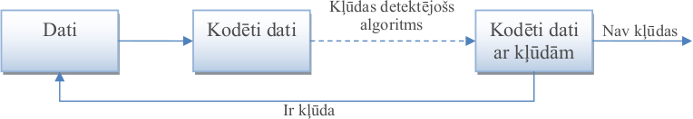
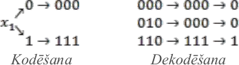

# 7. Kļūdu korekcija: Heminga kodi

**Mērķi**

* Ieviest dažus populārus kļūdu detekcijas algoritmus.
* Pamatot apgalvojumu par divu kļūdu korekcijas kodu attālumu.
* Lietot un pamatot Heminga kodus.

**Kļūdu detekcija:**



**Kļūdu korekcija:** Ideja visās metodēs - papildināt pārraidāmos datus ar papildinformāciju, cerot, ka papildinformācija ļaus pamanīt kļūdas.


## Kļūdu detekcijas algoritmi

Kļūdu detekcijai datiem pievieno īsu *kontrolsummu*, ko saņēmējs pārrēķina un salīdzina. Paritātes bits un CRC ir paredzēti nejaušām pārraides kļūdām (troksnim). Ja dati var būt mainīti apzināti, vajadzīga *kriptogrāfiska hešfunkcija* (piemēram, SHA-256), kurai uzbrucējs nevar pielāgot jaunu vērtību.

### Paritātes bits

**Bitu paritātes metode:** Pārraida $n$ bitu virkni $x_1,x_2,\ldots,x_n \in \lbrace 0; 1 \rbrace$. Lai konstatētu iespējamu kļūdu 1 bitā (kas var gan iestāties, gan neiestāties), pārraida $n+1$ bitus: Visus $x_1,x_2,\ldots,x_n$ un arī pēdējo bitu

$$
\left( x_1 + x_2 + \ldots + x_n \right)\,\text{mod}\,2.
$$

Pēdējais bits glabā visu iepriekšējo bitu paritāti. Tāpēc visu $n+1$ bitu paritāte ir $0$. Ja pārraidē rodas viena kļūda, tad paritāte būs $1$, un kļūdu varēs konstatēt.

### CRC kontrolsumma

*CRC* (*cyclic redundancy check*) bitu virkni uzskata par polinoma koeficientiem pēc moduļa $2$. Sūtītājs ziņojuma polinomu $M(x)$, pareizinātu ar $x^{32}$, izdala ar fiksētu *ģeneratorpolinomu* $G(x)$ (pakāpe $32$) un ziņojumam pievieno dalījuma atlikumu -- $32$ bitus. Dalīšana "stabiņā" pēc moduļa $2$ ir tikai bīdes un XOR, tāpēc CRC ļoti ātri aprēķina gan programmatūrā, gan aparatūrā. Ethernet izmanto CRC-32 ar

$$
G(x) = x^{32} + x^{26} + x^{23} + x^{22} + x^{16} + x^{12} + x^{11} + x^{10} + x^{8} + x^{7} + x^{5} + x^{4} + x^{2} + x + 1
$$

(heksadecimāli `0x04C11DB7`). Saņēmējs aprēķina CRC visam kadram kopā ar kontrolsummu; pareizam kadram vienmēr iznāk viena un tā pati konstante `0xC704DD7B` (bitu apgrieztā pierakstā `0xDEBB20E3`), tā sauktais "maģiskais skaitlis".

CRC-32 garantēti konstatē jebkuru kļūdu vienā bitā un jebkuru kļūdu virkni (*burst*), kas aptver ne vairāk kā $32$ blakusesošus bitus -- tādas rodas, piemēram, īsos traucējumos. Nejaušu bojājumu tas nepamana ar varbūtību apmēram $2^{-32}$.

**Efektīva aprēķināšana.** Dalīšanu "stabiņā" var izpildīt pa vienam bitam: $32$ bitu reģistrā glabā pašreizējo atlikumu, katrā solī to pabīda un, ja no reģistra "izkrīt" vieninieks, pieskaita (XOR) ģeneratorpolinomu. Aparatūrā (tīkla kartē) tas ir bīdes reģistrs ar dažiem XOR elementiem. Programmatūrā izdevīgāk apstrādāt veselu baitu uzreiz: katra baita ietekmi uz reģistru ($8$ dalīšanas soļus) aprēķina iepriekš un saglabā $256$ elementu tabulā. Praktiskajā CRC-32 ir trīs papildu detaļas:

* Ethernet katru baitu pārraida, sākot ar mazāko bitu, tāpēc reģistrā biti ir apgrieztā secībā: to bīda pa labi, un ģeneratorpolinoms ir `0x04C11DB7` ar apgrieztiem bitiem, t.i., `0xEDB88320`.
* Reģistra sākuma vērtība ir `0xFFFFFFFF` (nevis $0$), lai CRC mainītos arī tad, ja ziņojuma sākumā pievieno vai izmet nulles baitus.
* Beigās rezultātu apgriež (XOR ar `0xFFFFFFFF`), lai arī beigās pievienotas nulles mainītu CRC.

$\textsf{CRC32-Make-Table}()$ $\quad$ *// $T[n]$ -- baita $n$ ietekme uz reģistru pēc $8$ soļiem*
1. **for** $n = 0$ **to** $255$
2. $\quad c = n$
3. $\quad$ **for** $k = 1$ **to** $8$ $\quad$ *// viens dalīšanas solis katram bitam*
4. $\quad\quad$ **if** $c$ ir nepāra skaitlis $\quad$ *// no reģistra izkrīt vieninieks*
5. $\quad\quad\quad c = (c \gg 1) \oplus \mathtt{0xEDB88320}$
6. $\quad\quad$ **else** $c = c \gg 1$
7. $\quad T[n] = c$
8. **return** $T$

$\textsf{CRC32}(B, n, T)$ $\quad$ *// $B[1:n]$ -- baiti; $T$ -- $\textsf{CRC32-Make-Table}$ rezultāts*
1. $c = \mathtt{0xFFFFFFFF}$
2. **for** $i = 1$ **to** $n$
3. $\quad c = T[(c \oplus B[i]) \wedge \mathtt{0xFF}] \oplus (c \gg 8)$ $\quad$ *// $8$ dalīšanas soļi vienā reizē*
4. **return** $c \oplus \mathtt{0xFFFFFFFF}$

Šeit $\oplus$ ir bitu XOR, $\gg$ -- bīde pa labi, $\wedge$ -- bitu UN (pēc $\wedge \mathtt{0xFF}$ paliek tikai jaunākais baits). 3.rindiņā reģistra jaunākais baits kopā ar kārtējo ziņojuma baitu nosaka tabulas elementu, kas apraksta šo $8$ bitu dalīšanas soļu ietekmi uz pārējiem reģistra bitiem. Tātad katram baitam vajag vienu XOR, vienu nolasīšanu no tabulas ($256$ vārdi, $1$ KiB) un vienu bīdi: laiks ir $O(n)$, un tas ir apmēram $8$ reizes ātrāk nekā apstrāde pa bitam. Pārbaudei: $\textsf{CRC32}$ virknei `123456789` ir `0xCBF43926`. (Vēl ātrākas realizācijas izmanto vairākas tabulas un apstrādā $4$ vai $8$ baitus vienlaikus, vai arī procesora instrukcijas: ARMv8 ir speciālas CRC-32 instrukcijas, x86 -- bezpārneses reizināšana PCLMULQDQ.)

Ja $\textsf{CRC32}$ izpilda visam kadram kopā ar FCS, tad reģistrā pirms beigu XOR pareizam kadram vienmēr paliek `0xDEBB20E3` -- tas ir tas pats "maģiskais skaitlis" `0xC704DD7B`, tikai ar apgrieztiem bitiem (sk. 7.6. uzdevumu).


*Ethernet II kadrs un tā datu lauka saturs (IPv4 pakete ar TCP segmentu). Zem katra lauka norādīts tā garums bitos; bitu numuri galvenēs skaitīti no $0$. Lauku platumi attēlā nav proporcionāli garumiem.*

Kontrolsummas ir vairākos protokolu slāņos:

* **Kanāla slānis** (*data link layer*, OSI 2. slānis): Ethernet kadra pēdējā laukā FCS (*Frame Check Sequence*, $32$ biti) ir CRC-32 no mērķa adreses līdz datu lauka beigām. To aprēķina un pārbauda tīkla karte; kadru ar nepareizu FCS tā vienkārši izmet (atkārtoti nepieprasa). Tāds pats CRC-32 ir arī Wi-Fi kadros.
* **Tīkla slānis** (IPv4): galvenes kontrolsumma ($16$ biti) sargā tikai IP galveni, jo maršrutētāji to maina (piemēram, samazina TTL). IPv6 šīs kontrolsummas vairs nav.
* **Transporta slānis** (TCP): kontrolsumma ($16$ biti) sargā TCP galveni, datus un IP adreses. IP un TCP kontrolsummas ir $16$ bitu vārdu summa ar pārnesi (*Internet checksum*) -- daudz vājākas par CRC-32, bet tās pārbauda datus visā ceļā no sūtītāja līdz saņēmējam. Ja segments pazūd (arī tāpēc, ka kāds kadrs tika izmests), TCP to pamana pēc secības numuriem un nepienākušiem apstiprinājumiem un nosūta vēlreiz.

CRC-32 izmanto arī failu formātos (ZIP, gzip, PNG); citi CRC varianti ir USB, CAN un daudzos citos sakaru protokolos.

CRC neaizsargā pret apzinātām izmaiņām: CRC ir lineārs, un ikviens, kas mainījis datus, var aprēķināt arī jauno kontrolsummu.

### MD5

MD5 (R. Rivest, 1992) ir hešfunkcija, kas jebkura garuma ievadei aprēķina $128$ bitu vērtību (pieraksta kā $32$ heksadecimālus ciparus). Algoritms aprakstīts dokumentā [RFC 1321](https://www.rfc-editor.org/rfc/rfc1321); tā uzbūve ir līdzīga SHA-256 (sk. nākamo apakšnodaļu: $512$ bitu bloki un saspiešanas funkcija ar $64$ soļiem). Kriptogrāfiskiem mērķiem MD5 **nedrīkst** izmantot:

* **Kolīzijas ar kopīgu prefiksu.** 2004.gadā Van Sjaojuņa (*Wang Xiaoyun*) grupa atrada pirmo MD5 kolīziju -- divus dažādus ziņojumus ar vienādu MD5 vērtību. Mūsdienās šādu pāri (ar jebkuru izvēlētu kopīgu sākumu) parasts dators atrod sekundēs. Uzbrucējs var sagatavot divus dokumentus ar vienādu MD5 -- nekaitīgu un kaitīgu --, panākt, lai nekaitīgo paraksta, un paraksts derēs arī kaitīgajam.
* **Kolīzijas ar izvēlētiem prefiksiem.** 2007.gadā M. Stīvenss (*Marc Stevens*), A. Lenstra un B. de Vēgers parādīja, kā divus *patvaļīgus* dotus sākumus papildināt tā, lai MD5 sakristu. 2008.gadā ar $200$ PlayStation 3 konsolēm dažu dienu laikā izveidoja viltotu sertifikātu izdevēja (CA) sertifikātu, bet 2012.gadā ļaunatūra *Flame* ar šādu kolīziju viltoja Microsoft programmatūras parakstu. Mūsdienās tam pietiek ar dažām GPU dienām.
* **Pirmtēls joprojām nav atrodams.** Dotai MD5 vērtībai (kas nav paša uzbrucēja veidota) atrast ievadi ar šo vērtību labākais zināmais uzbrukums prasa apmēram $2^{123}$ operāciju -- praktiski neiespējami. Kolīzijas var izveidot tikai tādiem ziņojumu pāriem, kurus uzbrucējs pats konstruē.
* **Paroles.** MD5 ir ļoti ātra (videokarte aprēķina desmitiem miljardu vērtību sekundē), tāpēc paroļu MD5 vērtības viegli atrast ar pārlasi (sk. "Īsas ievades un vārdnīcas uzbrukumi").

MD5 vēl var noderēt nejaušu bojājumu pamanīšanai, bet arī tam labāk izmantot SHA-256.

### SHA-256

*SHA-256* ir SHA-2 saimes hešfunkcija, ko definē ASV standarts NIST FIPS 180-4 (pirmā versija -- 2001.gadā). Ievade ir jebkura bitu virkne, kuras garums $L < 2^{64}$; izvade vienmēr ir $256$ biti ($64$ heksadecimāli cipari). Piemēram, SHA-256 vērtība virknei `abc` ir `ba7816bf8f01cfea414140de5dae2223b00361a396177a9cb410ff61f20015ad`.


*SHA-256 aprēķins; numuri atbilst tālāk uzskaitītajiem soļiem. Piemēra skaitļi ir īsti.*

1. **Papildināšana.** Ziņojumam pieraksta bitu $1$, tad tik daudz nuļļu, cik vajag, un beigās ziņojuma garumu $L$ kā $64$ bitu skaitli, lai kopējais garums dalītos ar $512$.
2. **Sadalīšana blokos** $M_1, \ldots, M_N$ pa $512$ bitiem.
3. **Saspiešanas funkciju ķēde.** Stāvoklis ir $8$ vārdi pa $32$ bitiem; sākuma vērtība $H_0$ ir fiksēta (pirmo $8$ pirmskaitļu kvadrātsakņu daļveida daļu pirmie $32$ biti). Katrs bloks to pārrēķina: $H_i = f(H_{i-1}, M_i)$. Funkcija $f$ bloka $16$ vārdus paplašina līdz $64$ vārdiem un $64$ raundos maina stāvokli ar loģiskām funkcijām, bitu rotācijām, konstantēm (pirmo $64$ pirmskaitļu kubsakņu daļveida daļas) un saskaitīšanu pēc moduļa $2^{32}$.
4. **Rezultāts** ir pēdējais stāvoklis $H_N$.

**Kriptogrāfiskas hešfunkcijas īpašības.** SHA-256 aprēķins ir deterministisks un ātrs, un tam ir šādas īpašības:

* *pirmtēla noturība* (*preimage resistance*): dotai vērtībai $h$ nevar atrast $m$, kuram $\text{SHA-256}(m) = h$ -- labākā zināmā metode ir pārlase ar apmēram $2^{256}$ mēģinājumiem;
* *otrā pirmtēla noturība*: dotam $m$ nevar atrast citu $m' \neq m$ ar tādu pašu vērtību (arī apmēram $2^{256}$ mēģinājumu);
* *kolīziju noturība*: nevar atrast nevienu pāri $m \neq m'$ ar vienādām vērtībām (apmēram $2^{128}$ mēģinājumu, sk. tālāk);
* *lavīnas efekts*: mainot vienu ievades bitu, katrs izvades bits mainās ar varbūtību $\frac{1}{2}$. Piemēram, `abd` vērtība `a52d159f262b2c6d…` nav nekādi līdzīga `abc` vērtībai.

**Kolīziju paradokss.** Ievades virkņu ir bezgalīgi daudz (jau $257$ bitu virkņu ir $2^{257}$), bet izvades vērtību -- tikai $2^{256}$. Pēc Dirihlē principa kolīzijas **noteikti eksistē**, turklāt ļoti daudz. Tomēr neviena SHA-256 kolīzija nav zināma, jo nav zināms veids, kā to atrast ātrāk par nejaušu meklēšanu. Nejauši izvēloties ievades, pēc *dzimšanas dienu paradoksa* pirmā kolīzija gaidāma pēc apmēram $\sqrt{2^{256}} = 2^{128} \approx 3.4 \cdot 10^{38}$ mēģinājumiem. Pat visa Bitcoin tīkla jauda (apmēram $10^{21}$ SHA-256 aprēķinu sekundē) šim darbam tērētu apmēram $10^{10}$ gadu -- aptuveni Visuma vecumu. Drošība tātad nav matemātiski pierādīta; tā balstās uz to, ka ilgstoša analīze nav atradusi ātrāku metodi.

**Kāpēc SHA-256 ir industrijas standarts.** Pēc vairāk nekā $20$ gadu kriptoanalīzes pret pilno SHA-256 nav zināmu praktisku uzbrukumu (uzbrukumi darbojas tikai versijām ar samazinātu raundu skaitu). Tas ir ātrs, jaunajos Intel, AMD un ARM procesoros tam ir speciālas instrukcijas, un to prasa daudzi standarti. Iepriekšējais standarts SHA-1 ir salauzts (2017.gadā publiskota pirmā SHA-1 kolīzija *SHAttered*), tāpēc sistēmas pārgāja uz SHA-256. Alternatīva ir uz citiem principiem balstītais SHA-3 (2015).

Lietojumi:

* **Kriptovalūtas.** Bitcoin bloka galvenē ir iepriekšējā bloka hešs, tāpēc vēsturi nevar pārrakstīt, neaprēķinot visus nākamos blokus no jauna. Darba pierādījums (*proof of work*): kalnrači meklē tādu bloka galveni, kuras dubultā SHA-256 vērtība ir mazāka par doto slieksni. Darījumus bloka galvenē apkopo Merkla koks no SHA-256 vērtībām, un adreses iegūst no publiskās atslēgas ar SHA-256 un RIPEMD-160. (Ethereum SHA-256 vietā izmanto Keccak-256.)
* **Sertifikāti un paraksti:** TLS (HTTPS) sertifikāti, programmatūras un dokumentu paraksti paraksta nevis pašu dokumentu, bet tā SHA-256 vērtību.
* **Datu integritāte:** lejupielādēto failu kontrolsummas (`sha256sum`), Docker attēlu identifikatori, pakotņu pārvaldnieki; versiju kontroles sistēma Git atbalsta repozitorijus ar SHA-256 (pēc noklusējuma tā joprojām lieto SHA-1).
* **Ziņojumu autentifikācija** (HMAC-SHA256, piemēram, JWT žetonos un mākoņpakalpojumu API pieprasījumu parakstos) un atslēgu atvasināšana.

**SHA-256 post-kvantu pasaulē.** Kvantu datori salauztu RSA un eliptisko līkņu parakstus (Šora algoritms), bet hešfunkcijām tie dod tikai kvadrātisku paātrinājumu: Grovera algoritms pirmtēla meklēšanu samazina no $2^{256}$ līdz apmēram $2^{128}$ kvantu operācijām, kas joprojām nav izpildāms. Teorētiskie kvantu kolīziju algoritmi prasītu milzīgu kvantu atmiņu un praktiski nav ātrāki par klasisko $2^{128}$. Tāpēc SHA-256 uzskata par drošu arī post-kvantu laikmetā; tieši no hešfunkcijām veidoti arī post-kvantu parakstu standarti (SLH-DSA jeb SPHINCS+, NIST FIPS 205, 2024). Ja vajag lielāku rezervi, izmanto SHA-384 vai SHA-512.

### Īsas ievades un vārdnīcas uzbrukumi

Hešfunkcija neslēpj ievadi, ja iespējamo ievažu ir maz. Paroles, PIN kodi, telefona numuri vai personas kodi ir šādas ievades: uzbrucējs vienkārši aprēķina SHA-256 visiem kandidātiem (vārdnīcai vai visiem variantiem) un salīdzina. Videokarte aprēķina desmitiem miljardu SHA-256 vērtību sekundē, tāpēc, piemēram, visus $10^8$ astoņu ciparu skaitļus pārbauda sekundes daļā. Bez papildu pasākumiem uzbrucējs var arī iepriekš aprēķināt tabulas (*rainbow tables*) visām biežākajām parolēm.

Tāpēc īsas vai paredzamas ievades nehešo tieši, bet savieno (konkatenē) ar papildu datiem:

* **Sāls** (*salt*): katram ierakstam savs nejaušs skaitlis (piemēram, $16$ baiti), ko glabā kopā ar rezultātu: $h = \text{SHA-256}(\textit{sāls} \,\|\, \textit{parole})$. Vienādām parolēm rodas dažādas vērtības, iepriekš aprēķinātas tabulas kļūst nederīgas, un katrs ieraksts jāuzbrūk atsevišķi.
* **"Pipari"** (*pepper*): slepena vērtība, kas pievienota visām ievadēm, bet glabāta atsevišķi no datubāzes (piemēram, drošības modulī). Bez tās nozagtā datubāze nav izmantojama.
* **Lēna hešošana** (*key stretching*): paroļu glabāšanai SHA-256 ir pārāk ātra. Izmanto funkcijas, kas tīši prasa daudz darba vai atmiņas: PBKDF2-HMAC-SHA256 ar simtiem tūkstošu iterāciju, bcrypt, scrypt vai Argon2 (2015.gada paroļu hešošanas konkursa uzvarētāja). Tas lietotājam nav manāms, bet pārlasi palēnina simtiem tūkstošu reižu.
* **Slepena atslēga:** ja hešs apliecina, ka ziņojumu sūtījis atslēgas īpašnieks, izmanto HMAC, nevis vienkāršu $\text{SHA-256}(\textit{atslēga} \,\|\, \textit{ziņojums})$. Pēdējā gadījumā uzbrucējs var derīgai vērtībai pievienot ziņojuma turpinājumu, nezinot atslēgu (*length extension*), jo SHA-256 rezultāts ir pats stāvoklis $H_N$, no kura var turpināt ķēdi.

## Kļūdu korekcijas algoritmu jēdzieni

**Piemērs (Trīskāršā atkārtošana):**



Katru pārraidāmo bitu atkārto trīs reizes. Saņēmējs atrod, kādu bitu ir vairāk -- nuļļu vai vieninieku. Šāds kods var izlabot kļūdu vienā bitā.

**Definīcija:** Par $[n,k,d]$-kodu sauc *kļūdu korekcijas kodu*, kurā

* $n$ - bitu skaits, kurus kodējums faktiski pārraida,
* $k$ - kodējamo bitu skaits,
* $d$ - kļūdu skaits, ko iespējams koriģēt.

**Piemērs:** Trīskāršās atkārtošanas metodei $n=3$, $k=1$, $d=1$, tāpēc tas ir $[3,1,1]$-kods.

**Negatīvs piemērs:** Vēlamies veidot kļūdu korekcijas kodu alfabētam, kurā ir $3$ ziņojumi: $A = \lbrace a,b,c \rbrace$. Piedāvājam kodēt ziņojumus $a,b,c$ attiecīgi ar kodiem $S = \lbrace \mathtt{1000},\mathtt{0101},\mathtt{1101} \rbrace$.

Šis kods nespēj koriģēt vienu kļūdu, jo, saņemot virkni `0101`, nav skaidrs, vai tika pārraidīta virkne `0101` (bez kļūdām) vai arī virkne `1101` (ar vienu kļūdu -- pirmajā bitā). Divdomīgs ir arī `1001` u.c.

### Kļūdu korekcijas kodu īpašības

**Teorēma:** Kopa $S$, kas satur ziņojumu kodus ir $[n,k,d]$-kods tad un tikai tad, ja

1. $S$ sastāv no virknēm garumā $n$,
2. $\lvert S \rvert \geq 2^k$, lai visām $k$-bitu virknēm pietiktu kodu.
3. katras divas virknes no $S$ atšķiras vismaz $2d+1$ vietās.

**Pierādījums:** Kods nespēj koriģēt $d$ kļūdas, ja eksistē virkne $z = z_1z_2\ldots{}z_n$ un divas kopas virknes $x=x_1x_2\ldots{}x_n$ un $y=y_1y_2\ldots{}y_n$, kas katra atšķiras no $z$ ne vairāk kā $d$ vietās. Līdz ar to virknes $x$ un $y$ atšķiras ne vairāk kā $2d$ vietās. Tāpēc, lai kods spētu koriģēt kļūdas, katrām divām kopas $S$ virknēm ir jāatšķiras vismaz $2d+1$ vietās.

**Piemērs ($n=3$):** Ja pārraidāmo bitu skaits ir $n=3$, bet maksimāli pieļaujamo kļūdu skaits $d=1$, tad vairāk par divām virknēm kopai $S$ nevar piederēt. Ja $x_1x_2x_3 \in S$, tad otra var būt vienīgi tāda $y_1y_2y_3$, ka $y_1 \neq x_1$, $y_2 \neq x_2$, $y_3 \neq x_3$.

**Secinājums:** Eksistē $[n,k,d]$ kods $[3,1,1]$, kas $n=3$ bitos pārraida $k=1$ satura bitu un var izlabot kļūdas, kuru skaits nepārsniedz $d = 1$. Lielāku bitu skaitu nekā $k=1$ (jeb divas atšķiramas virknes) pārraidīt nevar.

**Apgalvojums:** Ja pārraida $n=4$ bitus, arī tad nevar iekodēt vairāk par divām virknēm (kuras atšķiramas, ja kļūdu skaits nepārsniedz $d=1$).

**Pierādījums:** Pieņemsim pretējo un aplūkosim trīs virknes, ko satur kopa $S$: $x_1x_2x_3x_4$, $y_1y_2y_3y_4$ un $z_1z_2z_3z_4$. Nekādas divas virknes nevar sakrist vairāk kā vienā vietā. Līdz ar to kopējais sakritību skaits nevar būt lielāks par $3$.

Ja kādā pozīcijā $i$ visi trīs biti sakristu ($x_i = y_i = z_i$), tad būtu iegūta pretruna: visas trīs sakritības jau izlietotas, bet kaut kādām sakritībām jābūt arī citās pozīcijās $j \neq i$, jo ir trīs skaitļi $x_j$, $y_j$, $z_j$ un tikai divas vērtības.

Ja divi biti sakrīt, bet trešais – atšķiras, tad sakritību skaits šajā bitā ir 1. Tā kā mums ir 4 biti, tad varam secināt, ka kopējais sakritību skaits būs vismaz 4, kas ir pretrunā ar to, ka šis skaits nevar būt lielāks par 3.

Tātad kopa $S$ nevar saturēt vairāk par divām virknēm. $\blacksquare$

**Piemērs ($n=5$, $k=2$):**

| $x_1$ | $x_2$ | $x_1,x_1,x_2,x_2,(x_1 + x_2)\,\text{mod}\,2$ |
| --- | --- | --- |
| 0 | 0 | 00000 |
| 0 | 1 | 00111 |
| 1 | 0 | 11001 |
| 1 | 1 | 11110 |

Tabula parāda, kā kodēt divu bitu virknītes par piecu bitu virknītēm: divreiz pārraida pirmo bitu, divreiz - otro, bet pēdējais bits ir abu satura bitu paritāte.

*Piezīme:* Tabulā redzams $[5,2,1]$-kods.

**Vai pie $n=5$ var būt vairāk par 4 virknēm?**

**Apgalvojums:** Kopa $S$ pie $n=5$ un $d=1$ nevar saturēt vairāk par četrām virknēm.

**Pierādījums:** Pieņemsim pretējo un aplūkosim piecas virknes, ko satur kopa $S$. Vismaz trim no tām pirmais bits būs vienāds, t.i., vai nu būs vismaz $3$ virknes, kurām pirmais bits vienāds ar $0$, vai arī vismaz $3$ virknes, kurām pirmais bits vienāds ar $1$.

Šīm trim virknēm atšķirības var būt tikai pēdējos četros bitos. Bet četru bitu gadījumā jau tika pierādīts, ka lielākais atšķiramo virkņu skaits ir $2$. Tāpēc kādas divas no šīm trim virknēm atšķirsies mazāk nekā trijās vietās. Pretruna. $\blacksquare$

## Heminga kodi

**Ja pārraida $n=7$ bitus:** No $n=7$ iespējams izveidot $2^4 = 16$ atšķiramas virknes:

```text
0000000
0000111
0011001
0011110
0101010
0101101
0110011
0110100
1100001
1100110
```

**Heminga koda konstruēšana:** Virkni $x_1x_2x_3x_4$ pārraida kā $x_1x_2x_3y_1x_4y_2y_3$, kur

$$
\begin{array}{l}
y_1 = \left( x_1 + x_2 + x_3 \right)\,\text{mod}\,2\\
y_2 = \left( x_1 + x_2 + x_4 \right)\,\text{mod}\,2\\
y_3 = \left( x_1 + x_3 + x_4 \right)\,\text{mod}\,2\\
\end{array}
$$

Šis ir $[7,4,1]$-kods, ko sauc arī par *Heminga kodu* (*Hamming code*).

**Apgalvojums (par Heminga kodu $[7,4,1]$):** Katras divas Heminga koda 7-bitu virknes atšķirsies vismaz $3$ vietās (tātad varēs izlabot vienu kļūdu).

**Pierādījums:** Apskatīsim jebkuras divas pareizi izrēķinātas (bez kļūdām saņemtas) virknes $x_1x_2x_3y_1x_4y_2y_3$ un $x'_1x'_2x'_3y'_1x'_4y'_2y'_3$.

**1.gadījums:** Atšķiras viens $x_i$. Katrs $x_i$ ietilpst vismaz $2$ no formulām priekš $y_1$, $y_2$, $y_3$ un, mainoties $x_i$ vērtībai, mainīsies šo formulu vērtības. Tāpēc virknes atšķiras vismaz $3$ vietās: vienā $x_i$ un vismaz divos $y_i$.

$$
\begin{array}{l}
y_1 = \left( x_1 + x_2 + x_3 \right)\,\text{mod}\,2\\
y_2 = \left( x_1 + x_2 + x_4 \right)\,\text{mod}\,2\\
y_3 = \left( x_1 + x_3 + x_4 \right)\,\text{mod}\,2\\
\end{array}
$$

**2.gadījums:** Atšķiras divi $x_i$. Apzīmējam atšķirīgos bitus ar $x_i$ un $x_j$. Lai kādi būtu $i$ un $j$, mēs vienmēr varam atrast vienu no $y_i$ formulām, kurā ietilpst viens no $x_i$ un $x_j$, bet ne otrs. Virknes atšķirsies vismaz $3$ vietās: divos $x_i$ un šajā vienā $y_i$.

**3.gadījums:** Atšķiras trīs $x_i$. Tad uzreiz ir $3$ atšķirības attiecīgajos $x_i$ (jo tos pārraida arī pašus). $\blacksquare$

**Heminga kods: Vispārīgais gadījums.** Heminga kods sastāv no $2^n-1$ bitu virknēm, kurās $2^n-n-1$ biti tiek izmantoti ziņojumam, bet $n$ ir kontrolbiti, kas tiek izrēķināti no ziņojuma bitiem.

Lai aprakstītu šo kodu, sanumurējam $2^n-1$ bitu pozīcijas ar skaitļiem $1, 2, \ldots, 2^n-1$, šos skaitļus pierakstot binārajā skaitīšanas sistēmā ($000001$, $000010$, $\ldots$, $111111$). Ir $n$ skaitļi, kuru binārajā pierakstā ir tieši viens $1$ ($000001$, $000010$, $\ldots$, $100000$). Šajās pozīcijās būs kontrolbiti.

Pārējās pozīcijas ir ziņojuma biti, kas var būt patvaļīgi.

**Piemēri:** Vispārinātais Heminga kods ir aprakstāms kā $\left[ 2^n - 1, 2^n - n - 1,1 \right]$. Visām $n$ vērtībām tas koriģē tikai $1$ bitu.

* $n = 2$, tad Heminga kods $[3,1,1]$ (trīskāršā atkārtošana).
* $n = 3$, tad Heminga kods $[7,4,1]$.
* $n = 4$, tad Hemings $[15,11,1]$.
* $n = 5$, tad Hemings $[31,26,1]$.
* $n = 6$, tad Hemings $[63,57,1]$.

**Kontrolbitu izrēķināšana**

$$
x_{0\ldots{}010\ldots{}0} = \left(
\sum\limits_{i_1,\ldots,i_{k-1},i_{k+1},\ldots,i_{n}}
x_{i_1\ldots{}i_{k-1}1i_{k+1}\ldots{}i_n} \right)\;\text{mod}\;2
$$

Lai atrastu, vai ir kļūda, rīkojās šādi. Ja kontrolbits pozīcijā $0\ldots{}010\ldots{}0$ (ar 1-nieku $k$-tajā ciparā) **nesakrīt** ar to, kas izrēķināts pēc formulas, tad mēs zinām, ka kādā no bitiem, kuru numuriem $k$-tā pozīcija $=1$ ir kļūda.

Ja kontrolbits pozīcijā $0\ldots{}010\ldots{}0$ (ar 1-nieku $k$-tajā ciparā) **sakrīt** ar to, kas izrēķināts pēc formulas, tad kļūda var būt tikai tajos bitos, kuru numuriem $k$-tajā pozīcijā ir $0$ (jo visi biti ar 1 k-tajā pozīcijā ietilpst formulā).

**Kļūdas atrašana:** Šādā veidā pēc katra kontrolbita var noteikt vienu bitu pozīcijai, kurā ir kļūda, numura. Kontrolbiti tad pilnībā nosaka šīs pozīcijas numuru. Ja iegūtais numurs ir $000\ldots{}000$ (t.i., visi kontrolbiti sakrita), tad kļūdas nav vispār. Citādi, mēs zinām, kurā vietā tā ir.

Kas notiek, ja kļūda ir pašā kontrolbitā?

**Teorēma (Heminga koda optimalitāte):** Ja $S \subseteq \lbrace 0, 1 \rbrace^{2^n-1}$ ir kods, kas spēj koriģēt vienu kļūdu, tad $\lvert S \rvert \leq 2^{2^n-n-1}$.

Šī teorēma nozīmē, ka virkņu skaitu Heminga kodā nevar uzlabot pat par $1$ virkni!

**Pierādījums:** Apzīmējam koda virknes ar $v_1,\ldots,v_m$. Ar $V_i$ apzīmējam kopu, kur ietilpst $v_i$ un visas virknes, kas atšķiras no $v_i$ tieši vienā vietā (koda $v_i$ "$\varepsilon$-apkārtne").

1. Apkārtnēm $V_i$ un $V_j$ ($i \neq j$) nav kopīgu elementu, citādi nevarētu veikt kļūdu korekciju.
2. Katrā $V_i$ ietilpst tieši $2^n$ virknes: $v_i$ un $2^n - 1$ virknes, kas atšķiras no tās kādā $1$ pozīcijā.

Tāpēc kopās $V_1,V_2,\ldots,V_m$ kopā ir $2^n \cdot m$ elementi. Tā kā ir pavisam $2^{2^n - 1}$ virkņu garumā $2^n-1$, tad

$$
2^n \cdot m \leq 2^{2^n - 1} \Rightarrow m \leq 2^{2^n - n-1}.
$$

$\blacksquare$

## Citi lineāri kodi

**Definīcija:** Jebkuru kodu, kurā katrs nokodētās virknes bits ir aprakstāms ar formulu

$$
\left( x_{i_1} + \dots + x_{i_k} \right)\,\text{mod}\,2
$$

sauc par lineāru kodu. Heminga kods ir lineārs kods un gandrīz visi citi praksē lietotie kodi arī ir lineāri.

Lineāru kodu var aprakstīt ar tā ģeneratormatricu. Ja $n$ ir kodētā ziņojuma garums, bet $k$ -- nokodēto bitu skaits, tad ģeneratormatrica ir $n \times k$ matrica. Ja bits $x_i$ ietilpst formulā pēc kuras rēķina $j$-to nokodētā ziņojuma bitu, tad šīs matricas $(i,j)$-ajā vietā ir $1$. Citādi tur ir $0$.

**Piemērs (lineārs kods):** Heminga $[7,4,1]$ ģeneratormatrica izskatās šādi:

$$
G = \left(
\begin{array}{cccc}
1 & 0 & 0 & 0 \\
0 & 1 & 0 & 0 \\
0 & 0 & 1 & 0 \\
1 & 1 & 1 & 0 \\
0 & 0 & 0 & 1 \\
1 & 1 & 0 & 1 \\
1 & 0 & 1 & 1
\end{array} \right)
$$

1.,2.,3. un 5. rinda apraksta kodētā ziņojuma bitu sakrišanu ar sākotnējā ziņojuma bitiem. Pārējās rindas apraksta formulas kontrolbitiem.

**Ziņojuma kodēšana:** Lai nokodētu ziņojumu, mēs aprakstām to ar vektoru:

$$
\mathbf{x} = \left( \begin{array}{l}
x_1\\
x_2\\
x_3\\
x_4
\end{array} \right)
$$

un tad reizinām šo vektoru ar ģeneratormatricu $M$. Nokodētais ziņojums būs $M\mathbf{x}$, visus tā elementus rēķinot pēc moduļa $2$.

**Lineāra koda atkodēšana:** Atkodēšanai var izmantot paritātes pārbaudes matricu. Hemingam $[7,4,1]$ tā ir šāda:

$$
P = \left( \begin{array}{ccccccc}
1 & 1 & 1 & 1 & 0 & 0 & 0\\
1 & 1 & 0 & 0 & 1 & 1 & 0\\
1 & 0 & 1 & 0 & 1 & 0 & 1
\end{array} \right)
$$

Katra tabulas rinda apraksta vienu no Heminga koda pārbaudēm (vai kontrolbits sakrīt ar noteiktu bitu summu pēc mod $2$).

Ja $\mathbf{y}$ -- nokodētais ziņojums, $P$ -- paritātes pārbaudes matrica un kļūdu nav, tad, rēķinot pēc mod $2$, jāizpildās

$$
P\mathbf{y} = \left( \begin{array}{c}
0 \\
0 \\
0
\end{array} \right)
$$

Paritātes pārbaudes matricu var izmantot arī, lai noteiktu, kur ir kļūdas, ja tādas ir, bet tas ir sarežģītāk un šajā kursā netiks aplūkots.

## Heminga kodu piemēri

**7-bitu Heminga kods**

| $x,y$ apzīmējumi | $x_1$ | $x_2$ | $x_3$ | $\textcolor{red}{y_1}$ | $x_4$ | $\textcolor{red}{y_2}$ | $\textcolor{red}{y_3}$ |
| --- | --- | --- | --- | --- | --- | --- | --- |
| Apzīmējumi ar bināriem indeksiem | $\textcolor{blue}{x_{111}}$ | $\textcolor{blue}{x_{110}}$ | $\textcolor{blue}{x_{101}}$ | $\textcolor{blue}{x_{100}}$ | $\textcolor{blue}{x_{011}}$ | $\textcolor{blue}{x_{010}}$ | $\textcolor{blue}{x_{001}}$ |

Kodi $x_{111},\ldots,x_{001}$ izkārtoti *apgrieztā leksikogrāfiskā secībā* (*reverse lexicographic order*) -- [Wikipedia](https://oeis.org/wiki/Orderings#Reverse_lexicographic_order).

Kāpēc virknītē $x_1,x_2,x_3,y_1,x_4,y_2,y_3$ ziņojuma biti $x_i$ nedaudz sajaukti ar kontrolbitiem $y_j$?

$$
\left\{
\begin{array}{l}
y_{1} = \textcolor{blue}{x_{100}} = \textcolor{blue}{x_{111} \oplus x_{110} \oplus x_{101}} = x_1 \oplus x_2 \oplus x_3\\
y_{2} = \textcolor{blue}{x_{010}} = \textcolor{blue}{x_{111} \oplus x_{110} \oplus x_{011}} = x_1 \oplus x_2 \oplus x_4\\
y_{3} = \textcolor{blue}{x_{001}} = \textcolor{blue}{x_{111} \oplus x_{101} \oplus x_{011}} = x_1 \oplus x_3 \oplus x_4
\end{array} \right.
$$

Ar $x_1 \oplus x_2$ apzīmējam $\left(x_1+x_2\right)\,\text{mod}\,2$. Saskaitīšana pēc moduļa $2$ jeb XOR, jeb "izslēdzošais VAI".

Heminga koda $[7,4,1]$ kodēšanas un atkodēšanas piemēri ir 7.1.-7.4. uzdevumā.

## Uzdevumi

**7.1. uzdevums:** Izmantojot Heminga kodu $[7,4,1]$, nokodēt virkni `0110`.

**Atbilde:** Ņemam $x_1 = 0$, $x_2 = 1$, $x_3 = 1$, $x_4 = 0$. Aprēķinot $y_1$, $y_2$, $y_3$ saskaņā ar formulām:

$$
\left\{
\begin{array}{l}
y_1 = x_1 \oplus x_2 \oplus x_3\\
y_2 = x_1 \oplus x_2 \oplus x_4\\
y_3 = x_1 \oplus x_3 \oplus x_4
\end{array} \right.
$$

Iegūst $y_1 = 0$, $y_2 = 1$, $y_3 = 1$. Tātad kodētais ziņojums būs: `0110011`. $\square$

**7.2. uzdevums:** Izmantojot Heminga kodu $[7,4,1]$, atkodēt virkni `0111101`.

**Atbilde:**

$$
\left\{
\begin{array}{l}
y_1 = x_1 \oplus x_2 \oplus x_3,\\
y_2 = x_1 \oplus x_2 \oplus x_4,\\
y_3 = x_1 \oplus x_3 \oplus x_4.
\end{array} \right.
$$

* $y_1$ nesakrīt $\Rightarrow$ kļūda var būt tikai kādā no bitiem, kas ietekmē $y_1$ ($y_1, x_1, x_2, x_3$).
* $y_2$ sakrīt $\Rightarrow$ kļūda var būt tikai kādā no bitiem, kas neietekmē $y_2$ ($y_1, y_3, x_3$).
* $y_3$ nesakrīt $\Rightarrow$ kļūda var būt tikai kādā no bitiem, kas ietekmē $y_3$ ($x_1, x_3, x_4, y_3$).
* Vienīgais bits, kas ir atzīmēts visās rindās ir $x_3$. Tātad tas ir kļūdainais bits.

Sākotnējais ziņojums bija $\mathtt{01}\textcolor{red}{\mathtt{0}}\mathtt{1101}$ (un $x_1x_2x_3x_4 = \mathtt{0101}$).

"X" $i$-tajā rindiņā nozīmē, ka kontrolbits $y_i$ pieļauj iespēju, ka attiecīgajā bitā ir kļūda.

| $x_1 = \mathtt{0}$ | $x_2 = \mathtt{1}$ | $x_3 = \mathtt{1}$ | $y_1 = \mathtt{1}$ | $x_4 = \mathtt{1}$ | $y_2 = \mathtt{0}$ | $y_3 = \mathtt{1}$ |
| --- | --- | --- | --- | --- | --- | --- |
| X | X | X | X | | | |
| | | X | X | | | X |
| X | | X | | X | | X |
| $\mathtt{0}$ | $\mathtt{1}$ | $\textcolor{red}{\mathtt{0}}$ | $\mathtt{1}$ | $\mathtt{1}$ | $\mathtt{0}$ | $\mathtt{1}$ |

$\square$

**7.3. uzdevums:** Izmantojot Heminga kodu $[7,4,1]$, atkodēt virkni `1010010`.

**Atbilde:**

$$
\left\{
\begin{array}{l}
y_1 = x_1 \oplus x_2 \oplus x_3,\\
y_2 = x_1 \oplus x_2 \oplus x_4,\\
y_3 = x_1 \oplus x_3 \oplus x_4.
\end{array} \right.
$$

* $y_1$ sakrīt $\Rightarrow$ kļūda var būt tikai kādā no bitiem, kas neietekmē $y_1$ ($y_2, y_3, x_4$).
* $y_2$ sakrīt $\Rightarrow$ kļūda var būt tikai kādā no bitiem, kas neietekmē $y_2$ ($y_1, y_3, x_3$).
* $y_3$ sakrīt $\Rightarrow$ kļūda var būt tikai kādā no bitiem, kas neietekmē $y_3$ ($y_1, y_2, x_2$).
* Nav neviena bita, kas ir atzīmēts visās rindās. Kļūdainu bitu nav.

Sākotnējais ziņojums bija $\mathtt{1010010}$ (un $x_1x_2x_3x_4 = \mathtt{1010}$).

"X" $i$-tajā rindiņā nozīmē, ka kontrolbits $y_i$ pieļauj iespēju, ka attiecīgajā bitā ir kļūda.

| $x_1 = \mathtt{1}$ | $x_2 = \mathtt{0}$ | $x_3 = \mathtt{1}$ | $y_1 = \mathtt{0}$ | $x_4 = \mathtt{0}$ | $y_2 = \mathtt{1}$ | $y_3 = \mathtt{0}$ |
| --- | --- | --- | --- | --- | --- | --- |
| | | | | X | X | X |
| | | X | X | | | X |
| | X | | X | | X | |
| $\mathtt{1}$ | $\mathtt{0}$ | $\mathtt{1}$ | $\mathtt{0}$ | $\mathtt{0}$ | $\mathtt{1}$ | $\mathtt{0}$ |

$\square$

**7.4. uzdevums:** Izmantojot Heminga kodu $[7,4,1]$, atkodēt saņemto virkni `1101110`.

**Atbilde:**

$$
\left\{
\begin{array}{l}
y_1 = x_1 \oplus x_2 \oplus x_3,\\
y_2 = x_1 \oplus x_2 \oplus x_4,\\
y_3 = x_1 \oplus x_3 \oplus x_4.
\end{array} \right.
$$

* $y_1$ nesakrīt $\Rightarrow$ kļūda ir kādā no bitiem, kas ietekmē $y_1$ ($y_1, x_1, x_2, x_3$).
* $y_2$ sakrīt $\Rightarrow$ kļūda ir kādā no bitiem, kas neietekmē $y_2$ ($y_1, y_3, x_3$).
* $y_3$ sakrīt $\Rightarrow$ kļūda ir kādā no bitiem, kas neietekmē $y_3$ ($x_2, y_1, y_2$).
* Vienīgais bits, kas ir atzīmēts visās rindās ir $y_1$. Tātad tas ir kļūdainais bits.

Tāpēc nosūtītais ziņojums bija $\mathtt{110}\textcolor{red}{\mathtt{0}}\mathtt{110}$ (un $x_1x_2x_3x_4 = \mathtt{1101}$).

"X" $i$-tajā tabulas rindiņā nozīmē, ka kontrolbits $y_i$ pieļauj iespēju, ka attiecīgajā bitā ir kļūda.

| $x_1 = \mathtt{1}$ | $x_2 = \mathtt{1}$ | $x_3 = \mathtt{0}$ | $y_1 = \mathtt{1}$ | $x_4 = \mathtt{1}$ | $y_2 = \mathtt{1}$ | $y_3 = \mathtt{0}$ |
| --- | --- | --- | --- | --- | --- | --- |
| X | X | X | X | | | |
| | | X | X | | | X |
| | X | | X | | X | |
| $\mathtt{1}$ | $\mathtt{1}$ | $\mathtt{0}$ | $\textcolor{red}{\mathtt{0}}$ | $\mathtt{1}$ | $\mathtt{1}$ | $\mathtt{0}$ |

$\square$

**7.5. uzdevums (CRC ar roku):** Izmantojam "mazo" CRC ar ģeneratorpolinomu $G(x) = x^3 + x + 1$ (biti `1011`) un $3$ bitu kontrolsummu.

* **(a)** Aprēķiniet ziņojuma `1101` kontrolsummu -- atlikumu, dalot $M(x) \cdot x^3$ ar $G(x)$ pēc moduļa $2$ -- un pārraidāmo $7$ bitu virkni.
* **(b)** Pārbaudiet, ka saņēmējs, izdalot visus $7$ bitus ar $G(x)$, iegūst atlikumu $0$.
* **(c)** Pamatojiet, ka jebkura kļūda, kas maina $1$ vai $2$ no šiem $7$ bitiem, tiks pamanīta. Atrodiet $3$ bitu kļūdu, kuru šis CRC nepamana.

**Atbilde:**

**(a)** $M(x) = x^3 + x^2 + 1$, tātad $M(x) \cdot x^3$ ir `1101000`. Dalām "stabiņā", katrā solī pieskaitot (XOR) `1011` zem vecākā vieninieka:

```text
  1101000
⊕ 1011
  0110000
⊕  1011
  0011100
⊕   1011
  0001010
⊕    1011
  0000001    atlikums 001
```

Kontrolsumma ir `001`, un pārraida `1101` `001` = `1101001`.

**(b)** Dalot `1101001`: tie paši soļi kā (a) punktā, tikai pēdējā rindā ir `0001011` $\oplus$ `1011` = `0000000`. Atlikums ir $0$, jo $M(x) \cdot x^3 + R(x)$ dalās ar $G(x)$ (atlikumu pieskaitīt pēc moduļa $2$ ir tas pats, kas to atņemt).

**(c)** Ja pārraidītajam polinomam $C(x)$ pieskaita kļūdu polinomu $E(x)$, saņēmējs iegūst atlikumu $(C + E) \bmod G = E \bmod G$. Kļūda paliek nepamanīta tad un tikai tad, ja $G(x)$ dala $E(x)$.

* Vienā bitā: $E = x^i$. Tā kā $G$ brīvais loceklis ir $1$, $G$ nedala $x^i$.
* Divos bitos: $E = x^i (x^d + 1)$, kur $1 \leq d \leq 6$. Pārbaudot $x^d \bmod G$ ($x^3 \equiv x + 1$, $x^4 \equiv x^2 + x$, $x^5 \equiv x^2 + x + 1$, $x^6 \equiv x^2 + 1$, $x^7 \equiv 1$), redzam, ka $x^d \equiv 1$ tikai pie $d = 7$; tātad septiņu bitu virknē $G$ nedala $E$.
* Trijos bitos: pats $E(x) = G(x) = x^3 + x + 1$ jeb `0001011`. Pieskaitot to `1101001`, iegūst `1100010`, kas arī dalās ar $G$ -- kļūda netiek pamanīta.

Šis kods ir Heminga koda $[7,4,1]$ variants: arī tā minimālais attālums ir $3$, tāpēc divas kļūdas var pamanīt (un vienu -- izlabot), bet trīs kļūdas var palikt nepamanītas. $\square$

**7.6. uzdevums (CRC-32):** Aplūkojam Ethernet CRC-32.

* **(a)** Pamatojiet, ka CRC-32 pamana jebkuru kļūdu virkni, kurā visi mainītie biti atrodas ne vairāk kā $32$ blakusesošās pozīcijās.
* **(b)** Vai uzbrucējam vai troksnim, lai CRC-32 nemainītos, jāzina ziņojums? Cik bitu minimāli jāmaina Ethernet kadrā, lai CRC-32 nepamanītu izmaiņu?
* **(c)** Kāpēc, pārbaudot pareizu kadru kopā ar FCS, vienmēr iegūst vienu un to pašu konstanti `0xC704DD7B` neatkarīgi no kadra satura?

**Atbilde:**

**(a)** Šādas kļūdas polinoms ir $E(x) = x^i \cdot B(x)$, kur $B(x)$ pakāpe ir mazāka par $32$ un tā brīvais loceklis ir $1$ (pirmais mainītais bits). $G(x)$ nedala $x^i$ (jo $G$ brīvais loceklis ir $1$, tam nav kopīgu reizinātāju ar $x^i$) un nedala $B(x)$ (jo $B \neq 0$ un $\deg B < 32 = \deg G$). Tātad $G$ nedala $E$, un kļūda tiek pamanīta.

**(b)** Nav jāzina. CRC-32 ir afīna funkcija: vienāda garuma ziņojumiem $\textsf{CRC32}(m \oplus e) = \textsf{CRC32}(m) \oplus \textsf{CRC32}(e) \oplus \textsf{CRC32}(0\ldots0)$. Tātad tas, vai izmaiņa $e$ tiek pamanīta, atkarīgs tikai no $e$, nevis no ziņojuma $m$. Pārbaudot ar datoru visus polinomus $x^a \bmod G(x)$ līdz maksimālajam Ethernet kadra garumam ($1518$ baiti), var pārliecināties, ka jebkura $1$, $2$ vai $3$ bitu izmaiņa tiek pamanīta. Taču pietiek ar $4$ bitiem: piemēram, jebkurā $380$ baitu ziņojumā, apgriežot bitus ar numuriem $0$, $140$, $791$ un $3006$ (bitus numurē no $0$, katrā baitā sākot ar mazāko bitu), CRC-32 nemainās. Šādas izmaiņas iespējamas tikai pietiekami garos kadros (apmēram no $3000$ bitiem), bet tas nozīmē, ka CRC-32 nevar "garantēti pamanīt $4$ kļūdas" visos Ethernet kadros. Uzbrucējs savukārt var mainīt ziņojumu, kā vēlas, un pēc tam pielāgot $32$ blakusesošus bitus (piemēram, $4$ baitus), atrisinot lineāru vienādojumu sistēmu pēc moduļa $2$, lai CRC-32 atkal sakristu (pēc (a) punkta šī sistēma vienmēr ir atrisināma), -- tāpēc CRC neaizsargā pret apzinātām izmaiņām.

**(c)** Bez sākuma vērtības un beigu XOR reģistrā pēc visa kadra ($M(x) \cdot x^{32} + R(x)$) būtu $0$, jo tas dalās ar $G(x)$. Sākuma vērtība `0xFFFFFFFF` ziņojumam pieskaita polinomu, kas atkarīgs tikai no kadra garuma; tas ietilpst gan $R(x)$ aprēķinā, gan pārbaudē, tāpēc savstarpēji saīsinās. Paliek tikai beigu XOR: FCS laukā ir $R(x) + F(x)$, kur $F(x) = x^{31} + \ldots + x + 1$ ir "visi vieninieki", tāpēc pārbaudes reģistrā paliek

$$
F(x) \cdot x^{32} \bmod G(x) = \mathtt{0xC704DD7B},
$$

kas nav atkarīgs no ziņojuma. Tātad "maģiskais skaitlis" nav izvēlēts patvaļīgi -- tas ir beigu XOR konstantes pēdas. Ja beigu XOR nebūtu, pārbaudē pareizam kadram iznāktu $0$. $\square$

## Izmantotā literatūra

* R. Rivest, *The MD5 Message-Digest Algorithm*, [RFC 1321](https://www.rfc-editor.org/rfc/rfc1321), 1992.
* NIST, *Secure Hash Standard (SHS)*, [FIPS 180-4](https://csrc.nist.gov/pubs/fips/180-4/upd1/final), 2015.
* R. Braden, D. Borman, C. Partridge, *Computing the Internet Checksum*, [RFC 1071](https://www.rfc-editor.org/rfc/rfc1071), 1988.
* X. Wang, H. Yu, *How to Break MD5 and Other Hash Functions*, EUROCRYPT 2005.
* M. Stevens, A. Sotirov, J. Appelbaum, A. Lenstra, D. Molnar, D. A. Osvik, B. de Weger, *Short Chosen-Prefix Collisions for MD5 and the Creation of a Rogue CA Certificate*, CRYPTO 2009.
* [Cyclic redundancy check](https://en.wikipedia.org/wiki/Cyclic_redundancy_check), [Ethernet frame](https://en.wikipedia.org/wiki/Ethernet_frame), [SHA-2](https://en.wikipedia.org/wiki/SHA-2).
