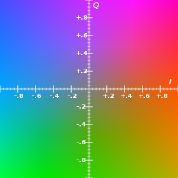
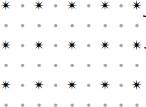
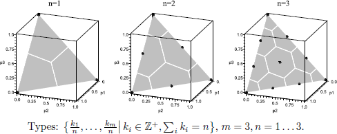
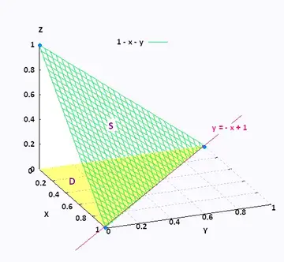

# 5. Lossy Compression: Images and Audio

We cover the following topics:

* Colors and quantization
* Color spaces: RGB, YIQ, YUV and YCbCr
* JPEG encoding (7 steps)
* The discrete cosine transform
* Other image formats; quantization in other areas

* **Computer lab:** 
{: .small}

## Colors and Quantization

**Example:** Grayscale images.

* In an image, a number $0-255$ denotes a color (from black to white).
* The eye cannot tell all $256$ shades apart, so the $256$ colors can be mapped to a smaller number of colors.
* The simplest mapping is, for example, $f(x) = \left\lfloor\frac{x}{4} \right\rfloor$. Then $f\,:\,\lbrace 0,\ldots,255 \rbrace \rightarrow \lbrace 0,\ldots,63 \rbrace$.
* In practice a more complex function is used; it groups together colors that the eye distinguishes poorly.

**Vector quantization**

* A color pixel is defined by $3$ values ($\text{Red}, \text{Green}, \text{Blue}$). The space is $\lbrace 0,\ldots,255 \rbrace^3$.
* $f(x_1, x_2, x_3 ) = (y_1,y_2,y_3)$, chosen so that different triples $(x_1, x_2, x_3)$ that map to the same $(y_1,y_2,y_3)$ are hard to tell apart.

Recall that multiplying a vector by a matrix is a linear transformation, i.e., a function $\mathbf{R}^n \rightarrow \mathbf{R}^n$. It is written as follows:

$$
\left( \begin{array}{c} x'_1 \\ x'_2 \\ \cdots \\ x'_n \end{array} \right)
=
\left( \begin{array}{cccc}
a_{11} &  a_{12} & \cdots & a_{1n} \\
a_{21} & a_{22} & \cdots & a_{2n} \\
\vdots & \vdots & \vdots & \vdots \\
a_{n1} & a_{n2} & \cdots & a_{nn}
\end{array} \right)
\left( \begin{array}{c} x_1 \\ x_2 \\ \cdots \\ x_n \end{array} \right)
$$

## Color Spaces

A color space defines which three numbers describe the color of one point (pixel). Displays and cameras work with RGB, but for compression it is better to split a color into *luma* and two *chroma* components. Human vision perceives changes in brightness much more precisely than changes in hue, so the chroma components can be stored at a lower resolution (see JPEG step 2).

### RGB

*RGB* is an additive color space: a color is obtained by mixing red (R), green (G) and blue (B) light. Each component is usually stored as an $8$-bit number from $0$ to $255$; $(0,0,0)$ is black and $(255,255,255)$ is white. All three components are equally important, so none of them can be compressed more than the others.

### YIQ

*YIQ* was used by the NTSC analog color television standard (USA, 1953). "Y" is luma (it was also shown by black-and-white TV sets), while "I" (*in-phase*) and "Q" (*quadrature*) carry chroma (the names come from signal modulation). If $R, G, B \in [0;1]$ (the 8-bit value divided by $255$), then

$$
\left( \begin{array}{c} Y \\ I \\ Q \end{array} \right)
= M
\left( \begin{array}{c} R \\ G \\ B \end{array} \right),
\qquad
M = \left( \begin{array}{rrr}
0.299 &  0.587 &  0.114 \\
0.5959 & -0.2746 & -0.3213 \\
0.2115 & -0.5227 &  0.3112
\end{array} \right).
$$

Then $Y \in [0;1]$, $I \in [-0.5959; 0.5959]$ and $Q \in [-0.5227; 0.5227]$. For gray colors ($R = G = B$) we get $I = Q = 0$, because the second and the third row of $M$ each sum to $0$. The matrix $M$ is invertible, so the transformation is lossless: $(R, G, B)^T = M^{-1} (Y, I, Q)^T$. Rounded to three decimal places, the elements of $M^{-1}$ are

$$
\left( \begin{array}{rrr}
1 &  0.956 &  0.621 \\
1 & -0.272 & -0.647 \\
1 & -1.107 &  1.704
\end{array} \right).
$$

The figure shows a photo and its Y, I, Q components (I and Q are shown with the color that corresponds to that component when the other components are at their middle values):

| | |
| --- | --- |
|  |  |
| *original (RGB)* | *Y component* |
|  |  |
| *I component* | *Q component* |

Almost all of the image structure (edges, details) is in the Y component, while the I and Q components are blurry. Human vision perceives "I" (the transition from orange to blue) more precisely than "Q" (the transition from green to purple), so NTSC broadcasting gave the Q signal a narrower frequency band than I.



*The IQ plane for $Y=0.5$.*

### YUV and YCbCr

*YUV* is the color space of analog television (PAL, SECAM). Luma $Y$ is the same as in YIQ, but chroma is described by the difference of blue and red from luma ($R, G, B \in [0;1]$):

$$
Y = 0.299\,R + 0.587\,G + 0.114\,B, \qquad
U = 0.492\,(B - Y), \qquad
V = 0.877\,(R - Y).
$$

(YIQ is the same UV plane, rotated by $33^\circ$.)

*YCbCr* is the digital version of YUV: $B - Y$ and $R - Y$ are scaled so that they fit into $8$ bits, and $128$ is added. The JPEG file format JFIF uses full-range YCbCr (ITU-R BT.601 coefficients). If $R, G, B \in \lbrace 0, \ldots, 255 \rbrace$, then

$$
\begin{array}{rcl}
Y  & = & 0.299\,R + 0.587\,G + 0.114\,B, \\[4pt]
\mathrm{Cb} & = & 128 + \dfrac{B - Y}{1.772}, \\[8pt]
\mathrm{Cr} & = & 128 + \dfrac{R - Y}{1.402}.
\end{array}
$$

The divisors $1.772 = 2\,(1 - 0.114)$ and $1.402 = 2\,(1 - 0.299)$ are chosen so that $\mathrm{Cb}$ and $\mathrm{Cr}$ stay in the interval $[0;255]$. After the computation all three values are rounded to integers and clipped to the interval $[0;255]$. The inverse transformation follows directly from these formulas:

$$
\begin{array}{rcl}
R & = & Y + 1.402\,(\mathrm{Cr} - 128), \\
B & = & Y + 1.772\,(\mathrm{Cb} - 128), \\
G & = & (Y - 0.299\,R - 0.114\,B) \,/\, 0.587.
\end{array}
$$

The transformation itself is invertible; information is lost only when rounding to integers.


*The CbCr plane for $Y = 128$. The point $(\mathrm{Cb}, \mathrm{Cr}) = (128, 128)$ is gray; colors outside the RGB range are clipped.*

## JPEG Encoding

The JPEG (*Joint Photographic Experts Group*) standard ISO/IEC 10918-1 (1992) describes several image compression modes: sequential (*baseline*) and progressive DCT coding, a lossless mode and a hierarchical mode. Below we describe the most common one, sequential (*baseline*) encoding; the result is stored in the JFIF file format (`*.jpg`).

* Input: a raster image; the color of each pixel is described by three $8$-bit numbers $R, G, B \in \lbrace 0, \ldots, 255 \rbrace$.
* Output: a sequence of bytes (a JFIF file).


*JPEG encoding steps; the numbers match steps 1-7 described below. The numbers are real: a sample block is transformed with DCT-II, quantized with the standard luma quantization table and read in zig-zag order (see "Python Examples").*

**Step 1: Color space conversion (RGB $\rightarrow$ YCbCr).** For each pixel, $(Y, \mathrm{Cb}, \mathrm{Cr})$ is computed from $(R, G, B)$ with the JFIF formulas (see "YUV and YCbCr"); the result is rounded to an integer and clipped to $[0;255]$. We get three image *components* (planes): $Y$, $\mathrm{Cb}$ and $\mathrm{Cr}$.

**Step 2: Chroma subsampling (4:2:0).** The $Y$ component is left unchanged. In the $\mathrm{Cb}$ and $\mathrm{Cr}$ components, each $2 \times 2$ square of pixels is replaced by a single value, the (rounded) arithmetic mean of the four values. The chroma components become half as wide and half as tall, so the amount of data drops from $3$ to $1 + \frac{1}{4} + \frac{1}{4} = 1.5$ values per pixel. The standard also allows 4:4:4 (no subsampling) and 4:2:2 (horizontal subsampling only).



*Grid subsampling (skipping grid).*

*A note on the J:a:b notation.* Chroma subsampling is denoted by three numbers J:a:b, which describe a *reference region*, a rectangle J pixels wide and $2$ rows tall:

* **J** is the width of the region in pixels (almost always $4$). The luma ($Y$) plane is not subsampled: each row of the region has J luma samples.
* **a** is the number of chroma samples in the *first* row of the region. $a = J$ means no horizontal subsampling; $a = J/2$ means one sample for every two neighboring pixels.
* **b** is the number of chroma samples in the *second* row of the region. $b = a$ means that the second row has its own samples (no vertical subsampling), while $b = 0$ means that the second row has no samples of its own and reuses those of the first row, i.e., the vertical resolution is halved.

The numbers a and b refer to *each* of the two chroma planes ($\mathrm{Cb}$ and $\mathrm{Cr}$ are subsampled in the same way). So J:a:b is **not** a ratio "$Y : \mathrm{Cb} : \mathrm{Cr}$", and the "0" in 4:2:0 does not mean that there is no $\mathrm{Cr}$ component; it means that every second row has no new chroma samples.


*A reference region of $4 \times 2$ pixels. The grid shows the luma samples (one per pixel); the green rectangles show pixels that share one chroma sample (the same layout in both the $\mathrm{Cb}$ and the $\mathrm{Cr}$ plane).*

| Scheme | Chroma horizontally | Chroma vertically | Values per pixel | JPEG factors of $Y$ ($H \times V$) | Where used |
| --- | --- | --- | --- | --- | --- |
| 4:4:4 | full | full | $3$ | $1 \times 1$ | high quality, graphics and text |
| 4:2:2 | $\frac{1}{2}$ | full | $2$ | $2 \times 1$ | professional video, some camera JPEGs |
| 4:2:0 | $\frac{1}{2}$ | $\frac{1}{2}$ | $1.5$ | $2 \times 2$ | most JPEGs and video (H.264, AV1), AVIF |
| 4:1:1 | $\frac{1}{4}$ | full | $1.5$ | $4 \times 1$ | DV video (NTSC) |
| 4:4:0 | full | $\frac{1}{2}$ | $2$ | $1 \times 2$ | rare (some cameras) |

The number of values per pixel is $1 + 2 \cdot (\text{fraction of chroma samples})$; for example, for 4:2:0 it is $1 + 2 \cdot \frac{1}{4} = 1.5$. The J:a:b notation itself is not stored in a JPEG file: the SOF segment gives each component a horizontal and a vertical sampling factor $H \times V$ (the relative sample density). If the $Y$ factors are $2 \times 2$ and those of $\mathrm{Cb}$ and $\mathrm{Cr}$ are $1 \times 1$, this is 4:2:0. A grayscale image that has only the $Y$ plane is sometimes (e.g., in the AV1 and AVIF documentation) denoted 4:0:0.

**Step 3: Splitting into $8 \times 8$ blocks.** The width and height of the image are padded to a multiple of $16$ (usually by repeating the last column and row). Each component is split into $8 \times 8$ blocks. With 4:2:0 subsampling, each $16 \times 16$ pixel area (*MCU, minimum coded unit*) corresponds to four $Y$ blocks, one $\mathrm{Cb}$ block and one $\mathrm{Cr}$ block; they are coded in this order. $128$ is subtracted from each value in a block (*level shift*), so that the values are in the interval $[-128; 127]$.

**Step 4: Discrete cosine transform (DCT-II).** For each block $A$, a coefficient matrix of the same size $B = C A C^T$ is computed (see "Discrete Cosine Transforms"):

$$
B_{u,v} = \alpha_u \alpha_v \sum_{x=0}^{7} \sum_{y=0}^{7} A_{x,y} \cos\frac{(2x+1)u\pi}{16} \cos\frac{(2y+1)v\pi}{16},
\qquad
\alpha_0 = \sqrt{\tfrac{1}{8}},\;\; \alpha_k = \sqrt{\tfrac{2}{8}} \;\; (k \geq 1).
$$

$B_{0,0}$ is the *DC coefficient*; it is $8$ times the average value of the block. The other $63$ are *AC coefficients*; the larger $u$ and $v$, the higher the vertical and horizontal frequency (finer details) they correspond to. In smooth image areas almost all the "energy" is concentrated in a few coefficients in the upper left corner. This step by itself is lossless (the DCT is invertible).

**Step 5: Quantization.** Each coefficient is divided by an element of the quantization table and rounded to the nearest integer:

$$
\hat{B}_{u,v} = \operatorname{round}\left( \frac{B_{u,v}}{Q_{u,v}} \right).
$$

This is the main step where information is lost: the decoder can only restore $\hat{B}_{u,v} \cdot Q_{u,v}$. For high frequencies, which the eye perceives less, $Q_{u,v}$ is larger, so most of these coefficients become $0$. The luma table of the JPEG standard (Annex K) is

$$
Q = \left( \begin{array}{rrrrrrrr}
16 & 11 & 10 & 16 & 24 & 40 & 51 & 61 \\
12 & 12 & 14 & 19 & 26 & 58 & 60 & 55 \\
14 & 13 & 16 & 24 & 40 & 57 & 69 & 56 \\
14 & 17 & 22 & 29 & 51 & 87 & 80 & 62 \\
18 & 22 & 37 & 56 & 68 & 109 & 103 & 77 \\
24 & 35 & 55 & 64 & 81 & 104 & 113 & 92 \\
49 & 64 & 78 & 87 & 103 & 121 & 120 & 101 \\
72 & 92 & 95 & 98 & 112 & 100 & 103 & 99
\end{array} \right);
$$

the smallest value is $Q_{0,2} = 10$ and the largest is $Q_{6,5} = 121$ (the indices $u, v$ start from $0$). The chroma components have a different table with larger values. The quality parameter $q \in \lbrace 1, \ldots, 100 \rbrace$ scales the table; in the *libjpeg* library $S = 5000/q$ if $q < 50$ and $S = 200 - 2q$ if $q \geq 50$, and the new table is $\max\left(1, \left\lfloor (S \cdot Q_{u,v} + 50)/100 \right\rfloor\right)$. The tables (for $q = 50$, exactly the one given above) are written to the file so that the decoder can use them.

**Step 6: Zig-zag order, coding the DC and AC coefficients.** The quantized block is read in zig-zag order, along the diagonals from the upper left corner to the lower right one. The number at position $(u, v)$ of the matrix is the index of that coefficient in the sequence:

$$
\left( \begin{array}{rrrrrrrr}
0 & 1 & 5 & 6 & 14 & 15 & 27 & 28 \\
2 & 4 & 7 & 13 & 16 & 26 & 29 & 42 \\
3 & 8 & 12 & 17 & 25 & 30 & 41 & 43 \\
9 & 11 & 18 & 24 & 31 & 40 & 44 & 53 \\
10 & 19 & 23 & 32 & 39 & 45 & 52 & 54 \\
20 & 22 & 33 & 38 & 46 & 51 & 55 & 60 \\
21 & 34 & 37 & 47 & 50 & 56 & 59 & 61 \\
35 & 36 & 48 & 49 & 57 & 58 & 62 & 63
\end{array} \right)
$$

This way the low-frequency coefficients come at the beginning of the sequence and the zeros at the end.

* The **DC coefficient** (index $0$) is usually similar in neighboring blocks, so the difference $\mathrm{DIFF} = \mathrm{DC}_k - \mathrm{DC}_{k-1}$ from the DC value of the previous block of the same component is coded (for the first block $\mathrm{DC}_{k-1} = 0$). This technique is called DPCM (*differential pulse-code modulation*).
* The **AC coefficients** (indices $1 \ldots 63$) are turned into a sequence of pairs $(\mathrm{RUN}, \mathrm{VALUE})$, where $\mathrm{VALUE} \neq 0$ is the next nonzero coefficient and $\mathrm{RUN} \in \lbrace 0, \ldots, 15 \rbrace$ is the number of zeros before it. $16$ zeros in a row are coded with the special pair ZRL $= (15, 0)$. If only zeros remain until the end of the block, the symbol EOB (*end of block*) is output.

Each nonzero value $v$ (both $\mathrm{DIFF}$ and $\mathrm{VALUE}$) is written as a *category* $\mathrm{SIZE}$ (the number of binary digits of $\lvert v \rvert$) followed by $\mathrm{SIZE}$ extra bits: for a positive $v$ these are the binary digits of $v$, for a negative $v$ the binary digits of $v + 2^{\mathrm{SIZE}} - 1$. For example, $-3$: $\mathrm{SIZE} = 2$, extra bits `00`; $-26$: $\mathrm{SIZE} = 5$, extra bits `00101`.

*Example* (the block in the figure): $\mathrm{DC} = -26$, and the AC sequence is `−3 0 −3 −2 −6 2 −4 1 −3 1 1 5 1 2 −1 1 −1 2 0 0 0 0 0 −1 −1` followed by $38$ zeros. The pairs are: $(0,-3)$, $(1,-3)$, $(0,-2)$, $(0,-6)$, $(0,2)$, $(0,-4)$, $(0,1)$, $(0,-3)$, $(0,1)$, $(0,1)$, $(0,5)$, $(0,1)$, $(0,2)$, $(0,-1)$, $(0,1)$, $(0,-1)$, $(0,2)$, $(5,-1)$, $(0,-1)$, EOB.

**Step 7: Entropy coding and building the file.** Baseline mode uses a Huffman code. For the DC coefficient the symbol $\mathrm{SIZE}$ is coded, and for an AC pair the byte $16 \cdot \mathrm{RUN} + \mathrm{SIZE}$ (EOB is $0$, ZRL is $240$). The extra bits are written uncoded after each Huffman codeword. The Huffman code tables (separate for DC and AC symbols, for luma and chroma) can be taken from Annex K of the standard or built for each image (optimized tables); they are written to the file. The standard also allows arithmetic coding, but it is rarely supported.

*Example:* If the DC of the previous block is $0$, then $\mathrm{DIFF} = -26$ and $\mathrm{SIZE} = 5$; in the standard luma DC table, category $5$ has the codeword `110`, so the output is `110` `00101`. The first AC pair $(0, -3)$ is the symbol $16 \cdot 0 + 2 = 2$ with the codeword `01` and the extra bits `00`. The bit string starts with `1100 0101 0100`...

The bits are packed into bytes. If the byte `FF` occurs in the data, `00` is written after it (*byte stuffing*), so that it cannot be mistaken for a marker. A JFIF file consists of marker segments: SOI (`FF D8`, start of image), APP0 (JFIF header), DQT (quantization tables), SOF0 (image size and components), DHT (Huffman tables), SOS (start of scan) followed by the compressed data, EOI (`FF D9`, end of image).

**Decoding** performs the same steps in reverse order: Huffman decoding, restoring DC and AC, $B_{u,v} = \hat{B}_{u,v} \cdot Q_{u,v}$, the inverse DCT $A = C^T B C$, $+128$, upsampling the chroma components and YCbCr $\rightarrow$ RGB. Information is lost only in steps 2 and 5 (and when rounding in step 1).

### Python Examples

**DCT with SciPy.** The function `dct` with `norm='ortho'` computes exactly the DCT-II defined above (`dct2(A)` is $C A C^T$):

```python
import numpy as np
from scipy.fftpack import dct, idct

def dct2(arr):
    return dct(dct(arr.T, norm='ortho').T, norm='ortho')

def idct2(arr):
    return idct(idct(arr.T, norm='ortho').T, norm='ortho')

# Create an 8x8 matrix with random values between 0 and 1
matrix = np.random.rand(8, 8)
print(matrix)
dct_coefficients = dct2(matrix)
print(dct_coefficients)
inverse_dct = idct2(dct_coefficients)
print(inverse_dct)
```

**One block through steps 3-6.** The program produces the numbers shown in the figure: the quantized block, $\mathrm{DC} = -26$ and the $(\mathrm{RUN}, \mathrm{VALUE})$ pairs.

```python
import numpy as np

# 8x8 luma (Y) block, values 0..255
A = np.array([
    [52, 55, 61, 66, 70, 61, 64, 73],
    [63, 59, 55, 90, 109, 85, 69, 72],
    [62, 59, 68, 113, 144, 104, 66, 73],
    [63, 58, 71, 122, 154, 106, 70, 69],
    [67, 61, 68, 104, 126, 88, 68, 70],
    [79, 65, 60, 70, 77, 68, 58, 75],
    [85, 71, 64, 59, 55, 61, 65, 83],
    [87, 79, 69, 68, 65, 76, 78, 94]])

# Standard JPEG luma quantization table (quality 50)
Q = np.array([
    [16, 11, 10, 16, 24, 40, 51, 61],
    [12, 12, 14, 19, 26, 58, 60, 55],
    [14, 13, 16, 24, 40, 57, 69, 56],
    [14, 17, 22, 29, 51, 87, 80, 62],
    [18, 22, 37, 56, 68, 109, 103, 77],
    [24, 35, 55, 64, 81, 104, 113, 92],
    [49, 64, 78, 87, 103, 121, 120, 101],
    [72, 92, 95, 98, 112, 100, 103, 99]])

# Step 3: level shift
A0 = A - 128

# Step 4: DCT-II, B = C A C^T
k, n = np.meshgrid(range(8), range(8), indexing="ij")
C = np.cos((2 * n + 1) * k * np.pi / 16)
C[0, :] *= np.sqrt(1 / 8)
C[1:, :] *= np.sqrt(2 / 8)
B = C @ A0 @ C.T

# Step 5: quantization
Bq = np.round(B / Q).astype(int)

# Step 6: zig-zag order and (RUN, VALUE) pairs
order = sorted(((u, v) for u in range(8) for v in range(8)),
               key=lambda p: (p[0] + p[1], p[1] if (p[0] + p[1]) % 2 == 0 else p[0]))
zz = [int(Bq[u, v]) for u, v in order]
dc, ac = zz[0], zz[1:]
pairs, run = [], 0
last = max((i for i, x in enumerate(ac) if x != 0), default=-1)
for x in ac[:last + 1]:
    if x == 0:
        run += 1
        if run == 16:
            pairs.append((15, 0))   # ZRL: 16 zeros in a row
            run = 0
    else:
        pairs.append((run, x))
        run = 0
pairs.append("EOB")

print(Bq)
print("DC =", dc)
print(pairs)
```

## Discrete Cosine Transforms

In 1972 Nasir Ahmed proposed this algorithm for signal compression:

$$
y_k = \alpha_k \sum_{n=0}^{N-1} x_n \cos \left[ \frac{\pi (2n + 1) k}{2N} \right]
$$

where $k \in \lbrace 0, \ldots, N-1 \rbrace$ and the normalization factor is $\alpha_k$, where

$$
\alpha_k = \begin{cases}
\sqrt{\frac{1}{N}} & \text{if } k = 0 \\
\sqrt{\frac{2}{N}} & \text{if } k \neq 0
\end{cases}
$$

The two-dimensional case appeared soon afterwards and is a natural generalization. It can be written in matrix form as follows:

For each $8 \times 8$ matrix of color intensities (*spatial domain*) we create a matrix $A$. The result of the DCT is a matrix $B$ of the same size (*frequency domain*), which can be obtained as follows:

$$
B = C A C^T,
$$

where $C$ is an $8 \times 8$ coefficient matrix defined as follows:

$$
C_{k, n} = \alpha_k \cos\left(\frac{(2n + 1)k\pi}{16}\right),
$$

where $k, n = 0, 1, \ldots, 7$, and the normalization factors $\alpha_k$ are:

$$
\alpha_k = \begin{cases}
\sqrt{\frac{1}{8}} & \text{if } k = 0 \\
\sqrt{\frac{2}{8}} & \text{if } k \neq 0
\end{cases}
$$

A single element $B_{u,v}$ of the matrix $B$ can be written as follows:

$$
B_{u, v} = \sum_{x=0}^{7} \sum_{y=0}^{7} A_{x, y} \cos\left(\frac{(2x + 1)u\pi}{16}\right) \cos\left(\frac{(2y + 1)v\pi}{16}\right) \alpha_u \alpha_v
$$

where $u, v, x, y \in \lbrace 0, 1, \ldots, 7 \rbrace$.

### A Numerical Example: DCT with $N = 4$

By hand it is easier to compute a DCT of length $N = 4$. Then $y = C x$, where $C_{k,n} = \alpha_k \cos\frac{\pi (2n+1) k}{8}$, $\alpha_0 = \frac{1}{2}$ and $\alpha_1 = \alpha_2 = \alpha_3 = \frac{1}{\sqrt{2}}$. The matrix $C$ contains only three different numbers (up to sign):

$$
C = \left( \begin{array}{rrrr}
a & a & a & a \\
b & c & -c & -b \\
a & -a & -a & a \\
c & -b & b & -c
\end{array} \right),
\qquad
\begin{array}{l}
a = \frac{1}{2}, \\[4pt]
b = \frac{1}{\sqrt{2}} \cos\frac{\pi}{8} = 0.65328\ldots, \\[4pt]
c = \frac{1}{\sqrt{2}} \cos\frac{3\pi}{8} = 0.27060\ldots
\end{array}
$$

Useful identities: $b + c = \cos\frac{\pi}{8} = 0.92388\ldots$ and $b - c = \cos\frac{3\pi}{8} = 0.38268\ldots$ The rows of $C$ are orthonormal ($C C^T = I$), so the inverse transform is $x = C^T y$.

**Example:** A uniformly increasing signal $x = (10, 20, 30, 40)$:

$$
\begin{array}{rcl}
y_0 & = & a\,(10 + 20 + 30 + 40) = 50, \\
y_1 & = & b\,(10 - 40) + c\,(20 - 30) = -30\,b - 10\,c = -22.304\ldots, \\
y_2 & = & a\,(10 - 20 - 30 + 40) = 0, \\
y_3 & = & c\,(10 - 40) - b\,(20 - 30) = -30\,c + 10\,b = -1.585\ldots
\end{array}
$$

$y_0 = 50$ is the DC coefficient ($2$ times the average $25$), and almost everything else is in the coefficient $y_1$, the lowest frequency. Since $C$ is orthonormal, the sum of squares does not change (Parseval's identity): $10^2 + 20^2 + 30^2 + 40^2 = 3000$ and $50^2 + 22.304^2 + 0^2 + 1.585^2 = 3000$ (up to rounding). For a smooth signal the "energy" is concentrated in the first coefficients, so the last ones can be quantized coarsely or dropped (see Problem 5.2).

**Two-dimensional example ($2 \times 2$):** If $N = 2$, then $C = \frac{1}{\sqrt{2}} \left( \begin{array}{rr} 1 & 1 \\ 1 & -1 \end{array} \right)$, and $B = C A C^T$ can be written in general form:

$$
A = \left( \begin{array}{cc} p & q \\ r & s \end{array} \right)
\;\;\Rightarrow\;\;
B = \frac{1}{2} \left( \begin{array}{cc}
p + q + r + s & p - q + r - s \\
p + q - r - s & p - q - r + s
\end{array} \right).
$$

$B_{0,0}$ is the sum, $B_{0,1}$ is the difference between the left and the right column, $B_{1,0}$ between the top and the bottom row, and $B_{1,1}$ is the "checkerboard" component. For example, $A = \left( \begin{array}{cc} 1 & 3 \\ 5 & 7 \end{array} \right)$ gives $B = \left( \begin{array}{rr} 8 & -2 \\ -4 & 0 \end{array} \right)$.

**Python (without libraries).** The formula can be written directly with a *list comprehension*; `dct2` first transforms each column and then each row, i.e., it computes $C A C^T$:

```python
from math import cos, pi, sqrt

def dct(x):
    """1D DCT-II (orthonormal): y[k] = alpha_k * sum x[n] cos(pi (2n+1) k / 2N)."""
    N = len(x)
    return [(sqrt(1 / N) if k == 0 else sqrt(2 / N))
            * sum(xn * cos(pi * (2 * n + 1) * k / (2 * N)) for n, xn in enumerate(x))
            for k in range(N)]

def idct(y):
    """Inverse transform: x[n] = sum alpha_k y[k] cos(pi (2n+1) k / 2N)."""
    N = len(y)
    return [sum((sqrt(1 / N) if k == 0 else sqrt(2 / N)) * yk
                * cos(pi * (2 * n + 1) * k / (2 * N)) for k, yk in enumerate(y))
            for n in range(N)]

def dct2(A):
    """2D DCT: first for each column, then for each row (B = C A C^T)."""
    cols = [dct(col) for col in zip(*A)]
    return [dct(row) for row in zip(*cols)]

print([round(v, 3) + 0.0 for v in dct([10, 20, 30, 40])])   # [50.0, -22.304, 0.0, -1.585]
print([round(v, 3) + 0.0 for v in idct(dct([10, 20, 30, 40]))])  # [10.0, 20.0, 30.0, 40.0]
for row in dct2([[0, 0, 8, 8]] * 4):                   # vertical edge in a 4x4 block
    print([round(v, 3) + 0.0 for v in row])
```

In the last example all rows of the block have the same sequence of values $(0, 0, 8, 8)$ (a vertical edge). Therefore only the first row of the result is nonzero, $(16, -14.782, 0, 6.123)$: the block has only horizontal frequencies and no vertical ones.

### What DCT Coefficients Store: Amplitude and Energy

**The coefficients are amplitudes of cosine waves.** Since the matrix $C$ is orthonormal, $x = C^T y$, i.e., the signal is a linear combination of the rows of $C$ (the *basis vectors*):

$$
x = y_0\,c_0 + y_1\,c_1 + \ldots + y_{N-1}\,c_{N-1},
\qquad
c_k[n] = \alpha_k \cos\frac{\pi (2n+1) k}{2N}.
$$

The basis vector $c_k$ is a cosine wave with $k$ half-periods in the block: $c_0$ is a constant, $c_1$ is one half-period (a slow transition from one end to the other), and $c_{N-1}$ is the fastest oscillation that can be represented with $N$ points. The coefficient $y_k$ says how much of this cosine wave the signal contains; its contribution $y_k c_k$ oscillates with amplitude $\alpha_k \lvert y_k \rvert$.


*The DCT-II basis vectors $c_0, \ldots, c_7$ ($N = 8$): the dots are the elements of the vector, the thin line is the cosine wave they are sampled from. In an $8 \times 8$ JPEG block, the two-dimensional basis images are products of $c_u$ and $c_v$ (a vertical and a horizontal cosine wave).*

For example, for the signal $x = (10, 20, 30, 40)$ with $y = (50,\; -22.304,\; 0,\; -1.585)$ ("A Numerical Example") the contributions are:

| Coefficient | Contribution $y_k c_k$ |
| --- | --- |
| $y_0 = 50$ | $(25,\; 25,\; 25,\; 25)$ |
| $y_1 = -22.304$ | $(-14.571,\; -6.036,\; 6.036,\; 14.571)$ |
| $y_2 = 0$ | $(0,\; 0,\; 0,\; 0)$ |
| $y_3 = -1.585$ | $(-0.429,\; 1.036,\; -1.036,\; 0.429)$ |
| **sum** | $(10,\; 20,\; 30,\; 40)$ |

The increasing signal is mostly the average value plus one cosine half-period; $y_3$ only slightly "straightens" the curve of the half-period into a straight line.

**The DC coefficient is the average value.** Since $c_0 = \left(\frac{1}{\sqrt{N}}, \ldots, \frac{1}{\sqrt{N}}\right)$, we have $y_0 = \sqrt{N} \cdot \bar{x}$, where $\bar{x}$ is the average value of the signal. In the example $y_0 = 2 \cdot 25$; in an $8 \times 8$ block $B_{0,0} = 8 \cdot \bar{A}$ (see JPEG step 4).

**Energy is preserved (Parseval's identity).** An orthonormal transform preserves the length of a vector, so

$$
\sum_{n=0}^{N-1} x_n^2 = \sum_{k=0}^{N-1} y_k^2 .
$$

Dividing by $N$ gives the *mean square* (average power) of the signal, and it splits into two parts:

$$
\frac{1}{N} \sum_{n} x_n^2
= \underbrace{\frac{y_0^2}{N}}_{=\ \bar{x}^2}
+ \underbrace{\frac{1}{N} \sum_{k \geq 1} y_k^2}_{=\ \sigma^2},
$$

where $\sigma^2 = \frac{1}{N} \sum_n (x_n - \bar{x})^2$ is the variance. The DC coefficient stores the average brightness, while the AC coefficients together store only the variation around it (contrast, texture, edges). In the example: $\frac{3000}{4} = 750 = 25^2 + 125$; the energy is distributed as follows: $y_0$: $83.3\%$, $y_1$: $16.6\%$, $y_3$: $0.08\%$. For a smooth signal almost all of the AC energy is in the low frequencies.

**The dropped coefficients determine the error.** If the coefficients $y$ are replaced by other values $y'$ (dropped, i.e., replaced by $0$, or quantized), then the error of the restored signal is $x - x' = C^T (y - y')$, and its sum of squares is exactly

$$
\sum_n (x_n - x'_n)^2 = \sum_k (y_k - y'_k)^2 .
$$

So the *mean squared error* (MSE) of the signal is $\frac{1}{N}$ times the sum of squares of the dropped coefficients, and each coefficient contributes to the error independently of the others. It follows that:

* The best approximation with $M$ coefficients keeps the $M$ coefficients with the largest $\lvert y_k \rvert$. In the example, dropping $y_3$ gives $\mathrm{MSE} = 1.585^2 / 4 = 0.63$ (on average $\sqrt{0.63} = 0.79$ units per point), while keeping only $y_0$ gives $\mathrm{MSE} = \sigma^2 = 125$: the signal is replaced by its average value.
* When quantizing with step $Q$, the error of each coefficient is at most $Q/2$; if the rounding error is uniformly distributed, its mean square is $Q^2/12$. So the encoder can estimate the error directly from the coefficients, without recomputing the pixels, and coarser quantization of high frequencies costs little, because the coefficients there are small anyway.
* Image quality is often measured by PSNR (*peak signal-to-noise ratio*) $= 10 \log_{10} \frac{255^2}{\mathrm{MSE}}$ in decibels; for good quality JPEG images it is usually $30$--$40$ dB.

## The AVIF Image Format

* Besides JPEG, there is WebP, a popular format created by Google that compresses well and is widely supported by browsers.
* HEIF/HEIC (High Efficiency Image Format) is related to the H.265 video codec; it is promoted by Apple.
* AVIF is related to the well-known open video codec AV1.
* JPEG XL is still a rather new format (not very widely supported), but it has several new features, good compression in various edge cases and also full compatibility with JPEG.

*AVIF* (*AV1 Image File Format*, Alliance for Open Media, 2019) stores an image as a single *intra frame* of the AV1 video codec (a frame coded without references to other frames), wrapped in a HEIF container (the same container format that HEIC files use). Since AV1 is designed for video compression, it offers many more choices than JPEG: for each area of the image the encoder searches for the best block size, prediction mode and transform. This is why AVIF encoding is much slower than JPEG, but for the same file size the quality is considerably better.

### AVIF Encoding

A typical case: a digital photo compressed lossily (e.g., with the program `avifenc` from the *libavif* library, which uses the AV1 encoder *libaom*, *SVT-AV1* or *rav1e*).


*AVIF encoding steps; the numbers match the steps listed below. The dashed arrow shows that already reconstructed (decoded) pixels are used to predict the following blocks.*

1. **Color space conversion (RGB $\rightarrow$ YCbCr).** As in JPEG, but the coefficient matrix (e.g., BT.601 or BT.709), the value range (full $0 \ldots 255$ or limited $16 \ldots 235$) and the bit depth ($8$, $10$ or $12$ bits per component) can be chosen, and the choice is written to the file. $10$- and $12$-bit images can also store HDR (*high dynamic range*) photos.
2. **Chroma subsampling.** As in JPEG: 4:2:0 is usual for photos; high-quality settings often use 4:4:4 (no subsampling).
3. **Splitting into superblocks and blocks.** Each component is split into $64 \times 64$ (or $128 \times 128$) *superblocks*, and each superblock is recursively split into smaller blocks (not only into four squares, but also into two or four rectangles and T-shaped parts), down to $4 \times 4$. The encoder chooses the partitioning by comparing how many bits each option takes and how large an error it gives (*rate–distortion optimization*). *Difference from JPEG:* a JPEG block is always $8 \times 8$; AVIF uses large blocks in smooth areas (sky, a wall) and small blocks in detailed areas.
4. **Intra prediction.** The values of each block are predicted from already encoded (and reconstructed) neighboring pixels above and to the left of the block. There are $56$ directional modes (they continue edges and lines at a given angle), a DC mode (the average value), smooth modes (*smooth*, *Paeth*), chroma prediction from luma (*chroma from luma*, CfL) and a palette for image areas with few colors. Only the *residual*, the difference between the block and its prediction, is coded further. *Difference from JPEG:* JPEG predicts only the DC coefficient from the previous block; AV1 predicts the whole block, so the residual is usually close to zero.
5. **Residual transform.** The residual is transformed in blocks from $4 \times 4$ to $64 \times 64$ (also rectangular). Different 1D transforms can be chosen for the horizontal and the vertical direction: DCT, ADST (*asymmetric discrete sine transform*, suitable for a residual that grows with the distance from the block edge it was predicted from), flipped ADST or the identity (no transform). All transforms are computed with integers, so that the encoder and the decoder get exactly the same result. *Difference from JPEG:* JPEG always uses an $8 \times 8$ DCT.
6. **Quantization.** The quantization step is set by a single parameter *qindex* ($0 \ldots 255$; the larger it is, the coarser the quantization and the smaller the file), with separate adjustments for the DC and AC coefficients and for each component. The step can also vary between superblocks. The encoder can choose the rounding direction of each coefficient so as to save bits (*trellis quantization*). *Difference from JPEG:* JPEG uses an $8 \times 8$ quantization table and plain rounding.
7. **Reconstruction and in-loop filters.** The encoder reconstructs the image exactly as the decoder will (inverse quantization and transform, adding the prediction), because the following blocks must be predicted from the same pixels that the decoder will have. Three filters are applied to the reconstructed image: *deblocking* (smooths block boundaries), CDEF (*constrained directional enhancement filter*, which removes ringing along edges, taking the edge direction into account) and *loop restoration* (a Wiener or *self-guided* filter). The encoder chooses the filter parameters that make the reconstructed image closest to the original and writes them to the bitstream. Optionally, the film grain of a photo can be removed and only its statistical parameters sent, so that the decoder draws the grain again. *Difference from JPEG:* JPEG has no filters, so $8 \times 8$ block boundaries are visible at low quality.
8. **Entropy coding.** All decisions (block partitioning, prediction modes, transform types, filter parameters) and the quantized coefficients are coded with an adaptive arithmetic code whose symbols have up to $16$ values. The probability distributions adapt after each symbol and depend on the context (e.g., on the coefficients of neighboring blocks). The result is an AV1 bitstream made of OBUs (*open bitstream units*): a sequence header and frame data. *Difference from JPEG:* JPEG uses a Huffman code whose tables stay fixed for the whole image and which spends at least $1$ bit on each symbol.
9. **Container.** The AV1 data is put into a HEIF (ISO base media file format) container that consists of "boxes": `ftyp` (file type `avif`), `meta` (image size, AV1 configuration `av1C`, color space `colr`, bit depth) and `mdat` (the AV1 data itself). The same file can also store an alpha (transparency) channel (as a second AV1 image), Exif metadata and image sequences (animation).

**Decoding** performs the steps in reverse order: it reads the container and the AV1 data, performs arithmetic decoding, computes the prediction for each block, adds the inverse-transformed residual, applies the in-loop filters and converts YCbCr $\rightarrow$ RGB. The decoder does not have to search for the best modes (they are written in the file), so decoding is much faster than encoding.

### An Animated AVIF Example

AVIF can also store an image sequence (animation). It then consists of several AV1 frames, which can also be coded with references to previous frames, just like video. This animation was created with the Python script [animated_avif.py]({{ '/lectures/lossy_images_and_audio/figs/animated_avif.py' | relative_url }}), which uses the Pillow and NumPy libraries:


*The ball moves at a $45^\circ$ angle and bounces off the edges. $280$ frames ($640 \times 360$ pixels, $50$ frames per second, $5.6$ seconds) take about $12$ KB.*

* The color of the pixels on the edge of the ball is a mix of the background and ball colors, in proportion to how much of the pixel is inside the ball (*anti-aliasing*; each pixel is split into $4 \times 4$ subpixels). This makes the ball look round and the motion smooth, even when the center of the ball is not at the center of a pixel.
* The dimensions are chosen so that the animation is a seamless loop: the center of the ball travels $560$ pixels horizontally and $280$ pixels vertically, so after a path of $2 \cdot 560 = 1120$ pixels ($4$ pixels per frame) the ball returns to its initial position.
* The frames are saved with `Image.save(..., format="AVIF", save_all=True, append_images=...)`; recent Pillow versions have built-in AVIF support.

## Quantization in Other Areas

**Definition:** For a given set of points $S$, a *Voronoi diagram* is a partition of the points of a plane region into classes according to which point of $S$ is the nearest.

The number of classes of a Voronoi diagram equals the number of elements of $S$. A Voronoi diagram consists of polygonal cells, each containing one point of $S$.



*A quantization example.*

### Proportional Electoral Systems

**Definition:** Barycentric coordinates in 3 dimensions assign to each point of a regular triangle $ABC$ a triple of non-negative numbers $(x,y,z)$ that satisfies $x+y+z = 1$.



Barycentric coordinates make it possible to represent the proportions between three positive (or non-negative) numbers. (If negative barycentric coordinates are also allowed, they assign a triple of numbers with $x + y + z = 1$ to every point of the plane, but we will not use those in this course.)

**The D'Hondt system**


*The D'Hondt method for 5 seats and 3 parties. A point in the triangle is a distribution of votes among the parties A, B, C; a region shows which seat allocation K:M:N it produces. The dot in each region is the vote ratio that exactly matches that seat allocation.*

**The Sainte-Laguë system**


*The Sainte-Laguë method for 5 seats and 3 parties (notation as above).*

## Problems

**Computer lab:** [Lab: Breaking JPEG on Purpose]({{ '/lectures/lossy_images_and_audio/jpeg_lab/' | relative_url }}): with a Python program, we compress an image "almost like JPEG" step by step, changing the color space, block size, quantization and transform, and explain what happens to the image.

**Problem 5.1:** We compress colors with a quantization algorithm that uses only the browser-friendly colors: the [Web Safe Color palette](https://www.rapidtables.com/web/color/Web_Safe.html), or the 6x6x6 color cube.

* A color coordinate is browser-friendly if both of its hex digits are equal and divisible by $3$ ($00,33,66,99,\text{CC},\text{FF}$). If all 3 coordinates of a color are friendly, then the color itself is friendly. For instance, `00FF99` is a friendly color, but `22BB99` is not, because the coordinates "22" and "BB" are not allowed.
* Each pixel of the image (each of its RGB coordinates) is rounded to the nearest friendly value from the set ($00,33,66,99,\text{CC},\text{FF}$) to get a browser-friendly color.

What is the compression ratio of this transformation (the new size compared to the old size)?

*Note:* Modern browsers can display any RGB color; this 6x6x6 color cube is mostly of historical interest.
Many early applications represented a color pixel value with 1 byte (256 different values, to which the user could
assign the actual colors with a palette). In this palette, $6^3 = 216$ values were often reserved for the "safe colors",
which (regardless of how the rest of the palette was filled) were displayed the same way.

**Problem 5.2:** Consider the signal $x = (8, 8, 0, 0)$ (a step). Use the DCT with $N = 4$ (see "A Numerical Example: DCT with $N = 4$").

* **(a)** Compute $y = C x$. Express the coefficients in terms of $\cos\frac{\pi}{8}$ and $\cos\frac{3\pi}{8}$, and then compute their values.
* **(b)** Check that $\sum x_n^2 = \sum y_k^2$.
* **(c)** The simplest "compression": drop the highest frequency, i.e., replace $y_3$ with $0$. Compute the restored signal $x' = C^T y'$, where $y' = (y_0, y_1, y_2, 0)$. How large is the squared error $\sum (x_n - x'_n)^2$, and why does it equal $y_3^2$?

**Answer:**

**(a)** From the rows of the matrix $C$:

$$
\begin{array}{rcl}
y_0 & = & a\,(8 + 8 + 0 + 0) = 8, \\
y_1 & = & 8\,b + 8\,c = 8\,(b + c) = 8 \cos\frac{\pi}{8} = 7.391\ldots, \\
y_2 & = & a\,(8 - 8 - 0 + 0) = 0, \\
y_3 & = & 8\,c - 8\,b = -8\,(b - c) = -8 \cos\frac{3\pi}{8} = -3.061\ldots
\end{array}
$$

**(b)** $\sum x_n^2 = 64 + 64 = 128$. $\sum y_k^2 = 64 + 64 \cos^2\frac{\pi}{8} + 64 \cos^2\frac{3\pi}{8} = 64 + 64 = 128$, because $\cos\frac{3\pi}{8} = \sin\frac{\pi}{8}$.

**(c)** $x' = C^T y'$, i.e., $x'_n = a\,y_0 + C_{1,n}\,y_1$ (because $y_2 = 0$ and $y'_3 = 0$):

$$
\begin{array}{rcl}
x'_0 & = & 4 + b \cdot 8 \cos\frac{\pi}{8} = 4 + 4 \cos^2\frac{\pi}{8} \cdot \sqrt{2} = 6 + 2\sqrt{2} = 8.828\ldots, \\
x'_1 & = & 4 + c \cdot 8 \cos\frac{\pi}{8} = 6, \\
x'_2 & = & 4 - c \cdot 8 \cos\frac{\pi}{8} = 2, \\
x'_3 & = & 4 - b \cdot 8 \cos\frac{\pi}{8} = 2 - 2\sqrt{2} = -0.828\ldots
\end{array}
$$

(We use $b \cos\frac{\pi}{8} = \frac{1}{\sqrt{2}} \cos^2\frac{\pi}{8} = \frac{2 + \sqrt{2}}{4\sqrt{2}}$ and $c \cos\frac{\pi}{8} = \frac{1}{\sqrt{2}} \cos\frac{3\pi}{8} \cos\frac{\pi}{8} = \frac{1}{4}$.)

The restored signal $(8.83,\; 6,\; 2,\; -0.83)$ is a "blurred" step that overshoots the original values at the edges; the same effect causes ripples around sharp edges in JPEG images (*ringing*). The error is $x - x' = (-0.83,\; 2,\; -2,\; 0.83)$, and $\sum (x_n - x'_n)^2 = 2 \cdot (2\sqrt{2} - 2)^2 + 2 \cdot 2^2 = 32 - 16\sqrt{2} = 9.37\ldots$ It equals $y_3^2 = 64 \cos^2\frac{3\pi}{8} = 32 - 16\sqrt{2}$, because $x - x' = C^T (y - y')$ and an orthonormal transform preserves the sum of squares: the square of a dropped coefficient is exactly the squared error. $\square$

## References

1. [The MP3 is dead, say creators after terminating licensing](https://www.cnbc.com/2017/05/15/mp3-dead-say-creators-after-terminating-licensing.html): about the evolution of audio formats.
2. [2018 Hungarian parliamentary election](https://en.wikipedia.org/wiki/2018_Hungarian_parliamentary_election): how the D'Hondt method helps round the results in favor of the largest party.
3. [The Theory Behind Mp3](http://www.mp3-tech.org/programmer/docs/mp3_theory.pdf): the main ideas of audio file compression.
