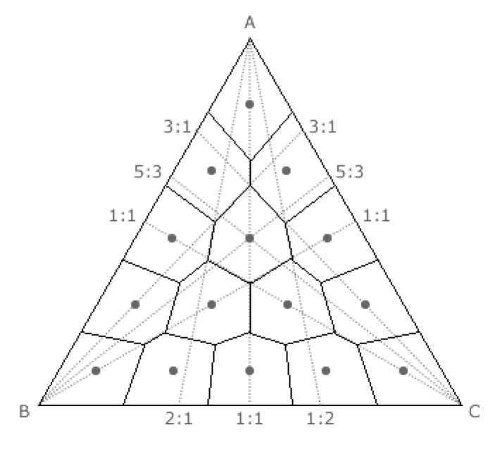
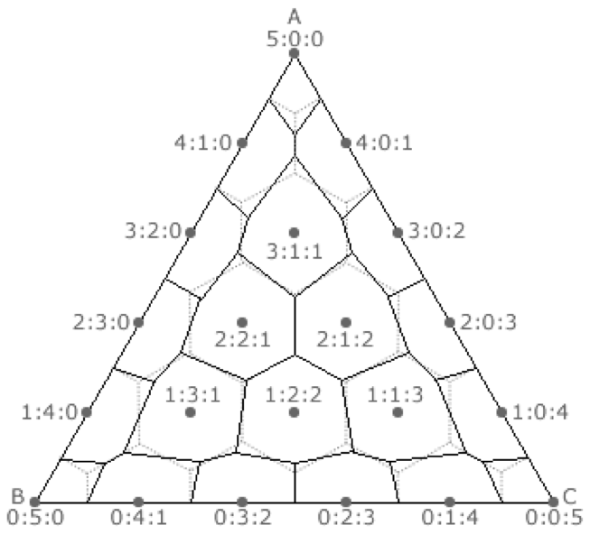

# 5. Zudumradošā saspiešana: Attēli un audio

Apskatām sekojošas sadaļas:

* Krāsu pārveidojumi
* Diskrētā kosinusu transformācija
* Nobeiguma soļi

## Krāsas un kvantizācija (1.-3.solis)

**Piemērs:** Melnbalti attēli.

* Attēlā skaitlis $0-255$ apzīmē krāsu (no melnas līdz baltai).
* Visus $256$ toņus acs neatšķir, tāpēc var attēlot $256$ krāsas uz mazāku skaitu.
* Vienkāršākais attēlojums, piemēram $f(x) = \left\lfloor\frac{x}{4} \right\rfloor$. Tad $f\,:\,\lbrace 0,\ldots,255 \rbrace \rightarrow \lbrace 0,\ldots,63 \rbrace$.
* Praksē lieto sarežģītāku funkciju, kas kopā sagrupē krāsas, kuras acs sliktāk atšķir.

**Vektoru kvantizācija**

* Krāsainu punktu nosaka $3$ vērtības ($\text{Red}, \text{Green}, \text{Blue}$). Telpa $\lbrace 0,\ldots,255 \rbrace^3$.
* $f(x_1, x_2, x_3 ) = (y_1,y_2,y_3)$, tā, lai dažādi trijnieki $(x_1, x_2, x_3)$, kas attēlojas par vienu $(y_1,y_2,y_3)$, būtu grūti atšķirami.

Atkārtojums -- matricas reizināšana ar vektoru ir lineārs pārveidojums jeb funkcija: $\mathbf{R}^n \rightarrow \mathbf{R}^n$. To pieraksta šādi:

$$
\left( \begin{array}{c} x'_1 \\ x'_2 \\ \cdots \\ x'_n \end{array} \right)
\approx
\left( \begin{array}{cccc}
a_{11} &  a_{12} & \cdots & a_{1n} \\
a_{21} & a_{22} & \cdots & a_{2n} \\
\vdots & \vdots & \vdots & \vdots \\
a_{n1} & a_{n2} & \cdots & a_{nn}
\end{array} \right)
\left( \begin{array}{c} x_1 \\ x_2 \\ \cdots \\ x_n \end{array} \right)
$$

## JPEG algoritma apraksts

JPEG ir algoritms attēlu saspiešanai un arī formāts attēlu glabāšanai. Tā mērķis ir iegūt saspiestu failu, no kura var atjaunot attēlu, kas ir līdzīgs sākotnējam. Saspiešana notiek ar zudumiem. Algoritma soļi ir saistīti ar to, kā cilvēks uztver krāsu.

* Ievade: punktu attēls, katra punkta krāsu apraksta trīs $8$ bitu skaitļi (robežās no $0$ līdz $255$) -- R, G, B (red, green, blue).
* Izvade: bitu virkne.


*JPEG kodēšanas soļi; numuri atbilst tālāk aprakstītajiem 1.-7. solim. Skaitļi ir īsti: paraugbloku pārveido ar DCT-II, kvantizē ar standarta gaišuma kvantizācijas tabulu un nolasa zig-zag secībā.*

### Pārveido krāsu telpu no RGB par YIQ

Y,I,Q vērtības iegūst no R,G,B vērtībām, pareizinot tās ar koeficientu matricu. Šis pārveidojums ir atgriezenisks (bezzudumu), t.i., zinot YIQ vērtības, var atjaunot RGB vērtības.

| | |
| --- | --- |
|  |  |
|  |  |

**Kas ir YIQ?**


*IQ plakne, ja $Y=0.5$.*

* "Y" - Luma informācija (melnbaltās televīzijas attēliem)
* "I" - *in-phase*, "Q" - *quadrature* (NTSC - analogās krāsu televīzijas žargons)

Redze precīzāk uztver "I" (pāreju no oranžā uz zilo) nevis "Q" (pāreju no zaļā uz violeto) - tāpēc Q var vairāk saspiest.

**JPEG 1.solis: Pārveidojums no RGB uz YIQ.** Šeit $R,G,B$ ir veseli skaitļi no intervāla $[0;255]$.

* Vispirms intervālu $[0;255]$ vienmērīgi saspiež līdz $[0;1]$, izdalot visus skaitļus ar $255$.
* Pēc tam reizina ar lineāra pārveidojuma matricu:

  $$
  \left( \begin{array}{c}
  Y \\
  I \\
  Q
  \end{array} \right)
  \approx
  \left( \begin{array}{ccc}
  0.299 &  0.587 &  0.114 \\
  0.5959 & -0.2746 & -0.3213 \\
  0.2115 & -0.5227 &  0.3112
  \end{array} \right)
  \left( \begin{array}{c}
  R \\
  G \\
  B
  \end{array} \right)
  $$

* Visbeidzot panāk, ka jaunizveidotie parametri: $Y \in [0;1]$, $I \in [-0.5957; 0.5957]$, un $Q \in [-0.5226; 0.5226]$. Lai tas notiktu, pēc lineārā pārveidojuma veic vēl vērtību apgriešanu (*clamping*) pret maksimālo vai minimālo ar šādām formulām:

  $$
  \left\{ \begin{array}{l}
  Y' := Y, \\
  I' := \max(\min(I, 0.5957), -0.5957), \\
  Q' := \max(\min(Q, 0.5226), -0.5226). \\
  \end{array} \right.
  $$

Šis pārveidojums saglabā informāciju, jo var pārveidot atpakaļ uz RGB:

$$
\left( \begin{array}{c}
R \\
G \\
B
\end{array} \right)
\approx
\left( \begin{array}{ccc}
1 &  0.956 &  0.619 \\
1 & -0.272 & -0.647 \\
1 & -1.106 &  1.703
\end{array} \right)
\left( \begin{array}{c}
Y \\
I \\
Q \end{array} \right)
$$

### Izretina režģi un sagriež blokos


*Režģa izretināšana (Skipping grid).*

**JPEG 2.solis: 4:2:0 subsampling.** Patur visas "Y" vērtības (melnbalto/gaišuma komponenti) - *full luminiscence*, bet "I" un "Q" vērtībām izrēķina aritmētisko vidējo katrā $2 \times 2$ kvadrātiņā -- *half chrominance*. Tāpēc krāsu datiem informācijas apjoms samazinās $4$ reizes. Redze pārmaiņas gaišumā uztver daudz labāk nekā pārmaiņas nokrāsā.

**JPEG 3.solis: Sadalīšana blokos.** YIQ vērtības sadala $8 \times 8$ blokos. Tā kā tika atstāta tikai katra otrā "I" un "Q" vērtība, tad šo bloku izmērs sākotnējā attēlā ir $16 \times 16$. Katru bloku turpmāk apstrādā atsevišķi.

No $16 \times 16$ pikseļu kvadrātiņa rodas četri "Y" (melnbaltie) bloki, viens "I" bloks un viens "Q" bloks.

### Diskrētā kosinusu transformācija

**JPEG 4.solis: DCT-II.** Katram $8 \times 8$ blokam lieto otrā tipa DCT gan horizontāli, gan vertikāli.

$$
\begin{array}{ll}
x'_0 = \frac{1}{\sqrt{8}} \sum\limits_{k=0}^7 x_k \\
x'_j = \frac{2}{\sqrt{8}} \sum\limits_{k=0}^7 \cos \frac{j(2k+1)\pi}{8}x_k,\;\;\text{ja } 1 \leq j \leq 7\\
\end{array}
$$

Vispirms diskrēto kosinusu transformāciju pielieto katrai matricas kolonnai, pēc tam to pašu izdara katrai iegūtās matricas rindai.

```python
import numpy as np
from scipy.fftpack import dct, idct

def dct2(arr):
    return dct(dct(arr.T, norm='ortho').T, norm='ortho')

def idct2(arr):
    return idct(idct(arr.T, norm='ortho').T, norm='ortho')

# Create an 8x8 matrix with random values between 0 and 1
matrix = np.random.rand(8, 8)
print(matrix)
dct_coefficients = dct2(matrix)
print(dct_coefficients)
inverse_dct = idct2(dct_coefficients)
print(inverse_dct)
```

**JPEG 5.solis.** Elementu $x''_{ij}$ noapaļojam līdz precizitātei $a_{ij}$ (dala ar $a_{ij}$ un apaļo uz leju ar $\lfloor x \rfloor$). Elementu atšķirības, kas ir mazākas par $a_{ij}$ ir nebūtiskas. Galvenā viltība ir tā, ka skaitļi atšķiras dažādiem matricas elementiem. Tās komponentes, kuras acs uztver vājāk, tiek noapaļotas ar zemāku precizitāti. Mazākā vērtība $a_{13} = 10$, lielākā -- $a_{66} = 121$.

**JPEG 6.solis.**

* Visu $8 \times 8$ matricu kreisos augšējos elementus saliek kopīgā virknē. Šādi tiks iegūtas trīs virknes -- katrai no trim krāsu telpas YIQ komponentēm.
* Kodē nevis pašas noapaļotās frekvences, bet to starpības $a_1, a_2-a_1, a_3 - a_2,\ldots$.

**JPEG 7.solis.** Iegūtajai starpību virknei lieto Hafmana vai aritmētisko kodēšanu.

## Diskrēto kosinusu transformācijas

Nasirs Ahmeds 1972.gadā piedāvāja šo algoritmu signālu saspiešanai:

$$
y_k = \alpha_k \sum_{n=0}^{N-1} x_n \cos \left[ \frac{\pi (2n + 1) k}{2N} \right]
$$

kur $k \in \lbrace 0, \ldots, N-1 \rbrace$ un normalizācijas reizinātājs ir $\alpha_k$, kur

$$
\alpha_k = \begin{cases}
\sqrt{\frac{1}{N}} & \text{if } k = 0 \\
\sqrt{\frac{2}{N}} & \text{if } k \neq 0
\end{cases}
$$

Divu dimensiju gadījums parādījās drīz pēc tam un ir dabisks vispārinājums. To var pierakstīt matricu formā šādi:

Katrai $8 \times 8$ krāsu intensitāšu matricai (*spatial domain*) izveidojam matricu $A$. DCT transformācijas rezultāts ir tāda paša izmēra matrica $B$ (*frequency domain*), ko var iegūt šādi:

$$
B = C A C^T,
$$

kur $C$ ir $8 \times 8$ koeficientu matrica, ko definē šādi:

$$
C_{k, n} = \alpha_k \cos\left(\frac{(2n + 1)k\pi}{16}\right),
$$

kur $k, n = 0, 1, \ldots, 7$, un normalizācijas reizinātāji $\alpha_k$ ir šādi:

$$
\alpha_k = \begin{cases}
\sqrt{\frac{1}{8}} & \text{if } k = 0 \\
\sqrt{\frac{2}{8}} & \text{if } k \neq 0
\end{cases}
$$

Vienu elementu $B_{u,v}$ matricā $B$ var pierakstīt šādi:

$$
B_{u, v} = \sum_{x=0}^{7} \sum_{y=0}^{7} A_{x, y} \cos\left(\frac{(2x + 1)u\pi}{16}\right) \cos\left(\frac{(2y + 1)v\pi}{16}\right) \alpha_u \alpha_v
$$

kur $u, v, x, y \in \lbrace 0, 1, \ldots, 7 \rbrace$.

## AVIF attēlu formāts

* Izņemot JPEG, ir populārs Google izveidotais formāts WebP, kas labi saspiežams un ir populārs pārlūkprogrammās.
* HEIF/HEIC (High Efficiency Image Format) ir radniecīgs video kodekam H.265; to veicina Apple.
* AVIF ir radniecīgs pazīstamajam atvērtajam video kodekam AV1.
* JPEG XL ir vēl visai jauns formāts (nav sevišķi plaši atbalstīts), bet ar vairākām jaunām iespējām, labu saspiešanu dažādos robežgadījumos un arī pilnu savietojamību ar JPEG.

AVIF idejas mazliet apskatām šajā kursā.

### Python piemērs

```bash
pip install pillow imageio pillow-avif-plugin
```

```python
from PIL import Image, ImageDraw
import imageio

# Create a white square image
image_size = 256
white_image = Image.new("RGB", (image_size, image_size), "white")

# Draw a red circle in the middle
draw = ImageDraw.Draw(white_image)
circle_radius = 50
circle_center = (image_size // 2, image_size // 2)
draw.ellipse(
    [
        (circle_center[0] - circle_radius, circle_center[1] - circle_radius),
        (circle_center[0] + circle_radius, circle_center[1] + circle_radius)
    ],
    fill="red"
)

import pillow_avif
white_image.save("output.avif", format="AVIF")
print("Image saved as output.avif")
```

## Kvantizācija citās jomās

**Definīcija:** Dotai punktu kopai $S$ par *Voronoja diagrammu* (*Voronoi diagram*) sauc plaknes apgabala punktu sadalījumu klasēs atkarībā no tā, kurš punkts no $S$ ir tuvākais.

Voronoja diagrammas klašu skaits sakrīt ar kopas $S$ elementu skaitu. Voronoja diagramma sastāv no daudzstūrveida šūnām, kur katras šūnas iekšpusē ir $S$ punkts.


*Kvantizācijas piemērs.*

### Proporcionālās vēlēšanu sistēmas

**Definīcija:** Baricentriskās koordinātes 3 dimensijās piekārto katram punktam regulārā trijstūrī $ABC$ nenegatīvu skaitļu trijnieku $(x,y,z)$, kas apmierina sakarību $x+y+z = 1$.


Baricentriskās koordinātes ļauj attēlot proporcijas starp trim pozitīviem (vai nenegatīviem) skaitļiem. (Ja atļauj arī negatīvas baricentriskās koordinātes, tad tās piekārto skaitļu trijnieku $x + y + z = 1$ katram plaknes punktam, bet tādas šajā kursā neizmantosim.)

**Donta (D'Hondt) sistēma**



*Donta (D'Hondt) metode 4 deputātu krēsliem un 3 partijām.*

**Senlaga (Sainte-Laguë) sistēma**



*Senlaga (Sainte-Laguë) metode 5 deputātu krēsliem un 3 partijām.*

## Uzdevumi

**5.1. uzdevums:** Izmantojam krāsu saspiešanai kvantizācijas algoritmu, kas lieto tikai pārlūkprogrammām draudzīgās krāsas: [Browser-safe color palette](https://whatis.techtarget.com/definition/216-color-browser-safe-palette).

* Pārlūkprogrammām draudzīgas ir tās krāsu koordinātes, kam abi hex cipariņi ir vienādi un dalās ar $3$ ($00,33,66,99,\text{CC},\text{FF}$). Ja krāsai visas 3 koordinātes ir draudzīgas, tad arī pati krāsa ir draudzīga. Teiksim, `00FF99` ir draudzīga krāsa, bet `22BB99` nav, jo "22" un "BB" koordinātes nav atļautas.
* Katru attēlā esošo pikseli (katru no RGB koordinātēm) noapaļo līdz tuvākajai draudzīgajai no kopas ($00,33,66,99,\text{CC},\text{FF}$), lai iegūtu pārlūkprogrammai draudzīgu krāsu.

Kāds ir saspiešanas koeficients šādam pārveidojumam (jaunais izmērs pret veco izmēru)?

## Izmantotā literatūra

1. [The MP3 is dead, say creators after terminating licensing](https://www.cnbc.com/2017/05/15/mp3-dead-say-creators-after-terminating-licensing.html) -- par audioformātu attīstību.
2. [Ungārijas 2018.g. vēlēšanas](https://en.wikipedia.org/wiki/2018_Hungarian_parliamentary_election) -- kā Donta metode palīdz noapaļot rezultātus par labu lielākajai partijai.
3. [The Theory Behind Mp3](http://www.mp3-tech.org/programmer/docs/mp3_theory.pdf) -- galvenās idejas audiofailu saspiešanai.
