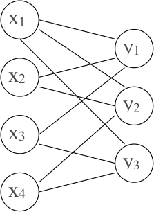
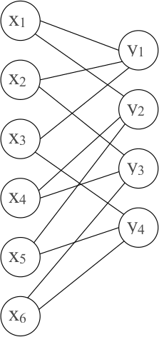

# 8. Kļūdu korekcija: Rīda-Solomona kodi

* Kāpēc jālabo vairāk par vienu kļūdu?
* Ļauj labot lielu daudzumu kļūdu.
* Ziņojums pirms un pēc kodēšanas būs skaitļu virkne.

## Rīda-Solomona metodes ievads

**Metodes apraksts:** Sadala datus grupās pa $k$ skaitļiem. $a_1,a_2,\ldots,a_k$ - viena grupa. Definē polinomu:

$$
f(x) = a_1x^{k-1} + a_2x^{k-2}+\ldots + a_{k-1}x + a_k.
$$

Skaitļu $a_1,\ldots,a_k$ vietā nosūta polinoma vērtības:

$$
f(0),f(1),\ldots,f(s-1)
$$

atbilstoši izraudzītam $s>k$.

**Rīda-Solomona kodu lietojumi:** Patērētāju tehnoloģijas, kur nolasīšanā var rasties kļūdas. Sk. [Reed-Solomon error correction](https://en.wikipedia.org/wiki/Reed%E2%80%93Solomon_error_correction).

* Audio CD, DVD, Blu-ray diski,
* QR codes,
* Datu pārraide ar DSL un WiMAX,
* Satelītu sakari, DVB un ATSC,
* RAID 6.

**Algebras pamatteorēma:** Polinomu $P(x)$ ar pakāpi $n>0$ var vienā vienīgā veidā izteikt sekojošā veidā:

$$
P(x)=c(x-x_1)(x-x_2)\cdots(x-x_n),
$$

kur $x_i$ ir polinoma $P(x)$ (kompleksas) saknes. Izteikšanas veidus, kas atšķiras tikai ar reizinātāju secību uzskatām par vienādiem. Šeit $c \neq 0$ un kompleksie skaitļi $x_1,\ldots,x_n$ ne obligāti ir visi dažādi.

**Sekas #1 no pamatteorēmas:** Ja ir polinoms $h(x)$ ar pakāpi ne lielāku par $k$ un $h(x) \neq 0$ (nav identiski vienāds ar $0$), tad ir ne vairāk kā $k$ tādi $x$, kam $h(x) = 0$. Citiem vārdiem: $h(x)$ ir ne vairāk kā $k$ saknes.

**Pierādījums:** Izriet no algebras pamatteorēmas: ja sakņu $x_i$ būtu vairāk, $h(x)$ varētu izteikt kā visu $(x-x_i)$ reizinājumu. Atverot iekavas izrādītos, ka $h(x)$ pakāpe pārsniedz $k$. Pretruna. $\blacksquare$

**Sekas #2 no pamatteorēmas:** Ja diviem polinomiem $f(x)$ un $g(x)$ pakāpes nepārsniedz $k-1$ un to vērtības sakrīt $k$ dažādos punktos, tad tie ir identiski vienādi.

**Pierādījums:** Atņemam abus polinomus un apzīmējam:

$$
h(x) = f(x)-g(x).
$$

Katrs punkts $x_i$, kur $f(x)=g(x)$ ir sakne polinomam $h(x)$. Arī polinoma $h(x)$ pakāpe nepārsniedz $k-1$. Ja sakņu būtu vairāk par $k$, tad $h(x)$ būtu identiska nulle. $\blacksquare$

*Piemēri:* Caur diviem punktiem var novilkt tikai vienu taisni (1.pakāpes polinomu) $P(x)=a_1x+a_2$. Caur trim punktiem $(a_1,b_1)$, $(a_2,b_2)$, $(a_3,b_3)$, kur $a_1,a_2,a_3$ ir pa pāriem dažādi, var novilkt tikai vienu parabolu vai taisni (otrās vai pirmās pakāpes polinomu, utt.).

### Rīda-Solomona nosūtāmo vērtību skaits

**Apgalvojums:** Ja ir $2$ ziņojumi: $a_1,\ldots,a_k$ un $b_1, \ldots, b_k$, tad

$$
f(x) = a_1x^{k-1} + a_2x^{k-2}+\ldots+a_{k-1}x + a_k,
$$

$$
g(x) = b_1x^{k-1} + b_2x^{k-2}+\ldots+b_{k-1}x + b_k.
$$

* Tā kā katram no šiem polinomiem pakāpe nepārsniedz $k-1$, tad $f(x)$ un $g(x)$ sakrīt ne vairāk kā $k-1$ vietās. (Tās ir otrās sekas no algebras pamatteorēmas.)
* Ja nosūta $s$ polinoma vērtības, tad viņi atšķiras pārējās $s - (k-1)$ vietās.

**Cik no pārraidītajām drīkst būt kļūdas?** Augstāk redzējām, ka ja divi kodētie ziņojumi atšķiras vismaz $2c+1$ vietās, tad kods spēj labot jebkuras $c$ kļūdas.

$$
s-(k-1) \geq 2c+1 \;\;\Rightarrow\;\; s - k \geq 2c \;\;\Rightarrow c \leq (s-k)/2
$$

* Rīda-Solomona kods spēj labot līdz $(s-k)/2$ kļūdām.
* Ja $s=2k$, tad var labot $c \leq (2k-k)/2 = k/2$ kļūdas.
* Ja $\leq 1/4$ no ziņojuma garumā $2k$ saņem nepareizi, tad iespējams atgūt sākotnējo tekstu.

**Piemērs:**

* Cik kļūdas var labot, ja $k=4$, $s=9$, tad $c \leq (s-k)/2 = 2.5$. **Tātad varēs labot 2 kļūdas.**
* Kāpēc nevaram labot $3$ kļūdas. Lai tās labotu, katriem diviem pārraidītajiem ziņojumiem jāatšķiras $2c+1$ vietās ($2\cdot 3 + 1 = 7$ vietās).
* No algebras pamatteorēmas seko, ka $f(x)$ un $g(x)$ sakrīt ne vairāk kā $k-1$ vietās un atšķiras vismaz $s - (k-1)$ vietās.
* Tātad tieši $s-(k-1)=6$ vietās var atšķirties. Tā ir pretruna: Ja mēģinātu labot $3$ kļūdas, tad $2$ kodus, kas atšķiras $6$ vietās, nevarētu atšķirt.

**Piemērs ar polinomiem:** Apskatām šādus divus atšķirīgus polinomus (ar vairākām kopīgām saknēm).

$$
f(x) = x(x-1)(x-2) = x^3 - 3x^2 + 2x + 0.
$$

$$
g(x) = 2x(x-1)(x-2) = 2x^3 - 6x^2 + 4x + 0.
$$

Ja sākotnējās virknes ir $(1;-3;2;0)$ un $(2;-6;4;0)$, tad pārraida ziņojumu argumentu vērtībām $(0,1,2,3,4,5,6,7,8)$:

$$
0,0,0,f(3),f(4),f(5),g(6),g(7),g(8).
$$

Tas var rasties gan pārraidot $f$ (ar kļūdām pēdējās $3$ vietās), gan arī pārraidot $g$ (ar kļūdām ziņojumos $f(3),f(4),f(5)$).

## Galuā lauki

**Galuā lauki un Rīds-Solomons**

* Ja polinomus rēķina parastiem veseliem skaitļiem, tad to vērtības ātri kļūst lielas.
* Rīda-Solomona kodiem veselo skaitļu vietā izmanto polinomu koeficientus un vērtības no galīga lauka, piemēram $\text{GF}(2^{8})$. (Galuā lauks ar $2^{8} = 256$ elementiem).

[Sk. primitīvo polinomu sarakstu](https://www.partow.net/programming/polynomials/index.html), lai konstruētu $\text{GF}(2^n)$ pakāpēm līdz $2^{32}$.

**Definīcija:** Par *lauku* (*field*) sauc kopu $L$, kurā definētas operācijas $+$ un $\ast$ ar šādām īpašībām:

* Visurdefinētība: jebkuriem $a$ un $b$ ir definēts gan $a+b$, gan $a \ast b$.
* Komutativitāte: $a + b = b + a$, $a \ast b = b \ast a$
* Asociativitāte: $(a + b) + c = a + (b + c)$, $(a \ast b) \ast c = a \ast (b \ast c)$.
* Distributivitāte: $a \ast (b + c) = a \ast b + a \ast c$.
* $0$ elements: Eksistē elements $0$ ar īpašību, ka $0 + a = a$ jebkuram $a$.
* $1$ elements: Eksistē elements $1$ ar īpašību, ka $1 \ast a = a$ jebkuram $a$.
* Pretējais elements: Katram $a$ eksistē $-a$, ka $a + (-a) = 0$,
* Multiplikatīvi inversais: Ja $a \neq 0$, tad eksistē $a^{-1}$, kuram $a \ast a^{-1} = 1$.

### Bezgalīgi lauki

Lauks ir jebkura skaitļu vai citu objektu kopa, kurā var izpildīt visas četras aritmētiskās darbības pēc parastajiem likumiem.

* Racionālo skaitļu kopa $\mathbb{Q}$ ir lauks (katrai racionālai daļai $a/b$ eksistē pretējā: $-a/b$ un apgrieztā: $b/a$).
* Reālo skaitļu kopa $\mathbb{R}$ ir lauks
* Komplekso skaitļu kopa $\mathbb{C}$ (vai arī tikai to komplekso skaitļu kopa $a+bi$, kur $a,b \in \mathbb{Q}$) ir lauks.
* Visu to nogriežņu garumu attiecību kopa, ko var uzkonstruēt ar cirkuli un lineālu (pievienojas kvadrātsaknes operācija, bet ne augstāku pakāpju saknes).
* Visu racionālu daļu $\frac{P(x)}{Q(x)}$ kopa ir lauks.

**Apgalvojums:**

1. Galīgs lauks ar elementu skaitu $q$ eksistē tad un tikai tad, ja $q$ ir izsakāms kā pakāpe $p^k$, kur $p$ ir pirmskaitlis, bet $k=1,2,3,\ldots$. Šo skaitu sauc arī par *kārtu* (*order*).
2. Ja ${\displaystyle q=p^{k}}$, tad visi lauki ar kārtu $q$ ir *izomorfi* (*isomorphic*) - to struktūra attiecībā pret saskaitīšanas un reizināšanas operācijām ir vienāda, atšķiras tikai elementu apzīmējumi.

**Definīcija:** Galīgu lauku ar $q = p^k$ elementiem sauc par *Galuā lauku* (*Galois field*); apzīmē $\text{GF}(q)$ jeb $\text{GF}(p^k)$.

### GF pirmskaitļiem

Saskaitīšanas un reizināšanas tabula pie $p = 2$. 

| $a+b$ | 0 | 1 |
| --- | --- | --- |
| 0 | 0 | 1 |
| 1 | 1 | 0 |

| $a \ast b$ | 0 | 1 |
| --- | --- | --- |
| 0 | 0 | 0 |
| 1 | 0 | 1 |

Saskaitīšanas un reizināšanas tabula pie $p = 3$. 

| $a+b$ | 0 | 1 | 2 |
| --- | --- | --- | --- |
| 0 | 0 | 1 | 2 |
| 1 | 1 | 2 | 0 |
| 2 | 2 | 0 | 1 |

| $a \ast b$ | 0 | 1 | 2 |
| --- | --- | --- | --- |
| 0 | 0 | 0 | 0 |
| 1 | 0 | 1 | 2 |
| 2 | 0 | 2 | 1 |

### Ja $q$ nav pirmskaitlis

* Aplūkojam $\text{GF}(8)$. Nevar izmantot saskaitīšanu un reizināšanu pēc $8$ moduļa, jo $2 \cdot 0 = 2 \cdot 4 = 0$ un $2 \cdot 1 = 2 \cdot 5 = 2$.
* Neeksistēs $2^{-1}$, jo skaitlis $2 \neq 0$ reizināšanā $(\text{mod}\,8)$ salipina rezultātus: Var gadīties, ka $a \neq b$, bet $2a = 2b$.
* Atlikumus pēc moduļiem $q$, kas **nav** pirmskaitļi var aplūkot (piemēram, paturot tikai tos, kas ir savstarpēji pirmskaitļi ar $q$), bet tie veido tikai multiplikatīvu grupu, nevis lauku.

*Svarīga piezīme:* Modulārā aritmētika $(\text{mod}\,q)$ veido laukus tad un tikai tad, ja $q$ ir pirmskaitlis. Ja $q = p^k$ $(k > 1)$, $\text{GF}(q)$ jākonstruē ar citu metodi.

* [Multiplikatīvas grupas pēc jebkura moduļa](https://en.wikipedia.org/wiki/Multiplicative_group_of_integers_modulo_n)
* [Galīgi lauki](https://en.wikipedia.org/wiki/Finite_field)

**Piemērs ($\text{GF}(8)$):**

* $p(x) = x^3 + x + 1$ ir *nereducējams* (*irreducible*) polinoms; citiem vārdiem - to nevar sadalīt reizinātājos tā, lai reizinātāju koeficienti būtu veseli skaitļi.
* Veidojam visus iespējamos "atlikumus", dalot ar polinomu $p(x)$, turklāt šo polinomu koeficientus visur saskaitām un reizinām pēc moduļa $2$.
* Tad visi $8$ iespējamie atlikumi veido Galuā lauku $\text{GF}(2^3)$: $0,\;1,\;x,\;x+1,\;x^2,\;x^2+1,\;x^2+x,\;x^2+x+1.$

**Saskaitīšana un reizināšana $\text{GF}(8)$**

| $P(x)+Q(x)$ | $0$ | $1$ | $x$ | $x+1$ | $x^2$ | $x^2+1$ | $x^2+x$ | $x^2+x+1$ |
| --- | --- | --- | --- | --- | --- | --- | --- | --- |
| $0$ | $0$ | $1$ | $x$ | $x+1$ | $x^2$ | $x^2+1$ | $x^2+x$ | $x^2+x+1$ |
| $1$ | $1$ | $0$ | $x+1$ | $x$ | $x^2+1$ | $x^2$ | $x^2+x+1$ | $x^2+x$ |
| $x$ | $x$ | $x+1$ | $0$ | $1$ | $x^2+x$ | $x^2+x+1$ | $x^2$ | $x^2+1$ |
| $x+1$ | $x+1$ | $x$ | $1$ | $0$ | $x^2+x+1$ | $x^2+x$ | $x^2+1$ | $x^2$ |
| $x^2$ | $x^2$ | $x^2+1$ | $x^2+x$ | $x^2+x+1$ | $0$ | $1$ | $x$ | $x+1$ |
| $x^2+1$ | $x^2+1$ | $x^2$ | $x^2+x+1$ | $x^2+x$ | $1$ | $0$ | $x+1$ | $x$ |
| $x^2+x$ | $x^2+x$ | $x^2+x+1$ | $x^2$ | $x^2+1$ | $x$ | $x+1$ | $0$ | $1$ |
| $x^2+x+1$ | $x^2+x+1$ | $x^2+x$ | $x^2+1$ | $x^2$ | $x+1$ | $x$ | $1$ | $0$ |

| $P(x) \ast Q(x)$ | $0$ | $1$ | $x$ | $x+1$ | $x^2$ | $x^2+1$ | $x^2+x$ | $x^2+x+1$ |
| --- | --- | --- | --- | --- | --- | --- | --- | --- |
| $0$ | $0$ | $0$ | $0$ | $0$ | $0$ | $0$ | $0$ | $0$ |
| $1$ | $0$ | $1$ | $x$ | $x+1$ | $x^2$ | $x^2+1$ | $x^2+x$ | $x^2+x+1$ |
| $x$ | $0$ | $x$ | $x^2$ | $x^2+x$ | $x+1$ | $1$ | $x^2+x+1$ | $x^2+1$ |
| $x+1$ | $0$ | $x+1$ | $x^2+x$ | $x^2+1$ | $x^2+x+1$ | $x^2$ | $1$ | $x$ |
| $x^2$ | $0$ | $x^2$ | $x+1$ | $x^2+x+1$ | $x^2+x$ | $x$ | $x^2+1$ | $1$ |
| $x^2+1$ | $0$ | $x^2+1$ | $1$ | $x^2$ | $x$ | $x^2+x+1$ | $x+1$ | $x^2+x$ |
| $x^2+x$ | $0$ | $x^2+x$ | $x^2+x+1$ | $1$ | $x^2+1$ | $x+1$ | $x$ | $x^2$ |
| $x^2+x+1$ | $0$ | $x^2+x+1$ | $x^2+1$ | $x$ | $1$ | $x^2+x$ | $x^2$ | $x+1$ |

## Rīda-Solomona kodu atkodēšana

**Galīgie lauki R-S kodos**

Rīda-Solomona kodā visi skaitļi -- ziņojuma elementi, polinoma argumenti un vērtības -- ir galīga lauka $\text{GF}(q)$ elementi, un visas darbības ($+$ un $\ast$) izpilda šajā laukā. Datus pārveido par lauka elementu virkni un sadala blokos garumā $k$.

**Apzīmējumi** (tie paši visā nodaļā un uzdevumos):

* $a_1, a_2, \ldots, a_k$ -- viens ziņojuma bloks; $f(x) = a_1 x^{k-1} + a_2 x^{k-2} + \ldots + a_{k-1} x + a_k$ -- ziņojuma polinoms (pakāpe nepārsniedz $k-1$).
* Nosūta $s$ vērtības $f(0), f(1), \ldots, f(s-1)$. Argumentiem $0, 1, \ldots, s-1$ jābūt dažādiem lauka elementiem, tāpēc $k < s \leq q$.
* $r_0, r_1, \ldots, r_{s-1}$ -- saņemtās vērtības: $r_i$ ir saņemts vērtības $f(i)$ vietā.
* $c$ -- lielākais kļūdu skaits, ko kods garantēti izlabo: $c \leq (s-k)/2$, t.i., $s \geq k + 2c$.

Atkodēšanas algoritms un izlabojamo kļūdu skaits nemainās, jo pierādījumā par kļūdu korekcijas spējām netiek izmantots nekas, kas neizpildās patvaļīgā laukā. Galīgie lauki tomēr ļauj izvairīties no darbībām ar lieliem skaitļiem.

**Piemēri ar $\text{GF}(5)$:** 8.1.-8.4. uzdevumā (sk. sadaļu "Uzdevumi") izmantojam galīgo lauku

$$
\text{GF}(5) = \lbrace 0, 1, 2, 3, 4 \rbrace,
$$

kur aritmētiskās darbības notiek pēc moduļa $5$. Ziņojuma blokā ir $k = 3$ skaitļi, tātad polinoms ir $f(x) = a_1 x^2 + a_2 x + a_3$, un nosūta $s = 5$ vērtības $f(0), f(1), f(2), f(3), f(4)$. Šis kods var atjaunot līdz $s - k = 2$ pazaudētām vērtībām (8.2. un 8.3. uzdevums) vai izlabot $c = (5-3)/2 = 1$ kļūdu (8.4. uzdevums).

### Lagranža interpolācija

Ja kļūdu nav, bet dažas vērtības ir pazudušas, pietiek ar jebkurām $k$ saņemtajām vērtībām: pēc algebras pamatteorēmas otrajām sekām ir tieši viens polinoms ar pakāpi ne lielāku par $k-1$, kas iet caur $k$ dotajiem punktiem. To var atrast ar vienādojumu sistēmu (kā 8.2. un 8.3. uzdevumā) vai ar interpolāciju (labi strādā pie neliela $k$).

Pieņemsim, ka zināmas pareizās vērtības $k$ dažādos punktos $x_1, \ldots, x_k$ (tie ir kādi no argumentiem $0, \ldots, s-1$):

$$
f(x_1)=w_1;\;\;f(x_2)=w_2;\;\;\ldots,\;\;f(x_k)=w_k.
$$

Definējam *Lagranža bāzes polinomus*:

$$
L_i (x) = \frac{(x-x_1)\cdot\ldots\cdot(x-x_{i-1})\cdot(x-x_{i+1})\cdot\ldots\cdot(x-x_k)}
{(x_i-x_1)\cdot\ldots\cdot(x_i-x_{i-1})\cdot(x_i-x_{i+1})\cdot\ldots\cdot(x_i-x_k)}.
$$

(Galīgā laukā dalīšana nozīmē reizināšanu ar apgriezto elementu; saucējs nav $0$, jo punkti ir dažādi.) Šiem polinomiem ir šādas īpašības:

1. Ja $x=x_i$, tad $L_i(x) = 1$, jo skaitītājs un saucējs sakrīt.
2. Ja $x=x_j$, ($i \neq j$), tad $L_i(x)=0$, jo skaitītājā ir reizinātājs $(x-x_j)=0$.

**Interpolāciju lietošana atkodēšanai**

Meklētais polinoms ir:

$$
f(x) = w_1 \cdot L_1(x) + w_2 \cdot L_2 (x) + \ldots + w_k \cdot L_k (x).
$$

Kāpēc šis polinoms dod pareizu rezultātu? Ja $x = x_i$, tad visi $L_j(x_i)$ ($j \neq i$) ir vienādi ar $0$, un vienīgi $L_i(x_i) = 1$. Tātad $f(x_i) = w_i \cdot L_i(x_i) = w_i$. Katra $L_i$ pakāpe ir $k-1$, tāpēc arī $f$ pakāpe nepārsniedz $k-1$, un tas ir tieši nosūtītais polinoms. Ja vienīgais kļūdu veids ir dažu vērtību pazušana, tad pietiek ar šo pieeju.

**Interpolācija, ja var būt citas kļūdas**

Ja ir kļūdas, kurās vienas vērtības vietā ir saņemta cita, tad ir grūtāk:

* $k$ -- ziņojuma elementu skaits;
* $s$ -- pārraidīto vērtību skaits: $f(0), f(1), \ldots, f(s-1)$;
* $c \leq (s-k)/2$ -- maksimālais pieļaujamais kļūdu skaits;
* vismaz $s-c$ vērtības ir pareizas.

Pareizo vērtību ir pietiekami daudz, taču nezinām, kuras tieši ir pareizas: ja interpolācijai izvēlētos $k$ punktus, starp kuriem ir kaut viena kļūda, iegūtu nepareizu polinomu.

## Berlekampa-Velča atkodēšana

**Polinoms $Y(x)$ -- kļūdu lokators**

Berlekampa-Velča (*Berlekamp–Welch*) algoritms ir Rīda-Solomona atkodēšanas metode, ko lieto tad, ja iespējama ne tikai datu pazušana, bet arī nepareizu datu saņemšana pareizo datu vietā. Izmantojam nodaļas "Rīda-Solomona kodu atkodēšana" apzīmējumus ($f$, $k$, $s$, $r_i$, $c$) un papildus:

* $e_1, e_2, \ldots, e_c$ -- argumenti, kuros saņemtā vērtība ir kļūdaina: $r_{e_j} \neq f(e_j)$ (pagaidām nezināmi). Ja kļūdu ir mazāk par $c$, pārējos $e_j$ var izvēlēties patvaļīgi.
* Visos pārējos argumentos $i$ vērtība ir pareiza: $r_i = f(i)$.

Definējam *kļūdu lokatoru*:

$$
Y(x) = (x-e_1)(x-e_2) \ldots (x-e_c).
$$

Tas ir polinoms ar pakāpi $c$ un vecāko koeficientu $1$, kas ir $0$ visos kļūdainajos argumentos.

**Polinoms $Z(x)$: $Y(x)$ un $f(x)$ reizinājums**

Definējam polinomu $Z(x)$, kas ir kļūdu lokatora un nosūtītā polinoma reizinājums:

$$
Z(x) = Y(x) \cdot f(x).
$$

Pakāpe $\deg Z = \deg Y + \deg f \leq c+(k-1) = k + c - 1$.

Ja protam atrast $Y$ un $Z$, tad nosūtīto polinomu iegūst ar dalīšanu: $f(x) = Z(x) / Y(x)$. Lai tos atrastu, izmantojam to, ka katrā pārraidītajā argumentā $i = 0, 1, \ldots, s-1$ ir spēkā

$$
Z(i) = Y(i) \cdot r_i ,
$$

jo

1. ja $r_i = f(i)$ (pareiza vērtība), tad $Z(i) = Y(i) \cdot f(i) = Y(i) \cdot r_i$;
2. ja $r_i \neq f(i)$ (kļūda), tad $i$ ir viens no $e_j$, tāpēc $Y(i) = 0$ un $Z(i) = 0 = Y(i) \cdot r_i$.

Vienādības $Z(i) = Y(i) \cdot r_i$ saturā nav nezināmā $f$ -- tajās ir tikai saņemtās vērtības $r_i$.

**$Y$, $Z$ atrašana**

Nezināmos polinomus pierakstām ar nezināmiem koeficientiem:

$$
Y(x) = x^c + y_{c-1} x^{c-1} + \ldots + y_1 x + y_0,
$$

$$
Z(x) = z_{k+c-1} x^{k+c-1} + z_{k+c-2} x^{k+c-2} + \ldots + z_1 x + z_0.
$$

Katrs saņemtais $r_i$ dod vienu vienādojumu:

$$
\left\{ \begin{array}{l}
Z(0) = Y(0) \cdot r_0\\
Z(1) = Y(1) \cdot r_1\\
\ldots\\
Z(s-1) = Y(s-1) \cdot r_{s-1}
\end{array} \right.
$$

Ievietojot konkrēto $i$ un $r_i$, katrs no tiem ir lineārs vienādojums ar nezināmajiem $z_0, \ldots, z_{k+c-1}$ un $y_0, \ldots, y_{c-1}$. Tā ir $s$ vienādojumu sistēma ar $(k + c) + c = k + 2c$ nezināmajiem; tā kā $s \geq k + 2c$, vienādojumu pietiek. Atrisinām to, atrodam $Z(x)$ un $Y(x)$ un aprēķinām $f(x) = Z(x)/Y(x)$. Skaitlisks piemērs ir 8.4. uzdevumā.

(Vecākais koeficients $Y$ polinomā ir $1$ tāpēc, lai izslēgtu triviālo atrisinājumu $Y = Z = 0$: bez šī nosacījuma sistēma būtu homogēna.)

**Jautājumi par Berlekampu-Velču:**

1. Vai vienādojumu sistēmai ir atrisinājums?
2. Vai vienādojumu sistēmai nav vairāki atrisinājumi?
3. Vai varam atrast algoritmisku metodi, kā atrisināt vienādojumu sistēmu?

**Atbildes:**

1. Jā: ja kļūdu nav vairāk par $c$, tad īstais kļūdu lokators $Y(x)$ un $Z(x) = Y(x) f(x)$ apmierina visus vienādojumus.
2. Atrisinājumi var būt vairāki (piemēram, ja kļūdu ir mazāk par $c$, kādu $e_j$ var izvēlēties patvaļīgi), bet visiem atrisinājumiem attiecība $Z(x)/Y(x)$ ir viena un tā pati (sk. apgalvojumu tālāk). Tātad jebkurš atrisinājums dod pareizo $f(x)$.
3. Jā; tā ir lineāra vienādojumu sistēma, ko var atrisināt ar Gausa izslēgšanas metodi (sk. tālāk).

### Berlekampa-Velča atrisināmība

**Apgalvojums:** Pieņemsim, ka $s \geq k + 2c$ un polinomu pāri $(Y, Z)$ un $(Y', Z')$ abi apmierina šādus nosacījumus:

1. $\deg Y \leq c$ un $Y \neq 0$,
2. $\deg Z \leq k + c - 1$,
3. visiem $i = 0, 1, \ldots, s-1$: $Z(i) = Y(i) \cdot r_i$.

Tad $Z(x)/Y(x) = Z'(x)/Y'(x)$.

**Pierādījums:** Katram $i$ ir spēkā $Z(i) = Y(i) \cdot r_i$ un $Z'(i) = Y'(i) \cdot r_i$. Tātad

$$
Z(i) \cdot Y'(i) = Y(i) \cdot r_i \cdot Y'(i) = Y(i) \cdot Z'(i)
$$

(nedalām ar $r_i$, jo tas var būt $0$). Polinomu $Z \cdot Y'$ un $Z' \cdot Y$ pakāpes nepārsniedz $(k + c - 1) + c = k + 2c - 1$, un tie sakrīt $s \geq k + 2c$ dažādos punktos $i = 0, 1, \ldots, s-1$.

> *Piezīme (algebras pamatteorēmas otrās sekas):* ja divu polinomu pakāpes nepārsniedz $m$ un to vērtības sakrīt vairāk nekā $m$ dažādos punktos, tad tie ir vienādi.

Tātad $Z(x) \cdot Y'(x) = Z'(x) \cdot Y(x)$ kā polinomi. Izdalot abas puses ar $Y(x) \cdot Y'(x)$ (abi nav nulles polinomi), iegūstam

$$
Z(x) / Y(x) = Z'(x) / Y'(x).
$$

$\blacksquare$

### Algoritmiska Berlekampa-Velča atrisināšana

Vienādojumā $Z(i) = Y(i) \cdot r_i$ ievietojot polinomu koeficientus un pārnesot nezināmos uz kreiso pusi, iegūst

$$
z_0 + z_1 i + z_2 i^2 + \ldots + z_{k+c-1} i^{k+c-1} - r_i \left( y_0 + y_1 i + \ldots + y_{c-1} i^{c-1} \right) = r_i \, i^c .
$$

Koeficienti pie nezināmajiem ir argumenta $i$ pakāpes (un tās, reizinātas ar $-r_i$), bet labajā pusē ir zināms skaitlis. Visi $s$ vienādojumi kopā veido lineāru sistēmu ar $k + 2c$ nezināmajiem, ko atrisina ar Gausa izslēgšanas metodi: pa vienam izslēdzot mainīgos, visas darbības izpildot laukā $\text{GF}(q)$ (dalīšana -- reizināšana ar apgriezto elementu). Tas prasa $O(s^3)$ lauka operāciju. Pēc tam $Z(x)$ izdala ar $Y(x)$:

* ja atlikums ir $0$, dalījums ir nosūtītais polinoms $f(x)$, bet $Y(x)$ saknes norāda kļūdu vietas;
* ja atlikums nav $0$ (vai sistēmai nav atrisinājuma), tad kļūdu bija vairāk par $c$ -- atkodētājs to konstatē, bet izlabot nevar.

Ja kļūdu ir vairāk par $c$, var gadīties arī tā, ka dalījums izdodas, bet rezultāts ir cits (nepareizs) koda vārds: garantija attiecas tikai uz ne vairāk kā $c$ kļūdām.

## LDPC kodi

*LDPC kodi* (*low-density parity-check codes*, kodi ar retu pārbaudes matricu) ir lineāri bināri kodi, kurus uzdod ar *pārbaudes matricu* $H$. Bitu virkne $c$ ir koda vārds tad un tikai tad, ja

$$
H c = 0 \pmod{2},
$$

t.i., katra matricas $H$ rinda ir viena paritātes pārbaude: to bitu XOR, kuriem rindā ir vieninieks, jābūt $0$. Tāds ir arī Heminga kods (sk. Heminga kodu lekcijas nodaļu "Citi lineāri kodi"). LDPC koda īpašība ir tā, ka $H$ ir *reta*: kodā var būt tūkstošiem bitu, bet katrs bits piedalās tikai dažās (parasti $3$--$6$) pārbaudēs, un katrā pārbaudē ir tikai daži desmiti bitu. Tāpēc atkodēšanas darbs aug lineāri ar koda garumu.

**Vēsture.** LDPC kodus izgudroja R. Galagers (*Robert Gallager*) savā doktora disertācijā MIT 1960.gadā (grāmata -- 1963.gadā). Tā laika datoriem to atkodēšana bija pārāk darbietilpīga, un kodi tika gandrīz aizmirsti. 1981.gadā M. Taners (*Michael Tanner*) ieviesa to attēlojumu ar divdaļīgu grafu. Pēc tam, kad 1993.gadā parādījās līdzīgi atkodējamie turbo kodi, LDPC kodus 1995.-1996.gadā no jauna atklāja D. Makejs (*David MacKay*) un R. Nīls (*Radford Neal*). Izrādījās, ka gari LDPC kodi ar iteratīvu mīksto atkodēšanu gandrīz sasniedz Šenona teorētisko robežu -- lielāko datu pārraides ātrumu, kādu kanālā ar noteiktu trokšņa līmeni vispār var droši sasniegt.

**Lietojumi.** Satelīttelevīzija DVB-S2 (2005), 10 gigabitu Ethernet pa vītā pāra kabeli (10GBASE-T), Wi-Fi (IEEE 802.11n/ac/ax), WiMAX, 5G mobilie sakari (datu kanāli), ciparu televīzija ATSC 3.0, kosmosa sakari (CCSDS standarti) un SSD disku kontrolieri (NAND zibatmiņas kļūdu labošana).

### Tanera grafs

LDPC kodu ērti attēlot ar *Tanera grafu* (*Tanner graph*) -- divdaļīgu grafu, kurā vienā pusē ir *bitu mezgli* (matricas $H$ kolonnas), otrā -- *pārbaužu mezgli* (matricas $H$ rindas). Pārbaudi $i$ un bitu $j$ savieno ar šķautni tad un tikai tad, ja $H_{i,j} = 1$. Katras pārbaudes kaimiņu bitu XOR koda vārdā ir $0$.

Piemēram, Heminga kodam $[7,4,1]$, kur kontrolbiti definēti kā

$$
\left\{
\begin{array}{l}
y_1 = x_1 \oplus x_2 \oplus x_3\\
y_2 = x_1 \oplus x_2 \oplus x_4\\
y_3 = x_1 \oplus x_3 \oplus x_4\\
\end{array} \right.
$$

atbilst šāds grafs (katrs kontrolbits $y_i$ šeit reizē ir arī pārbaude "$y_i \oplus$ savienotie $x_j = 0$"):

Tālāk izmantosim nelielu "spēļu" LDPC kodu ar $n = 12$ bitiem un $6$ pārbaudēm; katrs bits piedalās $2$ pārbaudēs, katrā pārbaudē ir $4$ biti. Koda dimensija ir $k = 12 - \operatorname{rank}(H) = 7$, un minimālais attālums $d = 3$ -- tātad, tāpat kā Heminga kods, tas garantēti izlabo tikai vienu kļūdu. (Reāli LDPC kodi ir daudz garāki, bet algoritmi ir tie paši.)

### Cietā un mīkstā informācija

Uztvērējs nesaņem pašus bitus, bet signālu ar troksni. Piemēram, bitu $0$ sūta kā $+1$, bitu $1$ -- kā $-1$, un saņem $r_j = 0.9$ vai $r_j = -0.2$. *Cietais lēmums* (*hard decision*) ir tikai zīme: $r_j < 0 \Rightarrow 1$, citādi $0$. *Mīkstā informācija* (*soft information*) ir pats skaitlis $r_j$: zīme rāda ticamāko bitu, bet $\lvert r_j \rvert$ -- cik tas ir drošs. (Praksē izmanto logaritmisko ticamības attiecību, *log-likelihood ratio*, LLR; kanālā ar Gausa troksni tā ir proporcionāla $r_j$.) Vērtība $-0.2$ nozīmē "drīzāk $1$, bet ļoti nedroši", vērtība $-1.3$ -- "gandrīz noteikti $1$".

### Atkodēšana ar ziņojumu apmaiņu

LDPC atkodētāji strādā iteratīvi: bitu mezgli un pārbaužu mezgli pa Tanera grafa šķautnēm sūta viens otram ziņojumus par to, kādai jābūt katra bita vērtībai. Katrs mezgls redz tikai savus kaimiņus, tāpēc katra iterācija prasa tikai tik daudz darba, cik grafā ir šķautņu.

**Bitu pārslēgšana** (*bit-flipping*, R. Galagers) izmanto tikai cietos lēmumus $y$:

1. Aprēķina sindromu $s = H y \pmod 2$. Ja $s = 0$, tad $y$ ir koda vārds -- beidz.
2. Katram bitam saskaita, cik neapmierinātās pārbaudēs ($s_i = 1$) tas piedalās.
3. Pārslēdz ($0 \leftrightarrow 1$) bitus, kuriem šis skaits ir lielākais, un atgriežas pie 1. soļa.

**Min–sum atkodētājs** izmanto mīksto informāciju $r_j$. Tas ir vienkāršots *belief propagation* (*sum–product*) algoritma variants:

1. Katrs bits $j$ katrai savai pārbaudei nosūta savu pašreizējo vērtību (sākumā -- $r_j$).
2. Katra pārbaude $i$ katram savam bitam $j$ atbild, kādai jābūt šī bita vērtībai, lai pārbaude būtu apmierināta, ja pārējie tās biti ir tādi, kā tie ziņo. Zīme ir pārējo bitu vērtību zīmju reizinājums (XOR), bet drošums -- mazākais no pārējo bitu drošumiem: pārbaude nav drošāka par savu vājāko posmu.
3. Katrs bits saskaita savu saņemto vērtību $r_j$ un visu savu pārbaužu atbildes. Summas zīme ir jaunais lēmums. Ja visi lēmumi kopā apmierina visas pārbaudes, beidz; citādi atkārto no 1. soļa (bits katrai pārbaudei sūta summu bez šīs pašas pārbaudes atbildes).

*Nosūtīts koda vārds $101000001000$; troksnis apgrieza 1. un 3. bita zīmi, bet šīs vērtības ir ļoti nedrošas ($0.1$ un $0.3$). Bitu pārslēgšana iegūst nepareizu koda vārdu, min–sum -- pareizo (sk. 8.6. uzdevumu). Attēlus un algoritmu gaitu izdrukā Python skripts [ldpc_toy.py]({{ '/lectures/lossy_reed_solomon/figs/ldpc_toy.py' | relative_url }}).*

### Garantētā un mīkstā kļūdu labošana

* **Rīda-Solomona kods** ar algebrisko atkodēšanu (piemēram, Berlekampa-Velča algoritmu) ir *ierobežota attāluma atkodētājs* (*bounded-distance decoder*): tas **garantēti** izlabo jebkurus ne vairāk kā $(s-k)/2$ kļūdainus simbolus, neatkarīgi no tā, kuri tie ir. Ja kļūdu ir vairāk, tas neizdodas vai atrod nepareizu koda vārdu. Atkodētājs izmanto tikai cietos simbolus -- katra saņemtā vērtība ir vienlīdz "svarīga".
* **Cietā atkodēšana** (arī bitu pārslēgšana) meklē koda vārdu, kas ir vistuvākais pēc Heminga attāluma. Piemērā saņemtajam $000000001000$ tuvākais koda vārds ir $000000000000$ (attālums $1$), bet nosūtītais $101000001000$ ir attālumā $2$ -- vairāk, nekā kods ($d = 3$) garantēti var izlabot. Tāpēc cietais atkodētājs "izlabo" pareizi saņemto 9. bitu un kļūdās, turklāt pats to nevar pamanīt: rezultāts ir derīgs koda vārds.
* **Mīkstā atkodēšana** mēra attālumu, ņemot vērā drošumu: kļūda nedrošā bitā "maksā" maz, kļūda drošā bitā -- daudz. Piemērā nosūtītais koda vārds saskan ar saņemtajām vērtībām labāk nekā nulles vārds (sk. 8.6. uzdevumu), un min–sum to atrod. Mīkstajai atkodēšanai nav tik vienkāršas garantijas kā "jebkuras $t$ kļūdas", un atsevišķos kļūdu izvietojumos tā var neizdoties. Tās kvalitāti mēra statistiski -- pēc kļūdu varbūtības pie dotā trokšņa līmeņa --, un gariem LDPC kodiem tā ir daudz labāka nekā garantētā labošana: tie izlabo lielāko daļu kļūdu izvietojumu ar daudz vairāk kļūdām, nekā ļauj minimālais attālums.
* Arī Rīda-Solomona atkodētājs var daļēji izmantot mīksto informāciju: vismazāk drošos simbolus var atzīmēt kā *dzēstus* (sk. 8.2. un 8.3. uzdevumu). Dzēsums, kura vieta ir zināma, "maksā" uz pusi mazāk nekā kļūda: ar $s - k$ liekajām vērtībām var atjaunot līdz $s - k$ dzēsumiem, bet tikai līdz $(s-k)/2$ kļūdām.

### Dzēsumu atkodēšana

Dažos kanālos biti netiek sagrozīti, bet pazūd: piemēram, ja datu pakete tiek saņemta, tās dati ir pareizi, bet dažas paketes pazūd. Tad LDPC kodu atkodē ar vienkāršu "noplēšanas" (*peeling*) algoritmu, kas izmanto tikai XOR:

1. Atrod pārbaudi, kurā nezināms ir tieši viens bits.
2. Šis bits ir pārējo pārbaudes bitu XOR (jo visu pārbaudes bitu XOR ir $0$).
3. Ja vēl ir nezināmi biti, atgriežas pie 1. soļa.

Uz šīs idejas 1990. gadu beigās tika izveidoti *Tornado kodi* (M. Lubijs u.c.) -- agrīni LDPC tipa dzēsumu kodi, kas atjauno pazaudētos datus līdzīgā apjomā kā Rīda-Solomona kodi, bet ar daudz ātrāku atkodēšanu. No tiem cēlušies *fontānu kodi* (LT, Raptor), ko izmanto datu izplatīšanai daudziem saņēmējiem vienlaikus (piemēram, mobilajā televīzijā). Piemērs ir 8.5. uzdevumā.

## Kopsavilkums

* Nokodējām un atkodējām Heminga kodus
* Definējām Rīda-Solomona kodus
* Saskaitījām un reizinājām galīgu lauku elementus
* Aplūkojām dažas Rīda-Solomona kodu atkodēšanas metodes, t.sk. Berlekampa-Velča algoritmu.
* Aplūkojām LDPC kodus, Tanera grafus un to cieto (bitu pārslēgšana) un mīksto (min–sum) atkodēšanu.

## Uzdevumi

**8.1. uzdevums:** Nokodēt ziņojumu $3, 2, 1$ ar Rīda-Solomona kodu laukā $\text{GF}(5)$ ($k = 3$, $s = 5$).

**Atbilde:** Ziņojuma polinoms ir $f(x) = a_1 x^2 + a_2 x + a_3 = 3x^2 + 2x + 1$. Izrēķinām vērtības

$$
\begin{array}{rl}
f(0) & = 3\cdot{}0^2 + 2\cdot{}0 + 1 = 1,\\
f(1) & = (3\cdot{}1^2 + 2\cdot{}1 + 1)\;\text{mod}\;5 = 6\;\text{mod}\;5 = 1,\\
f(2) & = (3\cdot{}2^2 + 2\cdot{}2 + 1)\;\text{mod}\;5 = 17\;\text{mod}\;5 = 2,\\
f(3) & = (3\cdot{}3^2 + 2\cdot{}3 + 1)\;\text{mod}\;5 = 34\;\text{mod}\;5 = 4,\\
f(4) & = (3\cdot{}4^2 + 2\cdot{}4 + 1)\;\text{mod}\;5 = 57\;\text{mod}\;5 = 2.
\end{array}
$$

Tātad tiek pārraidītas vērtības $1, 1, 2, 4, 2$. $\square$

**8.2. uzdevums:** Saņemts $r = (1, 1, \ast, 4, \ast)$, kur $\ast$ ir pazaudēta vērtība (saņemtās vērtības visas ir pareizas). Atjaunot ziņojumu $a_1, a_2, a_3$ (lauks $\text{GF}(5)$, $k = 3$, $s = 5$).

**Atbilde:** Zināms $f(0) = 1$, $f(1) = 1$, $f(3) = 4$. Tā kā $3^2 = 9 \equiv 4\;(\text{mod}\,5)$, iegūstam vienādojumu sistēmu (pēc mod 5):

$$
\left\{ \begin{array}{rcl}
a_3 & \equiv & 1,\\
a_1 + a_2 + a_3 & \equiv & 1,\\
4 a_1 + 3 a_2 + a_3 & \equiv & 4.
\end{array} \right.
$$

Ievietojot $a_3 = 1$ otrajā un trešajā vienādojumā:

$$
\left\{ \begin{array}{rcl}
a_1 + a_2 & \equiv & 1 - 1 = 0,\\
4 a_1 + 3 a_2 & \equiv & 4 - 1 = 3.
\end{array} \right.
$$

Pareizinot pirmo vienādojumu ar $3$ un atņemot no otrā, iegūst

$$
(4a_1 + 3a_2) - 3(a_1 + a_2) = a_1 \equiv 3 - 3\cdot{}0 = 3.
$$

No $a_1 + a_2 \equiv 0$ iegūstam $a_2 \equiv -3 \equiv 2$. Tātad $f(x) = 3x^2 + 2x + 1$, un ziņojums ir $3, 2, 1$ -- tas pats, ko nokodējām 8.1. uzdevumā. $\square$

**8.3. uzdevums:** Saņemts $r = (2, 3, \ast, \ast, 2)$, kur $\ast$ ir pazaudēta vērtība (saņemtās vērtības visas ir pareizas). Atjaunot ziņojumu $a_1, a_2, a_3$ (lauks $\text{GF}(5)$, $k = 3$, $s = 5$).

**Atbilde:** Zināms $f(0) = 2$, $f(1) = 3$, $f(4) = 2$. Tā kā $4^2 = 16 \equiv 1\;(\text{mod}\,5)$, iegūstam sistēmu (pēc mod 5):

$$
\left\{ \begin{array}{rcl}
a_3 & \equiv & 2,\\
a_1 + a_2 + a_3 & \equiv & 3,\\
a_1 + 4 a_2 + a_3 & \equiv & 2.
\end{array} \right.
$$

Ievietojot $a_3 = 2$:

$$
\left\{ \begin{array}{rcl}
a_1 + a_2 & \equiv & 1,\\
a_1 + 4 a_2 & \equiv & 0.
\end{array} \right.
$$

Atņemot pirmo vienādojumu no otrā: $3a_2 \equiv 0 - 1 \equiv 4$.

> *Piezīme:* Atrisinājums nebūs daļskaitlis $4/3$, jo tas nav lauka elements! Jāreizina ar $3^{-1}$: tā kā $3 \cdot 2 = 6 \equiv 1$, tad $3^{-1} = 2$, un $a_2 \equiv 4 \cdot 2 = 8 \equiv 3$. (Pārbaude: $3 \cdot 3 = 9 \equiv 4$.)
>
> Ir algoritmi, kā atrast apgriezto elementu, neizmantojot pilno pārlasi (paplašinātais Eiklīda algoritms). Bet priekš $(\text{mod}\,5)$ iespējamo vērtību ir tik maz, ka pārlase ir ātrāka.

No $a_1 + a_2 \equiv 1$ iegūstam $a_1 \equiv 1 - 3 = -2 \equiv 3$. Tātad $f(x) = 3x^2 + 3x + 2$, un ziņojums ir $3, 3, 2$. $\square$

**8.4. uzdevums (Berlekampa-Velča atkodēšana):** 8.1. uzdevumā ziņojumu $3, 2, 1$ nokodējām kā $1, 1, 2, 4, 2$. Pārraidē viena vērtība tika sabojāta, un saņemts

$$
r = (r_0, r_1, r_2, r_3, r_4) = (1, 1, 2, 0, 2).
$$

Atkodētājs nezina, kura vērtība ir kļūdaina. Ar Berlekampa-Velča metodi atrast kļūdas vietu un nosūtīto ziņojumu (lauks $\text{GF}(5)$).

**Atbilde:** Šeit $k = 3$, $s = 5$, tātad var izlabot $c = (5 - 3)/2 = 1$ kļūdu. Meklējam

$$
Y(x) = x + y_0, \qquad Z(x) = z_3 x^3 + z_2 x^2 + z_1 x + z_0
$$

($\deg Z \leq k + c - 1 = 3$). Nezināmo ir $k + 2c = 5$, tikpat, cik vienādojumu. Vienādojumi $Z(i) = (i + y_0) \cdot r_i$ pēc mod 5, izmantojot $2^3 = 8 \equiv 3$, $3^2 \equiv 4$, $3^3 = 27 \equiv 2$, $4^2 \equiv 1$, $4^3 = 64 \equiv 4$:

$$
\begin{array}{lrcl}
i = 0: & z_0 & \equiv & 1 \cdot (0 + y_0) = y_0,\\
i = 1: & z_3 + z_2 + z_1 + z_0 & \equiv & 1 \cdot (1 + y_0),\\
i = 2: & 3 z_3 + 4 z_2 + 2 z_1 + z_0 & \equiv & 2 \cdot (2 + y_0) = 4 + 2 y_0,\\
i = 3: & 2 z_3 + 4 z_2 + 3 z_1 + z_0 & \equiv & 0 \cdot (3 + y_0) = 0,\\
i = 4: & 4 z_3 + z_2 + 4 z_1 + z_0 & \equiv & 2 \cdot (4 + y_0) = 3 + 2 y_0.
\end{array}
$$

Ievietojam $z_0 = y_0$ pārējos vienādojumos:

$$
\left\{ \begin{array}{lrcl}
(1) & z_3 + z_2 + z_1 & \equiv & 1,\\
(2) & 3 z_3 + 4 z_2 + 2 z_1 - y_0 & \equiv & 4,\\
(3) & 2 z_3 + 4 z_2 + 3 z_1 + y_0 & \equiv & 0,\\
(4) & 4 z_3 + z_2 + 4 z_1 - y_0 & \equiv & 3.
\end{array} \right.
$$

No (1) izsakām $z_1 = 1 - z_3 - z_2$ un ievietojam:

$$
\left\{ \begin{array}{lrcl}
(2) & z_3 + 2 z_2 - y_0 & \equiv & 2,\\
(3) & -z_3 + z_2 + y_0 & \equiv & -3 \equiv 2,\\
(4) & -3 z_2 - y_0 & \equiv & -1.
\end{array} \right.
$$

Saskaitot (2) un (3): $3 z_2 \equiv 4$, tātad $z_2 \equiv 4 \cdot 3^{-1} = 4 \cdot 2 = 8 \equiv 3$. No (4): $y_0 \equiv 1 - 3 z_2 = 1 - 9 \equiv 2$. No (3): $z_3 \equiv z_2 + y_0 - 2 = 3$. No (1): $z_1 \equiv 1 - 3 - 3 = -5 \equiv 0$. Un $z_0 = y_0 = 2$.

Tātad $Y(x) = x + 2$ un $Z(x) = 3x^3 + 3x^2 + 2$. $Y(x)$ sakne ir $x = 3$ (jo $3 + 2 = 5 \equiv 0$), tātad kļūdaina ir vērtība $r_3$. Nosūtīto polinomu iegūst, dalot $Z(x)$ ar $Y(x)$ (pēc mod 5):

$$
\begin{array}{rcl}
3x^3 + 3x^2 + 0x + 2 - 3x^2 (x + 2) & = & -3x^2 + 0x + 2 \;\equiv\; 2x^2 + 0x + 2,\\
2x^2 + 0x + 2 - 2x (x + 2) & = & -4x + 2 \;\equiv\; x + 2,\\
x + 2 - 1 \cdot (x + 2) & = & 0.
\end{array}
$$

Dalījums ir $f(x) = 3x^2 + 2x + 1$ bez atlikuma, tātad ziņojums ir $3, 2, 1$, un pareizā vērtība pozīcijā $3$ ir $f(3) = 4$. (Pārbaude: $Z(3) = 3 \cdot 27 + 3 \cdot 9 + 2 = 110 \equiv 0$ -- kļūdas vietā gan $Z$, gan $Y$ ir $0$.) Ja kļūdas vieta būtu zināma iepriekš (dzēsums), pietiktu ar 8.2. uzdevuma metodi; Berlekampa-Velča metode šo vietu atrod pati kā polinoma $Y(x)$ sakni. $\square$

**8.5. uzdevums:** Kods uzdots ar zīmējumā redzamo Tanera grafu: katrs kontrolbits $y_i$ ir ar to savienoto ziņojuma bitu $x_j$ XOR. Pārraidē daži biti pazuda, bet saņemtie ir pareizi (dzēsumu kanāls): $x_1 = 1$, $x_2 = 0$, $x_5 = 1$, $y_1 = 0$, $y_2 = 1$, $y_3 = 1$, $y_4 = 0$. Ar dzēsumu atkodēšanu (sk. "Dzēsumu atkodēšana") noteikt pazaudētos ziņojuma bitus $x_3$, $x_4$, $x_6$.

**Atbilde:** $(x_1,x_2,x_3,x_4,x_5,x_6) = (1,0,\textcolor{red}{x_3},\textcolor{red}{x_4},1,x_6)$, $(y_1,y_2,y_3,y_4) = (0,1,1,0)$.

* Pēc $y_1 = x_1 \oplus x_2 \oplus x_3$ nosakām, ka $0 = 1 \oplus 0 \oplus x_3$, kas nozīmē, ka $x_3 = 1$.
* Pēc $y_2 = x_1 \oplus x_4 \oplus x_5$ nosakām, ka $1 = 1 \oplus x_4 \oplus 1$, kas nozīmē, ka $x_4 = 1$.
* Pēc $y_4 = x_3 \oplus x_5 \oplus x_6$ nosakām, ka $0 = 1 \oplus 1 \oplus x_6$, kas nozīmē, ka $x_6 = 0$.

Pārbaude: $y_3 = x_2 \oplus x_4 \oplus x_6 = 0 \oplus 1 \oplus 0 = 1$. $\square$

**8.6. uzdevums:** Aplūkojam LDPC kodu ar pārbaudes matricu $H$ no nodaļas "Tanera grafs" (pārbaudes $p_1, \ldots, p_6$; pārbaudē $p_1$ ir biti $1, 2, 3, 4$, pārbaudē $p_2$ -- $5, 6, 7, 8$, $p_3$ -- $1, 5, 9, 10$, $p_4$ -- $2, 6, 11, 12$, $p_5$ -- $3, 7, 9, 11$, $p_6$ -- $4, 8, 10, 12$). Nosūtīts koda vārds $c = 101000001000$ (bitu $0$ sūta kā $+1$, bitu $1$ -- kā $-1$), saņemtas vērtības

$$
r = (0.1,\; 0.8,\; 0.3,\; 1.3,\; 0.8,\; 0.9,\; 0.6,\; 1.1,\; -1.3,\; 1.4,\; 0.9,\; 1.2).
$$

* **(a)** Pārbaudiet, ka $c$ ir koda vārds.
* **(b)** Atrodiet cietos lēmumus $y$ un sindromu $H y$. Ko izdarīs bitu pārslēgšanas atkodētājs?
* **(c)** Izpildiet vienu min–sum iterāciju: aprēķiniet katras pārbaudes ziņojumus tās bitiem un katra bita jauno vērtību $L_j = r_j + (\text{tā pārbaužu ziņojumu summa})$. Kādi ir jaunie lēmumi?
* **(d)** Kurš koda vārds -- $c$ vai $000000000000$ -- labāk saskan ar saņemtajām vērtībām? Salīdziniet korelāciju $\sum_j r_j \cdot (1 - 2 c_j)$ (jo lielāka, jo labāk).

**Atbilde:**

**(a)** Vieninieki vārdā $c$ ir bitos $1, 3, 9$. Pārbaudē $p_1$ ir biti $1$ un $3$, pārbaudē $p_3$ -- biti $1$ un $9$, pārbaudē $p_5$ -- biti $3$ un $9$, pārējās pārbaudēs vieninieku nav. Katrā pārbaudē ir pāra skaits vieninieku, tātad $H c = 0$.

**(b)** Negatīva ir tikai $r_9$, tāpēc $y = 000000001000$ (kļūdas 1. un 3. bitā). 9. bits ir pārbaudēs $p_3$ un $p_5$, tāpēc sindroms ir $(0, 0, 1, 0, 1, 0)$. Neapmierināto pārbaužu skaits 9. bitam ir $2$, bitiem $1, 3, 5, 7, 10, 11$ -- $1$, pārējiem $0$. Atkodētājs pārslēdz 9. bitu un iegūst $000000000000$; sindroms ir $0$, tāpēc tas beidz darbu. Rezultāts ir derīgs, bet nepareizs koda vārds (no $c$ tas atšķiras trijos bitos).

**(c)** Pārbaude savam bitam sūta pārējo trīs bitu vērtību zīmju reizinājumu, kas pareizināts ar mazāko no to absolūtajām vērtībām. Piemēram, $p_3$ bitam $1$: pārējie biti $5, 9, 10$ ziņo $0.8$, $-1.3$, $1.4$, tāpēc zīme ir "$-$", bet drošums $\min(0.8, 1.3, 1.4) = 0.8$, t.i., ziņojums ir $-0.8$ ("tev jābūt $1$").

| Pārbaude | Biti | Ziņojumi bitiem |
| --- | --- | --- |
| $p_1$ | $1, 2, 3, 4$ | $0.3,\; 0.1,\; 0.1,\; 0.1$ |
| $p_2$ | $5, 6, 7, 8$ | $0.6,\; 0.6,\; 0.8,\; 0.6$ |
| $p_3$ | $1, 5, 9, 10$ | $-0.8,\; -0.1,\; 0.1,\; -0.1$ |
| $p_4$ | $2, 6, 11, 12$ | $0.9,\; 0.8,\; 0.8,\; 0.8$ |
| $p_5$ | $3, 7, 9, 11$ | $-0.6,\; -0.3,\; 0.3,\; -0.3$ |
| $p_6$ | $4, 8, 10, 12$ | $1.1,\; 1.2,\; 1.1,\; 1.1$ |

Jaunās vērtības: $L_1 = 0.1 + 0.3 - 0.8 = -0.4$, $L_3 = 0.3 + 0.1 - 0.6 = -0.2$, $L_9 = -1.3 + 0.1 + 0.3 = -0.9$; pārējie biti paliek pozitīvi: $L = (-0.4,\; 1.8,\; -0.2,\; 2.5,\; 1.3,\; 2.3,\; 1.1,\; 2.9,\; -0.9,\; 2.4,\; 1.4,\; 3.1)$. Lēmumi ir $101000001000 = c$, visas pārbaudes ir apmierinātas, tātad atkodēšana beidzas pēc vienas iterācijas ar pareizu rezultātu. 1. un 3. bitu izlabo pārbaudes $p_3$ un $p_5$, kurās ir drošais 9. bits; pārbaude $p_1$ tos gandrīz neietekmē, jo tajā abi ir nedroši.

**(d)** Nulles vārdam korelācija ir visu $r_j$ summa $8.1$. Vārdam $c$ bitu $1, 3, 9$ zīmes jāapgriež: $8.1 - 2 \cdot 0.1 - 2 \cdot 0.3 + 2 \cdot 1.3 = 9.9$. Tātad $c$ saskan labāk (tas ir arī labākais no visiem $128$ koda vārdiem -- *maksimālās ticamības* atbilde), lai gan pēc Heminga attāluma nulles vārds ir tuvāk cietajiem lēmumiem $y$. $\square$

## Izmantotā literatūra

* [Tanner graphs](https://en.wikipedia.org/wiki/Tanner_graph).
* [Low-density parity-check code](https://en.wikipedia.org/wiki/Low-density_parity-check_code).
* R. G. Gallager, *Low-density parity-check codes*, IRE Transactions on Information Theory, 8(1), 1962, 21--28.
* D. J. C. MacKay, R. M. Neal, *Near Shannon limit performance of low density parity check codes*, Electronics Letters, 32(18), 1996.
* T. Richardson, R. Urbanke, *Modern Coding Theory*, Cambridge University Press, 2008.
