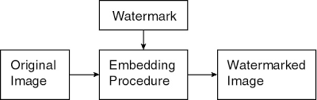

# 6. Video saspiešana

## Ievads

Video satura saspiešanai nepieciešami divi kodeki -- audio un video. Daži kodeki ir pietiekami plaši sastopami kā standarti, ietver mūsdienīgas idejas (labu līdzsvaru starp saspiešanas ātrumu, faila izmēru un kvalitāti), ir atskaņojami Web pārlūkos un dažādās citās vidēs un arī rediģējami ar Open Source programmatūru.

Šajā lekcijā aplūkojam audio kodekus **MP3** un **Opus** un video kodekus **H.264** un **VP9** (kā arī to pēcteci AV1). H.264 un MP3 bija populārākie standarti agrākajās desmitgadēs; jau tajos parādījās visas svarīgākās saspiešanas idejas, un tie izplatījās, pateicoties Napster un BitTorrent failu apmaiņas kustībām. VP9 (un AV1) un Opus ir atvērti, bezmaksas mūsdienu kodeki, ko izmanto pārlūkprogrammas un videozvani.

### Faili, konteineri un kodeki

Runājot par mediju failiem, jāatšķir trīs lietas:

* **Faila paplašinājums** (`.mp4`, `.webm`, `.mp3`, …) ir tikai daļa no faila nosaukuma -- norāde, kāda veida saturs tajā *varētu* būt. Programmas pēc tā izvēlas atskaņotāju, bet paplašinājums var arī maldināt.
* **Konteiners** (*container*) ir faila formāts, kas vienā failā vai straumē apvieno (*multipleksē*) vairākas *plūsmas* (*streams*) -- video, vienu vai vairākus audio celiņus, subtitrus -- un pievieno tām laika zīmogus, lai tās atskaņotu sinhroni, metadatus (nosaukums, valoda) un indeksu, lai varētu ātri pārlēkt uz jebkuru vietu. Konteiners pats datus nesaspiež.
* **Kodeks** (*codec*, *coder–decoder*) ir vienas plūsmas saspiešanas algoritms un formāts: iekodētājs (*encoder*) pārvērš nesaspiestus kadrus vai skaņas paraugus bitu virknē, atkodētājs (*decoder*) -- atpakaļ.

Vienu un to pašu kodeku var ievietot dažādos konteineros, un vienā konteinerā var būt dažādi kodeki. Tāpēc no paplašinājuma vien nevar zināt, vai ierīce failu atskaņos -- jāzina, kādi kodeki ir iekšā. To var noskaidrot, piemēram, ar `ffprobe fails.mp4` (vai programmu MediaInfo).

| Konteiners | Paplašinājums | Tipiski video kodeki | Tipiski audio kodeki | Kur lieto |
| --- | --- | --- | --- | --- |
| MP4 (MPEG-4 Part 14) | `.mp4`, `.m4a` | H.264, H.265, AV1 | AAC, Opus | gandrīz visur: telefoni, straumēšana, sociālie tīkli |
| WebM (Matroska apakškopa) | `.webm` | VP8, VP9, AV1 | Opus, Vorbis | pārlūkprogrammas (HTML5 video), YouTube |
| Matroska (MKV) | `.mkv`, `.mka` | jebkurš | jebkurš | filmas ar vairākiem audio celiņiem, subtitriem, nodaļām |
| Ogg | `.ogg`, `.opus` | (reti) | Opus, Vorbis, FLAC | audio faili |
| IVF | `.ivf` | VP8, VP9, AV1 | -- | vienkāršākais video konteiners: tikai viena video plūsma bez audio; kodeku testiem un pētniecībai (sk. "VP9 kodējums") |

Agrāk bija populāri arī AVI (Microsoft, `.avi`; bieži ar DivX vai Xvid kodeku), MOV (Apple QuickTime, `.mov`), FLV (Flash Video) un 3GP (3G mobilie tālruņi). Daži formāti ir gan kodeks, gan faila formāts: `.mp3` failā ir vienkārši MP3 kadri pēc kārtas (un, iespējams, ID3 metadati), bez īsta konteinera.

**Pārpakošana un pārkodēšana.** Ja maina tikai konteineru (*remux*), plūsmu bitus var nokopēt nemainītus (`ffmpeg -i ievade.webm -c copy izvade.mkv`): tas ir ātri un kvalitāti nemaina. Ja jāmaina kodeks (*transcode*), plūsma jāatkodē un jāiekodē no jauna: tas ir lēni, un zudumradošam kodekam katra atkārtota iekodēšana kvalitāti pasliktina (*generation loss*).

### Redzes un dzirdes modeļi: uz kā rēķina ietaupa

Saspiešana ietaupa bitus divos veidos. Pirmkārt, tā novērš *statistisku liekumu* (*redundancy*): blakus esošie pikseļi un secīgi kadri ir līdzīgi, tāpēc tos var prognozēt un kodēt tikai starpību -- to dara arī bezzudumu metodes. Otrkārt, zudumradoša saspiešana atmet *uztverei nesvarīgo* (*irrelevance*): informāciju, kuras trūkumu cilvēks nepamanīs. Kas tieši ir nesvarīgs, nosaka redzes un dzirdes modeļi.

#### Redze (HVS modelis)

*Human Visual System* (HVS) Model - attēlu un audio apstrādei izveidots vidējots cilvēka redzes modelis.

Redzes uztveri veido nūjiņas un konusiņi; modelis pieņem, ka nūjiņu izšķirtspēja ir divreiz labāka. Tāpēc melnbaltajai attēla komponentei (gaismas intensitātei, neatkarīgi no krāsas) jādod precīzs attēls; krāsas toties drīkst būt ar zemāku izšķirtspēju.

Krāsu televīzijas rītausmā bija teiciens: "Chrominance is at half resolution of luminance".

Video kodeki izmanto šādas redzes īpašības:

* **krāsainība ar zemāku izšķirtspēju** -- 4:2:0 izretināšana (sk. JPEG lekciju) krāsu datus samazina $4$ reizes;
* **augstas telpiskās frekvences** (sīkas detaļas, troksnis) redze uztver vājāk, tāpēc atbilstošos DCT koeficientus kvantizē rupjāk;
* **faktūrās un kustībā** kļūdas pamana mazāk nekā gludos apgabalos (debesis, āda), tāpēc iekodētājs gludos apgabalos var tērēt vairāk bitu (adaptīvā kvantizācija);
* **kadru ātrums**: $24$--$30$ kadri sekundē jau rada nepārtrauktas kustības iespaidu (sk. tālāk).

#### Mirgošanas frekvence

Mirgošana (*flicker*) ir efekts, ko rada kadru pārslēgšana. Filmu ieraksts: 24 kadri sekundē (un leģendas par 25.kadru). Lai mazinātu mirgošanas sajūtu, kadrus atkārto (parasti bez izmaiņām), lai mirgotu 48 vai 72 reizes sekundē.

Televīzijas ierakstos ir 25 vai 30 kadri sekundē; mirgošana mēdz būt divreiz biežāk (50 Hz vai 60 Hz), kas izmanto "interlacing" -- pārzīmē tikai daļu no pikseļu rindām. Katodstaru lampas mirgo ar 50 Hz vai 60 Hz frekvenci (regulāri maina gaismas intensitāti); šādu mirgošanu cilvēks var pamanīt.

#### Dzirde

Audio kodeki izmanto to, ka cilvēks dzird tikai frekvences apmēram no $20$ Hz līdz $20$ kHz, ka skaļa skaņa nomaskē klusākas skaņas ar tuvu frekvenci (*frekvenču maskēšana*) un tūlīt pirms vai pēc tās (*temporālā maskēšana*), un ka abās ausīs parasti skan ļoti līdzīgs signāls (*stereo*). Šīs īpašības sīkāk aplūkotas nodaļā "Audio kodējumi".

## Audio kodējumi

Audio kodeki saspiež skaņu, izmantojot to, ka cilvēka dzirde nav ideāla: tā neuztver pārāk augstas frekvences, klusas skaņas blakus skaļām un īsus trokšņus tūlīt pirms vai pēc skaļas skaņas. Vispirms aplūkojam kopīgos jēdzienus, tad divus kodekus: vēsturiski svarīgo MP3 un mūsdienu Opus.

### Audio saspiešanas pamati

#### Paraugu ņemšana un Naikvista teorēma

Skaņa ir gaisa spiediena svārstības. Mikrofons tās pārvērš elektriskā signālā, un to regulāri nomēra -- ņem *paraugus* (*samples*). *Paraugu ņemšanas frekvenci* (*sample rate*) mēra hercos ($1\ \mathrm{Hz} = 1\ \mathrm{s}^{-1}$) -- cik reizes sekundē nomēra signālu. Kompaktdiska kvalitātes ierakstam izmanto $44.1$ kHz (CD); ir arī standarti ar $48$ kHz (video, Opus), $88.2$ kHz vai $96$ kHz.

**Naikvista-Šenona teorēma:** Ja funkcijai $x(t)$ (pēc Furjē transformācijas pielietošanas) nav frekvenču, kas pārsniegtu $B$ hercus, tad to var pilnībā atjaunot, ja zināmas tās vērtības ik pēc laika intervāliem ${\displaystyle \Delta t = \frac{1}{2B}}$. (*Nyquist-Shannon Sampling theorem*)

Šie divi apgalvojumi ir ekvivalenti

**Nyquist-Shannon 1:** Funkciju $f(t)$, kuras vērtības zināmas pēc vienādiem laika intervāliem $\Delta T$ var viennozīmīgi atjaunot no šīm vērtībām $\lbrace f_n \rbrace$ tad un tikai tad, ja $f(t)$ enerģijas spektrs nesatur frekvences virs $\frac{\pi}{\Delta T}\ \mathrm{rad/s}$.

**Nyquist-Shannon 2:** Ir tikai viena funkcija $f(t)$, kuras frekvenču spektrs viss atrodas zem $\frac{\pi}{\Delta T}$, ko apmierina dotās vērtības $\lbrace f_n \rbrace$.

[Lecture10 in 2.161](https://ocw.mit.edu/courses/mechanical-engineering/2-161-signal-processing-continuous-and-discrete-fall-2008/lecture-notes/lecture_10.pdf).

**Intuīcija.** Paraugu ņemšanas frekvencei jābūt **vairāk nekā divreiz** lielākai par augstāko signāla frekvenci. Ja paraugus ņem retāk, augstu frekvenci nevar atšķirt no zemas: tie paši paraugi atbilst arī citai, zemākai sinusoīdai (*aliasing*). Tāpēc pirms paraugu ņemšanas signālu filtrē, atmetot frekvences virs $f_s / 2$. Cilvēks dzird līdz apmēram $20$ kHz, tāpēc $44.1$ kHz un $48$ kHz ir pietiekami.

*7 Hz sinusoīda un tās paraugi pie trim paraugu ņemšanas frekvencēm. Pie $8$ Hz tie paši punkti atbilst arī 1 Hz sinusoīdai, jo $\sin\left(2\pi \cdot 7 \cdot \frac{n}{8}\right) = -\sin\left(2\pi \cdot \frac{n}{8}\right)$.*

#### Bitu ātrums, CBR un VBR

*Bitu ātrums* (*bitrate*) -- cik bitu sekundē aizņem saspiestā skaņa -- ir svarīgākais saspiešanas parametrs. Nesaspiests kompaktdiska ieraksts ir $44\,100$ paraugi sekundē $\times$ $16$ biti $\times$ $2$ kanāli $= 1411.2$ kbit/s. MP3 parasti izmanto $128$--$320$ kbit/s (apmēram $5$--$10$ reizes mazāk), Opus mūzikai -- $64$--$128$ kbit/s, runai -- $16$--$32$ kbit/s.

* **Konstants bitu ātrums** (*constant bitrate*, CBR): katra sekunde aizņem vienādi daudz bitu. To viegli pārraidīt pa fiksēta ātruma kanālu, bet vienkāršām vietām (klusumam) tiek iztērēts par daudz bitu, sarežģītām -- par maz.
* **Mainīgs bitu ātrums** (*variable bitrate*, VBR): kodētājs tur fiksētu *kvalitāti* (piemēram, LAME parametrs `-V 0` ... `-V 9`), un bitu skaits mainās atkarībā no signāla sarežģītības -- to, cik instrumentu spēlē, vai ir troksnis un pārejas. Pie tāda paša vidējā bitu ātruma kvalitāte ir labāka, bet faila izmērs iepriekš nav precīzi zināms, un vecākiem atskaņotājiem bija grūti noteikt skaņdarba garumu.
* **Ierobežots VBR** (*constrained VBR*) ir kompromiss: bitu ātrums mainās, bet īsos laika intervālos nepārsniedz noteiktu robežu. To izmanto straumēšanā un videozvanos.

#### Dzirdamās frekvences, kritiskās joslas un filtrubankas

* Cilvēka ausis var uztvert no $20$ līdz $20\,000$ hercu skaņas frekvenci. Pusmūža cilvēki - no $16\,000$ herciem (*dog whistle* uz dzirdamības diapazona robežas).
* Pirmās oktāvas "la" (jeb **A4**) izmanto toņdakšu, ko sauc **Stuttgart pitch**, kam ir 440 Hz (nosvārsta gaisu 440 reizes sekundē). Ja frekvence palielinās divkārt, skaņa par oktāvu augstāka.
* "Labi temperēta" skaņu skala saliek $12$ pustoņus ar vienādām blakusesošo pustoņu frekvenču attiecībām.
* Piemēram, "do" (C) un "do diēzs" (Cis) frekvenču attiecība ir $1$ pret $\sqrt[12]{2}$.

Iekšējā ausī (gliemezī) katra vieta reaģē uz savu frekvenču apgabalu, tāpēc dzirde darbojas kā filtru komplekts. Apgabalus, kuros skaņas savstarpēji ietekmē viena otras uztveri, sauc par *kritiskajām joslām*; to ir apmēram $24$. Zemās frekvencēs kritiskās joslas ir šauras (apmēram $100$ Hz), augstās -- platas (vairāki kHz): auss zemās frekvences izšķir daudz smalkāk. Šo skalu sauc par Bark skalu.

**Analizējošās filtrubankas** (*filterbanks*) atdarina šo dzirdes uzbūvi: kodētājs skaņas signālu sadala daudzās frekvenču joslās (parasti ar MDCT -- modificēto diskrēto kosinusu transformāciju, sk. DCT attēlu lekcijā) un katru joslu kvantizē atsevišķi -- tik rupji, cik atļauj dzirde.

*MP3 filtrubankas $32$ vienāda platuma joslas, auss $24$ kritiskās joslas un Opus (CELT) $21$ josla uz vienas frekvenču ass.*

#### Frekvenču maskēšana

Skaļa skaņa padara nedzirdamas klusākas skaņas ar tuvu frekvenci (*frequency masking*). Katrai frekvencei var aprēķināt *maskēšanas slieksni* -- līmeni, zem kura skaņa nav dzirdama. Iekodētājs kvantizē signālu tā, lai kvantizācijas troksnis katrā joslā paliktu zem šī sliekšņa: kur slieksnis ir augsts, bitu var tērēt maz. Maskēšana ir asimetriska: tā daudz tālāk sniedzas uz augstajām frekvencēm nekā uz zemajām.

*Dzirdamības slieksnis klusumā un $1$ kHz, $70$ dB toņa maskēšanas slieksnis (vienkāršots Bark skalas modelis). Tonis A ir skaļāks par B, taču nav dzirdams, jo atrodas tuvu maskējošajam tonim.*

#### Temporālā maskēšana

Maskēšana darbojas arī laikā (*temporal masking*): skaļa skaņa nomaskē klusas skaņas, kas skan apmēram $100$--$200$ ms pēc tās (*pēcmaskēšana*), un -- daudz īsāku laiku, apmēram $5$--$20$ ms -- arī pirms tās (*priekšmaskēšana*). Tas ir svarīgi transformāciju kodekiem: kvantizācijas troksnis izplūst pa visu MDCT logu. Ja logs ir garāks par priekšmaskēšanu un pēc klusuma tajā sākas ass sitiens, troksni var sadzirdēt pirms paša sitiena -- to sauc par *pirmsatbalsi* (*pre-echo*). Tāpēc kodeki pārejās pārslēdzas uz īsiem logiem.

*Priekšmaskēšana un pēcmaskēšana (shematiski) un MP3 garā MDCT loga garums.*

Attēlus ģenerē Python skripti [sampling.py]({{ '/lectures/lossy_video/figs/sampling.py' | relative_url }}), [audio_bands.py]({{ '/lectures/lossy_video/figs/audio_bands.py' | relative_url }}) un [masking.py]({{ '/lectures/lossy_video/figs/masking.py' | relative_url }}).

#### Stereo skaņa

* *Joint Stereo* pārraida kreisās un labās auss skaņu divos kanālos: Vienā kanālā summu, otrā kanālā - starpību.
* Tā kā abām ausīm ir ļoti līdzīga skaņa, tad summa ir vidējota skaņa, bet starpība ir neliela un to var labi saspiest.
* *Intensitātes stereo* augstām frekvencēm pārraida tikai vienu kanālu un katras joslas skaļuma attiecību starp kreiso un labo pusi, jo virzienu augstās frekvencēs auss nosaka galvenokārt pēc skaļuma.
* Cilvēka telpiskā skaņas uztvere (*immersive sound*) ir ļoti niansēta: skaņas virzienu/azimutu var sadzirdēt ar 1 grāda precizitāti; augstumu virs horizonta - ar apmēram 10 grādu precizitāti.
* Joprojām grūti risināms jautājums, kā novietot skaļruņus un mainīt austiņās dzirdamās lietas, ja cilvēks pārvietojas telpā. Bet MP3 šo nerisina.

### MP3

*MP3* (*MPEG-1 Audio Layer III*) ir pirmais audio kodeks, kas masveidā izplatījās datoros un internetā, un tas parādīja, ka psihoakustisks kodeks var saspiest mūziku apmēram $10$ reizes, klausītājam gandrīz nemanot atšķirību.

**Vēsture.** MP3 izstrādāja vācu Fraunhofer IIS institūts (K. Brandenburgs u.c.) sadarbībā ar citām organizācijām, balstoties uz 1980. gadu pētījumiem par dzirdes uztveri. To standartizēja kā MPEG-1 daļu (ISO/IEC 11172-3, 1993), un 1995.gadā tika izvēlēts faila paplašinājums `.mp3`. Publiska MP3 atskaņošanas programmatūra parādījās ap 1994.gadu, 1997.gadā -- populārais atskaņotājs Winamp. Napster parādījās 1999.gadā; agrīns failu apmaiņas serviss, bet failu direktoriju glabāja centralizēti, tāpēc pret to vērsās tiesā un servisu 2001.gadā nācās slēgt. Tomēr mūzikas izplatīšana MP3 formātā turpinājās (BitTorrent, kā arī legāli pārnēsājami atskaņotāji, piemēram, iPod no 2001.gada un tiešsaistes mūzikas veikali) un pilnībā mainīja mūzikas industriju.

**Īpatnības.**

* *Hibrīdā filtrubanka*: signālu vispirms sadala $32$ vienāda platuma joslās (polifāzes filtrubanka), tad katru joslu ar MDCT vēl sadala $18$ frekvenču līnijās -- kopā $576$ līnijas. Pārejās izmanto īsos logus ($6$ līnijas), lai mazinātu pirmsatbalsi.
* *Psihoakustiskais modelis*: iekodētājs katrai joslai aprēķina maskēšanas slieksni un signāla un maskas attiecību un pēc tās sadala bitus. Standarts nosaka tikai atkodēšanu, tāpēc kvalitāte ļoti atkarīga no iekodētāja (vislabākā ilgstoši bija brīvā programma LAME).
* *Kvantizācija un Hafmana kods*: MDCT koeficientus kvantizē nevienmērīgi (ar pakāpi $\frac{3}{4}$) un kodē ar vienu no $32$ fiksētām Hafmana tabulām (sk. lekciju par [Hafmana kodu]({{ '/lectures/lossless_entropy_and_huffman/' | relative_url }})).
* *Bitu rezervuārs*: CBR režīmā kadrs var izmantot iepriekšējo kadru neiztērētos bitus -- tas ir neliels VBR elements CBR plūsmā.
* *Kadri* pa $1152$ paraugiem, bitu ātrumi $32$--$320$ kbit/s; *joint stereo* (M/S un intensitātes stereo).
* Ierobežojumi: pie zemiem bitu ātrumiem jānogriež augstās frekvences (pie $64$ kbit/s -- virs apmēram $11$ kHz), pirmsatbalss, kodētāja aizture (starp dziesmām bez pauzes rodas klusums, ja to speciāli nekompensē).

**Licencēšana.** MP3 bija aizsargāts ar daudziem patentiem; Fraunhofer IIS un Thomson (vēlāk Technicolor) pārdeva licences un ievāca maksu no programmatūras un ierīču ražotājiem, īpaši par iekodētājiem. Tāpēc atvērtā pirmkoda projekti nevarēja brīvi izplatīt MP3 iekodētājus: LAME tika izplatīts tikai kā pirmkods ("LAME Ain't an MP3 Encoder"), un daudzas Linux distribūcijas MP3 atbalstu neiekļāva līdz pat 2017.gadam. Neskaidrā patentu situācija bija viens no iemesliem, kāpēc Xiph.Org izstrādāja bezmaksas kodekus Vorbis un vēlāk Opus. Pēdējie patenti beidzās ap 2017.gadu, un Technicolor licencēšanas programmu izbeidza; kopš tā laika MP3 var brīvi lietot.

Mūsdienās MP3 ir "mantots" (*legacy*) formāts: jaunākie kodeki (AAC, Opus) pie tāda paša bitu ātruma dod labāku kvalitāti, bet MP3 joprojām atbalsta gandrīz jebkura ierīce.

### Opus

*Opus* ir atvērts un bezmaksas audio kodeks, ko 2012.gadā standartizēja IETF ([RFC 6716](https://www.rfc-editor.org/rfc/rfc6716)). Tas apvieno divus kodekus: Skype runas kodeku SILK un Xiph.Org mūzikas kodeku CELT. Opus ir obligāts WebRTC (videozvani pārlūkprogrammās) un plaši izmantots: Discord, WhatsApp, YouTube (WebM audio), spēļu balss čati.

Failu nosaukumos var parādīties, bet to bieži aizstāj konteinera faila paplašinājums.

* `audiofile.opus` (noteikti iekodēts ar Opus),
* `audiofile.ogg` (Ogg konteiners, ja tas nelieto citu kodeku, piemēram, Vorbis; reāli izmantoto kodeku var redzēt Ogg metadatos),
* `audiofile.webm` (WebM konteiners straumēšanai vai Web lietojumiem)
* `audiofile.mka` (Matreska vai MKV konteiners; paplašinājums `*.mka` nozīmē tikai audio)

Opus māk pārslēgties starp režīmiem, kas optimizē dažādas lietas -- vai nu augsta skaņas kvalitāte vai arī spēja pielāgoties dažādas caurlaidības transporta kanāliem un zema aizture (*latency*).

**SILK Mode:** SILK mode ir piemērotāka runas saspiešanai. SILK izmanto lineāru paredzošo kodējumu (*Linear Predictive Coding*, LPC) nevis MDCT: runas signālu modelē kā balss saišu ierosmi, kas iet caur balss trakta filtru, un pārraida filtra parametrus un ierosmi. Frekvenču josla līdz $8$ kHz.

**CELT Mode:** Parasti izmanto mūzikas saspiešanai. Tas nozīmē CELT (Constrained Energy Lapped Transform). Tas izmanto Izmainīto Diskrēto Kosinusu pārveidojumu (*Modified Discrete Cosine Transform*, MDCT) ar ļoti īsiem kadriem ($2.5$--$20$ ms), tāpēc aizture ir maza.

**Hibrīdais režīms:** zemās frekvences (līdz $8$ kHz) kodē SILK, augstās -- CELT. Iekodētājs režīmu un bitu ātrumu var mainīt katrā kadrā.

**CELT uzbūve un psihoakustika.** CELT MDCT koeficientus sagrupē $21$ joslā, kas tuvina auss kritiskās joslas (sk. attēlu augstāk). Katrai joslai atsevišķi un precīzi kodē tās *enerģiju* (skaļumu) -- no tā cēlies vārds "constrained energy": pat pie ļoti zema bitu ātruma spektra aploce (katras joslas skaļums) paliek pareiza. Joslas *formu* (normētu koeficientu vektoru) kodē ar piramīdas vektoru kvantizatoru (*PVQ*). Ja joslai atliek ļoti maz bitu, to aizpilda ar "salocītu" zemāku frekvenču spektru, nevis atstāj tukšu -- tāpēc Opus pat pie zema bitu ātruma saglabā augstās frekvences. Pārejās kadru sadala vairākos īsos MDCT, lai mazinātu pirmsatbalsi. Opus psihoakustika lielākoties ir iebūvēta pašā formātā (joslas, enerģijas saglabāšana), nevis atsevišķā maskēšanas modelī kā MP3.

**Entropijas kodēšana:** visus simbolus kodē ar *intervālu kodu* (*range coder*) -- aritmētiskā koda variantu (sk. lekciju par [aritmētisko kodu]({{ '/lectures/lossless_arithmetic_and_ans/' | relative_url }})).

**Bitu ātruma režīmi:** VBR (noklusējums), ierobežots VBR un stingrs CBR (`opusenc --vbr/--cvbr/--hard-cbr`, `ffmpeg -vbr on/constrained/off`); bitu ātrumi $6$--$510$ kbit/s. Tīkla lietojumiem ir iebūvēta pazaudētu pakešu slēpšana, papildu kļūdu labošana (FEC) un klusuma nepārraidīšana (DTX).

#### MP3 un Opus salīdzinājums

Salīdzinājumam izmantojam $8$ sekunžu sintētisku mūzikas paraugu ($48$ kHz, stereo), ko izveido Python skripts [audio_examples.py]({{ '/lectures/lossy_video/figs/audio_examples.py' | relative_url }}): $0$--$3$ s -- akordi (toņu signāls ar harmonikām); $3$--$5.5$ s -- tie paši akordi, "hi-hat" troksnis un asi klikšķi; $5.5$--$7$ s -- kluss $1$ kHz tonis ar vienu izolētu klikšķi; $7$--$8$ s -- klusums. Skripts to nokodē ar `ffmpeg` (`libmp3lame` un `libopus`) un analizē atkodētos failus.

| Fails | Kodeks | Režīms | Izmērs | Vidējais bitu ātrums | Atskaņot |
| --- | --- | --- | --- | --- | --- |
| [sample_ref.flac]({{ '/lectures/lossy_video/audio-examples/sample_ref.flac' | relative_url }}) | FLAC | bezzudumu atsauce | 494 KB | -- | <audio controls preload="none" src="{{ '/lectures/lossy_video/audio-examples/sample_ref.flac' | relative_url }}"></audio> |
| [sample_mp3_cbr128.mp3]({{ '/lectures/lossy_video/audio-examples/sample_mp3_cbr128.mp3' | relative_url }}) | MP3 | 128 kbit/s CBR | 129 KB | 129 kbit/s | <audio controls preload="none" src="{{ '/lectures/lossy_video/audio-examples/sample_mp3_cbr128.mp3' | relative_url }}"></audio> |
| [sample_mp3_vbr_v5.mp3]({{ '/lectures/lossy_video/audio-examples/sample_mp3_vbr_v5.mp3' | relative_url }}) | MP3 | VBR (`-q:a 5`) | 97 KB | 97 kbit/s | <audio controls preload="none" src="{{ '/lectures/lossy_video/audio-examples/sample_mp3_vbr_v5.mp3' | relative_url }}"></audio> |
| [sample_mp3_cbr64.mp3]({{ '/lectures/lossy_video/audio-examples/sample_mp3_cbr64.mp3' | relative_url }}) | MP3 | 64 kbit/s CBR | 65 KB | 64 kbit/s | <audio controls preload="none" src="{{ '/lectures/lossy_video/audio-examples/sample_mp3_cbr64.mp3' | relative_url }}"></audio> |
| [sample_opus_vbr64.opus]({{ '/lectures/lossy_video/audio-examples/sample_opus_vbr64.opus' | relative_url }}) | Opus | 64 kbit/s VBR | 90 KB | 89 kbit/s | <audio controls preload="none" src="{{ '/lectures/lossy_video/audio-examples/sample_opus_vbr64.opus' | relative_url }}"></audio> |
| [sample_opus_cbr64.opus]({{ '/lectures/lossy_video/audio-examples/sample_opus_cbr64.opus' | relative_url }}) | Opus | 64 kbit/s CBR | 65 KB | 64 kbit/s | <audio controls preload="none" src="{{ '/lectures/lossy_video/audio-examples/sample_opus_cbr64.opus' | relative_url }}"></audio> |
| [sample_opus_vbr32.opus]({{ '/lectures/lossy_video/audio-examples/sample_opus_vbr32.opus' | relative_url }}) | Opus | 32 kbit/s VBR | 50 KB | 49 kbit/s | <audio controls preload="none" src="{{ '/lectures/lossy_video/audio-examples/sample_opus_vbr32.opus' | relative_url }}"></audio> |

**Bitu ātrums laika gaitā.** CBR failos bitu ātrums ir vienāds visā ierakstā -- arī klusumā. VBR bitus pārdala: MP3 VBR trokšņainajā daļā izmanto līdz $200$ kbit/s, bet klusā toņa daļā apmēram $30$ kbit/s; Opus VBR klusumā gandrīz nekā nepārraida. VBR "mērķa" bitu ātrums ir tipiskas mūzikas vidējais -- šim sarežģītajam paraugam (daudz harmoniku, troksnis, pārejas) Opus VBR iztērēja vairāk bitu, nekā norādīts.

**Frekvenču josla.** Pie mazāka bitu ātruma MP3 nogriež augstās frekvences: $64$ kbit/s failā nav nekā virs apmēram $11$ kHz. Opus joslu aizpildīšanas dēļ pat pie $32$ kbit/s saglabā frekvences līdz $20$ kHz (to precīzās vērtības gan nav saglabātas -- saglabāta ir katras joslas enerģija).

**Pirmsatbalss.** Ap izolēto klikšķi ($6.25$ s) attēlā parādīta kodēšanas kļūda (atkodētais signāls mīnus oriģināls). Visiem kodekiem kļūda sākas jau pirms klikšķa, jo kvantizācijas troksnis izplūst pa transformācijas logu; zemākā bitu ātrumā tā ir lielāka. Šeit pirmsatbalss ilgst ne vairāk kā apmēram $10$ ms -- priekšmaskēšanas robežās --, tāpēc parasti nav dzirdama; ar garākiem logiem un bez īsajiem logiem tā būtu daudz pamanāmāka.

## H.264 kodējums

*H.264* jeb *MPEG-4 Part 10 / AVC* (*Advanced Video Coding*) ir video kodeks, ko 2003.gadā kopīgi standartizēja ITU-T un ISO/IEC MPEG darba grupas. Tas ir visplašāk izmantotais video kodeks: Blu-ray diski, ciparu televīzija, straumēšana, videozvani, kameras un telefoni; gandrīz visās ierīcēs ir tā aparatūras atkodētājs. H.264 patentus licencē patentu pūls, tāpēc Google izstrādāja bezmaksas alternatīvas VP8 un VP9 (sk. nākamo nodaļu). H.264 pēcteči ir H.265/HEVC (2013) un H.266/VVC (2020).

Salīdzinot ar agrākajiem MPEG-1 un MPEG-2 standartiem, pamatideja (I, P un B freimi, kustības kompensācija, atlikuma transformācija) ir tā pati, bet H.264 ievieš daudz precīzākus rīkus: $16 \times 16$ makrobloku kustības kompensācijai var sadalīt līdz $4 \times 4$ blokiem; kustības vektoru precizitāte ir $\frac{1}{4}$ pikseļa; bloku var prognozēt no vairākiem atsauces kadriem; I-freimos bloku prognozē no jau atkodētajiem kaimiņiem (intra prognoze); DCT vietā izmanto $4 \times 4$ (un $8 \times 8$) veselu skaitļu transformāciju; bloku robežas nogludina cilpas filtrs (*deblocking filter*); entropijas kodēšanai izmanto CAVLC (mainīga garuma kodi) vai CABAC (kontekstatkarīgs binārs aritmētiskais kods).

### Video saspiešanas pamatideja

Video visvienkāršākajā izpratnē ir daudzu rastra attēlu secība. Pat iekodējot ar JPEG (katru attēlu atsevišķi) radīsies milzīgi lieli faili. Secīgi attēli stipri korelē (ja vien tieši attiecīgajā vietā netika samontēti divi gabali vai krasi mainīts kameras stāvoklis).

**MPEG freimu tipi:** MPEG piemērots gan statiski saspiestiem, gan straumētiem datiem; katru attēlu iekodē vienā no šiem 3 veidiem:

* I-frame (*intra-frame*) - bilde, kuru kodē kā pilnu attēlu.
* P-frame (*predictive coded frame*) balstās uz iepriekšējo I-freimu vai P-freimu
* B-frame (*bidirectionally predictive coded frame*) izmanto gan iepriekšējo, gan nākamo freimu, kas var būt gan I-, gan P-freims.

**I-freimu kodēšana:** Līdzīgi kā JPEG (8x8 bloki), arī MPEG kodē vienādus blokus: 16x16 pikseļi. I-freimiem algoritms līdzīgs kā JPEG. I-freimi ir "pieturas punkti", uz kuriem būvē citus. [YCbCr krāsu plakne](https://en.wikipedia.org/wiki/YCbCr) - nav tas pats kas YIQ.

### P-freimi un kustības vektori

**P-freimu kodēšana:** **Kustības vektors:** P-freima 16x16 pikseļu blokam meklē līdzīgāko iepriekšējā I-freimā vai P-freimā. Dažreiz tas var būt nobīdīts - ja video attēlota kustība vai kameras slīdēšana - *panning*.

*Piemērs ar īstiem pikseļiem (Python skripts [p_frame_encoding.py]({{ '/lectures/lossy_video/figs/p_frame_encoding.py' | relative_url }})). Pašreizējā kadrā figūriņa ir nobīdījusies par $(+6, +3)$ pikseļiem un kļuvusi nedaudz gaišāka. Iekodētājs atzīmētajam $16 \times 16$ makroblokam atsauces kadrā atrod līdzīgāko apgabalu (zaļais rāmis) -- nobīde līdz tam ir kustības vektors $\mathrm{MV} = (-6, -3)$. Nosūta MV un atlikumu (pašreizējais bloks mīnus prognoze), kurā ir tikai vērtības $0$ un $4$; bez kustības kompensācijas atlikums būtu daudz lielāks (absolūto starpību summa $10\,658$ pret $720$).*

### B-freimi: sūtīšanas un atskaņošanas secība

**B-freimus atliek nosūtītajos datos:** B-freimu prognozē gan no iepriekšējā, gan no nākamā enkurfreima (I vai P), tāpēc nākamais enkurfreims jānosūta un jāatkodē **pirms** B-freimiem, kas atskaņošanas secībā atrodas pirms tā. Atkodētājs B-freimus parāda uzreiz, bet atkodēto enkurfreimu glabā, līdz pienāk tā kārta.

*GOP paraugs `IBBPBBPBBI`: augšā -- secība, kādā freimus nosūta (un atkodē), apakšā -- atskaņošanas secība. Sūtīšanas secību no parauga aprēķina Python skripts [h264_frame_order.py]({{ '/lectures/lossy_video/figs/h264_frame_order.py' | relative_url }}) (piemēram, `python h264_frame_order.py IBBBPBBBP`).*

H.264 šo ideju vispārina: B-freimi var būt arī atsauces citiem B-freimiem (hierarhiskie B-freimi), un bloku var prognozēt no vairākiem iepriekšējiem kadriem, tāpēc sūtīšanas secība var būt sarežģītāka par attēlā parādīto.

Ja filmas scēna strauji mainās, ir izdevīgi biežāk lietot I-freimus, ja tā ir relatīvi statiska, tad - sajauktus P-freimus un B-freimus. Kodeki parasti ir optimizēti kaut kādam "caurmēra" ritmam.

### Saspiešanas datu piemēri

Ja video ir $356 \times 260$ pikseļi, tad freimu izmēri un saspiešanas attiecības ir sekojošas:

| Freims | Izmērs | Saspiešana |
| --- | --- | --- |
| I-Freims | 18 KiB | 7:1 |
| P-Freims | 6 KiB | 20:1 |
| B-Freims | 2.5 KiB | 50:1 |
| Vidēji | 4.8 KiB | 27:1 |

Šādu attēlu pārraidīšanai vajadzīgais tīkla savienojums:

$$
30\,\text{kadri/s}\cdot 4.8\,\text{KiB/kadrs}\cdot 1024 \cdot 8 \approx 1.18\,\text{Mbit/s}.
$$

Kopā ar audio tas var būt 1.45 megabiti sekundē, kas aizņem T1 Interneta savienojumu (viens vītais pāris; 1.544 Mbps).

### H.264 un MPEG lietojumi

* Satelīttelevīzijas pārraides, kas digitālu signālu no satelīta pārtaisa krāsainā TV signālā (kas var joprojām būt analogs).
* Kabeļtelevīzija.
* On-demand televīzija ar desmitiem tūkstošu lejupielādējamu vai straumējamu filmu.

## VP9 kodējums

*VP9* ir Google izstrādāts atvērts un bezmaksas (bez licences maksām) video kodeks. Tā pamatideja ir tāda pati kā MPEG saimes kodekiem: katru kadru sadala blokos, katru bloku *prognozē* -- no tā paša kadra jau atkodētajiem kaimiņiem (*intra*) vai no iepriekšējiem kadriem ar kustības vektoru (*inter*) --, un kodē tikai prognozes kļūdu jeb *atlikumu*: to transformē (DCT vai ADST), kvantizē un saspiež ar aritmētisko kodu.

**Vēsture.** VP9 ir On2 Technologies kodeku (VP3, VP6, VP8) turpinājums; Google 2010.gadā nopirka On2 un atvēra VP8 kā daļu no WebM projekta. VP9 bitu plūsmu nofiksēja 2013.gadā. Salīdzinot ar VP8 (un H.264), tas pie tādas pašas kvalitātes dod apmēram par trešdaļu līdz pusei mazākus failus; to lieto YouTube, WebRTC videozvani un pārlūkprogrammas. VP9 idejas (un daļa neizlaistā VP10) kļuva par pamatu kodekam AV1 (Alliance for Open Media, 2018), kura intra kadri ir AVIF attēlu pamatā. Atsauces realizācija ir bibliotēka *libvpx* ar programmām `vpxenc` (iekodētājs) un `vpxdec` (atkodētājs).

### Konteineri: IVF, WebM, MP4

Pats VP9 kodeks definē tikai *freimu* (viena kodēta kadra) bitu virkni; kadru laiku, izmērus un audio glabā konteiners.

* **IVF** ir vienkāršākais konteiners, ko lieto libvpx testos un pētniecības rīkos. Faila sākumā ir $32$ baitu galvene: paraksts `DKIF`, kodeka kods (`VP90`), platums, augstums, laika bāze (piemēram, $25$ kadri sekundē) un freimu skaits. Pēc tās katram ierakstam ir $12$ baitu galvene (datu garums $4$ baitos un laika zīmogs $8$ baitos) un pati VP9 freima bitu virkne. Tā kā nekā cita nav, IVF ir ērts, lai freimus pa vienam izgrieztu, aizstātu vai analizētu.
* **WebM** ir Matroska (MKV) apakškopa, ko izmanto pārlūkprogrammas; tajā parasti ir VP9 video un Opus audio. **MP4** konteinerā VP9 plūsmas kods ir `vp09`.
* **YouTube** lielāko daļu video piedāvā arī VP9 formātā (WebM, DASH straumēšana, katra izšķirtspēja kā atsevišķa video plūsma bez audio). Lejupielādētu WebM (ievērojot autortiesības un pakalpojuma noteikumus) var pārlikt IVF konteinerā bez pārkodēšanas: `ffmpeg -i video.webm -c:v copy -an video.ivf` (`-c:v copy` saglabā VP9 bitus nemainītus, `-an` atmet audio).

Viens IVF ieraksts var saturēt arī vairākus VP9 freimus -- to sauc par *superfreimu* (*superframe*): freimus saliek pēc kārtas un beigās pievieno indeksu ar katra freima garumu. Tā kopā glabā slēpto freimu un nākamo rādāmo freimu (sk. nākamo apakšnodaļu), lai katram konteinera ierakstam atbilstu tieši viens parādāms kadrs.

### Video klipa struktūra: freimu veidi un GOP

VP9 freimam ir viena no šīm lomām:

* **Atslēgas freims** (*keyframe*, `frame_type = KEY_FRAME`) -- visi bloki ir *intra*; atkodētājs no tā var sākt darbu, un tas atiestata visas atsauces. Ar to sākas katrs klips (un katrs punkts, uz kuru var "pārtīt").
* **Inter freims** -- blokus var prognozēt no līdz pat trim *atsauces freimiem* (*reference frames*): `LAST` (parasti iepriekšējais kadrs), `GOLDEN` (senāks augstas kvalitātes kadrs) un `ALTREF`. Atsauces glabā $8$ atmiņas vietās (*reference slots*); freima galvenes lauks `refresh_frame_flags` norāda, kurās vietās pēc atkodēšanas ierakstīt šo freimu.
* **Intra-only freims** -- tikai intra bloki (kā atslēgas freimā), bet atsauces netiek atiestatītas.
* **Slēptais ALTREF freims** (`show_frame = 0`) -- inter freims, ko atkodē un saglabā kā atsauci, bet **neparāda**. Kodētājs to izveido no *nākotnes* kadra (parasti temporāli filtrētu, t.i., vidējotu no vairākiem blakus kadriem un tāpēc ar mazāku troksni) un no tā prognozē vairākus nākamos kadrus.
* **`show_existing_frame`** -- dažus baitus garš freims bez kodētiem datiem, kas vienkārši parāda kādu jau atkodētu atsauces freimu (piemēram, iepriekš slēpto ALTREF).

*GOP* (*group of pictures*) ir kadru grupa no viena "enkura" (atslēgas freima vai ALTREF) līdz nākamajam. Tā kā ALTREF ir nākotnes kadrs, kas jāatkodē **pirms** kadriem, kuri no tā prognozē, *dekodēšanas secība* (kādā freimi ir failā) nesakrīt ar *rādīšanas secību*. Tas ir līdzīgi MPEG B-freimiem (sk. H.264 nodaļas apakšnodaļu "B-freimi: sūtīšanas un atskaņošanas secība"), tikai VP9 nekodē atsevišķus B-freimus, bet izmanto slēptos freimus.

*Faila `bouncing_ball_ARF.ivf` (sk. galeriju) pirmie $16$ kodētie freimi: $33$ IVF ierakstos ir $36$ kodēti freimi, no kuriem $3$ ir slēpti ALTREF, katrs superfreimā kopā ar nākamo rādāmo freimu.*

Iekodētāja iestatījumi nosaka GOP struktūru: *low-delay* režīmā (`--lag-in-frames=0`) kodētājs neredz nākotnes kadrus, tāpēc dekodēšanas secība sakrīt ar rādīšanas secību un slēptu freimu nav (vajadzīgs videozvaniem); ar `--auto-alt-ref=1` un nākotnes kadru "skatīšanos uz priekšu" (`--lag-in-frames=25`) rodas ALTREF freimi un labāka saspiešana (video pēc pieprasījuma).

### Freima uzbūve: galvenes, flīzes, superbloki, bloki

Katrs freims sastāv no trim daļām:

1. **Nesaspiestā galvene** (*uncompressed header*) -- parastiem bitiem: freima tips, `show_frame`, `show_existing_frame`, izmēri, atsauču izvēle, `refresh_frame_flags`, cilpas filtra un kvantizācijas parametri (`base_q_idx`), segmentācija, flīžu izkārtojums. To var nolasīt, neko neatkodējot aritmētiski.
2. **Saspiestā galvene** (*compressed header*) -- aritmētiski kodēta: transformāciju izmēru režīms un varbūtību tabulu labojumi šim freimam.
3. **Flīžu dati** (*tiles*) -- paši bloki. Freimu var sadalīt vairākās flīžu kolonnās (katra vismaz $256$ pikseļus plata), ko var atkodēt paralēli; katrā flīzē aritmētiskais kods sāk no jauna.

Flīzi sadala *superblokos* $64 \times 64$ pikseļi, un katru superbloku rekursīvi sadala (*partition*): bloku var atstāt veselu (`PARTITION_NONE`), sadalīt divos horizontālos vai vertikālos taisnstūros (`HORZ`, `VERT`) vai četros kvadrātos (`SPLIT`), līdz $8 \times 8$, un $8 \times 8$ blokam ir arī $4 \times 4$ apakšbloki. Katram *blokam* (*block*) glabā:

* prognozes veidu (intra vai inter) un *režīmu* (*mode*): intra režīmam -- prognozes virzienu, inter režīmam -- atsauces freimu un kustības vektoru;
* transformācijas izmēru (`tx_size`) un karodziņu `skip` (ja `skip = 1`, bloka atlikums ir $0$ un koeficientus nekodē);
* segmenta numuru (`segment_id`, sk. "Cilpas filtrs un segmentācija").

Pēc tam seko atlikuma *transformācijas bloku* (`tx_size` lielumā) kvantizētie koeficienti.

### YUV pikseļi un prognoze

VP9 kodē *YUV* (precīzāk -- YCbCr) pikseļu datus: gaišuma plakni $Y$ un divas krāsainības plaknes $U$ un $V$ (sk. JPEG un AVIF lekcijas nodaļu par krāsu telpām un 4:2:0 izretināšanu). Pamata profils (*profile 0*) ir $8$ biti un 4:2:0, t.i., $256 \times 256$ kadrā ir $65\,536$ gaišuma un $2 \cdot 16\,384$ krāsainības vērtības. Profils 1 atļauj 4:2:2 un 4:4:4, profili 2 un 3 -- $10$ vai $12$ bitu vērtības (HDR). Iekodētājs parasti saņem jau YUV kadrus (piemēram, `.y4m` failā: teksta galvene un katram kadram secīgi $Y$, $U$, $V$ plaknes baitos), un atkodētājs izvada tieši tādas pašas plaknes. Divas atkodētas plūsmas uzskata par vienādām, ja visas YUV plaknes sakrīt baitu līmenī (to ērti pārbaudīt, salīdzinot katra kadra SHA-256).

**Intra prognoze** aizpilda bloku no jau atkodētajiem pikseļiem virs tā un pa kreisi no tā: VP9 ir $10$ režīmi -- DC (vidējā vērtība), vertikālais, horizontālais, sešas diagonāles un TM ("TrueMotion", gradienta turpinājums).

**Inter prognoze** ņem bloku no atsauces freima, nobīdītu par *kustības vektoru* (*motion vector*, MV). Kustības vektoru precizitāte ir $\frac{1}{8}$ pikseļa (vai $\frac{1}{4}$). Ja vektors nav vesels, starpvērtības aprēķina ar $8$ punktu *interpolācijas filtru* -- parasto (`EIGHTTAP`), gludo (`EIGHTTAP_SMOOTH`) vai aso (`EIGHTTAP_SHARP`); ja freimā filtrs ir `SWITCHABLE`, to var izvēlēties katram blokam. Veselam (*full-pel*) vektoram visi trīs filtri dod vienu un to pašu rezultātu. Bloku var prognozēt arī kā divu atsauču vidējo (*compound prediction*).

Kustības vektoru pašu arī prognozē no kaimiņu blokiem: atkodētājs no kaimiņiem sastāda divus kandidātus, un bloka inter režīms izvēlas `NEARESTMV` (pirmais kandidāts), `NEARMV` (otrais), `ZEROMV` (nulles vektors) vai `NEWMV` (kodē starpību no kandidāta). Tāpēc vienādu kustību bieži var pierakstīt ar vairākiem dažādiem simboliem.

### Transformācija un kvantizācija: DCT un ADST

Atlikumu transformē blokos $4 \times 4$, $8 \times 8$, $16 \times 16$ vai $32 \times 32$. Izmanto DCT vai *ADST* (*asymmetric discrete sine transform*); ADST ir piemērotāka intra blokiem, kuru atlikums aug, attālinoties no prognozes malas. VP9 transformācijas tipu (`tx_type`: DCT vai ADST katrā virzienā) nekodē atsevišķi: gaišuma plaknes intra blokiem līdz $16 \times 16$ tas izriet no prognozes virziena, visiem pārējiem (inter blokiem, krāsainības plaknēm, $32 \times 32$) vienmēr ir DCT. Visas transformācijas ir definētas veselos skaitļos (ar noapaļošanu), lai iekodētājs un jebkurš atkodētājs iegūtu bitu līmenī vienādu rezultātu.

Koeficientus kvantizē, dalot ar kvantizācijas soli un noapaļojot (sk. JPEG 5. soli). Soli nosaka *kvantizācijas indekss* `qindex` ($0 \ldots 255$; jo lielāks, jo rupjāk) caur standarta tabulām, atsevišķi DC un AC koeficientiem; `vpxenc` parametrs `--cq-level` izvēlas mērķa kvalitāti. Kvantizētos koeficientus nolasa noteiktā *skenēšanas secībā* (līdzīgi JPEG zig-zag) un kodē kā *žetonus* (*tokens*): `ZERO_TOKEN`, `ONE_TOKEN`, …, lielām vērtībām -- kategorijas ar papildu bitiem. *EOB* (*end of block*) žetons norāda, ka pārējie koeficienti ir nulles; lauks `eob` ir pozīcija skenēšanas secībā, kurā koeficientu kodēšana beidzas.

### Aritmētiskā kodēšana un varbūtību tabulas

Visu freima saturu pēc nesaspiestās galvenes kodē ar *Būla aritmētisko kodētāju* (*boolean arithmetic coder*) -- bināru aritmētisko kodu (sk. lekciju par [aritmētisko kodu]({{ '/lectures/lossless_arithmetic_and_ans/' | relative_url }})). Katram bitam ir varbūtība, ka tas ir $0$, pierakstīta kā skaitlis $1 \ldots 255$ (t.i., $p/256$); ļoti paredzams bits aizņem daudz mazāk par $1$ bitu. Simbolus ar vairākām vērtībām (režīmus, žetonus, sadalījumus) kodē kā binārā koka ceļu, katram koka mezglam ar savu varbūtību.

Varbūtības atkarīgas no *konteksta*: piemēram, `skip` varbūtība atkarīga no tā, vai kaimiņu blokiem ir `skip`, bet koeficienta žetona varbūtība -- no transformācijas izmēra, plaknes, pozīcijas un kaimiņu koeficientiem. Visu varbūtību kopums ir *freima konteksts* (*frame context*, tabula `fc`). Atkodētājs glabā $4$ šādus kontekstus; freims izvēlas vienu (`frame_context_idx`), saspiestajā galvenē var to labot (*forward update*), un pēc freima atkodēšanas konteksts var pielāgoties faktiskajam simbolu skaitam (*backward adaptation*), ja to atļauj galvenes lauki `refresh_frame_context`, `error_resilient_mode` un `frame_parallel_decoding_mode`.

### Kodētāja un atkodētāja stāvoklis

VP9 ir stāvokli saglabājošs kodeks: freimu var atkodēt tikai tad, ja ir atkodēti visi iepriekšējie freimi, no kuriem tas atkarīgs. Atkodēšanas laikā tiek uzturētas šādas datu struktūras (iekodētājs uztur tieši tās pašas, lai prognozētu tāpat kā atkodētājs):

* $8$ **atsauces kadru bufferi** (atkodētas YUV plaknes) un to piesaiste `LAST`, `GOLDEN`, `ALTREF`;
* $4$ **freimu konteksti** (varbūtību tabulas) un simbolu skaitītāji to pielāgošanai;
* **blokos izmantoto režīmu un kustības vektoru režģis** -- kaimiņu (virs un pa kreisi) konteksti un iepriekšējā freima kustības vektori, no kuriem prognozē jaunos vektorus;
* **segmentācijas karte** un cilpas filtra iestatījumi, kurus var pārņemt no iepriekšējā freima.

Tāpēc freima baitu nomaiņa ietekmē arī visus nākamos freimus, kuri no tā atkarīgi -- pārbaudot, vai divas plūsmas dod vienādus kadrus, jāatkodē visa plūsma no sākuma (vai no atslēgas freima).

### Cilpas filtrs un segmentācija

Pēc bloku atjaunošanas freimam piemēro **cilpas filtru** (*loop filter*): tas nogludina bloku robežas, ja tur ir tikai nelielas atšķirības (bloku artefakti), bet saglabā īstas malas. Filtra stiprumu nosaka freima līmenis (`filter_level` $0 \ldots 63$) un asums, kā arī bloku režīmi, atsauces un `skip`. Filtrēto kadru izmanto gan rādīšanai, gan kā atsauci nākamajiem freimiem ("cilpā"). Tāpēc atkodēto kadru salīdzina **pēc** cilpas filtra: simbola maiņa, kas nemaina atlikumu, joprojām var mainīt pikseļus caur filtra lēmumu.

**Segmentācija** ļauj blokus sadalīt līdz $8$ segmentos (`segment_id`); katram segmentam var iestatīt savu kvantizācijas indeksu, cilpas filtra līmeni, fiksētu atsauces freimu vai obligātu `skip`. Kodētājs to izmanto, piemēram, adaptīvai kvantizācijai (`--aq-mode`): sarežģītiem apgabaliem viens `qindex`, gludiem -- cits.

### Bezzudumu VP9: Volša-Adamāra transformācija

Ja `base_q_idx = 0` un visas kvantizācijas korekcijas ir $0$, freims ir **bezzudumu** (`vpxenc --lossless=1`): atkodētie pikseļi precīzi sakrīt ar ievades YUV. Tad DCT/ADST vietā izmanto tikai $4 \times 4$ *Volša-Adamāra transformāciju* (*Walsh–Hadamard transform*, WHT), un cilpas filtru nepiemēro.

WHT bāzes vektori sastāv tikai no $\pm 1$, piemēram, $4 \times 4$ gadījumā

$$
H_4 = \left( \begin{array}{rrrr}
1 & 1 & 1 & 1 \\
1 & 1 & -1 & -1 \\
1 & -1 & -1 & 1 \\
1 & -1 & 1 & -1
\end{array} \right),
$$

tāpēc to aprēķina tikai ar saskaitīšanu, atņemšanu un bīdēm. VP9 to realizē ar veselu skaitļu soļiem, kurus var precīzi apgriezt (*lifting*): no koeficientiem atjauno tieši to pašu atlikumu, bez noapaļošanas kļūdām. DCT šādas īpašības nav -- tās veselo skaitļu versija ir tikai tuvinājums, tāpēc pat ar vissīkāko kvantizāciju dažas vienības var mainīties. Bezzudumu režīmā informācija netiek zaudēta, un saspiešana notiek tikai prognozes un aritmētiskā koda dēļ, tāpēc faili ir daudz lielāki (ja vien saturs nav ļoti vienkāršs).

### Kodētāja lēmumi: Rate-Distortion Optimization

Standarts nosaka tikai atkodēšanu; iekodētājs pats izlemj, kā sadalīt superblokus, kādus režīmus, kustības vektorus, transformāciju izmērus un koeficientus izvēlēties. *Rate-distortion optimization* (RDO) šos lēmumus pieņem, minimizējot

$$
J = D + \lambda \cdot R,
$$

kur $D$ ir kropļojums (piemēram, kvadrātisko kļūdu summa starp oriģinālo un atjaunoto bloku), $R$ -- bitu skaits, kas vajadzīgs šim variantam (aprēķināts no pašreizējām aritmētiskā koda varbūtībām), bet $\lambda$ -- "bitu cena", kas aug līdz ar `qindex`. Iekodētājs katram blokam izmēģina daudzus variantus un izvēlas mazāko $J$; pat kvantizētos koeficientus var mainīt par $\pm 1$, ja tas ietaupa vairāk bitu nekā pieaug kļūda (*trellis* kvantizācija). Pilna pārlase ir ļoti lēna, tāpēc `vpxenc` ātruma iestatījumi (`--good`/`--best`/`--rt`, `--cpu-used`) nosaka, cik daudz variantu atmest ar heiristikām. Divu gājienu režīmā (`--passes=2`) pirmais gājiens savāc statistiku par visu video, un otrajā to izmanto bitu sadalīšanai starp kadriem un ALTREF izvietošanai.

Tā kā RDO izvēlas lētāko pierakstu, tipiskā plūsmā katram blokam ir "dabiskā" simbolu izvēle. Taču bieži vienu un to pašu atkodēto rezultātu var iegūt arī ar citiem simboliem: piemēram, `skip = 0` blokam ar nulles atlikumu, vēlāku `eob`, cita interpolācijas filtra izvēle veselam kustības vektoram vai `NEWMV` vietā `NEARESTMV`, ja tie dod to pašu vektoru. Šādas "pikseļus nemainošas" simbolu izmaiņas var izmantot steganogrāfijai un ūdenszīmēm (sk. "Kodeku lietojumi"), bet pārrakstīšana uz RDO dabisko izvēli -- to noņemšanai.

### Piemēru galerija

Šie IVF faili ($256 \times 256$ pikseļi, ja nav norādīts citādi, $33$ kadri, $25$ kadri sekundē, profils 0) ir sintētiski testa video, kas kodēti ar `vpxenc`. *LD* (*low delay*) failos dekodēšanas secība sakrīt ar rādīšanas secību; *ARF* failos ir slēpti ALTREF freimi superfreimos. Nesaspiestā veidā viens šāds klips ($33$ kadri 4:2:0) aizņem $3.2$ MB. Failus var atskaņot, piemēram, ar `ffplay` vai VLC, vai pārvērst YUV ar `vpxdec --i420 -o kadri.yuv fails.ivf`.

1. [white_static_LD.ivf]({{ '/lectures/lossy_video/vp9-examples/white_static_LD.ivf' | relative_url }}) (1 KB) -- nemainīgs balts kadrs. Pēc atslēgas freima visi bloki ir `skip` ar `ZEROMV`, tāpēc katrs nākamais freims aizņem tikai dažus baitus.
2. [bouncing_ball_LD.ivf]({{ '/lectures/lossy_video/vp9-examples/bouncing_ball_LD.ivf' | relative_url }}) (2 KB) -- vienkrāsaina bumba pa $2$ pikseļiem kadrā pārvietojas pa vienkrāsainu fonu. Bumbas iekšpuse tiek prognozēta ar veselu kustības vektoru, fons -- ar `skip`.
3. [bouncing_ball_ARF.ivf]({{ '/lectures/lossy_video/vp9-examples/bouncing_ball_ARF.ivf' | relative_url }}) (2 KB) -- tas pats saturs divu gājienu režīmā ar ALTREF: $36$ kodēti freimi, no tiem $3$ slēpti, superfreimos (sk. shēmu "Video klipa struktūra").
4. [integer_pan_LD.ivf]({{ '/lectures/lossy_video/vp9-examples/integer_pan_LD.ivf' | relative_url }}) (6 KB) -- sīka trīskrāsu rūtiņu tekstūra pārvietojas par veselu pikseļu skaitu. Viss kadrs ir labi prognozējams ar vienu kustības vektoru, tāpēc atlikuma gandrīz nav, lai gan attēls ir detalizēts.
5. [screen_content_LD.ivf]({{ '/lectures/lossy_video/vp9-examples/screen_content_LD.ivf' | relative_url }}) (7 KB) -- ekrāna saturs: vienkrāsaini paneļi un ritinošs "teksts". Lieli nemainīgi apgabali un asas malas.
6. [saturation_field_LD.ivf]({{ '/lectures/lossy_video/vp9-examples/saturation_field_LD.ivf' | relative_url }}) (8 KB) -- melns un balts lauks ($Y = 0$ un $Y = 255$) ar kustīgu robežu. Atjaunotās vērtības tiek apgrieztas līdz intervālam $[0; 255]$.
7. [lowq_gradient_LD.ivf]({{ '/lectures/lossy_video/vp9-examples/lowq_gradient_LD.ivf' | relative_url }}) (33 KB) -- lēni mainīgs gluds krāsu gradients ar zemu `qindex` (augsta kvalitāte): daudz mazu AC koeficientu un kustības vektori ar daļpikseļu precizitāti.
8. [midband_noise_LD.ivf]({{ '/lectures/lossy_video/vp9-examples/midband_noise_LD.ivf' | relative_url }}) (1 MB) -- katrā kadrā jauns nejaušs troksnis. Nekas nav prognozējams, tāpēc fails ir tikai apmēram $3$ reizes mazāks par nesaspiesto video.
9. [lossless_wht_LD.ivf]({{ '/lectures/lossy_video/vp9-examples/lossless_wht_LD.ivf' | relative_url }}) (2 KB) -- bumbas saturs bezzudumu režīmā (`qindex` $0$, Volša-Adamāra transformācija, bez cilpas filtra); atkodētais YUV precīzi sakrīt ar ievadi.
10. [clone_segment_LD.ivf]({{ '/lectures/lossy_video/vp9-examples/clone_segment_LD.ivf' | relative_url }}) (2 KB) -- bumbas saturs, kodēts ar segmentāciju (`--aq-mode=1`): freimu galvenēs ir segmentu karte un vairāki segmenti.
11. [yuv444_gradient_LD.ivf]({{ '/lectures/lossy_video/vp9-examples/yuv444_gradient_LD.ivf' | relative_url }}) (68 KB) -- krāsains gradients profilā 1 ar pilnas izšķirtspējas krāsainību (4:4:4); $U$ un $V$ plaknēs ir tikpat daudz vērtību kā $Y$ plaknē.
12. [hbd_gradient10_LD.ivf]({{ '/lectures/lossy_video/vp9-examples/hbd_gradient10_LD.ivf' | relative_url }}) (23 KB) -- gradients profilā 2 ar $10$ bitu vērtībām ($0 \ldots 1023$).
13. [tiled_multicolumn_LD.ivf]({{ '/lectures/lossy_video/vp9-examples/tiled_multicolumn_LD.ivf' | relative_url }}) (24 KB) -- $512 \times 256$ kadri, sadalīti divās flīžu kolonnās, kuras var atkodēt paralēli.
14. [natural_clip_foreman_ARF.ivf]({{ '/lectures/lossy_video/vp9-examples/natural_clip_foreman_ARF.ivf' | relative_url }}) (74 KB) -- reāls video (klasiskā testa secība *foreman*, izgriezums $256 \times 256$) ar kameras kustību, jauktiem intra un inter blokiem, dažādiem transformāciju izmēriem un slēptiem ALTREF freimiem.

## Kodeku lietojumi

### Steganogrāfija un ūdenszīmes

Abas tehnoloģijas mediju failā ievieto papildu informāciju, kuru skatītājs vai klausītājs nepamana, bet tām ir pretēji mērķi:

* **Steganogrāfija** (*steganography*) slēpj pašu ziņojuma **esamību**: novērotājam nav jāuzzina, ka parastajā attēlā, dziesmā vai video ir slepens ziņojums. Svarīgākais ir nepamanāmība un ietilpība; noturība pret faila izmaiņām nav obligāta -- sūtītājs un saņēmējs parasti var vienoties par nemainītu faila pārsūtīšanu.
* **Ūdenszīme** (*watermark*) nav slepena -- var būt pat zināms, ka tā ir --, bet tai jābūt piesaistītai saturam: tā jāspēj nolasīt arī pēc tam, kad failu pārkodē, samazina, apgriež vai kāds mēģina ūdenszīmi izdzēst. To izmanto autortiesību norādīšanai, lai noskaidrotu, kurš eksemplārs nopludināts, vai lai pārbaudītu, ka saturs nav mainīts.

*Ūdenszīmes ievietošana: no oriģinālā attēla (Original Image) un ūdenszīmes (Watermark) ievietošanas procedūra izveido attēlu ar ūdenszīmi.*

**Kur slēpt datus.** Datus var ievietot mediju faila saturā (pikseļos, skaņas paraugos), saspiestās plūsmas simbolos vai metadatos (galvenēs). Ekstrēms piemērs ir informācijas slēpšana tīkla protokolos: [Michal Drzymala, et al. Network Steganography in the DNS Protocol](http://www.czasopisma.pan.pl/Content/101654/PDF/47.pdf?handler=pdf).

* *Telpiskās* metodes maina pikseļus vai paraugus tieši, piemēram, mazāk nozīmīgos bitus (*LSB*). Tās ir vienkāršas un ar lielu ietilpību, bet pirmā zudumradošā saspiešana tās izdzēš.
* *Spektrālās* metodes maina koeficientus pēc transformācijas (DCT, DFT vai vilnīšu (*wavelet*) transformācijas). Augstāko frekvenču koeficientus kvantizācija nodzēš pirmos, tāpēc tur ievieto tikai trauslas zīmes; noturīgas ūdenszīmes parasti ievieto *vidējās* frekvencēs -- tās ir pietiekami svarīgas, lai saspiešana tās saglabātu, bet ne tik pamanāmas kā zemās frekvences.
* *Saspiestās plūsmas* metodes maina kodēšanas lēmumus, nevis pikseļus: piemēram, JPEG kvantizētos DCT koeficientus vai video kodeka simbolus -- kustības vektorus, prognozes režīmus, `skip` karodziņu. Nodaļā "VP9 kodējums" (sk. "Kodētāja lēmumi: Rate-Distortion Optimization") aprakstīts, ka vienu un to pašu atkodēto kadru bieži var iegūt ar dažādiem simboliem; šādas izvēles var nest slēptus bitus, nemainot nevienu pikseli.

**Ūdenszīmju veidi.**

* *Redzamas* (*visible*) ūdenszīmes -- logotips video stūrī, vai visām PDF faila lappusēm uzkrāsots kāds attēls, vai zīmogs visu bibliotēkai piederošo grāmatu 17.lpp.; *neredzamas* (*invisible*) -- tās atzīmē faila izcelsmi vai saņēmēju, reizēm arī nodrošina šīs informācijas *nenoliedzamību* (*nonrepudiation*).
* *Trauslas* (*fragile*) ūdenszīmes sabojājas jau pie nelielām izmaiņām -- tās palīdz atklāt, ka fails ticis mainīts; *noturīgas* (*robust*) saglabājas arī pēc pārkodēšanas, mērogošanas, apgriešanas un apzinātiem mēģinājumiem tās izdzēst. Bieži vajag abas: lai noskaidrotu faila patieso izcelsmi un vēl arī -- vai tas nav ticis mainīts pa ceļam līdz saņēmējam.
* *Individuālās* (*forensic*) ūdenszīmes katram lietotājam izveido atšķirīgu kopiju. Straumēšanas servisi to dara efektīvi, iepriekš sagatavojot katram video segmentam divus variantus ar dažādu zīmi (*A/B watermarking*): lietotāja saņemtā variantu virkne kodē viņa identifikatoru. Ja filma nonāk pirātu vietnē (arī nofilmēta no ekrāna), pēc ūdenszīmes var noskaidrot, no kura konta tā nopludināta.

Ūdenszīmēm svarīga arī *ietilpība* (*capacity*) -- cik bitu var ievietot -- un zemas skaitļošanas izmaksas: individuālās ūdenszīmes jāievieto katrai kopijai atsevišķi, un noteikšanai jādarbojas arī uz lieliem video apjomiem.

**Uzbrukumi un aizsardzība.**

* *Steganalīze* (*steganalysis*) mēģina noteikt, vai failā ir slēpts ziņojums, parasti bez oriģināla: tā meklē statistiskas novirzes (piemēram, mazāk nozīmīgo bitu vai DCT koeficientu histogrammās, kas slēpšanas dēļ kļūst neraksturīgas) vai izmanto mašīnmācīšanos, kas apmācīta uz tīriem un modificētiem failiem.
* *Aktīvais uzraugs* (*active warden*) visus caurejošos failus nedaudz pārveido -- pārkodē, samazina vai pārraksta saspiestās plūsmas simbolus "kanoniskā" formā (kādu izvēlētos parasts iekodētājs). Tas iznīcina steganogrāfiju (un trauslas ūdenszīmes), nepasliktinot saturu skatītājam.
* Lai uzbruktu noturīgām ūdenszīmēm, attēlus (piemēram JPEG vai citu zudumradošu formātu attēlus) var saspiest vai pārveidot -- permutēt pikseļus, apgriezt, mērogot, ģeometriski deformēt, vai apvienot vairākas atšķirīgas kopijas (*collusion*), vidējojot tās.

### Digitālo tiesību pārvaldība (DRM)

*Digitālo tiesību pārvaldība* (*Digital Rights Management*, DRM) ļauj maksas satura (filmu, seriālu, sporta pārraižu) izplatītājiem noteikt, kurš, cik ilgi un kādā ierīcē saturu drīkst atskaņot. Pamatideja: saspiesto video un audio plūsmu **šifrē**, un atšifrēšanas atslēgu izsniedz tikai licencētai ierīcei. Šifrēšana notiek pēc saspiešanas (šifrētus datus vairs nevar saspiest), un atšifrē tieši pirms atkodēšanas.

**Kopējā šifrēšana (CENC).** Standarts ISO/IEC 23001-7 *Common Encryption* (CENC) nosaka, kā šifrēt MP4 (ISO bāzes mediju faila formāta) failus ar AES-128. Šifrē tikai video un audio kadru datus, bet konteinera struktūru un kodeka galvenes atstāj atklātas, lai atskaņotājs failu varētu parsēt un pārlēkt uz jebkuru vietu. Ir divas shēmas: `cenc` (AES-CTR režīms) un `cbcs` (AES-CBC, šifrējot tikai daļu bloku, piemēram, $1$ no katriem $10$). Galvenais ir tas, ka **viens un tas pats šifrētais fails** der vairākām DRM sistēmām: failā ir atslēgas identifikators (KID), un katrai DRM sistēmai -- sava `pssh` kaste ar informāciju, kā iegūt licenci. Parasti saturu sagatavo fragmentētos MP4 failos (CMAF, ISO/IEC 23000-19) un straumē ar MPEG-DASH (ISO/IEC 23009-1) vai Apple HLS (RFC 8216).

**DRM sistēmas.**

* **Google Widevine** -- Chrome, Firefox, Android, Chromecast, daudzi viedie televizori. Drošības līmenis L1 nozīmē, ka atšifrēšana un atkodēšana notiek aizsargātā aparatūras vidē (*trusted execution environment*), L3 -- tikai programmatūrā; augstākās izšķirtspējas saturu parasti izsniedz tikai L1 ierīcēm.
* **Apple FairPlay Streaming** -- Safari, iOS, macOS, Apple TV; izmanto HLS un `cbcs` shēmu.
* **Microsoft PlayReady** -- Edge, Windows, Xbox, daudzi televizori un televīzijas priedēkļi.

Pārlūkprogrammā šīs sistēmas pieslēdz ar W3C standartu *Encrypted Media Extensions* (EME, 2017): tīmekļa lapas JavaScript kods saņem no faila šifrēšanas informāciju, pieprasa licenci no licenču servera un nodod to pārlūkprogrammas *satura atšifrēšanas modulim* (*Content Decryption Module*, CDM). CDM ir slēgta programmatūra, kuras atslēgas un atšifrētie kadri nav pieejami lapai; atvērts atsauces variants testēšanai ir *ClearKey*.

**Ierobežojumi.** DRM nevar novērst "analogo caurumu" (*analog hole*): ekrānu var nofilmēt. Tāpēc DRM papildina ar izejas aizsardzību (HDCP šifrēšana HDMI kabelī) un individuālajām ūdenszīmēm, kas ļauj atrast noplūdes avotu. DRM ir arī kritizēts, jo ierobežo likumīgu satura lietošanu (piemēram, rezerves kopijas) un balstās uz slēgtu programmatūru.

## Uzdevumi

**6.1. uzdevums (Naikvista teorēma):** Mūzikas ierakstā ir frekvences līdz $20$ kHz.

* **(a)** Kāda ir mazākā paraugu ņemšanas frekvence, ar kuru šo signālu vēl var precīzi atjaunot?
* **(b)** Kāda frekvence būs dzirdama atskaņojumā, ja $20$ kHz toni bez filtrēšanas iegūst ar paraugu ņemšanas frekvenci $32$ kHz?
* **(c)** Kāpēc kompaktdiskam izvēlēja $44.1$ kHz, nevis tieši $40$ kHz?

**Atbilde:**

**(a)** Paraugu ņemšanas frekvencei jābūt lielākai par $2 \cdot 20 = 40$ kHz.

**(b)** Pēc paraugu ņemšanas frekvences $f$ un $f_s - f$ nav atšķiramas (tāpat kā lekcijas attēlā $7$ Hz sinusoīdas paraugi pie $8$ Hz atbilst $1$ Hz sinusoīdai). Tātad $20$ kHz tonis izklausīsies kā $32 - 20 = 12$ kHz tonis -- dzirdams kropļojums, kura oriģinālā nebija.

**(c)** Pirms paraugu ņemšanas signālu filtrē, atmetot frekvences virs $f_s / 2$. Reāls filtrs nevar pāriet no "visu laiž cauri" uz "neko nelaiž cauri" vienā punktā; ar $44.1$ kHz tam ir josla no $20$ kHz līdz $22.05$ kHz. $\square$

**6.2. uzdevums (audio bitu ātrums):** Dziesma skan $3$ minūtes.

* **(a)** Cik megabaitu ($1$ MB $= 10^6$ baiti) tā aizņem nesaspiestā kompaktdiska formātā ($44.1$ kHz, $16$ biti, stereo)?
* **(b)** Cik -- MP3 formātā ar $128$ kbit/s un Opus formātā ar $64$ kbit/s? Kādas ir saspiešanas attiecības?
* **(c)** Cik stundu MP3 mūzikas ($128$ kbit/s) ietilpst $1$ GB ($10^9$ baiti) atmiņā?

**Atbilde:**

**(a)** $44\,100 \cdot 16 \cdot 2 = 1\,411\,200$ bit/s; $1\,411\,200 \cdot 180 / 8 = 31\,752\,000$ baiti $\approx 31.8$ MB.

**(b)** MP3: $128\,000 \cdot 180 / 8 = 2\,880\,000$ baiti $= 2.88$ MB, saspiešanas attiecība $1411.2 / 128 \approx 11$. Opus: $1.44$ MB, attiecība $\approx 22$.

**(c)** $8 \cdot 10^9 / 128\,000 = 62\,500$ s $\approx 17.4$ stundas. $\square$

**6.3. uzdevums (nesaspiests video):** Video ir $1920 \times 1080$ pikseļi, $30$ kadri sekundē, $8$ bitu YUV ar 4:2:0 krāsainības izretināšanu.

* **(a)** Cik baitu aizņem viens kadrs un kāds ir nesaspiestas plūsmas bitu ātrums?
* **(b)** Kā tas mainītos ar 4:4:4 (bez izretināšanas)?
* **(c)** Straumēšanas serviss šo video pārraida ar H.264 ar $5$ Mbit/s. Kāda ir saspiešanas attiecība un cik gigabaitu aizņem stunda šāda video?

**Atbilde:**

**(a)** $1920 \cdot 1080 = 2\,073\,600$ pikseļi; ar 4:2:0 ir $1.5$ vērtības uz pikseli, tātad $3\,110\,400$ baiti kadrā. Bitu ātrums: $3\,110\,400 \cdot 8 \cdot 30 \approx 746.5$ Mbit/s.

**(b)** Ar 4:4:4 ir $3$ vērtības uz pikseli -- divreiz vairāk, apmēram $1.49$ Gbit/s.

**(c)** $746.5 / 5 \approx 149$ reizes. Stunda: $5 \cdot 10^6 \cdot 3600 / 8 = 2.25 \cdot 10^9$ baiti $= 2.25$ GB (nesaspiesti -- apmēram $336$ GB). $\square$

**6.4. uzdevums (I, P un B freimi):** Izmantojiet freimu izmērus no H.264 nodaļas tabulas "Saspiešanas datu piemēri" (I-freims $18$ KiB, P-freims $6$ KiB, B-freims $2.5$ KiB) un $30$ kadrus sekundē.

* **(a)** Video kodē ar atkārtotu GOP struktūru `IBBPBBPBB` ($9$ kadri). Kāds ir vidējais kadra izmērs un bitu ātrums?
* **(b)** Kāds būtu bitu ātrums, ja visi kadri būtu I-freimi (piemēram, lai video būtu viegli rediģēt kadru pa kadram)?
* **(c)** Kādā secībā jānosūta kadri $I_0 B_1 B_2 P_3 B_4 B_5 P_6 B_7 B_8 I_9$?

**Atbilde:**

**(a)** Vienā GOP ir $1$ I, $2$ P un $6$ B freimi: $(18 + 2 \cdot 6 + 6 \cdot 2.5) / 9 = 45 / 9 = 5$ KiB. Bitu ātrums: $5 \cdot 1024 \cdot 8 \cdot 30 = 1\,228\,800$ bit/s $\approx 1.23$ Mbit/s.

**(b)** $18 \cdot 1024 \cdot 8 \cdot 30 \approx 4.42$ Mbit/s -- $3.6$ reizes vairāk.

**(c)** Katrs enkurfreims (I vai P) jānosūta pirms B-freimiem, kas atskaņošanas secībā ir pirms tā: $I_0 P_3 B_1 B_2 P_6 B_4 B_5 I_9 B_7 B_8$ (sk. attēlu "B-freimi: sūtīšanas un atskaņošanas secība"). $\square$

**6.5. uzdevums (VP9 iekodētāja parametri):** To pašu video iekodē ar `vpxenc` divos veidos:

* **A:** `--end-usage=q --cq-level=10 --good --cpu-used=0 --passes=2 --auto-alt-ref=1 --lag-in-frames=25`
* **B:** `--end-usage=q --cq-level=40 --rt --cpu-used=8 --passes=1 --auto-alt-ref=0 --lag-in-frames=0`

Salīdziniet abus rezultātus: (a) faila izmērs un kvalitāte; (b) iekodēšanas ātrums; (c) freimu struktūra (slēptie freimi, dekodēšanas un rādīšanas secība); (d) kurš variants der videozvanam un kurš -- video publicēšanai.

**Atbilde:**

**(a)** A mērķa kvantizācijas līmenis (`--cq-level`, skalā $0$--$63$) ir daudz mazāks, tātad arī `qindex` ir mazāks un kvantizācija smalkāka: fails būs daudz lielāks, bet kvalitāte augsta. B kvantizē rupji: fails mazs, bet redzami bloki un izplūdušas detaļas.

**(b)** A ir daudz lēnāks: `--good --cpu-used=0` liek RDO izmēģināt ļoti daudz variantu (bloku sadalījumus, režīmus, kustības vektorus), un divu gājienu režīmā video jāapstrādā divreiz. B (`--rt --cpu-used=8`) lielāko daļu variantu atmet ar heiristikām un darbojas reāllaikā.

**(c)** A iekodētājs redz $25$ nākotnes kadrus un veido slēptus ALTREF freimus (superfreimos), tāpēc dekodēšanas secība nesakrīt ar rādīšanas secību. B ir *low-delay* plūsma: slēptu freimu nav, un freimi ir tieši rādīšanas secībā.

**(d)** Videozvanam der tikai B: A pirms pirmā freima izvadīšanas jāgaida $25$ nākamie kadri (apmēram $1$ sekunde aiztures), un iekodēšana ir pārāk lēna. Publicēšanai (piemēram, YouTube) labāks ir A: iekodē vienreiz, bet skatās daudzreiz, tāpēc lēna iekodēšana atmaksājas ar labāku kvalitāti vai mazāku failu. $\square$

**6.6. uzdevums (konteineri un kodeki):**

* **(a)** Fails `lekcija.webm` satur VP9 video un Opus audio. Vai to var pārvērst par `lekcija.mkv` bez kvalitātes zuduma? Un par MP4 failu ierīcei, kas atbalsta tikai H.264 video un AAC audio?
* **(b)** Kāpēc `ffmpeg -i video.webm -c:v copy -an video.ivf` nemaina video kvalitāti un strādā ļoti ātri?
* **(c)** Draugs pārdēvē `dziesma.opus` par `dziesma.mp3`. Vai fails kļūs par MP3 failu?

**Atbilde:**

**(a)** Matroska (MKV) var saturēt gan VP9, gan Opus, tāpēc pietiek ar pārpakošanu (`ffmpeg -i lekcija.webm -c copy lekcija.mkv`) -- bez zudumiem. Ierīcei, kas atbalsta tikai H.264 un AAC, konteinera maiņa nepalīdz: abas plūsmas jāatkodē un jāiekodē ar citiem kodekiem, un tas ir lēni un pasliktina kvalitāti.

**(b)** `-c:v copy` nokopē VP9 freimu bitus nemainītus un tikai ieraksta tos IVF konteinerā (`-an` atmet audio, jo IVF audio nevar glabāt). Nekas netiek atkodēts vai iekodēts.

**(c)** Nē. Paplašinājums ir tikai nosaukuma daļa; faila iekšā joprojām ir Ogg konteiners ar Opus audio. Daudzi atskaņotāji nosaka formātu pēc faila satura, citi -- pēc paplašinājuma un tad failu neatskaņos. $\square$

**6.7. uzdevums (maskēšana):** Aplūkojiet frekvenču maskēšanas attēlu nodaļā "Audio kodējumi".

* **(a)** Vai $1200$ Hz tonis ar skaļumu $45$ dB (tonis A) būtu dzirdams, ja $1$ kHz maskējošais tonis nepastāvētu?
* **(b)** Ko iekodētājs var darīt ar joslu ap $1200$ Hz, kamēr skan maskējošais tonis?
* **(c)** Kāpēc temporālās maskēšanas dēļ iekodētājam pirms asa sitiena jāpārslēdzas uz īsiem transformācijas logiem?

**Atbilde:**

**(a)** Jā: dzirdamības slieksnis klusumā pie $1200$ Hz ir tikai dažus decibelus virs nulles, un $45$ dB tonis ir labi dzirdams. To nomaskē tikai skaļais $1$ kHz tonis.

**(b)** Kvantizēt to ļoti rupji (vai to nekodēt nemaz): kvantizācijas troksnis līdz apmēram maskēšanas sliekšņa līmenim ($\approx 48$ dB) nebūs dzirdams, tāpēc šai joslai vajag ļoti maz bitu.

**(c)** Kvantizācijas troksnis izplūst pa visu transformācijas logu. Garā logā troksnis nonāk arī klusumā pirms sitiena, kur to sedz tikai īsā priekšmaskēšana ($5$--$20$ ms), un to var sadzirdēt kā pirmsatbalsi. Īsā logā troksnis paliek tuvu sitienam, kur to nomaskē pats sitiens. $\square$

## Izmantotā literatūra

**[Guru14]** Guru, J. and Damecha, H. (2014). A review of watermarking algorithms for digital image. *Int. J. Innov. Res. Comput. Commun. Eng.*, 2, 5701--5708. Available at [https://api.semanticscholar.org/CorpusID:44191784](https://api.semanticscholar.org/CorpusID:44191784).

**[Pol16]** Yury Polyanskiy, *Information Theory*, MIT OpenCourseWare, Massachusetts Institute of Technology, Spring 2016. Available at [https://bit.ly/47EfIZ8](https://bit.ly/47EfIZ8), [Archived](https://web.archive.org/web/20240000000000*/https://ocw.mit.edu/courses/6-441-information-theory-spring-2016/).

**DRM standarti:** ISO/IEC 23001-7 (*Common encryption in ISO base media file format files*, CENC); ISO/IEC 23000-19 (*Common Media Application Format*, CMAF); ISO/IEC 23009-1 (MPEG-DASH); [RFC 8216](https://www.rfc-editor.org/rfc/rfc8216) (HTTP Live Streaming); W3C [Encrypted Media Extensions](https://www.w3.org/TR/encrypted-media/).
