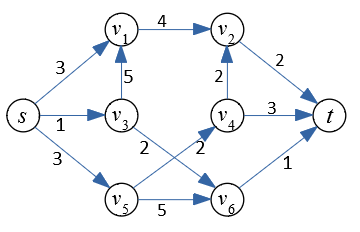

14. Savienotie koki, maksimālā plūsma, cikli
=============================================

Minimālie savienotie koki
----------------------------

Prima algoritms atrod minimālo savienoto koku (*minimum spanning tree, MST*)
neorientētā grafā ar svērtām šķautnēm (katrai šķautnei grafā ir pozitīvs svars). Sk. `<https://bit.ly/2VLz3DK>`_.
Tas ir efektīvs algoritms, kura laika sarežģītība ir :math:`O((m+n)\log n)`, ja
prioritāšu rindas programmē kā minimuma kaudzes.
Šai uzdevumā prioritāšu rindu veidot nav nepieciešams. 
Pieņemiet, ka minimumu vienmēr var atrast galvā un ierakstiet tabulā kā 
MST veidojas pa soļiem. 

**Piemērs:**
  Darbināt Prima algoritmu attēlā dotajam grafam:

  .. figure:: figs/problem-graph.png
     :width: 3in
     :alt: Graph Diagram for Prim's Algorithm.

  Virsotne :math:`A` būs sākuma virsotne, ko liek konstruējamā koka (MST) 
  virsotņu kopā :math:`S`.
  Katrā solī atrod vieglāko šķautni, kas savieno
  kādu virsotni no :math:`S` ar kādu virsotni ārpus :math:`S`.
  Pievienojiet jauno virsotni grafam un atcerieties, ar kuru šķautni tā tika pievienota.
  Parādiet, kā aug Minimālais Savienotais Koks, pakāpeniski pievienojot šķautnes.

  .. note::
    Minimālais Savienotais Koks dotajam grafam var nebūt viens vienīgs. 
    Gadījumos, kad ir izvēle starp vairākām vieglākajām šķautnēm ar tādu pašu
    svaru, var pievienot šķautni :math:`(v,w)` ar :math:`v \in S` un
    :math:`w \not\in S`, kurai :math:`(v,w)` ir alfabētiski pirms jebkuras citas 
    derīgas šķautnes. Tas padara atrisinājumu viennozīmīgu un vieglāk testējamu.

  Pārzīmējam grafu, izceļot šķautnes, kas pieder minimālajam savienotajam kokam. 
  Saskaitām MST kopējo svaru -- tai jābūt minimālajai starp visiem savienotajiem kokiem, 
  ko var izveidot starp grafa virsotnēm). 

Maksimālās plūsmas uzdevums
------------------------------

Forda-Falkersona algoritms atrod maksimālo plūsmu orientētā grafā 
ar noteiktām šķautņu kapacitātēm. 
Forda-Falkersona algoritms neapraksta, kā izvēlēties palielinošo šķautni. 
Dažreiz tās var izvēlēties ļoti neefektīvi -- tā, ka algoritma darbības 
laiks ir atkarīgs nevis no virsotņu vai šķautņu skaita, bet no 
skaitliskajām kapacitātēm (kas var būt ļoti lieli skaitļi). 

Tāpēc ir izplatīts Forda-Falkersona algoritma variants -- 
*Edmonda-Karpa* algoritms, 
sk `<https://bit.ly/2YMhkkC>`_. Tas izvēlas palielinošo ceļu no 
iztekas  :math:`s` līdz ietekai :math:`t` izmantojot BFS apstaigāšanu
(lietojot atlikuma grafu :math:`G_f` tai plūsmai :math:`f`, kas jau atrasta).
Tas ir efektīvs algoritms; tam vajadzīgi :math:`O(n^2 m)` soļi, 
kur :math:`n = |V|` ir virsotņu skaits, bet :math:`m =|E|`
ir šķautņu skaits.

Edmonds-Karp Algorithm
^^^^^^^^^^^^^^^^^^^^^^^^^^

Šo optimālo variantu Forda-Falkersona algoritmam ierosināja 
Jefims Dinics (Yefim Dinitz, 1970) un neatkarīgi no viņa 
Edmonds un Karps (1972). 

   
   Plūsmas grafs -- ievade Edmonda-Karpa algoritmam. 

**Piemērs:**

  **(A)**
    Run Edmonds-Karp algorithm on the graph shown above. 
    For every phase highlight the the augmenting path (or simply list its vertices), 
    find the *residual flow* of this augmenting graph. 
    Draw a copy of the original graph where the residual flow is added.
    Namely, every age is labeled by two numbers ``f/c`` -- the actual flow ``f`` (after adding
    the residual flow obtained in this step) and also the capacity ``c`` of the edge (it never changes).
  
    During the next phase, show the next residual graph, highlight the augmenting path, find the residual flow. 
    And next to that residual graph show a new copy of the original graph with updated flow numbers. 
    Thus, every phase shows two oriented graphs: 
  
    * The current residual graph (initially -- it is simply the given graph with all flows equal to 0). 
    * The original graph with all the flows added.
  
    .. note:: 
      In Edmonds-Karp algorithm visiting the successors of the source vertex :math:`s` in the BFS order
      needs to know the ordering. Assume that all the vertices are arranged in growing order of their indices
      (namely, :math:`v_1` is visited before :math:`v_2` and so on).
  
  **(B)**
    Redraw the original graph with all the maximum flows (use the same two-number labels for edges ``f/c``). 
    Show the min-cut which prevents any further augmenting paths (either highlight with 
    another color, or simply list the partition of graph's vertices into two disjoint sets that describe the cut).
  
  

**Atrisinājums:**

**(A)**

  **Phase 1:**
    Augmenting path: :math:`p = \left\langle s,v_1,v_2,t \right\rangle`, the added flow is 
    :math:`f_p = \min(3,4,2) = 2`. 
  
    .. image:: figs/edmonds-karp-solution-1.png
       :width: 4in
   
  **Phase 2:**
    Augmenting path: :math:`p = \left\langle s,v_3,v_6,t \right\rangle`, the added flow is 
    :math:`f_p = \min(1,2,1) = 1`.
  
    .. image:: figs/edmonds-karp-solution-2.png
       :width: 4in
  
  **Phase 3:**
    Augmenting path: :math:`p = \left\langle s,v_5,v_4,t \right\rangle`, the added flow is 
    :math:`f_p = \min(3,2,3) = 2`.
  
    .. image:: figs/edmonds-karp-solution-3.png
       :width: 4in

  **Phase 4:**
    Finally, the residual graph looks like shown below. There are no further 
    augmenting paths going from :math:`s` to :math:`t` with some positive capacity.

    .. image:: figs/edmonds-karp-solution-4.png
       :width: 2in

  
**(B)**
  The flow obtained during the previous three phases is shown in the picture below. 
  The minimum cut (that is equal to the max flow) is given by two 
  disjoints sets of vertices: 
  
  .. math::
  
    V_1 = \{ s,v_1,v_2,v_3,v_5,v_6 \}\;\;\text{and}\;\;V_2 = \{ v_4, t \}.
  
  The capacity of this min-cut is :math:`w(v_2,t) + w(v_5,v_4) + w(v_6,t) = 2 + 2 + 1 = 5`.
  It is the sum of the weights of edges connecting something in :math:`V_1` with something in :math:`V_2`. 

  .. image:: figs/edmonds-karp-min-cut.png
     :width: 2.5in
	 

Uzdevumi
----------

**14.1.uzdevums (Prima algoritms):**
  Jūsu studenta apliecības pēdējos 3 ciparus apzīmējam :math:`a,b,c`.
  Aprēķiniet skaitļus :math:`x,y,z`:

  .. math::

    \left\{ \begin{array}{l}
    x = (b + 4)\ \text{mod}\ 10\\
    y = (c + 4)\ \text{mod}\ 10\\
    z = (a + b + c)\ \text{mod}\ 10\\
    \end{array} \right.

  Ievades grafu :math:`G = (V,E)` nosaka šāda incidences matrica:

  .. math::

    M_G = \left( \begin{array}{cccccccc}
    0 & 0 & 5 & 8 & y & 0 & 0 & 0 \\
    0 & 0 & 3 & 7 & 0 & z & 0 & 0 \\
    5 & 3 & 0 & 3 & 0 & 0 & 0 & 0 \\
    8 & 7 & 3 & 0 & 1 & 7 & 0 & 0 \\
    y & 0 & 0 & 1 & 0 & 6 & 9 & 6 \\
    0 & z & 0 & 7 & 6 & 0 & x & 2 \\
    0 & 0 & 0 & 0 & 9 & x & 0 & 7 \\
    0 & 0 & 0 & 0 & 6 & 2 & 7 & 0 \\
    \end{array} \right).

  **(A)**
    Uzzīmēt šo grafu diagrammas veidā, aizstājot :math:`x,y,z`
    ar aprēķinātajām vērtībām.
    Apzīmēt grafa virsotnes 
    :math:`A,B,C,D,E,F,G,H` (tās atbilst matricas rindām un kolonnām).

    Var izmantot, piemēram, šādu virsotņu izvietojumu, lai šķautnes 
    pārāk daudz nekrustotos (bet grafa diagrammā virsotnes var izvietot arī citā Jums ērtā veidā). 

    .. image:: figs/mst-vertices.png
       :width: 3in

  **(B)**
    Darbināt Prima algoritmu minimālā savienotā koka iegūšanai, izmantojot 
    :math:`r = A` kā sakni. 
    Grafu nevajag daudzkārt pārzīmēt, jo konstrukciju var attēlot tabulas veidā, 
    izrēķinot :math:`v.key`
    vērtības katra soļa beigās. 
    (Nav nepieciešams norādīt vecāka virsotni :math:`v.p`, 
    jo vecākus var viegli atrast.)
    Tabulas augšdaļa izskatīsies šādi: sākumstāvoklis pirms šķautņu pievienošanas.
    Vērtība :math:`\infty` nozīmē, ka ceļš līdz attiecīgajai virsotnei vēl nav atrasts. 

    =====================  ==============  ==============  ==============  ==============  ==============  ==============  ==============  ==============
    Solis                               A               B               C               D               E               F               G               H
    0 (sākumstāvoklis)           :math:`0`  :math:`\infty`  :math:`\infty`  :math:`\infty`  :math:`\infty`  :math:`\infty`  :math:`\infty`  :math:`\infty`
    =====================  ==============  ==============  ==============  ==============  ==============  ==============  ==============  ==============

  **(C)**
    Apkopot iegūto rezultātu: Uzzīmēt MST, kas iegūts kā Prima algoritma rezultāts. 
    Atrast šī koka šķautņu kopējo svaru. 

**14.2.uzdevums (Kraskala algoritms):**
  Izpildīt Kraskala algoritmu tam pašam grafam, kas bija iepriekšējā jautājumā.

  **(A)**
    Pēc katra soļa, ja ir šķautne, kas savieno divas virsotņu grupas (divus mazos kokus), 
    ierakstiet šo šķautni un parādiet jauno virsotņu kopas sadalījumu 
    (apvienojot tās apakškopas, kuras savienotas ar šķautni). 

    .. note::
      Ja ir vairākas īsākās šķautnes, ko var izmantot, lai savienotu divas apakškopas, 
      izvēlamies to šķautni :math:`(v,w)`, kurai :math:`(v,w)` (vai :math:`(w,v)`) 
      ir alfabētiski pirms katras citas derīgas šķautnes.

  **(B)**
    Uzzīmēt doto grafu vēlreiz, katrai šķautnei iekavās norādot katras šķautnes pievienošanas soli. 
    Arī atrast šī MST kopējo svaru. 

**14.3.uzdevums:**

**(A)**
  Izpildiet Edmonds-Karpa algoritmu dotajā plūsmu grafā. 
  Katra šķautne tajā apzīmēta ar skaitli, kas parāda tās *kapacitāti*. 
  Katrā solī iezīmējiet palielinošo ceļu (*augmenting path*) un uzskaitiet šī ceļa virsotnes. 
  Palieliniet plūsmu uz šī ceļa un uzzīmējiet *atlikuma plūsmas* grafu (*residual flow*). 
  Katra šķautne ir apzīmēta ar skaitļiem ``f/c`` -- pašreizējā plūsma ``f`` (pēc pēc plūsmas palielināšanas) 
  un arī malas ietilpība ``c``, kas nemainās. 

  Nākamajā solī atkal parādiet atlikuma plūsmas grafu, iezīmējiet palielinošo ceļu, atrodiet atlikušo plūsmu. 
  Un blakus šim atlikušajam grafikam parādiet jaunu oriģinālā grafika kopiju ar atjauninātiem plūsmas skaitļiem. 
  Tātad, katrā fāzē tiek parādīti divi orientēti grafi: 

  * Pašreizējais atlikuma grafs (pirmajā solī tas ir vienkārši dotais grafs, kurā visas plūsmas ir vienādas ar 0). 
    Šajā grafikā tiek parādītas tikai malu ietilpības (bet tajā mēdz būt iezīmētas arī 
    *apgrieztās šķautnes* -- *reverse edges*).
    Šajā grafikā var ar BFS apstaigāt šķautnes, meklējot palielinošo ceļu.
  * Oriģinālais grafs ar visām pievienotajām plūsmām. Šajā grafikā jāparāda arī plūsmas,
    izmantojot divu skaitļu notāciju ``f/c``.

  .. note:: 
    Edmonda-Karpa algoritmā iztekas virsotnei :math:`s` un arī visām virsotnēm zem tās, bērnu 
    apmeklēšana ar BFS pārstaigāšanas algoritmu notiek alfabētiskā secībā.
  
**(B)**
  Uzzīmējiet sākotnējo grafu ar jau izrēķinātajām maksimālajām plūsmām (izmantojiet tādu pašu divu skaitļu malu marķēšanu ``f/c``). 
  Parādiet minimālo griezumu (*min-cut*), kas neļauj turpmākus palielinošos ceļus. 
  To var iezīmēt kā līniju, kas šķērso plūsmas grafu, sadala to divās daļās. 
  Vai vienkārši uzskaitiet grafa virsotņu sadalījumu divās nešķeļošās (*disjoint*) kopās, kas veido griezumu.

  
.. only:: Internal

  **Answer:** 
  
  **(A)**
    Sekojot Edmonda-Karpa algoritmam secīgi izvēlamies palielinošos ceļus (*augmenting paths*) -- sākam ar īsākajiem. 
    Kā arī -- ar alfabētiski pirmajiem, ja ir vairāki palielinošie ceļi vienādā garumā. 
    
    1.solis: Palielina plūsmu par :math:`11` vienībām uz palielinošā ceļa 
    :math:`S \rightarrow A \rightarrow B \rightarrow T` (izcelts oranžā krāsā). 
    
    .. image:: figs/ford-fulkerson-phases-1.png
       :width: 4in
    
    2.solis: Palielina plūsmu par :math:`1` uz palielinošā ceļa :math:`S \rightarrow C \rightarrow B \rightarrow T`. 
    
    .. image:: figs/ford-fulkerson-phases-2.png
       :width: 4in
       
    3.solis: Palielina plūsmu par :math:`7` uz palielinošā ceļa :math:`S \rightarrow C \rightarrow D \rightarrow T`.     

    .. image:: figs/ford-fulkerson-phases-3.png
       :width: 4in
       
    4.solis: Palielina plūsmu par :math:`2` uz palielinošā ceļa  :math:`S \rightarrow C \rightarrow B \rightarrow D \rightarrow T`.            

    .. image:: figs/ford-fulkerson-phases-4.png
       :width: 4in

    Pēdējais atlikuma grafs vairs nesatur nevienu palielinošo ceļu, kas savienotu 
    ieteku :math:`S` ar izteku 
    :math:`T`, tāpēc algoritms beidz darbu. 
    Kopumā esam izveidojuši plūsmu, kas ir  :math:`11 + 1 + 7 + 2 = 21` vienības.

    .. image:: figs/ford-fulkerson-phases-5.png
       :width: 2in
    
    
  **(B)**
    Pārzīmējam plūsmas grafu, parādot katrai šķautnei plūsmu un kapacitāti. 
    Minimālais griezums ir parādīts ar sarkanu raustītu līniju. 
    Tas sadala grafa virsotnes divās kopās: :math:`S,A,B,C` un :math:`D,T`; 
    visas šķautnes ir piesātinātas -- un plūsma sasniegusi maksimumu.
    Kā zināms, minimālā griezuma kapacitāte vienāda ar maksimālo plūsmu. 
    Šī maksimālā plūsma ir  :math:`7+2 + 12 = 21`. 

    .. image:: figs/ford-fulkerson-min-cut.png
       :width: 2in

      
  :math:`\square`
