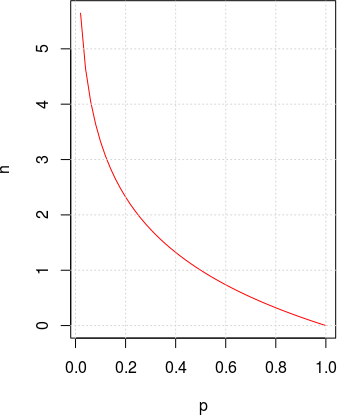
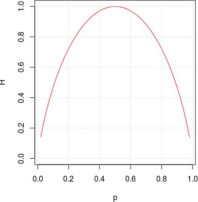
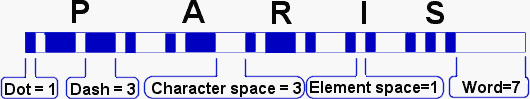
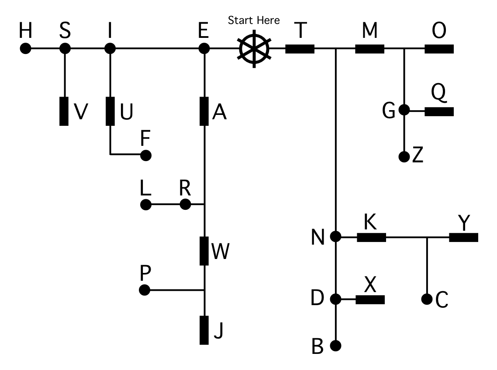

1. Bezzudumu saspiešana: Hafmana kods
========================================

1. Saspiešanas jēdzieni. 
2. Universālas saspiešanas neiespējamība
3. Notikuma informācijas saturs un varbūtību sadalījuma entropija
4. Entropijas piemēri un īpašības
5. Prefiksu kodējumi.
6. Teorēmas par optimālu prefiksu kodējumu.
7. Hafmana algoritms. Pareizums, ātrdarbība un iegūtā kodējuma optimalitāte.
8. Prefiksu koka iekodēšana. 
9. Apspriest Hafmana algoritma modifikācijas.
10. Atrast kodējumu vidējos garumus dažos piemēros.

Vienu no vienkāršākajiem saspiešanas algoritmiem sk.
`Run length encodings <https://commons.wikimedia.org/wiki/File:Run-lengthEncoding1.png>`_. 

.. TODO 2020: 
.. * Add definition of average code length - a little expression
.. * Remind of the independent variables; finish example with information content in two dice-rolls. 

Algoritmu dalījums 
-------------------

Ievadkursā **DatZ3168** "Datu struktūras un algoritmi" aplūkotas vispārīgas metodes
efektīvu algoritmu veidošanā un klasiskas datu struktūras (steki, rindas).
Algoritmus var iedalīt pēc dažādiem parametriem;
apskatīsim, kā iedala algoritmus mūsu kursā.

**Dalījums pēc priekšmetapgabala:**

* Bezzudumu saspiešana (*lossless compression*)
* Zudumradošā saspiešana (*lossy compression*); galvenokārt attēlu un video formāti.
* Kļūdu labošanas kodi (*error correction codes*)
* Lineārā programmēšana (lineāras izteiksmes optimizācija ar lineāriem ierobežojumiem)
* Stringu meklēšanas algoritmi

Daži radniecīgi priekšmetapgabali (bet neietilpst kursā) grafu algoritmi, kriptogrāfijas algoritmi. 

**Dalījums pēc paradigmas:**

Anany Levitin *Introduction to The Design and Analysis of Algorithms* 
apraksta vairākas algoritmu *izstrādes paradigmas* (*design techniques*). 
 
* Pilnā pārlase (*exhaustive search*) jeb rupjā spēka paradigma (*brute force*)
* Samazināšanas-valdīšanas paradigma (*decrease-and-conquer*)
* Skaldīšanas-valdīšanas paradigma (*divide-and-conquer*)
* Pārveidošanas-valdīšanas paradigma (*transform-and-conquer*)
* Dinamiskās programmēšanas paradigma (*dynamic programming*)
* Alkatīgā paradigma (*greedy technique*)
* Iteratīvās uzlabošanas paradigma (*iterative improvement*)

**Dalījums pēc sarežģītības un skaitļošanas modeļa:** 

* Sliktākā gadījuma sarežģītība `O(f(n))`, kur `n` ir ievades garums. 
* Vidējā sagaidāmā sarežģītība. 
* Amortizētā sarežģītība. 

Skaitļošanas modeļi var būt sekojoši:

* Tradicionāli, deterministiski algoritmi. 
* Varbūtiski algoritmi (drīkst ģenerēt gadījuma lielumus; drīkst 
  kļūdīties un kļūdas varbūtībai jāsamazinās, ja pieaug algoritma 
  izpildes laiks). 
* Nedeterministiski algoritmi 
* Paralēli algoritmi
* Kvantu algoritmi

Mūs interesē deterministiski algoritmi (nedaudz arī varbūtiskie, 
nedeterministiskie, paralēlie). 

Kursa mērķi
------------

* Algoritmu un to sarežģītības teorētiska izpēte 
  (tsk. laika/telpas sarežģītība, NP-pilnas problēmas).
* IT risinājumi ar advancētiem algoritmiem
  (tsk. uzlabojumi "ikdienišķos" produktos un pakalpojumos).
* Praktiska eksperimentēšana un prototipu veidošana.

**Līdzekļi:** 
  Jēdzienu definīcijas. Algoritmu paveidi pseidokoda līmenī 
  (RSA algoritmu grāmatas stils). Matemātiski apgalvojumi.
  Produktu un standartu salīdzināšana. Jupyter Notebook 
  (var arī C++ utml.). 

 

Par ko ir kurss "Lietišķie algoritmi"
----------------------------------------

* Noderīgums īstajā pasaulē.
* Informācijas teorija, datu pārraide, tīklošanās.
* Priekšmetapgabalu saspēle (dualitāte, 
  NP-pilni uzdevumi, lineārā algebra, u.c.).

**Kas neietilpst kursā:**

* Datu struktūru klasika (saraksti, koki, kārtošana, hešings, utml.).
* Kriptogrāfija.
* Skaitļojamā ģeometrija. 
* Skaitliskās metodes. 
* Advancēti skaitļošanas modeļi (paralēlie, kvantu algoritmi).

Sasniedzamie rezultāti
-----------------------

Kāpēc vajag vairāk nekā vienu saspiešanas algoritmu?

* Kādos gadījumos saspiešana atkarīga no ievades datiem?
* Kādus datus var (un kādus nevar) efektīvi saspiest?

1. Definēt ziņojumu alfabētus un to varbūtību sadalījumus
2. Definēt kodējumu kā funkciju uz bitu virknēm, tā sagaidāmo garumu
3. Pamatot universālas saspiešanas neiespējamību.
4. Definēt bezzudumu un zudumradošo saspiešanu.
5. Definēt ziņojuma informācijas saturu. 
6. Definēt entropiju, aprakstīt tās īpašības.
7. Izmantot entropiju teksta uzdevumos.

Informācijas saspiešanas pamatjēdzieni
----------------------------------------

**Alfabēti, vārdi, valodas**

Par *alfabētu* (*alphabet*) saucam galīgu kopu ar simboliem. 

* Latīņu/angļu alfabēts: 26 simboli
* Latviešu alfabēts: 33 simboli (:math:`26 - 4 + 11`)
* `ASCII alfabēts <http://www.asciitable.com/>`: :math:`128` simboli
* Unikoda alfabēts (UCS-2, *Basic Multilingual Plane*): 
  65536 simboli. Unikoda standartā ir ap 170 tūkstošiem simbolu
  (arī papildu plaknes).

**Ziņojumu alfabēts**

* Vienkāršākā teorija ir par atsevišķu ziņojumu kodēšanu. 
  Pieņemam, ka sākotnēji dota :math:`n` iespējamo ziņojumu kopa:

  .. math::
    
    S = \{ s_1, s_2, \ldots, s_n \}.

* Ziņojumu alfabēts var būt jebkāds; ziņojums var būt 
  viens burts, vairāki burti vai pat vesels fails.
* Ja dotas ziņojumu varbūtības, var atrast informācijas saturu un entropiju.

**Kodējuma jēdziens**

* Par *kodējumu* (*encoding*) 
  ziņojumu kopai :math:`S` sauc funkciju :math:`C`, kas
  katru ziņojumu pārvērš par bitu virkni. 
* Katru bitu virkni sauc par *kodavārdu* (*codeword*) un 
  aprakstām kodējumu ar funkcijas vērtību sarakstu:

  .. math::
    
    C = \{ (s_1,w_1),(s_2,w_2),\ldots,(s_m,w_m)\}.

* Ja ziņojumam dots garums sākotnējā, nesaspiestajā formā, 
  var runāt par *saspiešanas attiecību* 
  (*compression ratio*):

.. math::

  r = \frac{\text{Uncompressed size}}{\text{Compressed size}} = \frac{|s_i|}{|w_i|}.

**2 saspiešanas veidi**

**Bezzudumu saspiešana:**  
Atspiestais ziņojums
precīzi sakrīt ar sākotnējo.  
Iecienīts teksta dokumentiem, izpildāmam kodam.

**Zudumradošā saspiešana:**   
Atspiestais ziņojums tikai aptuveni vienāds
ar sākotnējo.  
Attēlu, skaņas, video glabāšana un pārraide.

Universālas saspiešanas neiespējamība
--------------------------------------

**Injektīvi attēlojumi:**

**Definīcija:** 
  Funkciju :math:`f\,:\;X \rightarrow Y` 
  sauc par *injektīvu* (*injective*), 
  ja katriem diviem argumentiem :math:`x_1,x_2 \in X` izpildās:
  
  .. math::

    x_1 \neq x_2\;\;\Rightarrow\;\;f(x_1) \neq f(x_2).

Bezzudumu saspiešanas funkcijai 
jābūt injektīvai, tajā nedrīkst
būt "kolīzijas" (vērtību "saskriešanās"). 

**Universāli saspiest nevar**

Neeksistē tāds algoritms, kas **katru** :math:`n` bitu virkni
bezzudumu saspiešanā pārveido 
par :math:`k` bitu virkni, kur :math:`k < n`.

*Pamatojums:* 
  Ar skaitīšanu. Bitam ir :math:`2` vērtības (:math:`0` vai :math:`1`). 

* :math:`m` bitu virknei ir :math:`2^m` vērtības,
* :math:`k` bitu virknei ir :math:`2^k` vērtības. 

No *Dirihlē principa* (*Pigeonhole principle*) 
seko, ka injektīva funkcija no kopas ar :math:`2^m` elementiem
uz :math:`2^k` elementiem (ja :math:`k < m`) neeksistē.

Informācijas saturs
---------------------

**Logaritmu īpašības:**

* Logaritms no reizinājuma
* Logaritms no dalījuma
* Logaritma bāzes maiņas formula

**Šenona informācijas saturs:**

Ziņojumam :math:`s \in S` *Klods Šenons* (*Claude Shannon (1916-2001)*) 
definēja *informācijas saturu*
(*information content*):

.. math::

  h(s) = \log_2 \frac{1}{p(s)} = -\log_2 p(s).

Ja ziņojuma varbūtība tiecas uz :math:`0`, tad :math:`h(s)` 
tiecas uz :math:`\infty`, 
bet svarīgi, ka informācijas satura un varbūtības reizinājums tiecas uz :math:`0`:

.. math:: 

  \lim\limits_{x \rightarrow 0} (-\log_2\,x) \cdot x = 0.

**Divi informācijas satura piemēri** 

Godīgai monētai ir divi stāvokļi: :math:`S=\{ \mathtt{heads}, \mathtt{tails} \}`, 
to varbūtības ir :math:`p=\frac{1}{2}`. Informācijas saturs: 

.. math:: 
  
  h(\mathtt{heads}) = h(\mathtt{tails}) = - \log_2 (1/2) = 1.

Metamajam kauliņam ir seši stāvokļi, katram no tiem varbūtība
ir :math:`1/6`. Informācijas saturs:

.. math::

  h(s_i) = - \log_2 (1/6) \approx 2.585.

**Divu informācijas saturu summa:** 

Pieņemsim, ka :math:`A,B \in S` ir divi neatkarīgi varbūtiski notikumi jeb ziņojumi. 
Tad varbūtība saņemt tos vienu aiz otra ir
:math:`p(AB) = p(A) \cdot p(B)` un informācijas daudzums:

.. math::

  h(AB) = -\log_2 (p(A) \cdot p(B)) = -\log_2(p(A)) - \log_2(p(B)) = h(A) + h(B).

Logaritms ir funkcija, kas reizinājumu pārtaisa par summu.

Entropija
----------

**Entropija diskrētā sistēmā:**

**Definīcija:** 
  Ja (diskrētam) *gadījuma lielumam*
  (*random variable*) ir zināma iespējamo stāvokļu kopa :math:`S` un 
  katram :math:`s \in S` zināma varbūtība, tad 
  par gadījuma lieluma *entropiju* sauc vērtību: 

  .. math:: 

    H(S) = - \sum\limits_{s \in S} p(s) \log_2 p(s),

  kur :math:`p(s)` ir stāvoklim :math:`s` atbilstošā varbūtība.

**Bitu virknītes entropija:** 

*Piemērs:* 
  Ja ir :math:`n = 2^L` ziņojumi ar vienādām varbūtībām :math:`1/n`, 
  tad katru no tiem var iekodēt ar :math:`\log_2 n = L` bitiem. 

  Katra ziņojuma informācijas saturs :math:`h(s) = -\log_2 (1/n) = \log_2 n = L`. 
  Tātad arī entropija (visu šo informācijas saturu vidējā vērtība) ir :math:`L`.  
  Šajā ekstrēmajā gadījumā entropija precīzi sakrīt ar kodēšanai 
  nepieciešamajiem baitiem. 

**Negodīga monēta** 

   
   Informācijas saturs.

* Ja varbūtības diviem monētas mešanas iznākumiem ir 
  attiecīgi :math:`0.9` un :math:`0.1`, tad pirmajam iznākumam informācijas
  saturs ir :math:`0.152`, bet otrajam :math:`3.32`. 
* Informācijas saturu un entropiju
  izsaka "bitos" (datoru arhitektūrā arī ir
  biti, bet tie ir reāli biti, kamēr entropijā izsaka 
  "perfekti saspiestas" informācijas bitus).

**Entropija 2 iznākumiem**

   
   Entropijas grafiks

* Vislielākā entropija jeb nenoteiktība ir tad, ja 
  2 iznākumu gadījumlielums ir ar divām vienādām varbūtībām. 
* Ja veic Bernulli eksperimentu sēriju - met godīgu monētu, 
  tad katrā eksperimentā rodas informācijas saturs - tieši :math:`1` bits.

**Info saturs secīgiem ziņojumiem**
  Ja kāds nosūta divus ziņojumus (jeb alfabēta simbolus) :math:`x_1` un 
  :math:`x_2`, kas ir neatkarīgi kā gadījuma lielumi, tad to 
  secības entropija ir abu viņu entropijas summa :math:`h(x_1x_2) = h(x_1) + h(x_2)`. 

**Entropijas saistība ar saspiešanu:** 

**Teorēma:** 
  Katrai ziņojumu kopai :math:`S` ar zināmu varbūtību sadalījumu 
  un optimālu prefiksu kodējumu :math:`C`:

  .. math:: 

    \ell_a(C) \leq H(S) + 1.

  *Pierādījumu sk.  nākamajā sadaļā.*

Piemērs: Monētu svēršana un entropija
---------------------------------------

**Uzdevums:** 
  Dotas :math:`12` monētas, no kurām visām ir vienādas masas, 
  izņemot vienu, kura ir vai nu vieglāka, vai nu smagāka nekā citas.   
  Ar kādu mazāko svēršanu skaitu var noskaidrot, vai tā ir vieglāka
  vai smagāka kā arī atrast šo smonētu?

**Uzdevuma sarežģītības analīze: Jautājumi** 

* Cik svēršanas būtu nepieciešamas, ja jau zinām atbildi un mums tā 
  jāpierāda, piemēram, tiesas ekspertīzē?  
  *Nedeterministiskie algoritmi* (*non-deterministic algorithms*). 
* Cik svēršanas nepieciešamas deterministiskam algoritmam? 
  Pamatojums ar variantu saskaitīšanu un Dirihlē principu?

**TODO:** 
  Attēls ar dalīšanos trīs virzienos. 

**Pirmais solis** 

Cik pret cik svērt vispirms? Rēķinām entropiju (vidējo 
sagaidāmo Šenona informācijas saturu no 1.svēršanas):

==========  =============================================================  ====================  
Svēršana    Rezultātu varbūtība                                            Entropija (biti)
==========  =============================================================  ====================
6 pret 6    :math:`p(\text{L},\text{Eq},\text{R})=(1/2,0,1/2)`             :math:`1`
5 pret 5    :math:`p(\text{L},\text{Eq},\text{R})=(5/12,1/6,5/12)`         :math:`1.483356`
4 pret 4    :math:`p(\text{L},\text{Eq},\text{R})=(1/3,1/3,1/3)`           :math:`1.584963`
3 pret 3    :math:`p(\text{L},\text{Eq},\text{R})=(1/4,1/2,1/4)`           :math:`1.5`
2 pret 2    :math:`p(\text{L},\text{Eq},\text{R})=(1/6,2/3,1/6)`           :math:`1.251629`
1 pret 1    :math:`p(\text{L},\text{Eq},\text{R})=(1/12,5/6,1/12)`         :math:`0.816689`
==========  =============================================================  ====================

**Par entropiju divās situācijās**

**Situācija Nr.1** 
  Ja jāsaspiež dati, to var vislabāk izdarīt tad, 
  ja informācijas saturs ieejas ziņojumu virknē ir **minimāls** (to varbūtības ir 
  ļoti dažādas, tie ir savstarpēji atkarīgi, veido prognozējamas virknītes - 
  ko īpaši izmanto Lempela-Ziva un Berouza-Vīlera algoritmi).

**Situācija Nr.2** 
  Ja kaut kas jāmeklē ar mazāko iespējamo svēršanu skaitu, 
  tad vislabāk **maksimizēt** informācijas saturu, ko ceram saņemt 1 svēršanā. 
  Vislabāk, ja svēršanas eksperimentu iznākumi 
  ir ar līdzīgām varbūtībām. Sviras svariem ideāli:
  
  .. math::

    \left( \frac{1}{3},\frac{1}{3},\frac{1}{3} \right). 

Entropijas īpašības
---------------------

Aplūkojam diskrētu gadījumlielumu :math:`X`, kuram 
ir :math:`m` dažādas vērtības (ziņojumi, burti, metamā kauliņa iznākumi, 
cipars/ģerbonis utt.) ar attiecīgajām varbūtībām 
:math:`\{ p_1, p_2, \ldots, p_m \}`. 
Entropiju :math:`H(X)` pierakstīsim arī kā 
:math:

un :math:`Y = \{ y_1, y_2, \ldots, y_n \}` 
ar tiem piesaistītajām varbūtībām :math:`P(x_i) = p_i` un :math:`P(y_j) = q_j`. 
Entropijai izpildās šādas īpašības: 

**Entropija ir nenegatīva:**
  :math:`H(X) \geq 0`. Vienādība :math:`H(X) = 0` izpildās tikai tad, ja 
  varbūtību sadalījums :math:`(x_1,x_2,\ldots,x_m) = (0,\ldots,0,1,0,\ldots,0)`. 

**Entropija ir simetriska**
  :math:`H(\{ x_1,\ldots, x_m \}) = H(\{ x_\tau(1),\ldots, x_\tau(m) \})`, 
  kur `\tau(i)` ir indeksu :math:`j` permutācija. 

**Mainīga garuma kodi**

* Dažāda garuma kodi var palīdzēt ietaupīt vietu. 
  Ja visus ziņojumus kodē vienādi gari, tad 
  katrs simbols aizņem 
  :math:`\left\lceil \log_2 |S| \right\rceil` - tas parasti
  ir ļoti neoptimāli.
* Ar dažāda garuma kodavārdiem rasties *divdomības* (*ambiguities*). 
  Piemēram, ja kodējums ir 

.. math::

    \{(a, \mathtt{1}), (b, \mathtt{01}), (c, \mathtt{101}), (d, \mathtt{011})\},

tad :math:`\mathtt{1011}` var saprast trīs dažādos veidos:

.. math::

    \mathtt{1.01.1},\;\;\mathtt{1.011},\;\;\mathtt{101.1}.

**Prefiksu kodējuma jēdziens**

.. figure:: figs/prefix-tree.png
   :width: 4in

   Prefiksu koks

*Prefiksu kodējumā* (*prefix code*) 
neviens kodavārds nav cita kodavārda
prefikss.  
(Korektāk būtu to saukt par "bezprefiksu" kodējumu.)

.. math::

    C=\{ (S, \mathtt{00}), (I, \mathtt{01}),
         (E, \mathtt{100}), (N, \mathtt{101}),
         (T, \mathtt{110}), (A, \mathtt{111})\}.

**Atkodēšanas piemēri**

* Atkodēt virkni :math:`\mathtt{11100110100}`,
* Atkodēt virkni :math:`\mathtt{0001100101111}`.

.. figure:: figs/prefix-tree.png
   :width: 4in
   

**Vidējais kodējuma garums**

Pieņemsim, ka ir zināms varbūtību sadalījums ziņojumu telpā :math:`S`:   
Katram :math:`s \in S` ir piekārtota 
varbūtība :math:`p(s)` un :math:`p(s_1)+\ldots+p(s_n)=1`.

**Definīcija:** 
  Par kodējuma :math:`C = \{(s_1,w_1),\ldots,(s_n,w_n)\}` 
  *vidējo garumu* (*average length*) sauksim summu:

  .. math::

      \ell_a(C) = \sum\limits_{(s,w) \in C} p(s)\ell(w),
   
  kur :math:`\ell(w)` apzīmē kodavārda :math:`w` garumu bitos. 

**Optimāls prefiksu kodējums**

**Definīcija:** 
  Teiksim, ka prefiksu kods :math:`C` ir *optimāls*
  prefiksu kods, ja tā :math:`\ell_a(C)` ir minimāls. Citiem vārdiem, ja 
  dotajam ziņojumu varbūtību sadalījumam neeksistē cits prefiksu 
  kods, kam vidējais garums ir vēl zemāks.

**Morzes kods**

* Morzes kods izmanto mainīga garuma kodēšanas principus (biežākiem 
  simboliem atbilst īsāki kodavārdi). 
* Attiecībā uz svītriņām un punktiņiem tas **nav** prefiksu kods. 
  Atkodēšanas viennozīmību nodrošina atšķirīga garuma pauzes.

Sk. `Morse structure and timing 
<http://www.nu-ware.com/NuCode%20Help/index.html?morse_code_structure_and_timing_.htm>`_

**Ne-prefiksu kods**

Note: See Dave Nathanson, KG6ZJO, Copyleft 2010.

Kodējuma vidējais garums
--------------------------

**T1: Kodējuma garuma novērtējums**

**Teorēma 1:**  
  Katrai ziņojumu kopai :math:`S` ar zināmu varbūtību sadalījumu un 
  viennozīmīgi atkodējamu kodējumu :math:`C` ir spēkā nevienādība:

  .. math:: 

    H(S) \leq l_a(C).

**Intuīcija par Šenona apgalvojumu**

Sūtot ziņojumu :math:`x` no 
alfabēta :math:`S`, *informācijas saturs* (*information content*) 
:math:`h(x)` ir ieteicamais bitu skaits.

**Intuīcija:** 
  Ja ziņojumiem :math:`x_i` atbilst varbūtības
  :math:`p_i`, tad katrs no tiem aizņem kaut gabalu no 
  "kodu telpas". Piemēram, izmantojot kodēšanai 4 bitus, esam aizņēmuši
  1/16 no kodu telpas.

Pierādām ar nevienādību ķēdīti:

.. math::

    H(S) - \ell_a(C) = \sum\limits_{s \in S} p(s)  \log_2 \frac{1}{p(s)} - 
    \sum\limits_{s \in S} p(s)\ell(s) =
    \sum\limits_{s \in S} p(s) \left( \log_2 \frac{1}{p(s)} - \log_2 2^{\ell(s)} \right) =
    \sum\limits_{s \in S} p(s) \log_2 \frac{ 2^{-\ell(s)}}{p(s)} \leq 
    \log_2 \sum_{s \in S} 2^{-\ell(s)} \leq 0.

$\blacksquare$

**Pēdējais pārveidojums ķēdītē**

Atgādinām :math:`\ell` definīciju:
Katram ziņojumam :math:`s_i \in S` ar :math:`\ell(s_i)` 
apzīmējam :math:`s_i` kodavārda :math:`w_i` garumu 
kodējumā :math:`C`, t.i. :math:`(s_i,w_i) \in C`. 
Kādēļ ir spēkā nevienādība?

.. math:: 

    \sum\limits_{s \in S} p(s) \log_2 \frac{ 2^{-\ell(s)}}{p(s)} \leq 
    \log_2 \sum_{s \in S} 2^{-\ell(s)}

**Jensena nevienādība:** 
  Dota :math:`f(x)` divreiz nepārtraukti diferencējama
  funkcija intervālā :math:`[a;b]` un šajā intervālā :math:`f''(x) \leq 0`, t.i. 
  :math:`f(x)` grafiks ir izliekts uz augšu. 
  Doti arī :math:`n` skaitļi :math:`x_1,x_2,\ldots,x_n \in [a;b]` un 
  svari :math:`p_1,p_2,\ldots,p_n`, kuru summa ir 1. Tad ir spēkā nevienādība:

  .. math:: 

    p_1f(x_1) + p_2f(x_2) + \ldots + p_nf(x_n) \leq f \left( p_1x_1 + \ldots p_nx_n \right).

**Krafta-Makmilana nevienādība**
    
**Teorēma 2:** 
  (*Kraft-McMillan Inequality*) 
  Ja ir *viennozīmīgi atkodējams kods* 
  (*Uniquely decodable code*) :math:`C = \{ (x_1,w_1),\ldots,(x_n,w_n)\}`, tad

  .. math::

    \sum\limits_{(x_i,w_i) \in C} 2^{-\ell(w_i)} \leq 1.

  Un otrādi: Ja ir doti vairāki kodējumu garumi :math:`l_i`, kas
  apmierina :math:`\sum 2^{-l_i} \leq 1`, tad no tiem var uzbūvēt
  prefiksu koku, kur katram garumam :math:`l_i` atbilst lapa šajā kokā, kuras
  dziļums ir tieši :math:`l_i`.

**Kā pamatot Krafta-Makmilana teorēmu?**

**Pierādījums:** 
  Vispārīgiem "uniquely decodable codes" pierādīt piņķerīgi.

  *Prefiksu kodiem* (*prefix-free codes*) ievērojam, ka ikviens
  :math:`k_i`-bitu kods aizpilda prefiksu kokā (sauktā arī par "kodu telpu") 
  tieši :math:`\frac{1}{2^{k_i}}` daļu no tilpuma. 

  Dažādu kodu veidotie "tilpumi" nevar daļēji šķelties. Un tā kā 
  neviens nav prefikss otram, neviens nevar būt pilnīgi otra iekšpusē.
  Pilnās kodu telpas tilpums ir :math:`1`, tādēļ summa 
  visiem :math:`2^{-k_i}`, kur :math:`k_i = \ell(w_i)` nepārsniedz 1.  
  $\blacksquare$

**Optimāla kodējuma garums**

**Teorēma 3:** 
  Katrai ziņojumu kopai :math:`S` ar zināmu varbūtību sadalījumu 
  un optimālu prefiksu kodējumu :math:`C`:

  .. math::

      \ell_a(C) \leq H(S) + 1.

**Sekas:** 
  Tā kā Hafmana algoritms rada optimālo
  (vai vienu no optimālajiem) prefiksu kodējumu (sk. Teorēmu 4), tad 
  arī Hafmana kodējumam :math:`C^{\ast}` ir spēkā: 

  .. math::

    \ell_a(C^{\ast}) \leq H(S) + 1.

**Pierādījums:** 
  Katram ievades ziņojumam/simbolam :math:`s \in S` izvēlamies 

  .. math::
    \ell(s) = \left\lceil \log_2 \frac{1}{p(s)} \right\rceil. 

  Tādā gadījumā:

  .. math::
    \sum\limits_{s \in S} 2^{-\ell(s)} = \sum\limits_{s \in S} 2^{-\left\lceil \log_2 \frac{1}{p(s)} \right\rceil} \leq \sum\limits_{s \in S} 2^{- \log_2 \frac{1}{p(s)}} = \sum\limits_{s \in S} p(s) = 1.

  Pēc Krafta-Makmilana teorēmas (pretējā virziena) varam 
  atrast tādu prefiksu kodu :math:`C'`, kam ir tieši šādi kodavārdu garumi. 
  Vidējā garuma :math:`\ell_{avg}(C')` novērtējums:

  .. math::

      \ell_{avg}(C') = \sum\limits_{s \in S} p(s) \cdot \left\lceil \log_2 \frac{1}{p(s)} \right\rceil \leq \sum\limits_{s \in S} p(s)\left( 1 + \log_2 \frac{1}{p(s)} \right) = 1 + H(S).

  Optimālajam prefiksu kodam :math:`C` jābūt vismaz tikpat labam kā nupat piedāvātais :math:`C'`. 
  Tādēļ arī tam būs novērtējums:

  .. math::

    \ell_{avg}(C) \leq \ell_{avg}(C') \leq 1 + H(S).

Hafmana algoritms
------------------

**Ievade:** 
  Burti (ziņojumi) ar dotām varbūtībām.  

**Izvade:** 
  Prefiksu koks šo burtu/ziņojumu attēlošanai ar prefiksu kodējumu.

.. figure:: figs/huffman-algorithm.png
   :width: 5in

   Hafmana algoritms. 

Hafmana algoritms atbilst *rijīgo* (*greedy*) algoritmu 
paradigmai - "lokāla" optimizēšana šoreiz noved pie globāli optimāla
risinājuma.

**Hafmana pseidokods**

| :math:`\text{\sc Huffman}(S)`
| 1. :math:`n = |S|` :math:`\;\;\;\;` *(elementu skaits)*
| 2. :math:`Q = \text{\sc MinimumPriorityQueue}(S)`
| 3. **for** :math:`i = 1` **to** :math:`n-1`: 
| 4. :math:`\;\;\;\;` izveido jaunu mezglu :math:`z`
| 5. :math:`\;\;\;\;` :math:`z.\mathit{left} = x = Q.\text{\sc ExtractMin}()`
| 6. :math:`\;\;\;\;` :math:`z.\mathit{right} = Y = Q.\text{\sc ExtractMin}()`
| 7. :math:`\;\;\;\;` :math:`z.\mathit{freq} = x.\mathit{freq} + y.\mathit{freq}`
| 8. :math:`\;\;\;\;` :math:`Q.\text{\sc insert}(z)`
| 9. **return** :math:`Q.\text{\sc ExtractMin}()`

.. note::
  Pseidokodu sk. (Cormen2009, p.431)

**Algoritma sarežģītība**

* ExtractMin(Q) minimuma prioritāšu kaudzē vajag :math:`O(\log n)`.
* Insert(Q,z) laiks arī ir :math:`O(\log n)`.
* Huffman(S) laiks ir :math:`O(n \log n)`.

**Kā atspiest Hafmana kodējumu**

`Kanoniskais Hafmana kodējums <https://en.wikipedia.org/wiki/Canonical_Huffman_code>`_

* **A1** Vispirms sakārto pēc kodavārda garuma; ja vienādi kodavārdi, tad pēc alfabēta.
* **A2** Īsākiem kodavārdiem piekārto nulli, garākiem - vieninieku.

.. code-block:: 

  B = 0     (1 bits)
  A = 10    (2 biti)
  C = 110   (3 biti)
  D = 111   (3 biti)

Ja kodētājs un saņēmējs zina, ka lietots **sakārtots** ziņojumu alfabēts 
:math:`S=\{ A,B,C,D \}`, tad pietiek paziņot attiecīgo burtu kodavārdu garumus: 2, 1, 3, 3.

**Daži Hafmana algoritma lietojumi**

* PKZIP (Phil Katz) arhivators - PKZIP 2.04g un jaunāki standarti, 
  kuri lieto DEFLATE saspiešanas standartu (tas pats, 
  kas populārie Zip failu formāti mūsdienās).
* `RFC 7541 - HPACK: Header Compression for HTTP/2 <https://tools.ietf.org/html/rfc7541>`_ 
  Hederu saspiešana HTTP/2 protokolam (RFC 7540), ko lieto kopš 2015.g.

**Hafmana koka optimalitāte**

**Teorēma:** 
  Hafmana algoritms ģenerē optimālu bināro prefiksu koku ziņojumu kopai S pie dotā varbūtību sadalījuma.

Starp visiem kodējumiem :math:`C`, kur ziņojumiem :math:`s \in S` kaut kā piešķir bezprefiksu kodus :math:`w_s`, 
vidējais garums

.. math:: 

   \ell_a(C) = \sum\limits_{(s,w_s) \in C} p(s)\ell(w_s)

Hafmana koka aprakstītajā kodējumā :math:`C^{\ast}` būs vismazākais (vai viens no vismazākajiem).

**Pierādījums:** 

  **Bāze:** 
    Ja ziņojumu alfabētā :math:`S` ir :math:`1` burts. 
    Tad ir tikai viens koks, kas ir gan optimālais, gan Hafmana koks.

  **Indukcijas pāreja:** 
    Ja ir vismaz divi burti. Pieņemam, ka Hafmana algoritms vienmēr dod optimālu koku pie :math:`k-1` burtiem. 
    Tagad dots alfabēts :math:`S` ar :math:`k` burtiem, kur :math:`x` 
    un :math:`y` ir divi visretāk sastopamie burti.

    Pirmajā solī Hafmana algoritms apvieno virsotnes :math:`x` un :math:`y`. 
    Izveidojas jauna virsotne, kuras biežums ir :math:`p(x) + p(y)`. 
    Tālāk ir jāpielieto Hafmana algoritms :math:`k-1` burtam.

    Pēc indukcijas pieņēmuma Hafmana algoritms :math:`k-1` burtam dod optimālo koku. 
    Tas nozīmē, ka Hafmana algoritms dod optimālo koku starp tiem kokiem, 
    kuros :math:`x` un :math:`y` atrodas blakus.

    Varbūt ir vēl optimālāks koks, kur :math:`x` un :math:`y` neatrodas blakus?

    Pamatosim, ka citus kokus var pārveidot par kokiem, 
    kuri ir vismaz tikpat optimāli, turklāt :math:`x` un :math:`y` ir blakus.

    Optimālā kokā izpildās 2 apgalvojumi:

    1. Ja :math:`p(x) < p(y)`, tad :math:`\ell_x \geq \ell_y` 
       (citādi varētu apmainīt :math:`x` un :math:`y` vietām kokā un kodējuma garums no tā samazinātos.)
    2. Apskatīsim maksimālo kodavārda garumu jeb prefiksu koka dziļumu ar :math:`\ell_{\max}`. 
       Tad ir divi tādi burti :math:`u`, :math:`v`, kuriem :math:`\ell_u = \ell_v = \ell_{\max}`. 
       (Vispirms atrodam maksimāli dziļu :math:`u`. 
       Ja blakus nebūtu šķautnes uz :math:`v`, tad varētu saīsināt :math:`u` kodējumu par vienu šķautni.)

    Doti :math:`x,y` -- 2 visretāk sastopamie burti,
    bet :math:`u,v` - visdziļāk prefiksu kokā esošie kaimiņi.

    * Abi :math:`x,y` ir tikpat dziļi kokā kā maksimāli dziļās 
      virsotnes :math:`u` un :math:`v`. (citādi koku varētu uzlabot).
    * Apmainot :math:`x` ar :math:`u`, bet :math:`y` ar :math:`v`, 
      no jebkura optimāla koka var iegūt citu optimālu koku, kuram :math:`x` un :math:`y` ir blakus.

    .. figure:: figs/switching-x-y.png
       :width: 1.5in

       Maina vietām :math:`x` un :math:`y`.

Hafmana koda praktiskie apsvērumi
------------------------------------

**Problēma: Kā pārsūta pašu koku?**

* Saspiešanas algoritmi izmanto simetrisku
  *kodējuma tabulu* (*codebook*); prefiksu kodiem var iztēloties kā koku.
* Ja ziņojumu biežumi ir zināmi jau iepriekš, koks zināms sūtītājam un saņēmējam, to var nesūtīt.
* Biežāk ziņojumu biežumi ir empīriski jānoskaidro pārsūtāmajos datos.

Saspiežot īsu ziņojumu virkni lielā alfabētā kodējuma tabula 
var aizņemt ievērojamu vietu.

Sk. `Kanonisks Hafmana kods <https://en.wikipedia.org/wiki/Canonical_Huffman_code>`_

**Simbolu grupēšana**

Piemērs: Negodīgās monētas alfabēts :math:`S = \{ A,B \}` ar varbūtībām
:math:`p(A) = 0.9` un :math:`p(B) = 0.1`.

* Kodējot pa vienam simbolam, iegūstam vidējo koda garumu :math:`\ell_a(C) = 1`,
  kaut arī entropija :math:`H(S) = 0.4689956`.
* Kodējot pa diviem simboliem: :math:`T = \{ AA,AB,BA,BB \}` ar
  varbūtībām :math:`\{ 0.81, 0.09, 0.09,0.01 \}`, vidējais koda garums Hafmana
  kodam ir :math:`\ell_a(C_2) = 1 \cdot 0.81 + 2\cdot 0.09 + 3\cdot 0.09 + 3 \cdot 0.01 = 1.29/2 = 0.645.`

**Prediktīva kodēšana**

* Parasti nevajag aplūkot pilnu Dekarta reizinājumu :math:`S \times S`, ko
  veido **visi** iespējamie simbolu pārīši :math:`(s_i,s_j)`, jo ne katri
  divi (vai trīs, četri, utt.) simboli mēdz atrasties blakus.
* Visu simbolu pāru kodēšana ir laba blēdīgajām monētām 
  (un to radītajai Bernulli eksperimentu virknei, kur 1 eksperimenta
  sadalījums ir :math:`\{ p, 1-p \}`).
* Pirmais tuvinājums reāliem tekstiem ir 
  Markova ķēdes (nākamā simbola varbūtības sadalījumu nosaka 
  iepriekšējais simbols).

**"Trie" koki**
  "Trie" ir tāds koks, kura šķautnes ir marķētas ar simboliem; 
  katra virsotne pārstāv to simbolu virkni, pa kuru turp var aiziet no koka saknes. 
  Ja virsotne :math:`u` ir vecāks virsotnei :math:`v`, tad 
  virsotnē :math:`v` iekodētā virkne ir par 1 garāka nekā virsotnē :math:`u`. 

  .. figure:: figs/trie-koks.png
     :width: 4in

     "Trie" koks.

**PPM (Prediction by Partial Matching):**
  Saspiešanas algoritmu
  paveids, kas garam tekstam izmanto iepriekšējos :math:`k` simbolus, lai
  noteiktu nosacīto varbūtību nākamajam simbolam.
  Dabīgas valodas tekstus var šādi saspiest ļoti labi,
  bet šie algoritmi parasti izveido milzīgas datu struktūras.

Uzdevumi
----------

**1.1. uzdevums:**
  Uz godīga metamā kauliņa uzmeta kādu skaitli 
  no kopas :math:`\{1,2,3,4,5,6\}`. Uzrakstīt izteiksmi, kura izteiksme izsaka 
  šī notikuma informācijas saturu?

**(A)** 
  :math:`(\ln 2) \cdot (\ln 6)`

**(B)** 
  :math:`{\displaystyle (\ln 2)/(\ln 6)}` 

**(C)** 
  :math:`{\displaystyle (\ln 6)/(\ln 2)}`  

**(D)** 
  :math:`\ln (2\ln 6)`

**(E)** 
  Kāda cita (ierakstīt savu)

.. only:: Internal 

  **Atbilde:**

    Logaritma bāzes maiņas formula: 

    .. math::

      \log_a b = \frac{\log_m b}{\log_m a}.

    Mūsu gadījumā :math:`{\displaystyle  \log_2 6 = (\ln 6)/(\ln 2) \approx 2.584963}`.

  :math:`\square`

**1.2. uzdevums:**
  Atrast entropiju gadījumlielumam :math:`S = \{A,B,C\}`, 
  kam :math:`p(A)=1/2`, :math:`p(B)=p(C)=1/4`. Atbildi noapaļot
  līdz diviem cipariem aiz komata. 

.. only:: Internal 

  **Atbilde:** 

    Katram no simboliem :math:`A,B,C` aprēķinām informācijas saturu:  
    :math:`h(A) = \log_2 \frac{1}{1/2} = \log_2 2 = 1.`

    .. math::

      h(B)=h(C)= \log_2 \frac{1}{1/4} = \log_2 4 = 2.

    Entropija ir svērts vidējais :math:`(1/2)p(A) + (1/4)p(B) + (1/4)p(C)`: 

    .. math::
    
      (1/2)\cdot 1 + (1/4) \cdot 2 + (1/4) \cdot 2 = 1.5.

  :math:`\square`

**1.3. uzdevums**
  Kāds ir Hafmana kodējuma vidējais garums, ja ar to 
  kodē burtu virknīti :math:`MISSISSIPPI`.
  Atbildi noapaļot līdz diviem cipariem aiz komata. 

.. only:: Internal  

  **Atbilde:** 

    .. figure:: figs/mississippi.png  
       :width: 3in

       Prefiksu koks

    .. list-table:: 
       :header-rows: 1 

       * - :math:`a \in S`
         - :math:`w(a)`
         - :math:`\ell_a`
         - :math:`p(a)`
       * - I 
         - 0
         - 1
         - :math:`4/11`
       * - S 
         - 10
         - 2
         - :math:`4/11`
       * - M 
         - 110
         - 3
         - :math:`1/11`
       * - P
         - 111
         - 3
         - :math:`2/11`

    Burtu :math:`I,S,M,P` kodējumu garumi ir attiecīgi :math:`1,2,3,3` biti. 
    Piereizinām ar attiecīgo burtu varbūtībām 
    (to relatīvajiem biežumiem vārdā :math:`MISSISSIPPI`).

    .. math::

       1\frac{4}{11} + 2\frac{4}{11} + 3\frac{2}{11} +
       3\frac{1}{11} = \frac{21}{11} \approx 1.91.

  :math:`\square`

**1.4. uzdevums**
  Kāds būtu kodējuma vidējais garums, ja vārdā :math:`\mathtt{MISSISSIPPI}`
  katru no četriem burtiem kodētu šādi:

  .. math::

     C = \{(I,\mathtt{00}),(M,\mathtt{01}),
     (P,\mathtt{10}),(S,\mathtt{11})\}.
   
  Atbildi noapaļot līdz diviem cipariem aiz komata. 

.. only:: Internal  

  **Atbilde:** 

    Pat neko nerēķinot, redzams, ka ikviena simbola kodējuma
    garums ir $2$, tātad arī vidējais kodējuma garums būs 
    svērts vidējais starp visiem šiem divniekiem:

    .. math::

       p(M)\cdot 2 + p(I)\cdot 2 + p(S)\cdot 2 + p(P)\cdot 2 =
       (1/11)\cdot 2 + (4/11)\cdot 2 + (4/11)\cdot 2 + (2/11)\cdot 2 = 2.

  :math:`\square`

Nodarbības kopsavilkums
---------------------------

1. Aprakstījām ziņojumus un to alfabētus
2. Atšķīrām bezzudumu/zudumradošo saspiešanu
3. Pamatojām, ka lielo vairumu ziņojumu dotajā alfabētā saspiest nevar
4. Aprakstījām prefiksu kokus
5. Aprakstījām un analizējām Hafmana algoritmu
6. Definējām un lietojām entropiju kā "visvairāk saspiestās" 
   informācijas garumu.
7. Aprakstījām prefiksu kokus
8. Aprakstījām un analizējām Hafmana algoritmu
9. Definējām un lietojām entropiju kā "visvairāk saspiestās" 
   informācijas garumu.

