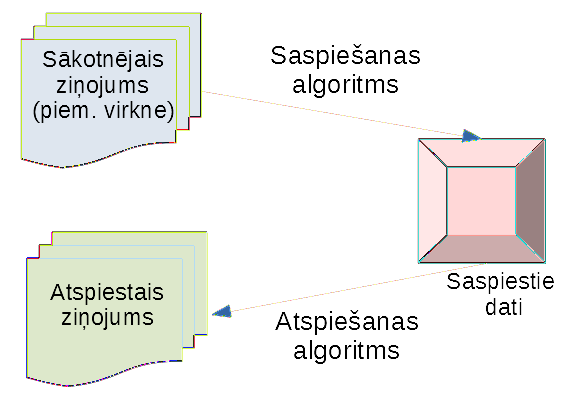
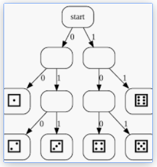
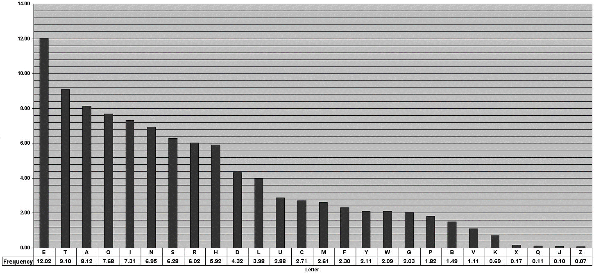

2. Bezzudumu saspiešana: Aritmētiskais kods
============================================

.. note:: 
  Detalizēti par aritmētiskajiem kodiem: 

  * `Arithmetic coding / decoding <https://web.mat.upc.edu/sebastia.xambo/CDI15/CDI15-04-ArithmeticCoding.pdf>`_
  * `Asymmetric numeral systems <https://en.wikipedia.org/wiki/Asymmetric_numeral_systems>`_ - 
    asimetriskās skaitīšanas sistēmas ir jaunāks entropijas kopu paveids

Labāka entropijas koda nepieciešamība
----------------------------------------

**Mērķis - tuvoties entropijai**

   Compression processes

Bezzudumu saspiešanā atspiestais vienāds ar sākotnējo.
Saspiešanu nosaka divi komponenti:

* *iekodēšanas algoritms* (*encoding algorithm*) saņem ieejā
  ziņojumu un izveido "saspiestu" attēlu (veiksmes gadījumā - tajā ir mazāk bitu).
* *atkodēšanas algoritms* (*decoding algorithm*) atjauno sākotnējo
  ziņojumu (vai tā tuvinājumu) no saspiestā attēla.

Aritmētiskā koda gadījumā abi algoritmi atšķiras (nav tik viegli kā
prefiksu kodējuma tabula).

**Metamais kauliņš: Neoptimāls piemērs**

   Metamā kauliņa piemērs. 

Alise grib nosūtīt Bobam :math:`1000` (godīga) metamā kauliņa rezultātus.
Prefiksu kodējumam reizēm vajag :math:`2`, reizēm :math:`3` bitus.

* :math:`00` = uzmests skaitlis :math:`1`,
* :math:`010` = uzmests skaitlis :math:`2`,
* :math:`011` = uzmests skaitlis :math:`3`,
* :math:`100` = uzmests skaitlis :math:`4`,
* :math:`101` = uzmests skaitlis :math:`5`,
* :math:`11` = uzmests skaitlis :math:`6`.

.. math:: 

    \ell_a(C) = 2 \cdot \left(\frac{1}{6} \cdot 2\right) + 4 \cdot \left(\frac{1}{6} \cdot 3\right) = 2.666\ldots

.. note::
  Lai nosūtītu :math:`1000` metamā kauliņa rezultātus ar Hafmana kodu, 
  Alise izlietos aptuveni :math:`2667` bitus. 
  Nedaudz mazāk, ja starp rezultātiem ir vairāk "1" un "6", bet 
  nedaudz vairāk, ja vairāk nekā vidēji tiek uzmesti "2", "3", "4", "5". 

**Cerība uz samazinājumu no 2667 uz 2585**

Entropija (vidējais informācijas saturs) vienā kauliņa metienā ir ap 
:math:`\log_2 6 \approx 2.585`.

.. math::

    H = \sum\limits_{s \in S} p(s) \cdot \left( - \log_2 p(s) \right) = 
    6 \cdot \left( \frac{1}{6} \cdot \left( - \log_2\,\frac{1}{6} \right) \right) \approx 2.584963.

Prefiksu kodi to nevar atrisināt, jo nevar nosūtīt daļveida (piemēram, 
:math:`2.585`) bitus.

.. note::
  Šajā situācijā Alisei jārīkojas citādi -- katram metamā kauliņa rezultātam 
  viņa izveido sešas reizes īsāku intervālu (kā aprakstīts aritmētiskajā kodējumā). 
  Un tikai pašās beigās viņa iekodē iegūto ļoti īso intervālu kā bitu 
  virknīti. 
  

**Līdzīga situācija ar burtiem**

   Angļu burtu biežumi. 

Aritmētiskais kods palīdz ietaupīt vietu tur, kur simbolu ir nedaudz, 
to varbūtības stipri atšķiras; toties garāku gabalu atkārtošanās nav novērojama.  

.. note::  
  Dabīgo valodu burtu sadalījums parasti nav labākais piemērs, jo tie mēdz parādīties
  prognozējamās virknītēs, atsevišķa simbolu kodēšana (gan ar Hafmana, gan aritmētisko kodējumu)
  parasti ir neoptimāla.
  `Burtu biežumi <http://pi.math.cornell.edu/~mec/2003-2004/cryptography/subs/frequencies.html>`

**Aritmētiskā saspiešana**

* Kāpēc lietot aritmētisko kodēšanu? 
* Ja ziņojumu telpā ir jocīgas varbūtības, tad Hafmana kodi (kas dala
  kodu telpas "nekustamo īpašumu" gabalos pa :math:`1/2`, :math:`1/4` utt.)
  iznieko daudz vietas. 
* Neizmantojam to, ka dažu ziņojumu informācijas saturs 
  ir daudz mazāks par :math:`1`. 

**Jautājums:** 
  Kā nosūtīt notikumu, kura informācijas saturs ir 0.4 biti?  

**Aritmētiskās saspiešanas ideja:** 
  Griežam kodu telpu tādos gabalos, kā mums vajag
  (un bitos iekodējam tikai pašās beigās).

Aritmētiskās saspiešanas algoritms
------------------------------------

**Algoritma apraksts**

**Ievade:** Alfabēts un tā varbūtību sadalījums. Ziņojumu virkne šajā alfabētā.   
**Izvade:** Intervāls :math:`I \subseteq [0;1]` (pietiek nosūtīt skaitli no šī 
intervāla). 

* Ir :math:`m` ziņojumi :math:`\{ 1,\ldots,m \}`. To varbūtības
  ir :math:`\{p(1),\ldots , p(m)\}`, kuru summa ir :math:`1`. 
* Apzīmējam *kumulatīvās varbūtības*: 

.. math::
    f(j) = \sum\limits_{i=1}^{j-1} p(i),\;\;j=1,\ldots,m.

**Pirmais intervāls**

Dota ziņojumu virkne :math:`x_1,x_2,\ldots,x_k \in \{ 1,\ldots,m \}`.  
Veidojam intervālu virkni: 

.. math::
    [0;1] \supset [l_1;l_1+s_1) \supset [l_2;l_2+s_2) \supset \ldots \supset [l_k; l_k+s_k).

1.intervāls: :math:`[l_1;l_1 + s_1) = \left[ f(x_1);p(x_1) \right)`.  
Intervāliem :math:`2,\ldots,k` apzīmējam:

.. math::
    \left\{
    \begin{array}{l}
    l_i = l_{i-1} + f(x_i) \cdot s_{i-1}\\
    s_i = s_{i-1} \cdot p(x_i)
    \end{array} \right.

**Piemērs**

  .. figure:: figs/arithmetic-babc.png
     :width: 4in

     Intervālu virkne.

  * Alfabētā ir 3 burti *a,b,c*. Varbūtības ir attiecīgi 0.2, 0.5, 0.3
    (entropija viena burta nosūtīšanai būs 1.485475)
  * Piemērā parādīts, ka *`babc`* atbilst intervāls [.255, .27).
  * Galīga bināra daļa šajā intervālā: 
    `.0100001` jeb [33/128,34/128) \subseteq [.255, .27).
  * 4 ziņojumu virknītes nosūtīšanai iztērējām 7 bitus
    (vidēji 1.75 biti uz vienu ziņojumu).

**Jautājums:** Vai robežā nosūtīto bitu daudzums pret ziņojuma garumu tieksies uz 
entropiju 1.485475. Kāpēc?

**Intervālu nosūtīšana**

  * Ja dots intervāls ar garumu :math:`s`, tad tā iekšienē 
    var atrast skaitli, kura binārajā pierakstā ir 
    ne vairāk kā :math:`-\left\lceil \log_2 s \right\rceil` biti.
  * Gribam sūtīt tikai vienu skaitli. Lai saprastu, cik garš ir 
    tā intervāls, interpretējam, teiksim $.010$ nevis vienkārši 
    kā $1/4$, bet kā intervālu $[1/4, 3/8)$. 
  * Nepazaudējot vairāk kā 1-2 bitus, varam izveidot šādu 
    intervālu :math:`[k/2^n,(k+1)/2^n)`, kurš atradīsies stingri iekšpusē 
    tam :math:`I`, ko dod aritmētiskais kods.

**Aritmētiskā koda īpatnības**

  * Aritmētiskā koda algoritmus jābūvē vai nu relatīvi nelielām ziņojumu 
    kopām (kur mums pietiek ar floating aritmētiku), vai arī
    jāizveido tuvinājums, kur reālos skaitļus tuvina ar veseliem skaitļiem. 

Sk arī 21.lpp. no teksta
`G.Blelloch. Introduction to Data Compression <https://www.cs.cmu.edu/~guyb/realworld/compression.pdf>`_ 
- ar veseliem skaitļiem tuvināts aritmētiskās kodēšanas algoritms.

**Iekodēšanas piemērs**

Sūtām stringu :math:`\textcolor{blue}{\mathtt{GACGU\$}}`, kur simboli 
:math:`\textcolor{blue}{\mathtt{A}}`, :math:`\textcolor{blue}{\mathtt{C}}`, 
:math:`\textcolor{blue}{\mathtt{G}}`, :math:`\textcolor{blue}{\mathtt{U}}` 
ir RNS-virknes nukleobāzes, 
bet :math:`\textcolor{blue}{\mathtt{\$}}` apzīmē stringa beigas.  Simbolu apriorās varbūtības ir šādas:

::

    -------------------------------
    $\mathtt{A}$ $\mathtt{C}$ $\mathtt{G}$ $\mathtt{U}$ $\mathtt{\$}$
    -------------------------------
    30%           10%         30%        20%        10%
    -------------------------------

.. figure:: figs/arithmetic-coding.png
   :width: 6in

===================  ===================  ===================  ===================  ===================
:math:`\mathtt{A}`   :math:`\mathtt{C}`   :math:`\mathtt{G}`   :math:`\mathtt{U}`   :math:`\mathtt{\$}`
===================  ===================  ===================  ===================  ===================
30%                  10%                  30%                  20%                  10%
===================  ===================  ===================  ===================  ===================

**Intervālu aprēķini**

  * :math:`S_0 = [0.000000; 1.000000]` atbilst :math:`\textcolor{blue}{\mathtt{""}}` (tukšais strings),
  * :math:`S_1 = [0.400000; 0.700000]` atbilst :math:`\textcolor{blue}{\mathtt{G}}`,
  * :math:`S_2 = [0.400000; 0.490000]` atbilst :math:`\textcolor{blue}{\mathtt{GA}}`,
  * :math:`S_3 = [0.427000; 0.436000]` atbilst :math:`\textcolor{blue}{\mathtt{GAC}}`,
  * :math:`S_4 = [0.430600; 0.433300]` atbilst :math:`\textcolor{blue}{\mathtt{GACG}}`,
  * :math:`S_5 = [0.432490; 0.433030]` atbilst :math:`\textcolor{blue}{\mathtt{GACGU}}`,
  * :math:`S_6 = [0.432976; 0.433030]` atbilst :math:`\textcolor{blue}{\mathtt{GACGU\$}}`.

Bināri pierakstītais skaitlis 

.. math::
    \beta = 0.011011101101100_2 \approx 0.4329834_{10}

pieder intervālam :math:`S_6 = [0.432976; 0.433030]`. 

Kāpēc :math:`\beta` binārais pieraksts beidzas ar divām nullēm?  
Tieši 15 cipari aiz komata un :math:`\left[\beta;\,\beta + \frac{1}{2^{15}}\right] \subseteq S_6`. 

.. note::
  Katrai galīgai binārai daļai atbilst :math:`[0;1]` apakšintervāls.

**Veselo skaitļu algoritms**

* Klasisko reālo skaitļu aritmētika ir "nekonstruktīva" (vairumam reālo skaitļu 
  vispār nav nekāda galīga apraksta). 
* Reālo skaitļu noapaļošana rada grūtības ar noapaļošanas kļūdām; 
  var mēģināt dalīt tekstu blokos, pirms tos aritmētiski iekodē.

**Beigu marķieris**

.. note:: 
  PSEUDO_EOF - Hafmana kods var beigties baita vidū. 
  Parasti pievieno īpašu simbolu (teksta beigu marķieri), 
  lai saprastu, kad atkodēšana jāpārtrauc. 

  Ar aritmētisko kodu ir līdzīgs stāsts: beigu marķieris nozīmē to, 
  ka viens atkodējamais strings nevar būt cita stringa prefikss.
  `Hafmana apraksts <https://web.stanford.edu/class/archive/cs/cs106b/cs106b.1172/assn/huffman.html>`_

Citi entropijas kodi 
-----------------------

**Nosacītās varbūtības modelis**

Aritmētisko kodu var uzlabot, ja ņem vērā simbolu parādīšanās
varbūtību atkarību no konteksta (1.kārtas modelis - tikai viens iepriekšējais
simbols). Tad nākamo intervālu dala gabalos atkarībā 
no iepriekšējā simbola.

.. figure:: figs/conditional-probability-model.png
   :width: 7in 

   Nosacītās varbūtības modelis.

.. note::
  `Bildes par aritmētisko kodēšanu 
  <http://www.ws.binghamton.edu/fowler/fowler%20personal%20page/EE523_files/Ch_04%20Arithmetic%20Coding%20(PPT).pdf>`_

**Asimetriskās skaitīšanas sistēmas**

*Asymmetric numeral systems (ASN)* -- Jaroslaw Duda (2014) pētījumi.
Kalpo līdzīgam mērķim kā aritmētiskie kodi (saspiež ievades datu plūsmu līdz 
entropijas noteiktajai robežai). Ar ko atšķiras no aritmētiskajiem kodiem:

* ASN mēdz būt vieglāk programmēt.
* Da

Lietojumi dažos jaunos standartos. 

1. Facebook Zstandard.
2. Apple LZFSE.
3. Google Draco 3D compressor.

Jaunie algoritmi var labāk saspiest vai pārraidīt vairāk datu pa to pašu sakaru kanālu; 
tiem reizēm vajadzīgas lielākas skaitļošanas jaudas (vai tie labākai efektivitātei 
jāprogrammē paralēli), tāpēc tos visas platformas neatbalsta. 

Būtiski, uz kādas ierīces un kādā situācijā notiek saspiešana/atspiešana. 
(Kešošana, retāka un mazāka tīkla izmantošana. CPU var izmantot drošāk.)

.. note::
  `Pārskats par asimetriskām skaitīšanas sistēmām <https://en.wikipedia.org/wiki/Asymmetric_numeral_systems>`_

**Entropijas kodēšana kā paralēli algoritmi?**

  Visos šajos algoritmos nākamais iekodējamais/atkodējamais simbols atkarīgs no 
  iepriekšējiem simboliem (un algoritma iekšējā stāvokļa). Parasti paralelizēt nevar. 

  * Ar Hafmana kodiem var mēģināt paralelizēt dažādu datu bloku iekodēšanu un atkodēšanu
    vairākos pavedienos.
  * GPU izmantot nevar, jo aprēķini katrā pavedienā izskatās citādi. 

  Varbūt iespējamas saspiešanas/atspiešanas instrukcijas uz garākiem vektoriem, 
  ja ievades dati iegūti kādā īpašā veidā.  
  Bet pagaidām rezultātu par to nav. 

  

Uzdevumi
---------

**Jautājums Nr.2**
  Aritmētisko kodu definē garai virknei, ko veido 
  no diviem ziņojumiem :math:`(A,B)` ar varbūtībām :math:`p(A) = 0.9`, :math:`p(B) = 0.1`.  
  Šajā aritmētiskajā kodā nosūta :math:`1/3` (binārajā pierakstā :math:`0.010101\ldots_2`). 
  Ja :math:`1/3` atkodē, ar cik ziņojumiem "A" sākas virkne, pirms 
  tajā parādās pirmais "B".

**Atrisinājums** 

* Ja :math:`x \geq 0.9`, tad :math:`x` atkodējums sākas ar `B`.
* Ja :math:`x < 0.9` un :math:`x \geq (0.9)^2`, tad atkodējums sākas ar `AB`.
* Ja :math:`x < (0.9)^2` un :math:`x \geq (0.9)^3`, tad atkodējums sākas ar `AAB`.
* Ja :math:`x < (0.9)^3` un :math:`x \geq (0.9)^4`, tad atkodējums sākas ar `AAAB`.

Šeit :math:`x = \frac{1}{3}`. Jāatrod mazākais :math:`k-1`, kuram 

.. math::

  1/3 \geq (0.9)^k\;\;\text{jeb}\;\;-\ln 3 \geq k \cdot \ln 0.9 

Tā kā :math:`\ln 0.9 < 0`, tad :math:`k \geq \frac{-\ln 3}{\ln 0.9} \approx 10.43`. 
Mazākā veselā $k$ vērtība ir :math:`11`, tātad :math:`x = 1/3` atkodējumā 
vispirms būs :math:`k-1 = 10` ziņojumi `A`, pēc tam sekos ziņojums `B`.

.. note::
  :math:`{\displaystyle \frac{1}{3}` binārais pieraksts: 
  Pamatojam, ka :math:`(1/3)_{10}` (viena trešdaļa decimālpierakstā)
  vienāda ar :math:`0.010101\ldots_2` (bezgalīga periodiska daļa 
  divnieku pierakstā). 

  Summējot :math:`0.010101\ldots` nenulles ciparus, iegūstam:

  .. math::

    \frac{1}{4} + \frac{1}{16} + \frac{1}{64} + \ldots = \frac{1/4}{1 - 1/4}.

  *Bezgalīgas ģeometriskas progresijas summas formula:*

  .. math::

    b_1 + b_1q + b_1q^2 + b_2q^3 + \ldots = \frac{b_1}{1 - q}.

Nodarbības kopsavilkums
---------------------------

1. Ar Hafmana algoritmu uzbūvēts prefiksu koks ir savā ziņā optimāls kodējums, 
   bet tas katru ziņojumu iekodē ar veselu skaitu bitu (var nevajadzīgi iztērēt 
   līdz pat :math:`1` bitam uz katru nosūtāmo ziņojumu). 
2. Aritmētiskais kods var nedaudz aizturēt bitu plūsmas izvadi 
   (lai pareizi iekodētu iepriekšējo ziņojumu reizēm ir jāzina nākamais ziņojums), 
   toties nezaudē bitus. 
3. "Naivajā formā" aritmētiskā saspiešana izmanto reālos skaitļus -- saskaras ar 
   noapaļošanas kļūdām vai reģistru pārpildīšanos (*overflow* vai *underflow*). 
   Tāpēc var izmantot arī veselo skaitļu variantu. 
4. Kopš 1986.g. pazīstams arī aritmētiskā koda variants, kurā nevajag reizināt 
   (pietiek ar bitu nobīdēm). 
4. Aritmētiskā koda idejas var pielāgot arī adaptīviem modeļiem, kuri ņem vērā 
   ziņojumu sadalījuma nosacītās varbūtības. 
5. 1980-tajos un 1990-tajos gados vairumu saprātīgo aritmētiskā kodējuma lietojumu 
   ierobežoja patenti. Tādēļ `bzip2` arhivators un JPEG failu formāts 
   izmantoja Hafmana kodējumu (mazāk optimāls viņu vajadzībām, bet bez patentu 
   ierobežojumiem). Patenti, kuru pieteikumi tika iesūtīti jau 
   1976.g. (Jorma Rissanen, IBM) iespaido tehnoloģiju standartus joprojām. 
6. 2004.g. publicētais video kodeka standarts H.264/AVC izmanto aritmētiskā kodējuma 
   variantu CABAC - `Context-adaptive binary arithmetic coding 
   <https://en.wikipedia.org/wiki/Context-adaptive_binary_arithmetic_coding>`_. 

