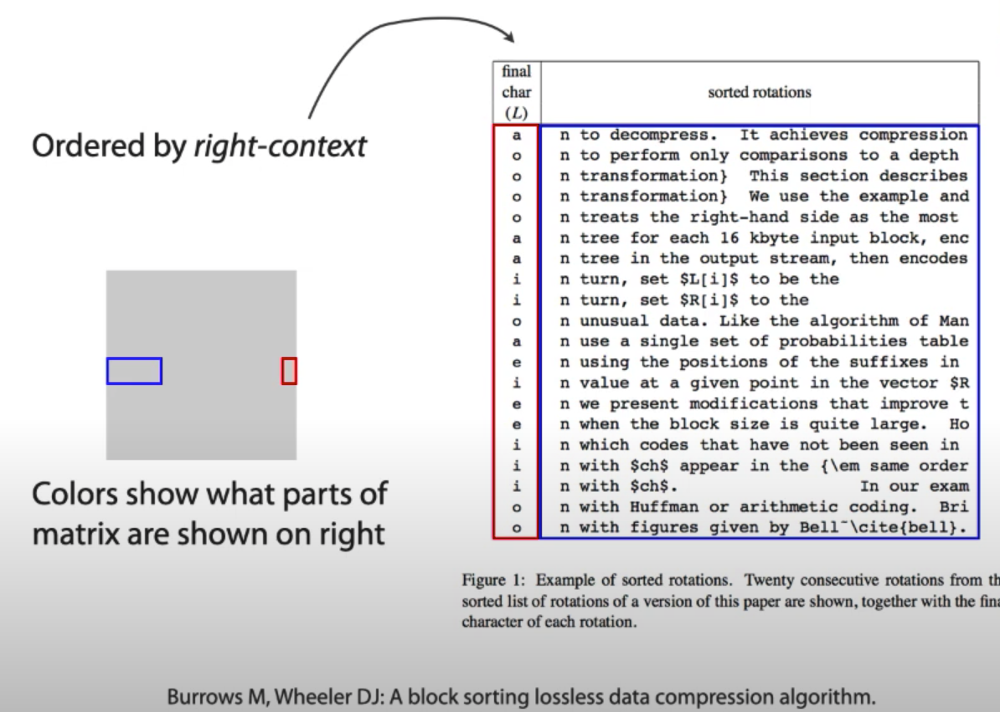

4. Bezzudumu saspiešana: BWT transformācija
=======================================================

**Definīcija:** 
  Par :math:`n` elementu saraksta *permutāciju* (*permutation*) sauc jebkuru
  citu sarakstu, kurā izmainīta šo elementu secība. Šādu permutāciju ir :math:`n!`. 
  Par *ciklisku permutāciju* sauc tādu permutāciju, kurā elementiem saglabājas 
  abi kaimiņi -- t.i. vienu vai vairākus 
  elementus no saraksta beigām var pārlikt uz saraksta sākumu. 

(Ja permutācijas notiek tekstā ar burtiem, kuri atkārtojas, tad variantu skaitu 
nosaka citādi.)

**Piemērs:** 
  Izrakstīt visas cikliskās permutācijas vārdam :math:`\mathtt{BONBON}`. 

**Cikliskās permutācijas tekstā**

  .. figure:: figs/cyclic-permuations.png
     :width: 2in

     Cikliskas permutācijas

  * Ja dotajā tekstā ar garumu "n" visu laiku rotē burtus (pārliek pēdējo burtu uz sākumu utt.), 
    tad pēc "n" soļiem teksts atgriežas sākumstāvoklī. 
  * Ja visas cikliskās permutācijas izraksta vienu zem otras, katrā kolonnā nonāks visi burti, 
    kas ir tekstā. 

**Berouza-Vīlera transformācija**

.. code-block:: 

  B A N A N A $
  $ B A N A N A
  A $ B A N A N 
  N A $ B A N A 
  A N A $ B A N 
  N A N A $ B A 
  A N A N A $ B

.. figure:: figs/alpha-sort.png
   :width: 2in

   Ciklisko permutāciju kārtošana alfabētiski.

Berouza-Vīlera transformācija ir šajā sakārtojumā 
iegūtā pēdējā kolonna. 

**Definīcija:** 
  Par burta "x" *labo kontekstu* sauc tekstu kaut kādā fiksētā garumā "k", 
  kas tieši seko burtam "x" (ja burts "x" ir tuvu vārda beigām, tad 
  kontekstu iegūst cikliski pārvietojoties uz teksta sākumu). 

Berouza-Vīlera transformācija sakārto visus labos kontekstus leksikogrāfiski 
un izraksta teksta burtus secībā, kuru nosaka šie labie konteksti. 

.. note:: 
  Varētu kārtot arī inversi leksikogrāfiski (t.i. alfabētiski, bet skatoties 
  vārdam no otra gala). Šādā gadījumā pirmā kolonna kļūtu par Berouza-Vīlera 
  transformāciju. T.i. var izmantot arī sakārtošanu pēc "kreisajiem kontekstiem". 
  Šādi to apraksta Guy Blelloch *Introduction to Data Compression* grāmatā.

**Kāpēc var atjaunot sākotnējo?**

No Berouza-Vīlera transformācijas (pēdējās kolonnas) var izsecināt, kāda 
būs pirmā kolonna (tie paši burti, bet alfabētiskā secībā). 
Var pamatot, ka vienādo burtu secība Berouza-Vīlera transformācijas rezultātā 
nemainās. Tāpēc pietiek zināt šīs divas kolonnas un izmantot L2F (Last-to-First)
kodējuma tabulu.

Ir arī iespējams atjaunot visu matricu: 

.. figure:: figs/burrows-decode.png
   :width: 7in

   Decode

**Algoritma apraksts**

1. Ciklā katru kolonnu pabīda vienu soli pa labi un 
   tad pārkārto. Permutāciju nosaka pēdējā kolonna matricā. 
2. Šādi, ja mēs varam atrast kolonnu :math:`j`, varam iegūt
   kolonnu :math:`j+1` no kolonnas :math:`j`. Šo atkārtojot, varam 
   atjaunot visu matricu :math:`M`.
3. Lai rekonstruētu sākotnējo tekstu :math:`T`, mums pietiek atrast tikai vienu 
   rindiņu matricā.

.. note::
  Sk. 177 lapu <https://www.cs.helsinki.fi/u/tpkarkka/opetus/12s/spa/lecture11.pdf>`_

Sufiksu masīvi
-------------------------

Praksē garus tekstus saspiež veicot Berouza-Vīlera transformāciju 
atsevišķiem blokiem. Tipisks bloku garums ir apmēram viens megabaits, 
lai tos būtu praktiski apstrādāt un vienlaikus varētu optimāli 
izmantot atrastos kontekstus. Praktisks labums ir arī no īsākiem blokiem - 
dažu kilobaitu garumā.

Berouza-Vīlera transformāciju šādiem gariem blokiem var veikt gandrīz lineārā laikā -- tie ir
*sufiksu masīvi* (*suffix arrays*). 
Sākotnējā implementācija tiem nebūs sevišķi efektīva (tie paši :math:`O(n^2 \log n)`, 
ko nodrošina arī naivais algoritms),
bet sufiksu masīvus var optimizēt - lai izveidotu tos jau :math:`O(n \log n)` laikā. 

Uzdevumi
------------

**4.1. uzdevums**
  Ierakstīt Berouza-Vīlera transformāciju vārdam :math:`\textcolor{blue}{\mathtt{ABBA\$}}`. 
  Aiz tās norādīt, kurā vietā šajā transformācijā ir strings :math:`\textcolor{blue}{\mathtt{ABBA\$}}`.   
  *Piezīme.* Sakārtotajā matricā virkņu numerācija sākas no :math:`1`.

.. only:: Internal 

  **Atbilde:** 

    Iegūst cikliskas `ABBA$` permutācijas, sakārto leksikogrāfiski:

    .. math::

      \left( \begin{array}{ccccc}
      \text{A} & B & B & A & \$ \\
      \$ & A & B & B & A \\
      A & \$ & A & B & B \\
      B & A & \$ & A & B \\
      B & B & A & \$ & A
      \end{array} \right) \rightarrow
      \left( \begin{array}{ccccc}
      \text{\$} & A & B & B & A \\
      A & \$ & A & B & B \\
      A & B & B & A & \$ \\
      B & A & \$ & A & B \\
      B & B & A & \$ & A
      \end{array} \right).

    Transformācijas rezultāts ir labējā kolonna: *AB$BA*.
    Sākotnējā virkne ir 3.rindiņa.

  :math:`\square`

**4.2. uzdevums**
  Iepriekšējā jautājumā iegūtajai `ABBA$` Berouza-Vīlera transformācijas 
  virknei uzrakstīt **Move-to-Front** kodu, ja
  sākotnējā burtu secība alfabētā ir 
  :math:`\textcolor{blue}{\mathtt{\$}} < \textcolor{blue}{\mathtt{A}} < \textcolor{blue}{\mathtt{B}}`.  
  *Piezīme.* **Move-to-Front** algoritmos alfabēta numerācija sākas no :math:`0`.

  * Uzrakstīt virkni, kas iegūta ar Berouza-Vīlera transformāciju.   
  * Uzrakstīt šīs virknes move-to-front kodu. 

.. only:: Internal 

  **Atbilde:** 

    Katrā **Move-to-Front** kodēšanas solī pārliekam
    tekošo simbolu uz alfabēta sākumu. 

    =================  ==================  ==================
    Virkne             Kods                Alfabēts
    =================  ==================  ==================
    `*A*B$BA`            1                   ($,A,B)
    `A*B*$BA`            2                   (A,$,B)
    `AB*$*BA`            2                   (B,A,$)
    `AB$*B*A`            2                   ($,B,A)
    `AB$B*A*`            2                   (B,$,A)
    =================  ==================  ==================

    Iegūtais kods ir `12222`.

  :math:`\square`

**Kopsavilkums:** 

1. Berouza-Vīlera transformācija un tās tālāka saspiešana
2. Bijektīvā Berouza-Vīlera transformācija. 
3. Sufiksu masīvi. 

**Bibliogrāfija:**
  
* `https://www.cs.helsinki.fi/u/tpkarkka/opetus/12s/spa/lecture11.pdf <https://www.cs.helsinki.fi/u/tpkarkka/opetus/12s/spa/lecture11.pdf>`_
* `https://docs.python.org/3/library/bz2.html <https://docs.python.org/3/library/bz2.html>`_
* `https://serverfault.com/questions/2600/how-do-you-set-bzip2-block-size-when-using-tar <https://serverfault.com/questions/2600/how-do-you-set-bzip2-block-size-when-using-tar>`_
