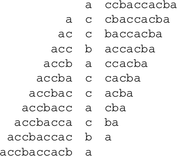
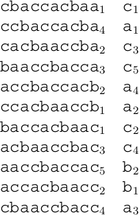
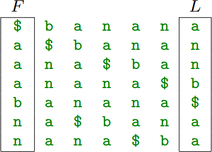
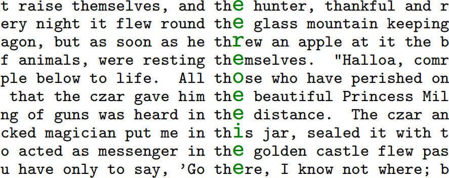
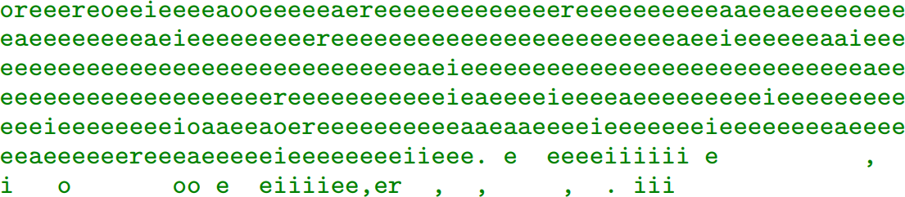

4. Bezzudumu saspiešana: BWT transformācija
=======================================================

**Berouza-Vīlera transformācija**

   Cyclic permutations

Katram burtam atrodam visas cikliskās permutācijas. 
Tās pēc tam sakārtojam inversi-leksikogrāfiski.

**Inversi leksikogrāfiskā kārtība**

   Inverse lexicographic order

Pēc sakārtošanas (sākot ar priekšpēdējo burtu, tad priekšpriekšpēdējo, utt.)
iegūstam matricu, no kuras mums vajag tikai pēdējo kolonnu.

Turklāt vajag zināt, kurā rindiņā ir rakstīta mūsu virkne (šajā piemērā
sākotnējā virkne :math:`a_1c_1c_2b_1a_2c_3c_4a_3c_5b_2a_4` atrodas piektajā
inversi sakārtotās tabulas rindiņā.

**Var kārtot arī parasti leksikogrāfiski**

   Parasta kārtošana

Daudzos avotos (atskaitot G.Blelloch tekstu) 
Berouza-Vīlera transformāciju apraksta izmantojot 
parastu leksikogrāfisku kārtošanu.
Lielas atšķirības teorijā nav (tekstu pirms saspiešanas
var uzrakstīt no otra gala).

**Kāpēc var atjaunot sākotnējo?**

.. figure:: figs/burrows-decode.png
   :width: 7in

   Decode

**Algoritma apraksts**

1. Ciklā katru kolonnu pabīda vienu soli pa labi un 
   tad pārkārto. Permutāciju nosaka pēdējā kolonna matricā. 
2. Šādi, ja mēs varam atrast kolonnu :math:`j`, varam iegūt
   kolonnu :math:`j+1` no kolonnas :math:`j`. Šo atkārtojot, varam 
   atjaunot visu matricu :math:`M`.
3. Lai rekonstruētu sākotnējo tekstu :math:`T`, mums pietiek atrast tikai vienu 
   rindiņu matricā.

.. note::
  Sk. 177 lapu <https://www.cs.helsinki.fi/u/tpkarkka/opetus/12s/spa/lecture11.pdf>`_

Sašķiroti konteksti ļauj saspiest dabīgās valodas tekstus. 
Berouza-Vīlera algoritmā tiek atssevišķi saspiesti gari teksta bloki - 
apmēram 1MiB garumā. 

   Izejas teksts

**Sašķiroti burti pēc TH**

   Izejas teksts

Sufiksu masīvi
-------------------------

Praksē garus tekstus saspiež veicot Berouza-Vīlera transformāciju 
atsevišķiem blokiem. Tipisks bloku garums ir apmēram viens megabaits, 
lai tos būtu praktiski apstrādāt un vienlaikus varētu optimāli 
izmantot atrastos kontekstus. Praktisks labums ir arī no īsākiem blokiem - 
dažu kilobaitu garumā.

Šajā sadaļā aplūkosim veidu, kā praktiski
veikt Berouza-Vīlera transformāciju šādiem gariem blokiem -- tie ir
*sufiksu masīvi* (*suffix arrays*). 
Sākotnējā implementācija tiem nebūs sevišķi efektīva (tie paši :math:`O(n^2 \log n)`, 
ko nodrošina arī naivais algoritms),
bet sufiksu masīvus var optimizēt - lai izveidotu tos jau :math:`O(n \log n)` laikā. 

Uzdevumi
------------

**4.1. uzdevums**
  Ierakstīt Berouza-Vīlera transformāciju vārdam :math:`\textcolor{blue}{\mathtt{ABBA\$}}`. 
  Aiz tās norādīt, kurā vietā šajā transformācijā ir strings :math:`\textcolor{blue}{\mathtt{ABBA\$}}`.   
  *Piezīme.* Sakārtotajā matricā virkņu numerācija sākas no :math:`1`.

.. only:: Internal 

  **Atbilde:** 

    Iegūst cikliskas `ABBA$` permutācijas, sakārto leksikogrāfiski:

    .. math::

      \left( \begin{array}{ccccc}
      \text{A} & B & B & A & \$ \\
      \$ & A & B & B & A \\
      A & \$ & A & B & B \\
      B & A & \$ & A & B \\
      B & B & A & \$ & A
      \end{array} \right) \rightarrow
      \left( \begin{array}{ccccc}
      \text{\$} & A & B & B & A \\
      A & \$ & A & B & B \\
      A & B & B & A & \$ \\
      B & A & \$ & A & B \\
      B & B & A & \$ & A
      \end{array} \right).

    Transformācijas rezultāts ir labējā kolonna: *AB$BA*.
    Sākotnējā virkne ir 3.rindiņa.

  :math:`\square`

**4.2. uzdevums**
  Iepriekšējā jautājumā iegūtajai `ABBA$` Berouza-Vīlera transformācijas 
  virknei uzrakstīt **Move-to-Front** kodu, ja
  sākotnējā burtu secība alfabētā ir 
  :math:`\textcolor{blue}{\mathtt{\$}} < \textcolor{blue}{\mathtt{A}} < \textcolor{blue}{\mathtt{B}}`.  
  *Piezīme.* **Move-to-Front** algoritmos alfabēta numerācija sākas no :math:`0`.

  * Uzrakstīt virkni, kas iegūta ar Berouza-Vīlera transformāciju.   
  * Uzrakstīt šīs virknes move-to-front kodu. 

.. only:: Internal 

  **Atbilde:** 

    Katrā **Move-to-Front** kodēšanas solī pārliekam
    tekošo simbolu uz alfabēta sākumu. 

    =================  ==================  ==================
    Virkne             Kods                Alfabēts
    =================  ==================  ==================
    `*A*B$BA`            1                   ($,A,B)
    `A*B*$BA`            2                   (A,$,B)
    `AB*$*BA`            2                   (B,A,$)
    `AB$*B*A`            2                   ($,B,A)
    `AB$B*A*`            2                   (B,$,A)
    =================  ==================  ==================

    Iegūtais kods ir `12222`.

  :math:`\square`

**Kopsavilkums:** 

1. Berouza-Vīlera transformācija un tās tālāka saspiešana
2. Bijektīvā Berouza-Vīlera transformācija. 
3. Sufiksu masīvi. 

**Bibliogrāfija:**
  
* `https://www.cs.helsinki.fi/u/tpkarkka/opetus/12s/spa/lecture11.pdf <https://www.cs.helsinki.fi/u/tpkarkka/opetus/12s/spa/lecture11.pdf>`_
* `https://docs.python.org/3/library/bz2.html <https://docs.python.org/3/library/bz2.html>`_
* `https://serverfault.com/questions/2600/how-do-you-set-bzip2-block-size-when-using-tar <https://serverfault.com/questions/2600/how-do-you-set-bzip2-block-size-when-using-tar>`_
