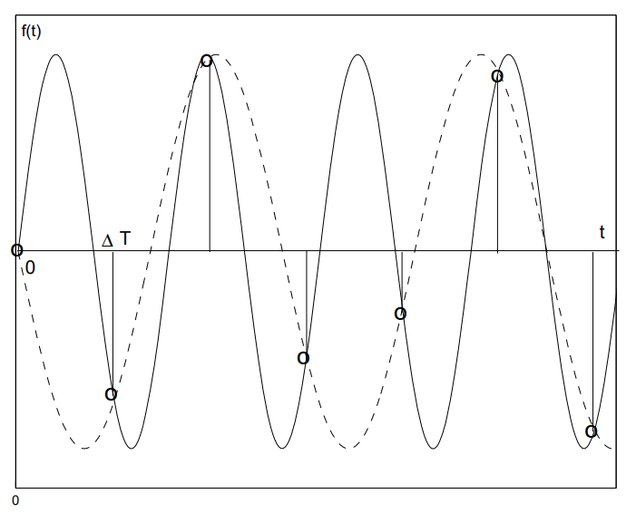
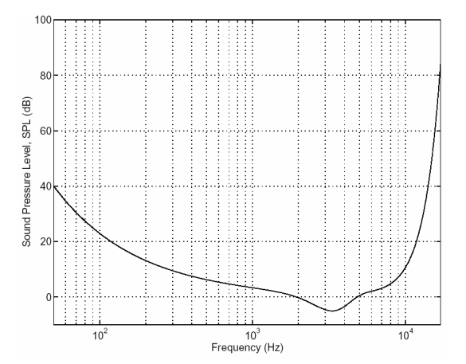
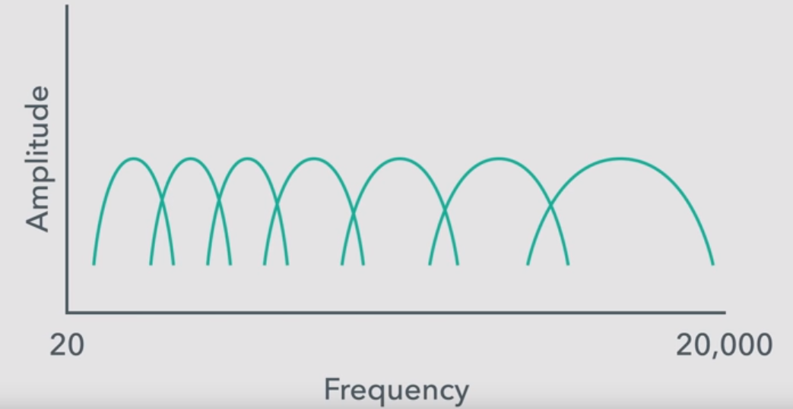
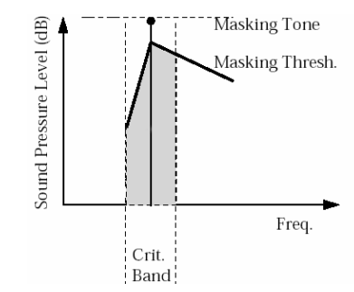
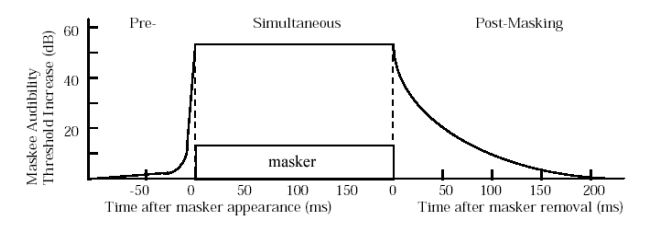
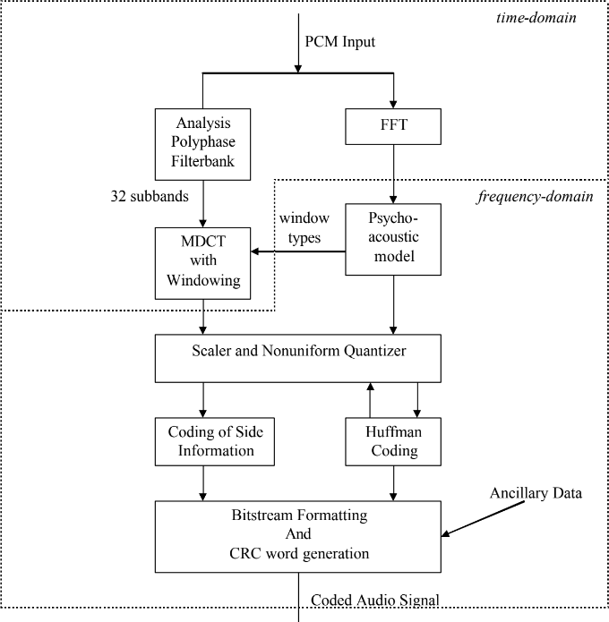
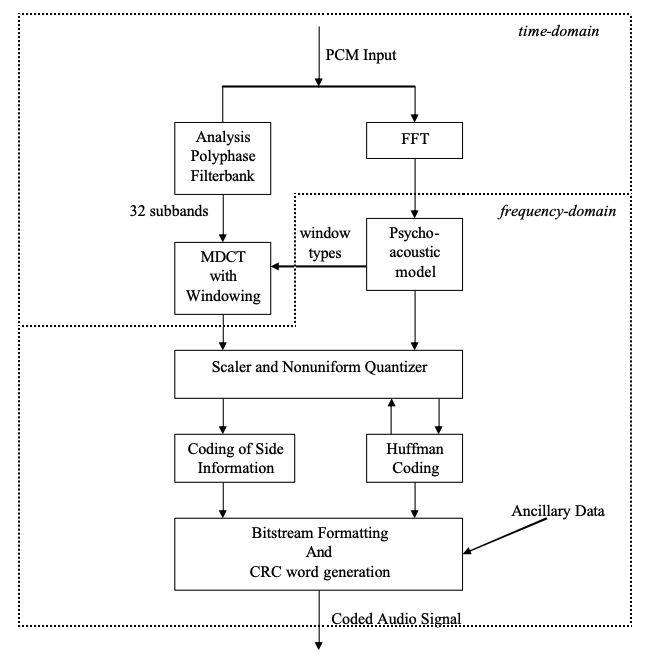
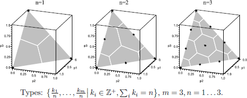

1. Zudumradošā saspiešana: JPEG formāts
==========================================

Apskatām sekojošas sadaļas: 

* Krāsu pārveidojumi
* Diskrētā kosinusu transformācija
* Nobeiguma soļi

Krāsas un kvantizācija (1.-3.solis)
-------------------------------------

Piemērs: melnbalti attēli.

* Attēlā skaitlis :math:`0-255` apzīmē krāsu (no melnas līdz baltai).
* Visus :math:`256` toņus acs neatšķir, tāpēc var attēlot :math:`256` krāsas uz mazāku skaitu.
* Vienkāršākais attēlojums, piemēram
  :math:`f(x) = \left\lfloor\frac{x}{4} \right\rfloor`. 
  Tad :math:`f\,:\,\{0,\ldots,255\} \rightarrow \{0,\ldots,63\}`.
* Praksē lieto sarežģītāku funkciju, kas kopā sagrupē krāsas, kuras acs sliktāk atšķir.

**Vektoru kvantizācija (melnbalti attēli)**

* Krāsainu punktu nosaka :math:`3` vērtības (:math:`\text{Red}, \text{Green}, \text{Blue}`). 
  Telpa :math:`\{ 0,\ldots,255\}^3`.
* :math:`f(x_1, x_2, x_3 ) = (y_1,y_2,y_3)`, tā, lai dažādi trijnieki 
  :math:`(x_1, x_2, x_3)`, kas attēlojas par vienu :math:`(y_1,y_2,y_3)`, būtu grūti atšķirami.

Atkārtojums -- matricas reizināšana ar vektoru ir lineārs pārveidojums jeb funkcija:
:math:`\mathbf{R}^n \rightarrow \mathbf{R}^n`. To pieraksta šādi:

.. math::

   \left( \begin{array}{c} x'_1 \\ x'_2 \\ \cdots \\ x'_n \end{array} \right)
   \approx
   \left( \begin{array}{cccc}
   a_{11} &  a_{12} & \cdots & a_{1n} \\
   a_{21} & a_{22} & \cdots & a_{2n} \\
   \vdots & \vdots & \vdots & \vdots \\
   a_{n1} & a_{n2} & \cdots & a_{nn} 
   \end{array} \right)
   \left( \begin{array}{c} x_1 \\ x_2 \\ \cdots \\ x_n \end{array} \right)

**JPEG algoritma uzdevums**

* JPEG ir algoritms. Arī formāts attēlu glabāšanai.
* Ievade:  punktu attēls, katra punkta krāsu apraksta 
  trīs :math:`8` bitu skaitļi (robežās no :math:`0` līdz :math:`255`) -- 
  R, G, B (red, green, blue). 
* Mērķis -- iegūt saspiestu failu, no kura var atjaunot attēlu, 
  kas ir līdzīgs sākotnējam. Saspiešana notiek ar zudumiem.
* Soļi ir saistīti ar to, kā cilvēks uztver krāsu.

**JPEG 1.solis: Pārveido no RGB par YIQ**

Y,I,Q vērtības iegūst no R,G,B vērtībām, pareizinot tās ar koeficientu matricu. 
Šis pārveidojums ir atgriezenisks (bezzudumu), t.i., zinot YIQ 
vērtības, var atjaunot RGB vērtības.

+-------------------------------------+-------------------------------------+
| .. image:: figs/kuldiga.png         | .. image:: figs/kuldiga1.png        |
|    :width: 100%                     |    :width: 100%                     |
+-------------------------------------+-------------------------------------+
| .. image:: figs/kuldiga2.png        | .. image:: figs/kuldiga3.png        |
|    :width: 100%                     |    :width: 100%                     |
+-------------------------------------+-------------------------------------+

**Kas ir YIQ?**

.. figure:: figs/YIQ_IQ_plane.svg.png
   :width: 3in

   IQ plakne, ja :math:`Y=0.5`

* "Y" - Luma informācija (melnbaltās televīzijas attēliem)
* "I" - *in-phase*, "Q" - *quadrature* (NTSC - analogās krāsu televīzijas žargons)

Redze precīzāk uztver "I" (pāreju no oranžā uz zilo) nevis
"Q" (pāreju no zaļā uz violeto) - tāpēc Q var vairāk saspiest.

**Pārveidojums no RGB uz YIQ**
  Šeit :math:`R,G,B` ir veseli skaitļi no intervāla :math:`[0;255]`. 
  
  * Vispirms intervālu :math:`[0;255]` vienmērīgi saspiež līdz :math:`[0;1]`, 
    izdalot visus skaitļus ar :math:`255`. 
  * Pēc tam reizina ar lineāra pārveidojuma matricu:  

    .. math::

       \left( \begin{array}{c} 
       Y \\ 
       I \\ 
       Q 
       \end{array} \right)
       \approx
       \left( \begin{array}{ccc}
       0.299 &  0.587 &  0.114 \\
       0.5959 & -0.2746 & -0.3213 \\
       0.2115 & -0.5227 &  0.3112
       \end{array} \right)
       \left( \begin{array}{c} 
       R \\ 
       G \\ 
       B 
       \end{array} \right)

  * Visbeidzot panāksim, ka jaunizveidotie parametri: :math:`Y \in [0;1]`, 
    :math:`I \in [-0.5957; 0.5957]`, un :math:`Q \in [-0.5226; 0.5226]`. 
    Lai tas notiktu, pēc lineārā pārveidojuma veic vēl 
    vērtību apgriešanu pret gada maksimālo vai vidējo ar šādām formulām: 

    .. math:: 

      \left\{ \begin{array}{l}
      Y' := Y, \\
      I' := \max(\min(I, 0.5957), -0.5957), \\
      Q' := \max(\min(q, 0.5226), -0.5226). \\
      \end{array} \right.

**Pārveido atpakaļ uz RGB:**

Ja nepieciešams, var arī pārveidot atpakaļ: 

.. math::

   \left( \begin{array}{c} 
   R \\ 
   G \\ 
   B 
   \end{array} \right)
   \approx
   \left( \begin{array}{ccc}
   1 &  0.956 &  0.619 \\
   1 & -0.272 & -0.647 \\
   1 & -1.106 &  1.703
   \end{array} \right)
   \left( \begin{array}{c} 
   Y \\ 
   I \\ 
   Q \end{array} \right)

**JPEG 2.solis**

.. figure:: figs/sparser-grid.png
   :width: 1.5in

   Režģa izretināšana (*Skipping grid*)

Patur visas "Y" vērtības (melnbalto/gaišuma komponenti), 
taču katrā virzienā atstāj tikai katru otro "I" un "Q" vērtību 
(datu punktu skaits samazinās :math:`4` reizes). 
Redze pārmaiņas gaišumā uztver daudz labāk nekā pārmaiņas nokrāsā.

**JPEG 3.solis**

YIQ vērtības sadala :math:`8 \times 8` blokos. Tā kā tika atstāta tikai katra 
otrā "I" un "Q" vērtība, tad šo bloku izmērs sākotnējā attēlā ir 
:math:`16 \times 16`. Katrs bloks tiek apstrādāts atsevišķi.

Kosinusu transformācija utt. (4.-7. solis)
-------------------------------------------

**JPEG 4.solis**

Katram :math:`8 \times 8` blokam DCT lieto abos virzienos:

.. math::

   \begin{array}{ll}
   x'_0 = \frac{1}{\sqrt{8}} \sum\limits_{k=0}^7 x_k \\
   x'_j = \frac{2}{\sqrt{8}} \sum\limits_{k=0}^7 \cos \frac{j(2k+1)\pi}{8}x_k,\;\;\mbox{ja $1 \leq j \leq 7$}\\
   \end{array}

Vispirms diskrēto kosinusu transformāciju pielieto katrai matricas kolonnai,
pēc tam to pašu izdara katrai iegūtās matricas rindai.

.. code-block:: python 

  import numpy as np
  from scipy.fftpack import dct, idct

  def dct2(arr):
      return dct(dct(arr.T, norm='ortho').T, norm='ortho')

  def idct2(arr):
      return idct(idct(arr.T, norm='ortho').T, norm='ortho')

  # Create an 8x8 matrix with random values between 0 and 1
  matrix = np.random.rand(8, 8)
  print(matrix)
  dct_coefficients = dct2(matrix)
  print(dct_coefficients)
  inverse_dct = idct2(dct_coefficients)
  print(inverse_dct)

**JPEG 5.solis**
  Elementu :math:`x''_{ij}` noapaļojam līdz precizitātei :math:`a_{ij}` (dala 
  ar :math:`a_{ij}` un apaļo uz leju ar :math:`\lfloor x \rfloor`). 
  Elementu atšķirības, kas ir mazākas par :math:`a_{ij}` ir nebūtiskas. 
  Galvenā viltība ir tā, ka skaitļi  atšķiras dažādiem matricas elementiem. 
  Tās komponentes, kuras acs uztver vājāk, tiek noapaļotas ar 
  zemāku precizitāti. Mazākā vērtība :math:`a_{13} = 10`, lielākā -- :math:`a_{65} = 121`.

**JPEG 6.solis**
  * Visu :math:`8 \times 8` matricu kreisos augšējos elementus saliek 
    kopīgā virknē. Šādi tiks iegūtas trīs virknes -- 
    katrai no trim krāsu telpas YIQ komponentēm. 
  * Raksta starpības :math:`a_1, a_2-a_1, a_3 - a_2,\ldots`.

**JPEG 7.solis**
  Iegūtajai starpību virknei lieto Hofmana vai aritmētisko kodēšanu.

MP3, Zudumradoši algoritmi skaņai
-----------------------------------

**MP3 (MPEG-1 Audio Layer 3)**
  Standarts radies 1991.g. Vācijā. Līdz 2017.g. bija patentēts *Fraunhofer Society*, kas 
  apgrūtināja softa radīšanu šim formātam. 
  Izmantots *Internet Underground Music Archive* (neatkarīgo mūzikas mākslinieku publicēšanās 
  vieta), kļuva populārs pateicoties *Winamp* atskaņotājam un *Napster* failu apmaiņas servisam. 

**Advanced Audio Coding (AAC):** 
   Tālāka MP3 attīstība, ņemot vērā cilvēku psihoakustiskās īpašības un ar  
   labāku skaņas kvalitāti tam pašam *bitu ātrumam* (*bit rate*).

**Opus:**   
  Laba skaņas kvalitāte dažādiem bitu ātrumiem, lieto reālā laika aplikācijām 
  (VoIP) pateicoties zemajai *aizkavēšanai* (*delay*). 

**FLAC (Free Lossless Audio Codec)**
  Vienīgais no kodekiem, kas ir bezzudumu. Audio kvalitāte ir identiska sākotnējam 
  audio failam. 

**OGG Vorbis:** 
  Veidots uz līdzīgiem principiem kā MP3, bet savlaicīgi izvairījies no patentētām 
  tehnoloģijām. Populārs starp atvērtā koda entuziastiem, pirātisku skaņas failu izplatītājiem. 

**MP3 mērķi**

* Saspiest mūziku u.c. audiofailus, lai tos varētu pārraidīt 
  datortīklos un glabāt mūzikas atskaņotājos. 
* Publiska programmatūra parādījās ap 1994.g.
* Līdz pat 2017.g. *Fraunhofer Institute for Integrated Circuits*
  uzlika tam ierobežojošas licences. 
* Mūsdienās MP3 ir "mantots" (*legacy*) jeb "miris" formāts, bet 
  tam joprojām plašs rīku atbalsts.
* Mūsdienās radio un video straumēšana izmanto ISO-MPEG kodekus; 
  piemēram, AAC (Advanced Audio Coding) vai MPEG-H; bet MP3 joprojām daudz 
  kur tiek radīts un atbalstīts. 

**Parauga ātrums (sample rate)**

* *Sample rate* mēra hercos (1 Hz = 1 :math:`s^{-1}`) - cik reizes
  sekundē kaut kas notiek. 
* CD-ROM kvalitātes ierakstam parasti vajag 
  ap 44.1 kHz (CD). (Ir arī 
  standarti, kas izmanto 48 kHz, 88.2 kHz, vai 96 kHz.)

**Naikvista-Šenona teorēma:** (*Nyquist-Shannon Sampling theorem*)
  Ja funkcijai :math:`x(t)` (pēc Furjē transformācijas pielietošanas)
  nav frekvenču, kas pārsniegtu :math:`B` hercus, tad to 
  var pilnībā (bez zudumiem) atjaunot, ja zināmas tās 
  vērtības ik pēc laika intervāliem :math:`\Delta t = 1/(2B)`.

**Ekvivalenti apgalvojumi**

**Nyquist-Shannon 1:**
  Funkciju :math:`f(t)`, kuras vērtības zināmas pēc vienādiem laika intervāliem 
  :math:`\Delta T` var viennozīmīgi atjaunot no šīm vērtībām :math:`\{ f_n \}` 
  tad un tikai tad, ja :math:`f(t)` enerģijas spektrs nesatur frekvences virs :math:`\frac{\pi}{\Delta T}` rad/s. 

**Nyquist-Shannon 3:** 
  Ir tikai viena funkcija :math:`f(t)`, kuras frekvenču spektrs viss atrodas zem :math:`\frac{\pi}{\Delta T}`, 
  ko apmierina dotās vērtības :math:`\{ f_n \}`.

`Lecture10 in 2.161 <https://ocw.mit.edu/courses/mechanical-engineering/2-161-signal-processing-continuous-and-discrete-fall-2008/lecture-notes/lecture_10.pdf>`_

**Kas notiek, ja neievēro teorēmu**

   Sinusu starpība

**Bitu pārraide? (bitrate)**

* Svarīgākais saspiešanas parametrs. 
* MP3 (MPEG layer 3 standarts) atļauj bitu ātrumus no 8 kbit/s līdz 320 kbit/s. 
  Noklusējums ir 128 kbit/s.
* Salīdzinājumam, audio CD-ROM satur 2048 baitus sektorā 
  (un atskaņo 75 sektorus sekundē). Tātad  = 153,600 baiti sekundē jeb 
  1200 kbit/s. 

Tipiski MP3 faili ir 10-reiz mazāki par audio kompaktdiska failiem. 

`CD-ROM bitrate <https://en.wikipedia.org/wiki/Compact_Disc_Digital_Audio#Bit_rate>`_

**CBR un VBR**

*Constant bitrate* un *Variable bitrate* - var lietot gan vienu, gan otru. 

* Mūzikas sarežģītība var būt atkarīga no tā, cik daudzi instrumenti spēlē. 
  VBR to risina, ļaujot bitu ātrumam mainīties atkarībā no signāla. 
  Mūzikas gabalu sadala vairākos *freimos* (*frames*) un iekodē ar atšķirīgiem 
  bitu ātrumiem. 
* Ieraksta kvalitāti VBR gadījumā nosaka lietotāja izraudzīts parametrs (maksimāli 
  atļautais bitu ātrums). 
* VBR var radīt dažiem atskaņotājiem (dekoderiem) grūtības pateikt, cik ilgi gabals skanēs. 
* VBR nav piemērots straumēšanai. 

**Dzirdamās skaņas frekvences** 

* Cilvēka ausis var uztvert no :math:`20` līdz :math:`20\,000` hercu 
  skaņas frekvenci. Pusmūža cilvēki - no :math:`16\,000` herciem 
  (*dog whistle* uz dzirdamības diapazona robežas). 
* Pirmās oktāvas "la" (jeb **A4**) izmanto toņdakšu, 
  ko sauc **Stuttgart pitch**, kam
  ir 440 Hz (nosvārsta gaisu 440 reizes sekundē). 
  Ja frekvence palielinās divkārt, skaņa par oktāvu augstāka. 
* "Labi temperēta" skaņu skala saliek :math:`12` pustoņus 
  ar vienādām blakusesošo pustoņu frekvenču attiecībām. 
* Piemēram, "do" (C) un "do diēzs" (Cis) frekvenču
  attiecība ir :math:`1` pret :math:`\sqrt[12]{2}`. 

   Dzirdamības slieksnis atkarībā no skaņas frekvences

**Analizējošās filtrubankas (filterbanks)**

Atdarina cilvēka ausī esošās struktūras, no kurām katra uztver 
skaņas kaut kādā šaurā frekvenču diapazonā. 
Šo diapazonu cilvēkam ir :math:`24`, tie noskaidroti eksperimentāli.  

   Kritiskās frekvenču joslas (*Critical bands*)

Skaņu plūsmā ir dažas situācijas, kad viens tonis
nomaskē otru (MP3 paredz, ka otru toni nevarēs dzirdēt; 
tāpēc tas tiek nomaskēts). Divi gadījumi - 
tuva frekvence, laika sakritība.

**Skaņas maskēšana**

   Vienlaicīgā maskēšana (*Simultaneous Masking*)

   Temporālā maskēšana (*Temporal Masking*)

**FFT (ātrā Furjē transformācija)**

   Full MP3 model

* Ik pēc aptuveni 25 ms rodas jauns MP3 freims. 
* Tajā saspiež esošās frekvences ar FFT. 
  "Sample rate" (ap 40Hz) ir tāds, ka vienā freimā
  ir 1152 datu punkti. 

**Stereo-mūzikas dati**

**Joint Stereo** pārraida kreisās un labās auss skaņu 
divos kanālos: Vienā kanālā summu, otrā kanālā - starpību. 

* Tā kā abām ausīm ir ļoti līdzīga skaņa, tad summa ir 
  vidējota skaņa, bet starpība ir neliela un to var labi saspiest. 
* Cilvēka telpiskā skaņas uztvere (*immersive sound*) ir ļoti niansēta: 
  skaņas virzienu/azimutu var sadzirdēt ar 1 grāda precizitāti; 
  augstumu virs horizonta - ar apmēram 10 grādu precizitāti.
* Joprojām grūti risināms jautājums, kā novietot skaļruņus un mainīt
  austiņās dzirdamās lietas, ja cilvēks pārvietojas telpā. 
  Bet MP3 šo nerisina.

   MP3 saspiešanas process.

Kvantizācija citās jomās
-------------------------------

**Definīcija:**
  Dotai punktu kopai :math:`S` par *Voronoja diagrammu* (*Voronoi diagram*) sauc plaknes vai plaknes apgabala 
  punktu sadalījumu klasēs atkarībā no tā, kurš punkts no :math:`S` ir tuvākais. 
  
Voronoja diagrammas klašu skaits sakrīt ar kopas :math:`S` elementu skaitu. 
Voronoja diagramma sastāv no daudzstūrveida šūnām, kur katras šūnas iekšpusē ir :math:`S` punkts. 

   Kvantizācijas piemērs

**Proporcionālās vēlēšanu sistēmas**

**Definīcija:** 
  Baricentriskās koordinātes 3 dimensijās piekārto katram punktam regulārā trijstūrī
  :math:`ABC` nenegatīvu skaitļu trijnieku :math:`(x,y,z)`, kas apmierina sakarību 
  :math:`x+y+z = 1`. 

  .. figure:: figs/surface-xyz.png
     :width: 3in

Baricentriskās koordinātes ļauj attēlot proporcijas 
starp trim pozitīviem (vai nenegatīviem) skaitļiem. 
(Ja atļauj arī negatīvas baricentriskās koordinātes, tad tās piekārto skaitļu 
trijnieku :math:`x + y + z = 1` katram plaknes punktam, bet tādas šajā kursā 
neizmantosim.)

**Donta (D'Hondt) sistēma**

  .. figure:: figs/hondt.png
     :width: 3in

     Donta (*D'Hondt*) metode 4 deputātu krēsliem un 3 partijām. 

**Senlaga (Sainte-Laguë) sistēma**

  .. figure:: figs/sainte-lague.png
     :width: 3in

     Senlaga (*Sainte-Laguë*) metode 5 deputātu krēsliem un 3 partijām

Uzdevumi
----------

**5.1. uzdevums:**
  Izmantojam krāsu saspiešanai kvantizācijas algoritmu, kas lieto tikai 
  pārlūkprogrammām draudzīgās krāsas: 
  `Browser-safe color palette <https://whatis.techtarget.com/definition/216-color-browser-safe-palette>`_

  * Pārlūkprogrammām draudzīgas ir tās krāsu koordinātes, kam abi hex cipariņi ir vienādi un dalās ar :math:`3` 
    (:math:`00,33,66,99,\text{CC},\text{FF}`). Ja krāsai visas 3 koordinātes ir draudzīgas, 
    tad arī pati krāsa ir draudzīga. Teiksim, `00FF99` ir draudzīga krāsa, bet `22BB99` nav, jo 
    "22" un "BB" koordinātes nav atļautas.
  * Katru attēlā esošo pikseli (katru no RGB koordinātēm) noapaļo līdz tuvākajai draudzīgajai
    no kopas (:math:`00,33,66,99,\text{CC},\text{FF}`), lai iegūtu pārlūkprogrammai draudzīgu krāsu. 

  Kāds ir saspiešanas koeficients šādam pārveidojumam (jaunais izmērs pret veco izmēru). 

**Bibliogrāfija** 

1. `The MP3 is dead, say creators after terminating licensing 
   <https://www.cnbc.com/2017/05/15/mp3-dead-say-creators-after-terminating-licensing.html>`_ -- 
   par audioformātu attīstību.
2. `Ungārijas 2018.g. vēlēšanas <https://en.wikipedia.org/wiki/2018_Hungarian_parliamentary_election>`_ -- 
   kā Donta metode palīdz noapaļot rezultātus par labu lielākajai partijai.
3. `The Theory Behind Mp3 <http://www.mp3-tech.org/programmer/docs/mp3_theory.pdf>`_ -- 
   galvenās idejas audiofailu saspiešanai. 