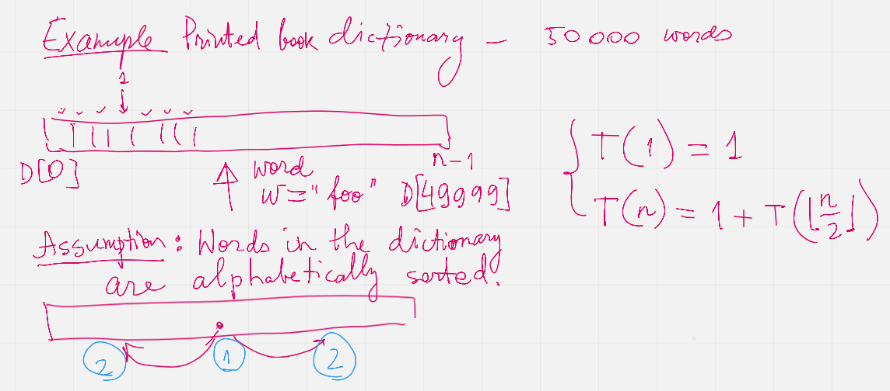
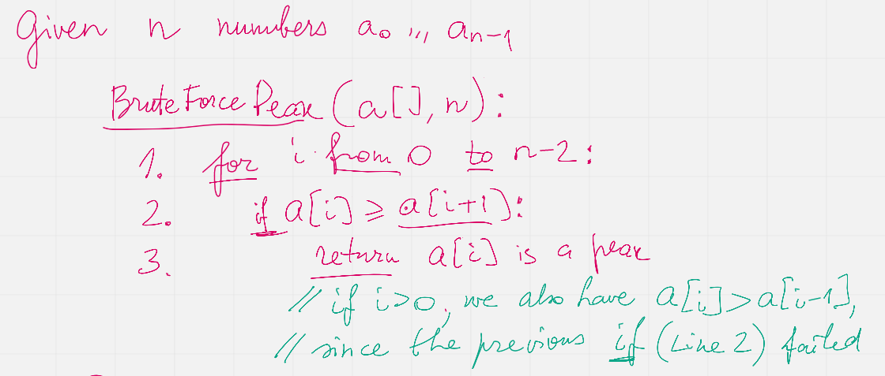
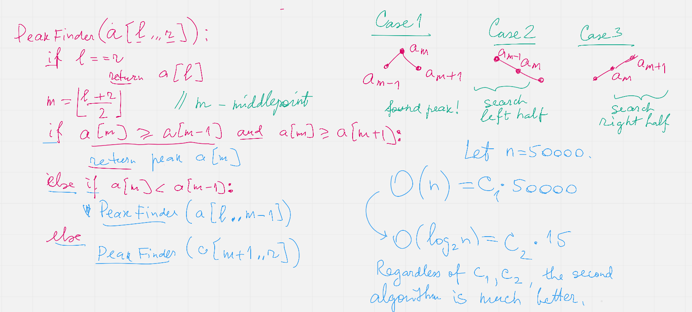

Week01A: Lecture Notes
=======================

Goals of this Course
-----------------------

Programming courses where we solve problems using language like C++ can have different focus. 

* The programming language itself and its expressive power (for example, could have entire semester on various advanced features of C++). 
* Object Oriented Programming and design. This could include creating the most appropriate OO design at the level of UML diagrams and Design patterns. 
* Software engineering process -- approaches to insure optimum quality and testability of the software. 
* Efficiency of the algorithms being used -- their time and space complexity. 

The focus of this course is obviously the efficiency; namely -- creating algorithms that can work on 
large input data sets or handle complex mathematical structures sufficiently fast. 
All the other aspects of programming serve the purpose of learning about algorithms and their efficiency.

* C++ language features being used -- console applications (plaintext files for input and output).
  STL and C++ template classes are used to implement data structures. 
* Object orientation serves to isolate concerns by separating data structure code from the remaining algorithms. 
  Design patterns and other advanced OO stuff can be used, if students find it useful -- but algorithm learning 
  is largely independent from it. 
* Ability to test our software (including unit tests) and also to measure the speed of our code is essential.

Formal Requirements
^^^^^^^^^^^^^^^^^^^^^

The maximum overall grade is 100% (100 percentage points). 
Your numeric grade will be obtained by dividing your actual percentage points by :math:`10` and by 
rounding to the nearest integer. 
For example, the minimum number of percentage points to get the grade "10" is 95% (and the minimum number of 
percentage points to get the grade "4" is 35%). 

All the percentage points in this section are relative to the overall maximum grade. 

1. Four programming tasks (40% total; 10% per task). These problems ask you to solve some problem using algorithms and data structures 
   covered in the class. (The first tasks let you use any data structures you want, but 
   tasks #3 and #4 may ask you to refrain from using the built-in STL libraries and similar data structure implementations 
   and to use your own.) 
2. One design and solution description (20% total): Algorithm analysis, class design, test creation and finally -- test-driven development. 
   Half of the credit -- 10 percentage points are given for the submitted analysis paper. Another 10 percentage points are given for the implementation. 
3. Midterm (20%) -- algorithmic tasks done on paper (writing pseudocode, drawing pictures of data structures and running 
   some algorithmic steps there). 
4. Final (20%) -- similar to the midterm, but refers to the second half of the course. 

Midterm and final will not ask you to implement any code. 
To prepare for these exams we will solve problems (especially on Wednesday 14:30 lab sessions) that resemble midterms and finals.
Such training tasks will not affect your grade, but you are encouraged to practice them. 

Office Hours
^^^^^^^^^^^^^

Use a link to register -- `<https://calendly.com/kalvis-apsitis/office-hours?month=2022-02>`_; 
instructor will send a Zoom link. You are encouraged to come in groups as well. 

There will be strongly suggested office hours (about one 30 minute session) **before** the first programming task is due. 
This would help to ensure that your directory layout, compilation and testing approach is the same as that used
by the instructor. 

    
  

How to Determine Algorithm Efficiency?
----------------------------------------

Looking Up an Item in a List
^^^^^^^^^^^^^^^^^^^^^^^^^^^^^^

**Problem:**
  There is a dictionary (the traditional printed book variety) with :math:`50\,000` words written in the
  English alphabet (26 letters; assume that all of them are lowercase). 
  The words in the dictionary are sorted alphabetically. 
  The task is to find a given word :math:`w` (such as :math:`w = \mathtt{efficiency}`) in this 
  dictionary or to report that there is no such word.

.. note::
  There is also a data structure named *dictionary* (storing keys and values); 
  here we use the everyday notion of a dictionary -- an alphabetically arranged
  list of words. 

**Linear (Brute Force) Solution:** 

Let us have a zero-based dictionary :math:`D` with :math:`n` items
from :math:`D[0]` to :math:`D[n-1]`. 

| :math:`\text{\sc LinearSearch}(D,w)`
| 1. :math:`\;\;\;\;\;` **for** :math:`i` **in** :math:`\text{\sc range}(0,n)`:
| 2. :math:`\;\;\;\;\;\;\;\;\;\;` **if** :math:`w` ``==`` :math:`D[i]`:
| 3. :math:`\;\;\;\;\;\;\;\;\;\;\;\;\;\;\;` **return** :math:`\text{\sc found}` :math:`w` at location :math:`i`
| 4. :math:`\;\;\;\;\;` **return** :math:`\text{\sc not found}`

This method in the real life would mean somebody scanning through all the words in a dictionary 
and searching for the match with the given word :math:`w`. 
This would be very inefficient. The only advantage for this approach -- we do not need any assumptions
about the word order in the dictionary -- the algorithm would work equally well even for 
totally unordered list of words.

**Binary Search Solution:** 

Binary search is a different algorithm that relies on the alphabetical sorting of the 
dictionary :math:`D[0]<D[1]<\ldots<D[n-2]<D[n-1]`.
At every point we maintain a closed interval :math:`[\ell, r]` so that the index :math:`D[i]=w` we want to 
find satisfies the inequalities :math:`\ell \leq i \leq r`. 

The initial call is :math:`\text{\sc BinarySearch}(D,\ell, r,w)`, where :math:`\ell = 0` and :math:`r = n-1`. 
After that the binary search may call itself recursively on shorter intervals. 

| :math:`\text{\sc BinarySearch}(D,\ell, r, w)`
| 1. :math:`\;\;\;\;\;` **if** :math:`\ell > r`:
| 2. :math:`\;\;\;\;\;\;\;\;\;\;` **return** :math:`\text{\sc not found}` :math:`w`
| 3. :math:`\;\;\;\;\;` :math:`{\displaystyle m = \left\lfloor \frac{\ell + r}{2} \right\rfloor}`
| 4. :math:`\;\;\;\;\;` **if** :math:`w` ``==`` :math:`D[m]`:
| 5. :math:`\;\;\;\;\;\;\;\;\;\;` **return** :math:`\text{\sc found}` :math:`w` at location :math:`m`
| 6. :math:`\;\;\;\;\;` **else** **if** :math:`w < D[m]`:
| 7. :math:`\;\;\;\;\;\;\;\;\;\;` **return** :math:`\text{\sc BinarySearch}(D,\ell, m-1, w)`
| 8. :math:`\;\;\;\;\;` **else**:
| 9. :math:`\;\;\;\;\;\;\;\;\;\;` **return** :math:`\text{\sc BinarySearch}(D,m+1, r, w)`

Finding a Peak in a Numeric Sequence
^^^^^^^^^^^^^^^^^^^^^^^^^^^^^^^^^^^^^^

**Definition:** 
  Given a sequence :math:`a_i` (:math:`i = 0,\ldots,n-1`) we call its element :math:`a_i` a *peak* 
  iff it is a local maximum (not smaller than any of its neighbors): 
  
  .. math:: 
  
    a_i \geq a_{i-1}\;\;\text{\bf and}\;\; a_i \geq a_{i+1}

  In case if :math:`i=0` or :math:`i = n-1`, one of these neighbors does not exist; and in such cases we 
  only compare :math:`a_i` with neighbors that do exist.

**Brute Force Algorithm:** 

  
  
.. note::
  Observe that in every nonempty numeric sequence :math:`a_i` there exist at least one peak (for example, 
  the global maximum is always a peak). On the other hand, peaks are not necessarily unique. 
  In particular, if the sequence is constant (all members are equal), then any member there is a peak.

Big-O-Notation
^^^^^^^^^^^^^^^

**Definition:** 
  Let :math:g \colon \mathbb{N} \rightarrow \mathbb{R}_{0+}` be a function from natural numbers (non-negative integers)
  to non-negative real numbers. 
  Then :math:`O(g)` is the set of all functions :math:`f \colon \mathbb{N} \rightarrow \mathbb{R}`
  such that there exist real constants :math:`c>0` and :math:`n_0 \in \mathbb{N}` such that 
  
  .. math::
    
    \forall n \in \mathbb{N}\ \big( n \geq n_0 \rightarrow | f(n) | \leq c \cdot g(n) \big).
    
  
  
**Examples:** 
  Show using the above definition of :math:`O(g)` the following facts: 
  
  **(A)**
    :math:`f(n) = 13n + 7` is in :math:`O(n)`. (Formally, :math:`f \in O(g)`, where :math:`g(n) = n`.)
    
  **(B)**
    :math:`f(n) = 3n^2 - 100n + 6` is in :math:`O(n^2)`. 

  **(C)**
    :math:`f(n) = 3n^2 - 100n + 6` is in :math:`O(n^3)`. 
    
  **(D)**
    :math:`f(n) = 3n^2 - 100n + 6` is **not** in :math:`O(n)`. 

For every example (every pair of functions :math:`g(n)` and :math:`f(n)`) 
either find :math:`c>0` and :math:`n_0 \in \mathbb{N}` such that the definition is satisfied, 
or demonstrate that such :math:`c>0` and :math:`n_0` cannot exist.

