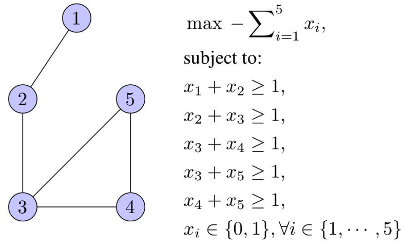

9. Lineārā programmēšana
======================================

Šajā nodaļā uzzinām, kāpēc 
vajadzīga lineāru izteiksmju maksimizēšana, ko parasti sauc par *lineāro programmēšanu*. 
Un arī, kāpēc lineārās optimizācijas uzdevumi pierakstāmi noteiktā formā. 

Ievads: Optimizācijas uzdevumi 
--------------------------------

* Definēt dažus optimizācijas uzdevumu veidus
* Uzrakstīt lineārās programmēšanas uzdevumu vispārīgā formā.
* Izveidot grafisku interpretāciju LP uzdevumam nelielam dimensiju skaitam.

**Optimizācijas uzdevumu veidi** 

  Optimizācijas uzdevumos maksimizējam (vai minimizējam) kādu izteiksmi  
  (piemēram, peļņu vai izmaksas). Vai nu visā izteiksmes definīcijas apgabalā, 
  vai arī pie dotiem nosacījumiem jeb ierobežojumiem.

* Optimizācija bez nosacījumiem: Minimizēt :math:`f(x_1, x_2, \ldots, x_n)`. 
  Ja :math:`f` ir lineāra funkcija, tad tā var pieņemt cik patīk lielas (vai mazas) 
  vērtības.

* Optimizācija ar nosacījumiem: Minimizēt :math:`f(x_1, x_2, \ldots, x_n)` pie nosacījumiem

  .. math:: 
  
    \begin{array}{l}
    c_1(x_1, x_2, \ldots, x_n) \geq 0, \ldots, c_k(x_1, x_2, \ldots, x_n) \geq 0,\\
    d_1(x_1, x_2, \ldots, x_n) = 0, \ldots, d_{\ell}(x_1, x_2, \ldots, x_n) = 0.\\
    \end{array}

**Lineārā programmēšana:** 
  Minimizēt
  :math:`{\displaystyle \sum\limits_{i=1}^{n} b_ix_i}`  pie nosacījumiem

  .. math:: 

    \left\{ \begin{array}{l}
    c_{11} x_1 + c_{12} x_2 + \ldots + c_{1n} x_n \leq d_1,\\
    \ldots,\\
    c_{m1} x_1 + c_{m2} x_2 + \ldots + c_{mn} x_n \leq d_m,
    \end{array} \right.

*Piezīme:* Vārds "programmēšana" lietots nozīmē "plānošana". 
Dažus optimizācijas uzdevumu veidus sauc par programmēšanu jau 
kopš 1920.-tajiem gadiem.

**Kvadrātiskā programmēšana**
  (*Kursā netiek aplūkota, bet arī praktiski nozīmīga.*)

  Minimizēt sekojošu izteiksmi: 

  .. math:: 
    
    \sum\limits_{i,j=1}^{n} a_{ij}x_ix_j +  \sum\limits_{i=1}^{n} b_ix_i

  pie nosacījumiem

  .. math:: 

    \left\{ 
    \begin{array}{l} 
    c_{11} x_1 + c_{12} x_1 + \ldots + c_{1n} x_n \leq d_1,\\
    \ldots,\\
    c_{m1} x_1 + c_{m2} x_1 + \ldots + c_{mn} x_n \leq d_m,
    \end{array} \right.

  Šajā gadījumā minimizējamā funkcija ir kvadrātiska, bet nosacījumi ir lineāri. 

**Lineārā veselo skaitļu programmēšana** 
  Jeb lineārā programmēšana veselos skaitļos (*Integer Programming*):
  uzdevums tāds pats kā lineārā programmēšanā, tikai klāt nāk nosacījums, 
  ka visi :math:`x_1, x_2, \ldots, x_n` ir veseli skaitļi.

  Ar lineārajām programmām veselos skaitļos 
  var aprakstīt daudzus interesantus un praktiski svarīgus uzdevumus, 
  bet nav zināms algoritms, kas ātri (polinomiālā laikā) atrisina 
  patvaļīgu veselo skaitļu programmu. 

NP-pilni uzdevumi
~~~~~~~~~~~~~~~~~~~~~

**Apgalvojums:** 
  Veselo skaitļu programmēšanas uzdevums ir NP-pilns: 
  tas pieder labi pazīstamai uzdevumu saimei, kurus var visus citu uz citu reducēt.  
  (Efektīvs algoritms nav zināms. Ja tādu veselo skaitļu programmēšanai atrastu, 
  tad varētu efektīvi atrisināt arī pārējos uzdevumus no slavenā 
  `Ričarda Karpa saraksta <https://en.wikipedia.org/wiki/Karp%27s_21_NP-complete_problems>`_ 
  un vēl simtiem citu uzdevumu, kas arī ir NP-pilni - algoritmiski 
  ekvivalenti cits ar citu. 

  Lineārām programmām reālos skaitļos efektīvi polinomiāli algoritmi ir. 
  Tāpēc šajā kursā mēs tālāk apskatīsim tikai lineāras programmas, 
  kuru mainīgie ir reāli skaitļi.

Lineāru programmu lietojumi
~~~~~~~~~~~~~~~~~~~~~~~~~~~~~

**Piemērs: Pārtikas iepirkšana**
  Doti produkti :math:`1,\ldots, n` ar cenām :math:`p_1,\ldots, p_n`.
  Ir :math:`k` uzturvielu tipi un vienā dienā cilvēkam vajadzīgs daudzums :math:`c_i` ar
  uzturvielu math:`i`. Atrast lētāko produktu
  kombināciju, kas nodrošina pietiekami daudz katras uzturvielas.

**Pārtikas iepirkšanas lineārais modelis**
  Ar :math:`x_i` apzīmējam :math:`i`-tā produkta daudzumu, 
  ko iegādāsimies. Tad jāminimizē kopējās izmaksas

  .. math: 
    
    \textcolor{blue}{p_1 x_1 + p_2 x_2 + \ldots + p_n x_n}

  pie nosacījumiem

  .. math:: 

    \left\{ \begin{array}{l}
    x_1 \geq 0,\;\; x_2 \geq 0,\;\; \ldots,\;\; x_n \geq 0,\\
    a_{11} x_1 + a_{12} x_2 + \ldots + a_{1n} x_n \geq c_1,\\
    \ldots,\\
    a_{k1} x_1 + a_{k2} x_2 + \ldots + a_{kn} x_n \geq c_k,
    \end{array} \right.

  kur :math:`a_{ij}` apzīmē :math:`i`-tās uzturvielas daudzumu produktā :math:`j`.

*Piezīme.* Ja produktu daudzumi ir mērāmi veselos skaitļos 
(piemēram, veselā skaitā :math:`1~\mathrm{L}` paku), 
tad iegūstam lineāro programmēšanu veselos skaitļos. 
Ja dažiem mainīgajiem jābūt veseliem, 
bet citi drīkst būt patvaļīgi reāli skaitļi, 
tad tā ir jauktā veselo skaitļu programmēšana 
(*mixed integer programming*).

**Leonīds Kantorovičs (Leonid Kantorovich, 1912-1986):** 
  Optimāla izejvielu izmantošana finiera 
  rūpniecībā (1939.g.). Agrīni optimizācijas uzdevumi bieži saistīti ar
  ražošanas plānošanu, it īpaši situācijās, kurās nav brīvā tirgus.

Lineāro programmu grafiskā interpretācija
~~~~~~~~~~~~~~~~~~~~~~~~~~~~~~~~~~~~~~~~~~~

**Vispārīgais LP uzdevums**
  Lineārā programmēšana apraksta daudzas praktiskas problēmas, 
  tai eksistē efektīvi algoritmi.

  Vispārīgais LP uzdevums: Atrast :math:`\textcolor{blue}{\max\left(c_1x_1 + \ldots + c_nx_n\right)}`, 
  ja izpildās nosacījumi:
  
  .. math::

    \left\{
    \begin{array}{l}
    a_{11}x_1 + a_{12}x_2 + \ldots + a_{1n}x_n \leq b_1\\
    \ldots\\
    a_{m1}x_1 + a_{m2}x_2 + \ldots + a_{mn}x_n \leq b_m
    \end{array} \right.

**Divdimensiju piemērs:** 
  Atrast :math:`\textcolor{blue}{\max(2x_1 + 3x_2)}`, kur

  .. math::

    \left\{ \begin{array}{l}
    x_1 - 2x_2 \leq 4,\\
    x_1 + x_2 \leq 18,\\
    x_2 \leq 10,\\
    x_1,x_2 \geq 0.
    \end{array} \right.

*Piezīme.* Katrs maksimizācijas uzdevums ekvivalents kādam 
minimizācijas uzdevumam (un otrādi). Piemēram:
:math:`\max(2x_1 + 3x_2) = -\min(-2x_1 - 3x_2).` 
Turpmāk apskatīsim tikai maksimizācijas uzdevumus.

**Piemēra grafiskā interpretācija:** 
  Atrast :math:`\textcolor{blue}{\max(2x_1 + 3x_2)}`, kur

  .. math::

    \left\{ \begin{array}{l}
    x_1 - 2x_2 \leq 4,\\
    x_1 + x_2 \leq 18,\\
    x_2 \leq 10,\\
    x_1,x_2 \geq 0.
    \end{array} \right.

  .. figure:: figs/graphical-interpretation.png
     :width: 4in

Attēlā viegli redzēt uzdevuma atrisinājumu -- tas ir punkts 
:math:`(8,10)`.  Lielākam dimensiju skaitam var būt grūti
veidot šādu attēlu. Tipiskos LP uzdevumos *pieļaujamais apgabals*
(*feasible region*) ir galīgs. Citādi var gadīties, ka maksimuma nemaz nav -- 
izteiksme var pieņemt patvaļīgi 
lielas vērtības. Pirms LP risināšanas mēdz pārbaudīt, vai pieļaujamais 
apgabals ir galīgs.

**Optimuma atrašanās**
  Attēlos var pamanīt divus nozīmīgus faktus:

  **Fakts 1:** 
    Mērķfunkcija savu maksimumu sasniedz pieļaujamā apgabala stūrī.  

  **Fakts 2:** 
    Ja kādā stūri :math:`a_1x_1 + \ldots + a_nx_n` 
    nesasniedz maksimumu, tad vienā no blakus stūriem 
    :math:`a_1x_1 + \ldots + a_nx_n` ir lielāka vērtība.

  Divu dimensiju gadījumā, piemēram, par 2.faktu var pārliecināties, 
  lietojot ģeometrisko interpretāciju. 

**Kur atrodas maksimums**
  Ja neeksistē iegūstam vienu no diviem rezultātiem:  
  
  **(a)** 
    Ja visos kaimiņu stūros mērķa funkcijas vērtības ir mazākas, 
    :math:`c_1x_1 + c_2x_2 \leq c`, tad stūris ir maksimums.  
    
  **(b)** 
    Ja visos kaimiņu stūros mērķa funkcijas vērtības ir lielākas, 
    :math:`c_1x_1+c_2x_2 \geq c`, tad tad stūris ir minimums.

  **(c)** 
    Citos gadījumos stūris nav ne maksimums, ne minimums, 
    tad atrodas gan blakus stūris ar lielāku mērķa funkcijas 
    vērtību :math:`c_1x_1+c_2x_2` vērtību, gan arī ar mazāku vērtību. 
  

  .. figure:: figs/locate-maximum.png
     :width: 4in 

LP lietojumi un redukcijas
----------------------------

* (Reālo skaitļu) LP ir pirmais solis, lai risinātu 
  veselo skaitļu problēmas (*Integer Programming, IP*) un 
  jauktās LP problēmas (*Mixed Integer Linear Programs, MIP*). 
* Kā optimāli izvēlēties komplektu (izejvielas, akciju portfeļus), 
  kā vislabāk sadalīt kādu resursu.
* Plūsmas maksimizēšana grafā (skatīsimies šajā lekcijā).

Veselie skaitļi kā nezināmie (*Integer Programming*) 
labāk modelē Yes/No lēmumu pieņemšanu (0 un 1 vērtības), 
bet šādus uzdevumus ir grūtāk risināt. 

LP risināšanas algoritmi 
~~~~~~~~~~~~~~~~~~~~~~~~~~~

* Simpleksalgoritmi (Kantorovičs, 1939; Dantzig, 1947).
* Elipsoīda algoritms (Khachian, 1979)
* Iekšējo punktu metodes (*Interior Point methods*).
    - Projektīvā metode (Karmarkar, 1984).
    - Afīnā metode (Dikin, 1967).
    - Log Barrier Method. 

Simpleksalgoritms parasti ir efektīvs, bet īpaši uzkonstruēti
piemēri var būt ļoti lēni.   
Matricām var būt ap 100 tūkstošiem rindiņu/kolonnu; ap miljons
skaitļu šajās matricās nav nulles. 

Maksimālā plūsma orientētā grafā
----------------------------------

Forda-Falkersona algoritms atrod maksimālo plūsmu orientētā grafā 
ar noteiktām šķautņu kapacitātēm. 
Forda-Falkersona algoritms neapraksta, kā izvēlēties palielinošo šķautni. 
Dažreiz tās var izvēlēties ļoti neefektīvi -- tā, ka algoritma darbības 
laiks ir atkarīgs nevis no virsotņu vai šķautņu skaita, bet no 
skaitliskajām kapacitātēm (kas var būt ļoti lieli skaitļi). 

Tāpēc ir izplatīts Forda-Falkersona algoritma variants -- 
*Edmonda-Karpa* algoritms, 
sk `<https://bit.ly/2YMhkkC>`_. Tas izvēlas palielinošo ceļu no 
iztekas  :math:`s` līdz ietekai :math:`t` izmantojot BFS apstaigāšanu
(lietojot atlikuma grafu :math:`G_f` tai plūsmai :math:`f`, kas jau atrasta).
Tas ir efektīvs algoritms; tam vajadzīgi :math:`O(n^2 m)` soļi, 
kur :math:`n = |V|` ir virsotņu skaits, bet :math:`m =|E|`
ir šķautņu skaits.

Šo optimālo variantu Forda-Falkersona algoritmam ierosināja 
Jefims Dinics (Yefim Dinitz, 1970) un neatkarīgi no viņa 
Edmonds un Karps (1972). 

Edmonda-Karpa algoritmā no ietekas (*source*) :math:`s`  citas virsotnes apciemo BFS-secībā
(secībā, kas rodas meklējot platumā jeb *Breadth First Search*).  
Tad visas virsotnes sakārto pēc to BFS atrašanas indeksiem un 
vienmēr :math:`v_i` apmeklē pirms :math:`v_j`, ja :math:`i<j`.

**Piemērs: Edmonda-Karpa Algoritms**
  Darbināt Edmonda-Karpa algoritmu uz šāda grafa:

  .. figure:: figs/edmonds-karp-graph.png
     :width: 250px

  Zīmējumus var sakārtot pāros šādi:
     

  1. Uzzīmēt pašreizējo atlikumu plūsmas grafu (*residual graph*) un izcelt uz tā 
     palielinošo ceļu (*augmenting path*), ievērojot BFS secību.
     Pašā sākumā atlikumu plūsmas grafs sakrīt ar ievades grafu, jo visas plūsmas ir :math:`0`.
  2. Pēc tam zīmē sākotnējo grafu, uz kura atzīmē visas plūsmas un kapacitātes 
     kā skaitļu pārīšus ``f/c`` (pirmais skaitlītis -- cik liela plūsma; 
     otrais skaitlītis -- šķautnes kapacitāte).  
  
**1.solis:**
  Palielinošais ceļš: :math:`p = \left\langle s,v_1,v_2,t \right\rangle`, pievienojam 
  uz tā plūsmu :math:`f_p = \min(3,4,2) = 2`. 
  
  .. image:: figs/edmonds-karp-solution-1.png
     :width: 4in
   
**2.solis:**
  Palielinošais ceļš: :math:`p = \left\langle s,v_3,v_6,t \right\rangle`, pievienojam 
  uz tā plūsmu :math:`f_p = \min(1,2,1) = 1`.
  
  .. image:: figs/edmonds-karp-solution-2.png
     :width: 4in

**3.solis:** 
  Palielinošais ceļš: :math:`p = \left\langle s,v_5,v_4,t \right\rangle`, pievienojam 
  uz tā plūsmu :math:`f_p = \min(3,2,3) = 2`.
  
    .. image:: figs/edmonds-karp-solution-3.png
       :width: 4in

**4.solis:**
  Beigās atlikumu plūsmas grafs ir tāds, kā dots zīmējumā. 
  Vairs nav palielinošu ceļu no :math:`s` uz :math:`t` ar pozitīvu ietilpību.

  .. image:: figs/edmonds-karp-solution-4.png
     :width: 2in

**Secinājums:**   
  Plūsma parādīta attēlā; un minimālais griezums (*the minimum cut*)
  kas vienāds ar maksimālo plūsmu, aprakstāms ar divām disjunktām virsotņu 
  kopām, kas atdala :math:`s` un :math:`t`. 
  
  .. math::
  
    V_1 = \{ s,v_1,v_2,v_3,v_5,v_6 \}\;\;\text{and}\;\;V_2 = \{ v_4, t \}.
  
  Minimālā griezuma kapacitāte ir :math:`w(v_2,t) + w(v_5,v_4) + w(v_6,t) = 2 + 2 + 1 = 5`.
  Tā ir summa visām šķautnēm, kas iet no :math:`V_1` uz :math:`V_2`. 

  .. image:: figs/edmonds-karp-min-cut.png
     :width: 2.5in
	 

Virsotņu pārklājums
----------------------

**Definīcija:** 
  Neorientētā grafā :math:`G = (V,E)` par *pārklājumu* sauc 
  virsotņu apakškopu :math:`V' \subseteq V`, kura 
  satur katras šķautnes :math:`(v_i,v_j) \in E` vismaz vienu galapunktu. 

Ričards Karps parādīja, ka ir NP-pilns uzdevums noskaidrot, 
vai dotam grafam :math:`G = (V,E)` eksistē pārklājums :math:`V'` ar 
ne vairāk kā :math:`|V'| = k` virsotnēm. Tas ir atpazīšanas 
uzdevums (*decision problem*). 

Ir arī radniecīgs *optimizācijas uzdevums*: dotajam grafam atrast mazāko 
:math:`k`, kuram eksistē virsotņu pārklājums :math:`|V'|=k`. 

Abos gadījumos var papildus vēlēties ne tikai atrast atbildi Jā/Nē (vai 
skaitli :math:`k`), bet arī uzkonstruēt pašu virsotņu pārklājumu.

Virsotņu pārklājuma redukcija uz veselo skaitļu programmēšanu
~~~~~~~~~~~~~~~~~~~~~~~~~~~~~~~~~~~~~~~~~~~~~~~~~~~~~~~~~~~~~~~

Virsotņu skaits atbilst mainīgo skaitam, ierobežojumu skaits atbilst 
šķautņu skaitam. Ja virsotni :math:`v_i` liek pārklājumā, tad attiecīgais 
mainīgais :math:`x_i = 1`; pretējā gadījumā :math:`x_i = 0`. 

Šis piemērs parāda, ka veselo skaitļu programmēšanai, visticamāk, nav vienkārša 
algoritma, kas to atrisina polinomiālā laikā, jo pretējā gadījumā varētu 
polinomiālā laikā atrisināt arī virsotņu pārklājuma problēmu (vienu no 
NP-pilniem uzdevumiem). 

Uzdevumi
----------

**9.1.uzdevums:**

**(A)**
  Izpildiet Edmonds-Karpa algoritmu dotajā plūsmu grafā. 
  Katra šķautne tajā apzīmēta ar skaitli, kas parāda tās *kapacitāti*. 
  Katrā solī iezīmējiet palielinošo ceļu (*augmenting path*) un uzskaitiet šī ceļa virsotnes. 
  Palieliniet plūsmu uz šī ceļa un uzzīmējiet *atlikuma plūsmas* grafu (*residual flow*). 
  Katra šķautne ir apzīmēta ar skaitļiem ``f/c`` -- pašreizējā plūsma ``f`` (pēc pēc plūsmas palielināšanas) 
  un arī malas ietilpība ``c``, kas nemainās. 

  Nākamajā solī atkal parādiet atlikuma plūsmas grafu, iezīmējiet palielinošo ceļu, atrodiet atlikušo plūsmu. 
  Un blakus šim atlikušajam grafikam parādiet jaunu oriģinālā grafika kopiju ar atjauninātiem plūsmas skaitļiem. 
  Tātad, katrā fāzē tiek parādīti divi orientēti grafi: 

  * Pašreizējais atlikuma grafs (pirmajā solī tas ir vienkārši dotais grafs, kurā visas plūsmas ir vienādas ar 0). 
    Šajā grafikā tiek parādītas tikai malu ietilpības (bet tajā mēdz būt iezīmētas arī 
    *apgrieztās šķautnes* -- *reverse edges*).
    Šajā grafikā var ar BFS apstaigāt šķautnes, meklējot palielinošo ceļu.
  * Oriģinālais grafs ar visām pievienotajām plūsmām. Šajā grafikā jāparāda arī plūsmas,
    izmantojot divu skaitļu notāciju ``f/c``.

  .. note:: 
    Edmonda-Karpa algoritmā iztekas virsotnei :math:`s` un arī visām virsotnēm zem tās, bērnu 
    apmeklēšana ar BFS pārstaigāšanas algoritmu notiek alfabētiskā secībā.
  
**(B)**
  Uzzīmējiet sākotnējo grafu ar jau izrēķinātajām maksimālajām plūsmām (izmantojiet tādu pašu divu skaitļu malu marķēšanu ``f/c``). 
  Parādiet minimālo griezumu (*min-cut*), kas neļauj turpmākus palielinošos ceļus. 
  To var iezīmēt kā līniju, kas šķērso plūsmas grafu, sadala to divās daļās. 
  Vai vienkārši uzskaitiet grafa virsotņu sadalījumu divās nešķeļošās (*disjoint*) kopās, kas veido griezumu.

  
.. only:: Internal

  **Atbilde:** 
  
  **(A)**
    Sekojot Edmonda-Karpa algoritmam secīgi izvēlamies palielinošos ceļus (*augmenting paths*) -- sākam ar īsākajiem. 
    Kā arī -- ar alfabētiski pirmajiem, ja ir vairāki palielinošie ceļi vienādā garumā. 
    
    1.solis: Palielina plūsmu par :math:`11` vienībām uz palielinošā ceļa 
    :math:`S \rightarrow A \rightarrow B \rightarrow T` (izcelts oranžā krāsā). 
    
    .. image:: figs/ford-fulkerson-phases-1.png
       :width: 4in
    
    2.solis: Palielina plūsmu par :math:`1` uz palielinošā ceļa :math:`S \rightarrow C \rightarrow B \rightarrow T`. 
    
    .. image:: figs/ford-fulkerson-phases-2.png
       :width: 4in
       
    3.solis: Palielina plūsmu par :math:`7` uz palielinošā ceļa :math:`S \rightarrow C \rightarrow D \rightarrow T`.     

    .. image:: figs/ford-fulkerson-phases-3.png
       :width: 4in
       
    4.solis: Palielina plūsmu par :math:`2` uz palielinošā ceļa  :math:`S \rightarrow C \rightarrow B \rightarrow D \rightarrow T`.            

    .. image:: figs/ford-fulkerson-phases-4.png
       :width: 4in

    Pēdējais atlikuma grafs vairs nesatur nevienu palielinošo ceļu, kas savienotu 
    ieteku :math:`S` ar izteku 
    :math:`T`, tāpēc algoritms beidz darbu. 
    Kopumā esam izveidojuši plūsmu, kas ir  :math:`11 + 1 + 7 + 2 = 21` vienības.

    .. image:: figs/ford-fulkerson-phases-5.png
       :width: 2in
    
    
  **(B)**
    Pārzīmējam plūsmas grafu, parādot katrai šķautnei plūsmu un kapacitāti. 
    Minimālais griezums ir parādīts ar sarkanu raustītu līniju. 
    Tas sadala grafa virsotnes divās kopās: :math:`S,A,B,C` un :math:`D,T`; 
    visas šķautnes ir piesātinātas -- un plūsma sasniegusi maksimumu.
    Kā zināms, minimālā griezuma kapacitāte vienāda ar maksimālo plūsmu. 
    Šī maksimālā plūsma ir  :math:`7+2 + 12 = 21`. 

    .. image:: figs/ford-fulkerson-min-cut.png
       :width: 2in

      
  :math:`\square`

