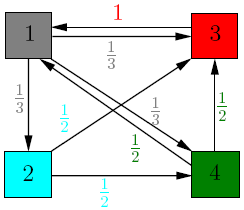

Bezzudumu saspiešana: Uzdevumu lapa
========================================

**1.uzdevums:** 
  :math:`X` un :math:`Y` ir divi neatkarīgi diskrēti 
  gadījumlielumi (piemēram, metamā kauliņa uzmešanas rezultāts no 
  :math:`1` līdz :math:`6`), bet :math:`X+Y` ir šo gadījumlielumu summa.  
  Kura izteiksme ar entropiju ir lielāka:

  .. math::

    H(X) + H(Y)\;\; \text{vai}\;\; H(X+Y)?

**2.uzdevums:** 
  Divos binārajos kokos veic vienādus eksperimentus: 
  Gājienus sāk koka saknē; ar vienādām varbūtībām pāriet 
  uz kreiso vai labo bērnu, kamēr sasniedz koka lapu. 
  Koka lapa ir varbūtiskā procesa radītais ziņojums.  

  .. figure:: figs/two-trees.png 
     :width: 3in
  
  Atrast precīzas izteiksmes entropijām :math:`H(X_1)` un :math:`H(X_2)`.  

**3.uzdevums:** 

  .. figure:: figs/markov-chain.png
     :width: 1.5in

  Izveidot Python programmu, kas ģenerē burtu virknīti, atbilstoši 
  dotajai Markova ķēdei. Sākumstāvoklis vienmēr ir :math:`A`. 
  Ģenerēt vairākas virknes un empīriski atrast trešā burta varbūtisko sadalījumu. 

**4.uzdevums**
  Dota Markova ķēde (sk. attēlu 3.uzdevumā), kurā automāta sākumstāvoklis (un 
  izvades pirmais burts) vienmēr ir :math:`A`. 
  Atrast tajā trešā burta varbūtību sadalījumu (ar kādām 
  varbūtībām tur ir attiecīgi :math:`A, B, C`).  

  Ierakstīt atbildē trīs racionālus skaitļus. 

.. only:: Internal 

  **Atbilde:**

    .. figure:: figs/markov-chain.png
       :width: 1.5in

       Markova ķēde

    1. Trešo burtu :math:`A` šajā Markova ķēdē var iegūt divos veidos:  

      **(i)** 
        Pāreja :math:`A \rightarrow A` un vēlreiz :math:`A \rightarrow A`.
        Varbūtība :math:`\frac{1}{4}\cdot\frac{1}{4}=\frac{1}{16}`.  

      **(ii)** 
        Pāreja :math:`A \rightarrow B` un tad :math:`B \rightarrow A`.
        Varbūtība :math:`\frac{3}{4}\cdot\frac{1}{4}=\frac{3}{16}`.  
        Abu varbūtību summa ir :math:`\frac{1}{16} + \frac{3}{16} = \frac{1}{4}`.

    2. Trešo burtu :math:`B` arī var iegūt divos veidos:  

      **(i)** 
        Pāreja :math:`A \rightarrow A` un tad :math:`A \rightarrow B`.
        Varbūtība :math:`\frac{1}{4}\cdot\frac{3}{4} = \frac{3}{16}`.  

      **(ii)** 
        Pāreja :math:`A \rightarrow B` un tad :math:`B \rightarrow B`.
        Varbūtība :math:`\frac{3}{4}\cdot\frac{1}{4} = \frac{3}{16}`.  
        Abu varbūtību summa :math:`\frac{3}{16} + \frac{3}{16} = \frac{3}{8}`.

    3. Trešo burtu :math:`C` var iegūt vienā veidā:
       :math:`A \rightarrow B` un tad :math:`B \rightarrow C`.
       Varbūtība  :math:`\frac{3}{4}\cdot\frac{1}{2} = \frac{3}{8}`.

    Tātad varbūtību sadalījums ir :math:`\left( \frac{1}{4}, \frac{3}{8}, \frac{3}{8} \right)`. 

    Starp citu, trešajam burtam atbilstošā varbūtību sadalījuma :math:`\{ 1/4, 3/8, 3/8 \}` 
    entropija ir :math:`1.56`. Bet faktiski no Markova ķēdes
    saņemtās virknes var saspiest labāk 
    nekā šī entropija, jo burti :math:`A,B,C` nav pilnīgi neatkarīgi.

    Salīdzināt šāda veida datiem aritmētisko kodu, LZ78 un Berouza-vīlera 
    saspiešanu. 
    Tādēļ aritmētisko saspiešanu šajā gadījumā lietot nav optimāli.

  `\square`

.. _my-figure:

**5.uzdevums:** 
  Izveidot matricu kāpināšanas programmu valodā Python, lai 
  atrastu PageRank vērtības grafam, ko apraksta ar Markova ķēdi :ref:`my-figure`.attēlā: 

  Sal. `<https://pi.math.cornell.edu/~mec/Winter2009/RalucaRemus/Lecture3/lecture3.html>`_. 

  Izmantot `<https://checkpagerank.net/>`_, lai atrastu PageRank novērtējumu dažām 
  Web lapām (gan ļoti populārām, gan mazpazīstamām).  

**6.uzdevums:** 
  Ja Jums pieejama Linux komandrinda, izmantot arhivācijas komandas: 
  
  .. code-block:: bash

     tar -cvfz result.tar.gz original.txt
     tar xvzf result.tar.gz
     # gzip komandas:
     gzip -l examplefile.gz
     gzip -d examplefile.gz

  * "c" - *create* (veidot arhīvu),
  * "x" - *eXtract* (atpakot arhīvu),
  * "z" - *gZip* (lietot gzip saspiedēju papildus "Tape ARchive").
  * "z" vietā "j" - (lietot bzip2 saspiedēju - t.i. Berouza-Vīlera algoritmu).

  Izmantot arī LZMA (Lempel Ziv Markov Chain) saspiešanu: 

  .. code-block:: bash

    lzma -c --stdout examplefile > examplefile.lzma
    lzma -d --stdout examplefile.lzma > examplefile

**7.uzdevums:** 
  Darbināt sekojošu programmu, lai ģenerētu PNG atēlu 100*100, kas
  aizpildīts ar pelēkiem pikseļiem nejaušās krāsās. 

  .. code-block:: python 

    from PIL import Image
    import numpy as np

    # 100x100 nejauši reāli skaitļi intervālā [0;1]
    imageArray = np.random.rand(100,100)
    # Izmaina mērogu uz [0;255] melnbaltā attēlā "255" ir balts
    img = Image.fromarray(imageArray * 255)
    # Eksportē uz PNG failu
    img.convert('RGB').save('raster_output.png')

  .. figure:: figs/raster_output.png
     :width: 2in

.. note:: 
  PNG ir bezzudumu formāts; pēc atspiešanas vienmēr rodas tā pati pikseļu matrica.
  Komandrindas rīks ``pngcrush`` cenšas izveidot vislabāk saspiesto variantu dotajam attēlam. 
  Saspiešanai ir iespējami dažādi līmeņi (0 - nesaspiests, ātrākais; 9 - visvairāk saspiests, lēnākais). 
  Piemēram, šādas komandas: 

  .. code-block:: bash

     fmpeg -i input -vframes 1 -compression_level 0 0.png
     ffmpeg -i input -vframes 1 -compression_level 9 9.png

**8.uzdevums:** 
  Uz balta fona novietot sarkanu apli (ar vai bez pikseļu robežas anti-aliasing jeb 
  maliņu pārkrāsošanas). Pārveidot to GIF vai PNG formātā. 